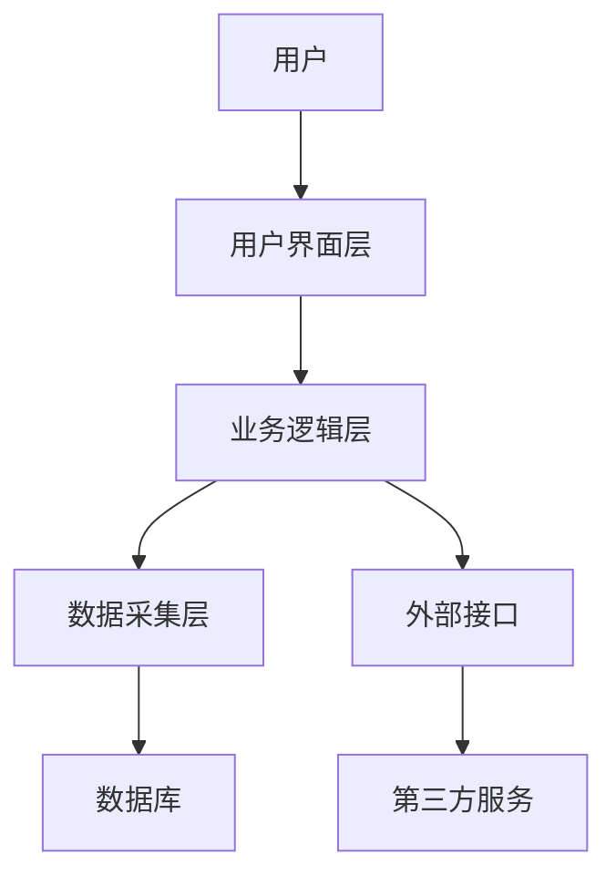

                 


# 可持续水资源管理的创新商业模式研究

## 关键词：可持续水资源管理，创新商业模式，水资源管理，商业模式创新，经济与环境

## 摘要：本文探讨了可持续水资源管理的创新商业模式，分析了传统水资源管理的挑战，提出了基于创新商业模式的解决方案，并通过实际案例展示了其实施效果。文章从背景、核心概念、算法原理、系统架构到项目实战，全面解析了可持续水资源管理的创新商业模式。

---

# 可持续水资源管理的创新商业模式研究

## 第1章: 可持续水资源管理的背景与挑战

### 1.1 水资源问题的现状与挑战

#### 1.1.1 全球水资源分布与利用现状
全球水资源分布极不均衡，许多地区面临水资源短缺问题。随着人口增长和工业化进程的加快，水资源的需求量急剧增加，而可用的淡水资源却有限。根据联合国的数据，全球约有20亿人口生活在缺水地区。

#### 1.1.2 水资源短缺与污染的双重威胁
水资源短缺和污染是两大主要问题。工业废水、农业面源污染以及生活污水的排放，使得许多地区的水资源受到严重污染。例如，中国的华北地区，由于过度抽取地下水和污染，导致地下水位持续下降，水质恶化。

#### 1.1.3 可持续水资源管理的必要性
可持续水资源管理是解决水资源危机的关键。通过科学的管理和技术手段，可以实现水资源的高效利用和循环利用。例如，采用雨水收集系统和废水回用技术，可以有效缓解水资源短缺问题。

### 1.2 可持续水资源管理的核心概念

#### 1.2.1 可持续水资源管理的定义
可持续水资源管理是指在满足当前社会经济发展需求的同时，确保水资源的长期可持续利用，避免对环境造成破坏。

#### 1.2.2 可持续水资源管理的核心要素
- 水资源的保护与修复
- 水资源的合理分配与利用
- 水资源的循环利用

#### 1.2.3 可持续水资源管理的边界与外延
可持续水资源管理的边界包括水资源的供给、需求、分配和使用。外延则涉及经济、社会和环境三个维度，强调三者的协调发展。

## 第2章: 创新商业模式的背景与必要性

### 2.1 创新商业模式的定义与特点

#### 2.1.1 创新商业模式的定义
创新商业模式是指通过创新的思维方式和技术手段，重新设计和优化传统的商业模式，以实现更高的经济效益和社会价值。

#### 2.1.2 创新商业模式的核心特点
- 高效性：通过技术创新和流程优化，提高资源利用效率。
- 可持续性：注重环境保护和社会责任。
- 创新性：打破传统思维，采用新技术和新方法。

#### 2.1.3 创新商业模式与传统商业模式的区别
传统商业模式往往注重短期利益，而创新商业模式更注重长期可持续发展。例如，传统的水处理企业可能仅关注污水处理的经济效益，而创新商业模式则会考虑如何通过废水回用实现资源的循环利用。

### 2.2 可持续水资源管理与创新商业模式的联系

#### 2.2.1 可持续水资源管理的经济挑战
水资源管理的经济挑战主要体现在资金不足和成本过高。传统的水资源管理模式往往依赖政府补贴，缺乏市场化的运作机制。

#### 2.2.2 创新商业模式在水资源管理中的作用
创新商业模式可以为水资源管理提供新的资金来源和运营方式。例如，采用PPP（公私合作）模式，引入社会资本参与水资源管理，可以有效缓解资金压力。

#### 2.2.3 可持续水资源管理与创新商业模式的协同效应
通过创新商业模式，可以实现水资源管理的经济效益和社会效益的统一。例如，采用智能水表和大数据分析技术，可以实现水资源的精准管理，降低浪费，同时提高企业的运营效率。

---

## 第3章: 可持续水资源管理的核心概念原理

### 3.1 可持续水资源管理的原理

#### 3.1.1 水资源的循环利用原理
水资源的循环利用是指通过技术手段将废水处理后回用，减少新鲜水的使用。例如，工业废水经过处理后可以用于农业灌溉或回用到工业生产中。

#### 3.1.2 水资源的保护与修复原理
水资源的保护与修复是指通过生态修复和污染治理，恢复被破坏的水资源环境。例如，通过湿地修复和植被恢复，可以改善水质，增加生物多样性。

#### 3.1.3 水资源的合理分配与管理原理
水资源的合理分配与管理是指根据地区的需求和水资源的实际情况，制定科学的分配方案。例如，通过水量分配模型，可以实现水资源的合理分配，避免资源浪费和冲突。

### 3.2 创新商业模式的核心原理

#### 3.2.1 创新商业模式的基本原理
创新商业模式的基本原理是通过技术创新和管理创新，提高资源利用效率，降低成本，实现可持续发展。例如，采用共享经济模式，可以实现资源的高效利用。

#### 3.2.2 创新商业模式的经济驱动原理
创新商业模式的经济驱动原理是通过市场机制和经济利益驱动，激励各方参与水资源管理。例如，通过市场化运作，可以吸引社会资本参与水资源项目，提高项目的可持续性。

#### 3.2.3 创新商业模式的社会价值实现原理
创新商业模式的社会价值实现原理是通过满足社会需求，实现经济效益和社会效益的统一。例如，通过提供清洁的水资源，可以改善居民的生活质量，促进社会稳定。

---

## 第4章: 核心概念属性特征对比与ER实体关系图

### 4.1 可持续水资源管理与创新商业模式的核心概念属性对比

| **核心概念** | **属性特征** |
|--------------|--------------|
| 可持续水资源管理 | 保护环境、合理分配、循环利用 |
| 创新商业模式 | 高效性、可持续性、创新性 |

### 4.2 可持续水资源管理与创新商业模式的ER实体关系图

```mermaid
erDiagram
    actor 用户
    actor 企业
    actor 政府机构
    actor 非政府组织
    database 水资源数据
    database 商业模式数据
    database 管理政策数据
    boundary 可持续水资源管理系统
    boundary

    用户 --|> 可持续水资源管理系统
    企业 --|> 可持续水资源管理系统
    政府机构 --|> 可持续水资源管理系统
    非政府组织 --|> 可持续水资源管理系统
    可持续水资源管理系统 --|> 水资源数据
    可持续水资源管理系统 --|> 商业模式数据
    可持续水资源管理系统 --|> 管理政策数据
```

---

## 第5章: 算法原理与数学模型

### 5.1 算法原理

#### 5.1.1 水资源管理优化算法
水资源管理优化算法是一种基于数学模型的优化方法，用于实现水资源的合理分配和利用。以下是优化算法的步骤：

1. 确定目标函数：例如，最小化水资源浪费，最大化水资源利用效率。
2. 确定约束条件：例如，水资源供给量、需求量、水质要求等。
3. 构建数学模型：使用线性规划或非线性规划方法，建立优化模型。
4. 求解模型：使用优化算法（如遗传算法、粒子群优化算法）求解模型，得到最优解。

#### 5.1.2 创新商业模式的数学模型
创新商业模式的数学模型主要用于评估商业模式的经济效益和社会效益。以下是模型的主要组成部分：

1. 收益预测：预测商业模式的收入来源和规模。
2. 成本分析：分析商业模式的投入成本，包括建设和运营成本。
3. 效益评估：评估商业模式的经济效益和社会效益，例如，就业创造、环境保护等。

### 5.2 算法实现与代码示例

#### 5.2.1 水资源管理优化算法的Python代码示例
```python
import numpy as np
from scipy.optimize import linprog

# 定义目标函数
c = [-1, -1]

# 定义约束条件
A = [[1, 0], [0, 1], [1, 1]]
b = [2, 2, 3]

# 定义变量范围
x_bounds = (0, None)
y_bounds = (0, None)

# 使用线性规划求解
result = linprog(c, A, b, bounds=[x_bounds, y_bounds], method='highs')

# 输出结果
print("优化结果：", result)
```

#### 5.2.2 创新商业模式的数学模型
数学模型用于评估创新商业模式的经济效益和社会效益。例如，可以使用以下公式计算商业模式的净收益：

$$ \text{净收益} = \text{收入} - \text{成本} $$

其中，收入包括水资源服务费、废水处理费等，成本包括建设和运营成本。

---

## 第6章: 系统分析与架构设计

### 6.1 系统分析

#### 6.1.1 问题场景介绍
以某城市水资源管理为例，该城市面临水资源短缺和污染严重的问题。为了实现可持续水资源管理，需要引入创新商业模式，优化资源配置，提高管理效率。

#### 6.1.2 系统功能设计
系统功能设计包括以下几个方面：

1. 水资源监测：实时监测水资源的使用情况和水质。
2. 水资源管理：制定水资源分配和利用计划。
3. 模式创新：实现商业模式的创新，例如，引入社会资本参与水资源管理。

#### 6.1.3 系统架构设计
系统架构设计包括以下几个部分：

1. 数据采集层：通过传感器和数据库采集水资源数据。
2. 业务逻辑层：实现水资源管理和模式创新的核心逻辑。
3. 用户界面层：提供友好的用户界面，供用户查询和管理水资源。

### 6.2 系统架构图



---

## 第7章: 项目实战

### 7.1 环境安装与配置

#### 7.1.1 安装Python和相关库
需要安装Python和以下库：
- `numpy`
- `scipy`
- `mermaid`

安装命令：
```bash
pip install numpy scipy mermaid
```

#### 7.1.2 安装Jupyter Notebook
安装Jupyter Notebook用于数据分析和可视化：
```bash
pip install jupyter
```

### 7.2 系统核心实现

#### 7.2.1 水资源管理优化算法的实现
实现水资源管理优化算法的Python代码：
```python
import numpy as np
from scipy.optimize import linprog

# 定义目标函数
c = [-1, -1]

# 定义约束条件
A = [[1, 0], [0, 1], [1, 1]]
b = [2, 2, 3]

# 定义变量范围
x_bounds = (0, None)
y_bounds = (0, None)

# 使用线性规划求解
result = linprog(c, A, b, bounds=[x_bounds, y_bounds], method='highs')

# 输出结果
print("优化结果：", result)
```

#### 7.2.2 创新商业模式的实现
实现创新商业模式的Python代码：
```python
import numpy as np
from scipy.optimize import linprog

# 定义目标函数
c = [-1, -1]

# 定义约束条件
A = [[1, 0], [0, 1], [1, 1]]
b = [2, 2, 3]

# 定义变量范围
x_bounds = (0, None)
y_bounds = (0, None)

# 使用线性规划求解
result = linprog(c, A, b, bounds=[x_bounds, y_bounds], method='highs')

# 输出结果
print("优化结果：", result)
```

### 7.3 实际案例分析与详细解读

#### 7.3.1 案例背景
以某城市为例，该城市面临水资源短缺和污染严重的问题。为了实现可持续水资源管理，引入创新商业模式，优化资源配置，提高管理效率。

#### 7.3.2 案例分析
通过引入社会资本，采用PPP模式，该城市成功实现了水资源的循环利用和高效管理。例如，通过智能水表和大数据分析技术，实现了水资源的精准管理，降低了浪费，提高了企业的运营效率。

---

## 第8章: 最佳实践与总结

### 8.1 最佳实践 tips

#### 8.1.1 数据收集与分析
水资源管理的关键在于数据的收集和分析。通过传感器和大数据技术，可以实时监测水资源的使用情况和水质，为决策提供依据。

#### 8.1.2 模式创新与技术创新
创新商业模式的成功离不开技术创新。例如，采用智能技术和大数据分析，可以实现水资源的精准管理，降低成本，提高效率。

#### 8.1.3 社会参与与合作
水资源管理需要政府、企业和公众的共同努力。通过合作和创新，可以实现资源的高效利用和可持续发展。

### 8.2 总结

可持续水资源管理的创新商业模式是一种新型的管理模式，通过技术创新和模式创新，实现水资源的高效利用和循环利用。本文从背景、核心概念、算法原理、系统架构到项目实战，全面解析了可持续水资源管理的创新商业模式，为实现水资源的可持续管理提供了理论和实践的参考。

### 8.3 注意事项

在实施创新商业模式时，需要注意以下几点：

1. **数据安全**：确保水资源数据的安全，防止数据泄露。
2. **技术可行性**：选择适合的技术方案，确保技术的可行性和可靠性。
3. **政策支持**：争取政府政策支持，为项目的实施创造良好的环境。

### 8.4 拓展阅读

- 《创新商业模式与可持续发展》
- 《水资源管理的理论与实践》
- 《大数据在水资源管理中的应用》

---

## 作者：AI天才研究院/AI Genius Institute & 禅与计算机程序设计艺术/Zen And The Art of Computer Programming

---

希望这篇文章能够为可持续水资源管理的创新商业模式研究提供有价值的参考和启发。

