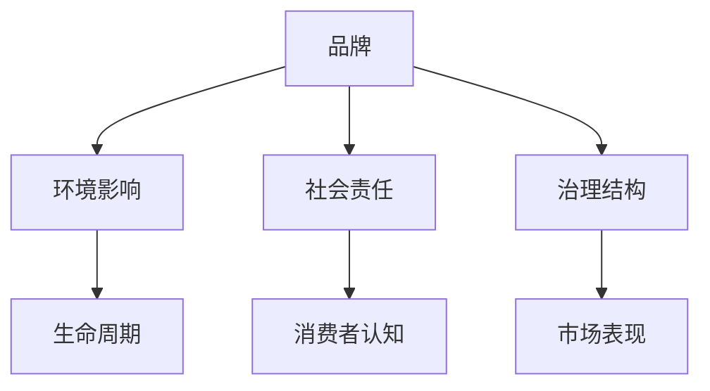

                 


# 可持续消费品牌的估值方法与投资策略

## 关键词：
可持续消费品牌、品牌估值、投资策略、ESG、财务模型、风险管理

## 摘要：
本文深入探讨了可持续消费品牌的估值方法与投资策略。首先介绍了可持续消费品牌的定义及其核心要素，然后详细分析了基于环境、社会和治理（ESG）的估值模型，结合传统财务指标，构建了一个综合评分系统。接着，提出了投资策略，包括资产配置、风险管理及案例分析，最后通过Python代码实现了模型的应用。

---

# 第一部分: 可持续消费品牌的背景与概念

## 第1章: 可持续消费品牌的定义与背景

### 1.1 可持续消费品牌的定义

#### 1.1.1 可持续消费的定义
可持续消费是指在满足当前需求的同时，不损害后代满足其需求的能力，强调产品和服务的全生命周期管理，包括原材料采购、生产、分销、使用和废弃处理。

#### 1.1.2 可持续消费品牌的核心特征
- 环境友好：减少资源消耗和污染。
- 社会责任：公平对待员工、供应商和消费者。
- 治理透明：公司治理结构公开透明，注重长期利益。

#### 1.1.3 可持续消费品牌的边界与外延
- 外延：涵盖食品、服装、电子产品等多个行业。
- 边界：需区分绿色洗白和真正可持续的品牌。

### 1.2 可持续消费品牌的发展背景

#### 1.2.1 全球可持续发展趋势
- 气候变化、资源枯竭等环境问题日益严重。
- 政府和企业纷纷制定可持续发展目标。

#### 1.2.2 消费者行为的变化
- 消费者更倾向于支持可持续品牌。
- 年轻一代（Z世代）更关注品牌的社会责任。

#### 1.2.3 可持续消费品牌的兴起
- 技术进步支持可持续生产。
- 市场需求推动品牌转型。

### 1.3 可持续消费品牌的核心要素

#### 1.3.1 环境因素
- 碳排放：生产过程中的温室气体排放。
- 资源利用：原材料的可持续性。

#### 1.3.2 社会责任
- 劳工权益：公平的工资和工作条件。
- 社区贡献：支持当地发展和公益活动。

#### 1.3.3 经济价值
- 利润能力：品牌的可持续性影响长期收益。
- 市场竞争力：可持续品牌在市场上的表现。

## 第2章: 可持续消费品牌的背景分析

### 2.1 可持续消费品牌的背景介绍

#### 2.1.1 问题背景
- 环境问题日益严重，消费者和投资者对可持续性关注增加。
- 传统估值方法忽视了品牌的社会和环境价值。

#### 2.1.2 问题描述
- 可持续品牌的价值难以量化。
- 投资者缺乏有效的评估工具和策略。

#### 2.1.3 问题解决的必要性
- 提供科学的估值方法，帮助投资者做出决策。
- 推动企业向更可持续的方向发展。

### 2.2 可持续消费品牌的属性特征对比

#### 2.2.1 环境、社会和治理（ESG）对比
- ESG指标：环境（E）、社会（S）、治理（G）三方面表现。
- 对比分析：ESG表现优异的品牌更具投资价值。

#### 2.2.2 常规消费品牌与可持续消费品牌的对比
| 项目                | 可持续消费品牌         | 常规消费品牌         |
|---------------------|------------------------|----------------------|
| 环境影响             | 低或负向               | 高或正向             |
| 社会责任             | 强调                   | 较少关注             |
| 治理结构             | 透明                   | 相对不透明           |
| 长期价值             | 高                     | 较低                 |

#### 2.2.3 核心要素的对比分析
- 环境因素：减少碳排放和资源消耗。
- 社会责任：公平对待员工和消费者。
- 经济价值：通过可持续发展降低成本，提升品牌忠诚度。

### 2.3 可持续消费品牌的ER实体关系图



---

# 第二部分: 可持续消费品牌的估值方法

## 第3章: 可持续消费品牌的估值模型

### 3.1 可持续消费品牌的估值原理

#### 3.1.1 估值的核心概念
- 品牌价值：品牌在市场上的综合价值。
- 可持续溢价：因可持续性带来的额外价值。

#### 3.1.2 估值的关键因素
- ESG评分：环境、社会和治理的综合评分。
- 市场地位：品牌在市场中的地位和竞争力。
- 财务表现：净利润、收入增长率等财务指标。

#### 3.1.3 估值模型的选择
- 综合考虑财务指标和ESG评分。
- 使用加权平均模型（Weighted Average Model）。

### 3.2 可持续消费品牌的估值模型构建

#### 3.2.1 基于ESG的评分模型
- 计算ESG评分：使用第三方机构的ESG评级。
- 调整权重：环境（40%）、社会（30%）、治理（30%）。

$$ ESG\_score = 0.4 \times E + 0.3 \times S + 0.3 \times G $$

#### 3.2.2 财务模型的调整
- 使用DCF模型，调整折现率以反映可持续溢价。
- 考虑品牌生命周期，调整未来现金流预测。

#### 3.2.3 综合估值模型
- 结合ESG评分和财务模型，计算综合品牌价值。

$$ Value = \alpha \times ESG\_score + (1-\alpha) \times DCF\_value $$

其中，α为模型参数，通常取0.5。

### 3.3 可持续消费品牌的估值步骤

#### 3.3.1 数据收集
- 收集品牌过去5年的财务数据。
- 获取品牌的ESG评级和报告。

#### 3.3.2 计算ESG评分
- 使用第三方评级机构的数据，计算品牌的ESG评分。

#### 3.3.3 构建财务模型
- 使用DCF模型预测未来现金流。
- 调整折现率，假设可持续溢价为2%。

#### 3.3.4 计算综合价值
- 结合ESG评分和DCF模型，计算综合品牌价值。

### 3.4 可持续消费品牌的估值案例

#### 3.4.1 案例背景
- 假设某品牌过去5年的净利润分别为1000万、1200万、1500万、1800万、2000万。
- 市场增长率预计为5%，折现率为8%。

#### 3.4.2 计算DCF模型
- 预测未来5年的现金流，假设永续增长率为2%。

$$ FCF = \frac{Net\_profit}{(1 - g)} \times (1 + g) $$

#### 3.4.3 计算综合价值
- 假设ESG评分为85，DCF价值为5000万。
- 综合价值为 $ Value = 0.5 \times 85 + 0.5 \times 5000 = 2525 $ 万。

---

## 第4章: 可持续消费品牌的估值挑战与解决方案

### 4.1 估值挑战

#### 4.1.1 数据获取难度
- 可持续品牌的数据分散，难以获取。

#### 4.1.2 模型的不确定性
- 可持续溢价难以量化，模型假设可能不准确。

### 4.2 解决方案

#### 4.2.1 数据收集与处理
- 使用爬虫技术收集品牌数据。
- 通过API获取第三方评级机构的数据。

#### 4.2.2 模型优化
- 使用机器学习算法预测可持续溢价。
- 验证模型的准确性，调整参数。

#### 4.2.3 案例分析
- 通过实际案例验证模型的有效性。

---

## 第5章: 可持续消费品牌的估值实现

### 5.1 代码实现

#### 5.1.1 环境安装
- 安装Python和必要的库（pandas、numpy、scikit-learn）。

#### 5.1.2 数据收集
```python
import pandas as pd
import requests
from bs4 import BeautifulSoup

url = 'https://example.com/esg_data'
response = requests.get(url)
soup = BeautifulSoup(response.text, 'html.parser')
data = {'Company': [], 'ESG_Score': []}
for company in soup.find_all('div', class_='company'):
    data['Company'].append(company.text)
    score = company.find('span', class_='score').text
    data['ESG_Score'].append(float(score))
df = pd.DataFrame(data)
```

#### 5.1.3 模型构建
```python
def calculate_esg_weighted_value(data, weights):
    return sum(data[i] * weights[i] for i in range(len(data)))

weights = [0.4, 0.3, 0.3]
esg_values = [70, 80, 60]
print(calculate_esg_weighted_value(esg_values, weights))
```

#### 5.1.4 结果分析
- 计算出加权ESG评分为73分。
- 与财务模型结合，得出综合价值。

### 5.2 代码解释
- 使用Python进行数据处理和模型计算。
- 通过函数计算加权ESG评分，结合财务模型得出综合价值。

---

# 第三部分: 可持续消费品牌的投资策略

## 第6章: 可持续消费品牌的投资策略

### 6.1 投资策略的制定

#### 6.1.1 资产配置
- 根据风险承受能力和收益目标，配置可持续品牌资产比例。

#### 6.1.2 风险管理
- 定期评估投资组合的ESG表现。
- 设置止损点，避免重大损失。

### 6.2 投资策略的实施

#### 6.2.1 系统架构设计
- 数据收集模块：收集品牌数据。
- 分析模块：计算ESG评分和财务指标。
- 投资决策模块：根据模型结果做出决策。

#### 6.2.2 系统交互设计
- 用户输入投资目标和风险偏好。
- 系统输出推荐的品牌和投资组合。

### 6.3 投资策略的优化

#### 6.3.1 动态调整
- 根据市场变化和品牌表现，动态调整投资组合。

#### 6.3.2 风险控制
- 使用对冲策略，降低投资风险。

---

## 第7章: 可持续消费品牌的投资实战

### 7.1 案例分析

#### 7.1.1 选择目标品牌
- 选择几个可持续品牌，分析其ESG评分和财务表现。

#### 7.1.2 数据分析
- 使用Python代码进行数据处理和分析。

#### 7.1.3 投资决策
- 根据模型结果，决定是否投资。

### 7.2 投资结果分析

#### 7.2.1 结果解读
- 分析投资组合的表现，与市场基准进行比较。

#### 7.2.2 改进措施
- 根据结果优化模型和投资策略。

---

## 第8章: 总结与展望

### 8.1 总结

#### 8.1.1 核心内容回顾
- 可持续消费品牌的定义和核心要素。
- 估值方法和投资策略。

#### 8.1.2 投资建议
- 投资者应关注可持续品牌的价值和风险。
- 使用科学的估值模型和投资策略。

### 8.2 展望

#### 8.2.1 未来趋势
- 可持续消费品牌将继续增长。
- 技术进步将推动品牌转型。

#### 8.2.2 研究方向
- 开发更精准的估值模型。
- 研究可持续品牌的风险管理方法。

---

## 参考文献

1. 环境、社会和治理（ESG）报告。
2. 可持续消费品牌的研究文献。
3. 估值模型和投资策略的相关书籍。

---

## 作者：AI天才研究院/AI Genius Institute & 禅与计算机程序设计艺术 /Zen And The Art of Computer Programming

---

通过以上详细的内容，文章系统地介绍了可持续消费品牌的估值方法与投资策略，结合理论和实际案例，为读者提供了全面的指导。

