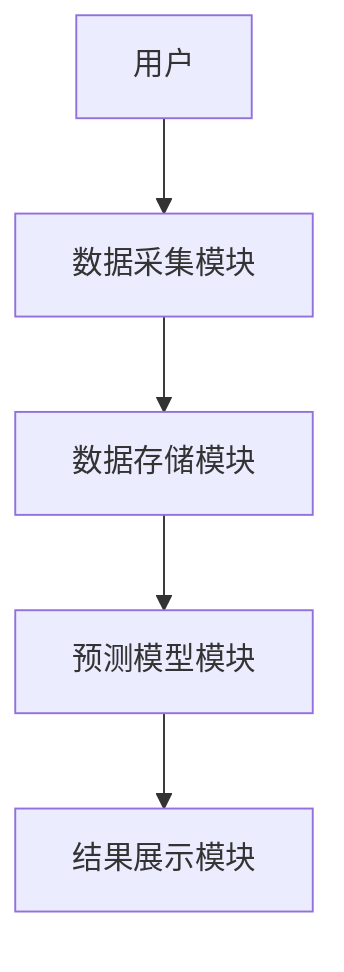

                 


# 可持续能源存储技术的市场渗透率预测

> 关键词：可持续能源存储技术，市场渗透率，预测模型，时间序列分析，机器学习

> 摘要：本文详细探讨了可持续能源存储技术的市场渗透率预测方法，从背景介绍、核心概念、算法原理、系统设计到项目实战，全面分析了如何利用技术手段预测市场渗透率，并提供了实际案例和最佳实践建议。

---

## 第1章: 可持续能源存储技术的背景与现状

### 1.1 可持续能源存储技术的基本概念

#### 1.1.1 可持续能源的定义与特点
可持续能源是指能够持续供应而不枯竭的能源，主要包括太阳能、风能、水能、生物质能等。这些能源具有可再生性、清洁性和广泛性等特点。

#### 1.1.2 能源存储技术的分类与应用
能源存储技术主要分为化学储能、物理储能和电磁储能三大类。化学储能包括电池储能（如锂离子电池、铅酸电池）和燃料电池；物理储能包括 pumped hydropower（抽水蓄能）和压缩空气储能；电磁储能包括超级电容器和飞轮储能。

#### 1.1.3 可持续能源存储技术的重要性
随着全球能源需求的增长和化石能源的枯竭，可持续能源存储技术成为实现能源可持续发展的重要手段。它能够有效解决可再生能源间歇性问题，提高能源利用效率，降低碳排放。

### 1.2 市场渗透率预测的定义与意义

#### 1.2.1 市场渗透率的基本概念
市场渗透率是指某项产品或技术在目标市场中的普及程度，通常以市场份额的形式表示。

#### 1.2.2 可持续能源存储技术的市场渗透率预测的重要性
准确预测市场渗透率可以帮助企业制定合理的市场策略，政府制定能源政策，投资者进行风险评估。此外，预测结果还可以为技术改进和市场推广提供数据支持。

#### 1.2.3 市场渗透率预测的边界与外延
市场渗透率预测需要考虑技术成熟度、市场需求、政策支持、经济成本等因素。预测的外延包括市场规模、竞争分析、技术生命周期等。

### 1.3 本章小结
本章介绍了可持续能源存储技术的基本概念及其重要性，阐述了市场渗透率预测的定义和意义，并明确了预测的边界与外延。

---

## 第2章: 可持续能源存储技术的核心概念与联系

### 2.1 市场渗透率预测的核心原理

#### 2.1.1 技术成熟度对市场渗透率的影响
技术成熟度越高，市场渗透率通常越高。例如，锂离子电池技术经过多年发展，市场渗透率显著提高。

#### 2.1.2 市场需求与政策支持的作用
市场需求的增长和政策支持（如政府补贴、税收优惠）是推动市场渗透率上升的重要因素。

#### 2.1.3 经济成本与市场竞争的关系
经济成本的降低和市场竞争的加剧会加速市场渗透率的提升。例如，电池成本的下降显著推动了电动汽车的普及。

### 2.2 核心概念对比分析

#### 2.2.1 技术成熟度与市场需求的对比
技术成熟度是市场需求的基础，但市场需求还受到价格、消费者偏好等因素的影响。

#### 2.2.2 经济成本与政策支持的对比
经济成本直接影响产品的市场竞争力，而政策支持可以弥补经济成本的部分差距，促进市场渗透。

#### 2.2.3 市场渗透率与技术可行性的对比
技术可行性是市场渗透的前提，而市场渗透率则反映了技术的实际应用情况。

### 2.3 ER实体关系图

```mermaid
er
actor: 用户
model: 市场渗透率预测模型
database: 数据库
```

### 2.4 本章小结
本章分析了市场渗透率预测的核心原理，探讨了技术成熟度、市场需求、政策支持和经济成本等因素之间的关系，并通过ER实体关系图展示了核心概念之间的联系。

---

## 第3章: 可持续能源存储技术的市场渗透率预测算法原理

### 3.1 市场渗透率预测的数学模型

#### 3.1.1 时间序列分析模型
时间序列分析是一种常用的预测方法，适用于具有时间依赖性的数据。常用模型包括ARIMA（自回归积分滑动平均模型）。

#### 3.1.2 机器学习模型
机器学习模型（如随机森林、支持向量机、神经网络）可以通过训练数据预测市场渗透率。

#### 3.1.3 统计回归模型
统计回归模型通过建立变量之间的关系模型，预测市场渗透率。

### 3.2 算法原理的详细讲解

#### 3.2.1 时间序列分析模型的数学公式
ARIMA模型的公式为：
$$ ARIMA(p, d, q) $$

其中，p为自回归阶数，d为差分阶数，q为移动平均阶数。

#### 3.2.2 机器学习模型的数学公式
线性回归模型的公式为：
$$ y = w_1x_1 + w_2x_2 + ... + w_nx_n + b $$

其中，$w_i$为权重，$x_i$为输入特征，$b$为偏置。

#### 3.2.3 统计回归模型的数学公式
多元线性回归模型的公式为：
$$ y = \beta_0 + \beta_1x_1 + \beta_2x_2 + ... + \beta_kx_k + \epsilon $$

其中，$\beta_i$为回归系数，$\epsilon$为误差项。

### 3.3 算法实现的Python代码示例

#### 3.3.1 时间序列分析模型的实现
```python
import pandas as pd
from statsmodels.tsa.arima_model import ARIMA

# 加载数据
data = pd.read_csv('market_penetration.csv')

# 训练模型
model = ARIMA(data, order=(5, 1, 0))
model_fit = model.fit()

# 预测
forecast = model_fit.forecast(steps=5)
print(forecast)
```

#### 3.3.2 机器学习模型的实现
```python
from sklearn.ensemble import RandomForestRegressor
from sklearn.model_selection import train_test_split

# 数据预处理
X = data.drop('penetration_rate', axis=1)
y = data['penetration_rate']

X_train, X_test, y_train, y_test = train_test_split(X, y, test_size=0.2, random_state=42)

# 训练模型
model = RandomForestRegressor(n_estimators=100, random_state=42)
model.fit(X_train, y_train)

# 预测
y_pred = model.predict(X_test)
print('预测结果:', y_pred)
```

### 3.4 本章小结
本章详细讲解了时间序列分析模型、机器学习模型和统计回归模型的原理，并通过Python代码示例展示了如何实现这些模型。

---

## 第4章: 可持续能源存储技术的市场渗透率预测系统分析

### 4.1 问题场景介绍
本章以某地区的可持续能源存储技术市场为背景，探讨如何利用系统分析方法预测市场渗透率。

### 4.2 系统功能设计

#### 4.2.1 数据采集模块
负责收集市场渗透率相关的数据，包括技术成熟度、市场需求、政策支持等。

#### 4.2.2 预测模型模块
基于收集的数据，选择合适的预测模型（如ARIMA、随机森林）进行预测。

#### 4.2.3 结果展示模块
将预测结果以可视化形式展示，便于用户理解和分析。

### 4.3 系统架构设计



### 4.4 接口设计与交互流程

#### 4.4.1 接口设计
- 数据采集模块接口：提供数据输入接口。
- 预测模型模块接口：提供模型训练和预测接口。
- 结果展示模块接口：提供结果输出接口。

#### 4.4.2 交互流程
1. 用户输入数据。
2. 数据采集模块接收数据并存储。
3. 预测模型模块基于数据进行预测。
4. 结果展示模块显示预测结果。

### 4.5 本章小结
本章设计了一个完整的市场渗透率预测系统，包括数据采集、模型预测和结果展示三个模块，并通过系统架构图和交互流程图展示了系统的整体结构。

---

## 第5章: 可持续能源存储技术的市场渗透率预测项目实战

### 5.1 环境安装与数据准备

#### 5.1.1 环境安装
- 安装Python和必要的库（如pandas、scikit-learn、statsmodels）。
- 安装Jupyter Notebook用于数据分析和建模。

#### 5.1.2 数据准备
加载市场渗透率相关的数据，包括技术成熟度、市场需求、政策支持等。

### 5.2 核心代码实现

#### 5.2.1 数据预处理
```python
import pandas as pd
import numpy as np

# 加载数据
data = pd.read_csv('market_penetration.csv')

# 数据清洗
data = data.dropna()
data = data.replace({np.nan: 0})

# 数据转换
data['year'] = pd.to_datetime(data['year'])
```

#### 5.2.2 模型训练与预测
```python
from statsmodels.tsa.arima_model import ARIMA
from sklearn.ensemble import RandomForestRegressor
from sklearn.model_selection import train_test_split

# 数据分割
X = data.drop('penetration_rate', axis=1)
y = data['penetration_rate']

X_train, X_test, y_train, y_test = train_test_split(X, y, test_size=0.2, random_state=42)

# 训练ARIMA模型
model_arima = ARIMA(y_train, order=(5, 1, 0))
model_arima_fit = model_arima.fit()

# 预测
y_pred_arima = model_arima_fit.forecast(steps=len(X_test))[0]

# 训练随机森林模型
model_rf = RandomForestRegressor(n_estimators=100, random_state=42)
model_rf.fit(X_train, y_train)

# 预测
y_pred_rf = model_rf.predict(X_test)
```

#### 5.2.3 结果分析
比较ARIMA模型和随机森林模型的预测结果，选择表现更好的模型作为最终预测模型。

### 5.3 项目总结
通过实际案例分析，展示了如何利用ARIMA和随机森林模型预测可持续能源存储技术的市场渗透率，并对比了两种模型的优缺点。

### 5.4 本章小结
本章通过实际项目实战，详细讲解了如何从数据准备、模型训练到结果分析的整个过程，并提供了代码实现和结果解读。

---

## 第6章: 可持续能源存储技术的市场渗透率预测最佳实践

### 6.1 小结
总结本文的主要内容，重申市场渗透率预测的重要性和实现方法。

### 6.2 注意事项
- 数据预处理是预测的基础，需仔细清洗和转换数据。
- 模型选择需根据实际问题和数据特点进行，避免盲目使用热门算法。
- 预测结果需结合实际业务场景进行解读，避免片面结论。

### 6.3 拓展阅读
建议读者进一步学习时间序列分析、机器学习和深度学习等技术，探索更多预测方法和应用场景。

### 6.4 本章小结
本章提供了市场渗透率预测的最佳实践建议，帮助读者在实际应用中更好地进行预测。

---

## 作者：AI天才研究院/AI Genius Institute & 禅与计算机程序设计艺术 /Zen And The Art of Computer Programming

---

通过本文的详细讲解和实际案例分析，读者可以全面了解可持续能源存储技术的市场渗透率预测方法，并能够将其应用到实际项目中。

