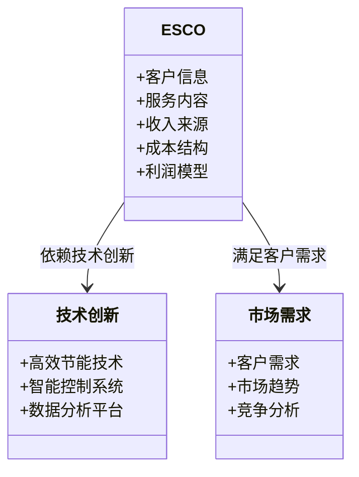
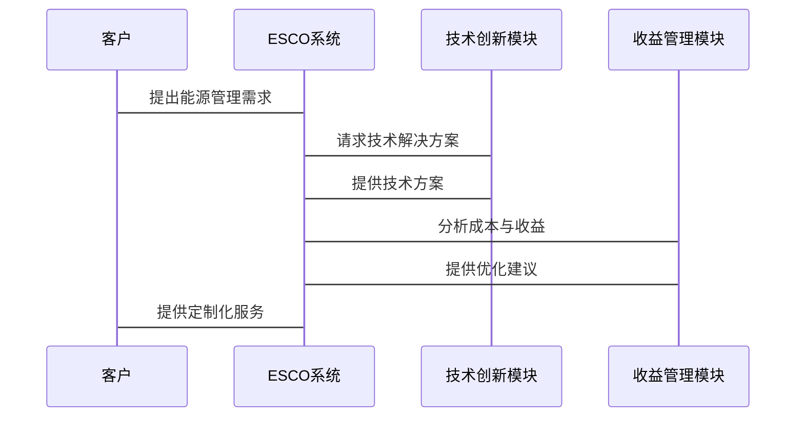

                 


# 可持续能源服务公司（ESCO）的商业模式分析

## 关键词：可持续能源服务公司（ESCO）、商业模式、节能服务、能源管理、可持续发展

## 摘要：  
本文详细分析了可持续能源服务公司（ESCO）的商业模式，从背景、核心要素到创新优化策略，全面探讨了ESCO在可持续能源领域的独特定位与竞争优势。文章结合实际案例，通过系统分析与架构设计，提出了ESCO商业模式的优化路径，并展望了其未来发展方向。

---

# 第一部分: 可持续能源服务公司（ESCO）的背景与定义

## 第1章: 可持续能源服务公司（ESCO）的背景与定义

### 1.1 可持续能源服务公司的定义与特点

#### 1.1.1 可持续能源服务公司的定义
可持续能源服务公司（ESCO）是指专注于提供节能、可再生能源和能源管理服务的企业。其核心目标是通过技术与管理创新，帮助客户实现能源消耗的最优化，同时推动可持续发展目标的实现。

#### 1.1.2 可持续能源服务公司的核心特点
- **技术驱动**：依托先进能源技术，提供节能改造、可再生能源利用等服务。
- **服务导向**：以客户需求为中心，提供定制化能源管理解决方案。
- **可持续性**：通过降低能源消耗和碳排放，推动绿色经济发展。

#### 1.1.3 可持续能源服务公司的目标与使命
ESCO的目标是通过技术创新和服务优化，帮助客户降低能源成本，提升能源利用效率，同时减少对环境的负面影响。其使命在于推动可持续能源的应用，助力全球能源结构的转型。

---

## 第2章: 可持续能源服务公司商业模式的核心要素

### 2.1 可持续能源服务公司商业模式的核心要素

#### 2.1.1 服务内容与产品组合
- 节能改造服务：包括建筑节能、工业节能等。
- 可再生能源服务：如太阳能、风能发电系统的设计与安装。
- 能源管理服务：通过智能系统优化能源使用效率。

#### 2.1.2 服务交付方式与渠道
- **直接服务模式**：ESCO直接与客户签订合同，提供从设计到实施的全套服务。
- **合作伙伴模式**：与设备供应商、金融机构等合作，共同为客户提供解决方案。

#### 2.1.3 收入来源与利润结构
- **服务收入**：通过节能改造、设备安装等服务获得收入。
- **分成模式**：与客户按比例分享节能带来的成本节约。
- **金融创新模式**：通过能源贷款、融资租赁等方式获取收益。

---

## 第3章: 可持续能源服务公司商业模式的分类

### 3.1 可持续能源服务公司商业模式的分类

#### 3.1.1 按服务类型划分的商业模式
- **节能服务模式**：专注于帮助客户降低能源消耗，按节约的能源成本分成。
- **可再生能源服务模式**：通过投资和运营可再生能源项目获取收益。

#### 3.1.2 按客户群体划分的商业模式
- **To B模式**：面向企业客户，提供工业节能、建筑节能等服务。
- **To G模式**：面向政府，提供城市级的能源管理解决方案。

#### 3.1.3 按地域范围划分的商业模式
- **区域化模式**：专注于某一区域市场，深度服务本地客户。
- **全球化模式**：跨国布局，提供全球化能源管理服务。

---

## 第4章: 可持续能源服务公司商业模式与传统能源公司的对比

### 4.1 传统能源公司的商业模式特点
- 以能源销售为核心，依赖化石能源的垄断性优势。
- 模式较为单一，主要通过销售能源和相关设备获取利润。

### 4.2 可持续能源服务公司的创新之处
- 强调服务化，从单纯的能源销售转向综合能源服务。
- 通过技术创新降低能源消耗，创造更大的客户价值。

### 4.3 两种模式的优劣势分析
- **传统能源公司优势**：资金实力雄厚，产业链整合能力强。
- **ESCO优势**：灵活性高，能够快速响应市场需求，技术创新能力强。

---

# 第二部分: 可持续能源服务公司商业模式的创新与优化

## 第5章: 可持续能源服务公司商业模式的创新策略

### 5.1 技术驱动的商业模式创新
- 通过大数据、人工智能等技术优化能源管理，降低运营成本。

#### 5.1.1 数据驱动的能源管理
- 利用IoT技术实时监测能源消耗，通过数据分析优化能源使用效率。

#### 5.1.2 人工智能在能源管理中的应用
- 使用机器学习算法预测能源需求，优化能源分配。

### 5.2 市场需求驱动的商业模式创新
- 根据客户需求定制化服务，提升客户满意度。

#### 5.2.1 客户需求分析
- 通过客户调研和数据分析，精准定位客户需求。

#### 5.2.2 服务定制化
- 提供个性化解决方案，满足客户多样化需求。

### 5.3 政策支持与商业模式创新的关系
- 利用政府补贴、税收优惠等政策，降低运营成本，推动商业模式创新。

---

## 第6章: 可持续能源服务公司商业模式的优化路径

### 6.1 优化服务内容与产品组合
- 持续引入新技术，丰富服务内容，提升服务附加值。

#### 6.1.1 新技术引入
- 引入高效节能技术，提升服务竞争力。

#### 6.1.2 服务组合优化
- 根据客户需求，灵活调整服务组合。

### 6.2 提高客户粘性
- 通过长期合作和服务升级，增强客户粘性。

#### 6.2.1 长期合作模式
- 与客户签订长期服务合同，确保稳定的收入来源。

#### 6.2.2 服务升级策略
- 定期为客户提供增值服务，提升客户满意度。

### 6.3 加强成本控制
- 通过技术创新和管理优化，降低运营成本。

#### 6.3.1 技术创新
- 引入高效节能技术，降低能源消耗。

#### 6.3.2 管理优化
- 优化内部管理流程，提升运营效率。

---

## 第7章: 可持续能源服务公司商业模式的竞争优势

### 7.1 技术驱动的竞争优势
- 通过技术创新，提升服务质量和效率，增强市场竞争力。

#### 7.1.1 技术创新案例
- 引入智能控制系统，优化能源使用效率。

### 7.2 客户导向的竞争优势
- 以客户需求为中心，提供个性化解决方案，提升客户满意度。

#### 7.2.1 客户需求分析
- 通过客户调研和数据分析，精准定位客户需求。

### 7.3 可持续发展竞争优势
- 通过降低能源消耗和碳排放，提升企业社会责任形象。

---

# 第三部分: 可持续能源服务公司商业模式的系统分析与架构设计

## 第8章: 可持续能源服务公司商业模式的系统分析

### 8.1 问题场景介绍
- 能源消耗日益增加，传统能源模式面临转型压力。
- 可持续能源技术快速发展，市场需求增长迅速。

### 8.2 项目介绍
- 本项目旨在通过系统分析和架构设计，优化ESCO的商业模式。

### 8.3 系统功能设计

#### 8.3.1 领域模型设计


### 8.4 系统架构设计

#### 8.4.1 系统架构图


### 8.5 系统接口设计

#### 8.5.1 系统接口设计
- **客户需求接口**：用于收集和分析客户需求。
- **服务交付接口**：用于向客户提供定制化服务。
- **收益管理接口**：用于监控收入来源和成本结构。

### 8.6 系统交互设计

#### 8.6.1 系统交互序列图


---

## 第9章: 可持续能源服务公司商业模式的算法原理

### 9.1 算法原理概述
- 使用机器学习算法预测能源需求，优化能源分配。

#### 9.1.1 算法原理
- 使用线性回归模型预测能源消耗，优化能源分配策略。

### 9.2 算法实现
- 通过Python代码实现能源需求预测模型。

#### 9.2.1 Python代码实现
```python
import numpy as np
from sklearn.linear_model import LinearRegression

# 示例数据：能源消耗与时间的关系
X = np.array([1, 2, 3, 4, 5]).reshape(-1, 1)
y = np.array([2, 3, 5, 7, 11])

model = LinearRegression()
model.fit(X, y)

# 预测未来能源需求
future_X = np.array([[6]])
predicted_y = model.predict(future_X)
print("预测的能源需求为:", predicted_y[0])
```

---

## 第10章: 可持续能源服务公司商业模式的实际案例分析

### 10.1 实际案例分析
- 某智能建筑节能改造项目，通过ESCO的商业模式实现能源消耗降低20%。

#### 10.1.1 案例背景
- 建筑面积：10万平方米
- 改造内容：建筑节能改造、智能控制系统安装

#### 10.1.2 实施过程
- 需求分析：通过数据分析确定能源浪费点。
- 方案设计：提出节能改造方案。
- 实施与监控：实施改造并实时监控能源消耗。

#### 10.1.3 成果分析
- 能源消耗降低20%
- 投资回收期：3年
- 客户满意度：95%

---

## 第11章: 可持续能源服务公司商业模式的总结与展望

### 11.1 总结
- 可持续能源服务公司通过技术创新和模式优化，正在改变传统的能源行业格局。
- 其商业模式的成功在于以客户为中心，通过技术驱动实现可持续发展。

### 11.2 展望
- 随着技术进步和政策支持，ESCO的商业模式将更加成熟。
- 全球范围内，ESCO将发挥越来越重要的作用，推动能源结构转型。

---

# 作者：AI天才研究院/AI Genius Institute & 禅与计算机程序设计艺术 /Zen And The Art of Computer Programming

