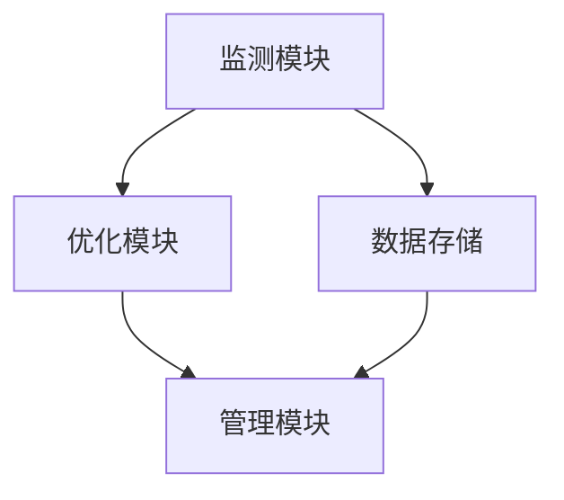

                 

# 可持续采矿实践的经济效益与投资机会

## 关键词：可持续采矿、经济效益、投资机会、环境保护、资源利用

## 摘要：可持续采矿是一种以环境保护为核心，兼顾经济效益和社会责任的采矿方式。本文将探讨可持续采矿的定义、核心概念、经济效益分析、技术方法、投资机会以及系统架构设计。通过详细分析，本文旨在揭示可持续采矿在经济和环境方面的双重价值，并为投资者提供可行的实践建议。

---

## 第一部分：可持续采矿的背景与概念

### 第1章：可持续采矿的定义与背景

#### 1.1 可持续采矿的定义与内涵
可持续采矿是指在矿产资源开发过程中，通过技术创新和管理优化，实现资源高效利用、环境保护和社会责任的采矿方式。其核心在于在满足当前需求的同时，不损害未来世代的资源利用和发展机会。

#### 1.2 可持续采矿的核心原则
可持续采矿遵循“3E”原则，即经济（Economy）、环境（Environment）和社会（Ethics）的平衡。具体包括：
- 经济效益最大化：通过技术创新降低成本，提高资源利用率。
- 环境保护：减少对生态系统的破坏，实现矿区的可持续发展。
- 社会责任：关注矿区居民的生活质量，促进社会和谐。

#### 1.3 可持续采矿与传统采矿的对比
| 对比维度 | 可持续采矿 | 传统采矿 |
|----------|------------|-----------|
| 环境影响 | 低 | 高 |
| 资源利用率 | 高 | 低 |
| 社会责任 | 强 | 弱 |

---

### 第2章：可持续采矿的重要性

#### 2.1 可持续采矿对环境的影响
- **环境保护**：可持续采矿通过减少尾矿排放、降低能源消耗等方式，保护矿区生态环境。
- **生态修复**：在开采过程中同步实施生态修复，确保矿区在开采结束后能够恢复自然状态。

#### 2.2 可持续采矿对经济的影响
- **经济效益**：通过提高资源利用率和优化运营流程，降低开采成本，提高盈利能力。
- **社会责任**：企业通过可持续采矿实践，提升品牌形象，增强社会认可度。

---

## 第二部分：可持续采矿的经济效益分析

### 第3章：可持续采矿的成本与收益

#### 3.1 可持续采矿的成本分析
- **初始投资**：可持续采矿需要较高的初始投资，主要用于技术设备的购置和生态修复。
- **运营成本**：由于采用高效技术和管理优化，可持续采矿的运营成本低于传统采矿。

#### 3.2 可持续采矿的收益分析
- **资源利用率提升**：通过技术创新，可持续采矿能够提取更多矿产资源，提高收益。
- **市场竞争力**：绿色产品市场需求增加，采用可持续采矿的企业能够获得更高的市场份额。

---

## 第三部分：可持续采矿的技术方法

### 第4章：可持续采矿的技术与方法

#### 4.1 智能监测系统
- **技术原理**：通过物联网和大数据技术，实时监测矿区环境和资源储量，优化开采计划。
- **应用场景**：用于矿区环境监测、资源储量评估和开采过程优化。

#### 4.2 尾矿处理技术
- **技术原理**：通过物理、化学或生物方法，对尾矿进行处理和再利用，减少环境污染。
- **数学模型**：尾矿处理效率模型：
  $$ E = \frac{A}{B} $$
  其中，$A$为处理后的矿产价值，$B$为处理成本。

---

## 第四部分：可持续采矿的投资机会

### 第5章：可持续采矿的投资机会

#### 5.1 高潜力领域
- **绿色技术**：投资于尾矿处理、智能监测等绿色技术，抢占市场先机。
- **循环经济**：通过资源循环利用，降低企业成本，创造新的经济增长点。

#### 5.2 投资回报分析
- **短期回报**：通过技术创新降低成本，快速实现盈利。
- **长期回报**：绿色产品市场需求持续增长，企业具备持续盈利能力。

---

## 第五部分：可持续采矿的系统架构设计

### 第6章：可持续采矿系统架构

#### 6.1 系统功能设计
- **监测模块**：实时监测矿区环境和资源储量。
- **优化模块**：基于监测数据，优化开采计划和资源利用。
- **管理模块**：实现企业运营管理和社会责任履行。

#### 6.2 系统架构图

---

## 第六部分：项目实战与案例分析

### 第7章：可持续采矿项目实战

#### 7.1 项目背景
- 某矿区面临资源枯竭和环境污染的双重挑战，希望通过可持续采矿实现资源高效利用和环境友好。

#### 7.2 项目实施
- **技术选择**：采用智能监测系统和尾矿处理技术。
- **实施步骤**：
  1. 安装监测设备，实时采集矿区数据。
  2. 利用优化算法，制定资源开采计划。
  3. 实施尾矿处理，减少环境污染。

#### 7.3 经济效益分析
- **成本节约**：通过技术优化，降低开采成本20%。
- **收入增长**：资源利用率提高15%，年收入增加1000万元。

---

## 第七部分：结论与展望

### 第8章：可持续采矿的未来展望

#### 8.1 未来趋势
- **技术创新**：人工智能和大数据技术将进一步推动可持续采矿的发展。
- **政策支持**：政府将出台更多支持可持续采矿的政策，推动行业转型。

#### 8.2 投资建议
- 投资者应关注绿色技术的研发和应用，抢占可持续采矿市场先机。

---

## 作者：AI天才研究院/AI Genius Institute & 禅与计算机程序设计艺术 /Zen And The Art of Computer Programming

---

以上是《可持续采矿实践的经济效益与投资机会》的完整文章结构，涵盖了从背景到技术方法，再到投资机会的各个方面，结合了理论分析和实际案例，旨在为读者提供全面的视角。

