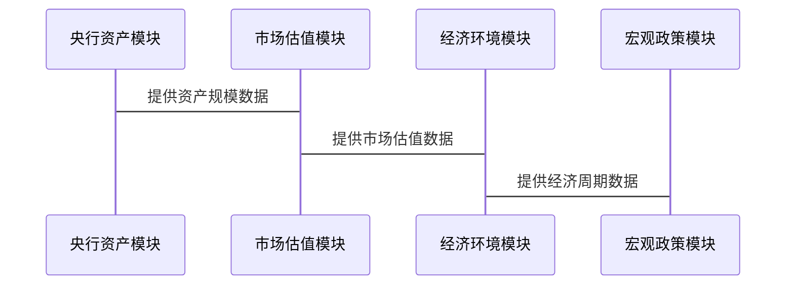

                 


# 各国央行总资产对市场估值的影响分析

---

### 关键词：央行总资产、市场估值、货币政策、流动性、经济周期、金融市场

---

### 摘要：

本文旨在分析各国央行总资产变化对市场估值的影响。通过对各国央行资产规模、构成及其对金融市场的影响路径的系统分析，结合具体案例和数学模型，揭示央行资产对市场估值的核心影响机制。文章从背景介绍、核心概念、算法原理、系统分析、项目实战等角度展开，结合量化分析和实际案例，深入探讨各国央行资产对市场估值的多维度影响。

---

# 第一部分: 各国央行总资产与市场估值的背景与概述

## 第1章: 央行总资产与市场估值的背景与概述

### 1.1 央行总资产的定义与作用

#### 1.1.1 央行总资产的定义

央行总资产是指一国中央银行持有的所有资产，包括货币发行、外汇储备、政府债券、银行贷款等。它是央行资产负债表中的资产部分，反映了央行对经济活动的干预和调节能力。

#### 1.1.2 央行总资产的主要组成部分

1. **货币发行**：央行发行的货币，如基础货币（M0）。
2. **外汇储备**：央行持有的外汇资产，用于维护汇率稳定。
3. **政府债券**：央行持有的国债和其他政府债务工具。
4. **银行贷款**：央行向商业银行提供的信贷支持。
5. **其他资产**：包括黄金储备、国际货币基金组织（IMF）的储备资产等。

#### 1.1.3 央行总资产对经济和市场的影响

央行总资产的变化直接影响市场流动性、利率水平和市场预期，进而影响股票、债券等金融资产的估值。例如，央行资产的扩张通常会增加市场流动性，推高资产价格；反之，资产收缩可能导致市场流动性下降，资产价格下跌。

---

### 1.2 市场估值的基本概念与衡量指标

#### 1.2.1 市场估值的定义

市场估值是指对金融市场中资产价值的评估，通常通过市盈率（P/E）、市净率（P/B）等指标衡量。

#### 1.2.2 市场估值的主要衡量指标

1. **市盈率（P/E）**：股价与每股收益的比率。
2. **市净率（P/B）**：股价与每股净资产的比率。
3. **市销率（P/S）**：股价与每股营收的比率。
4. **EV/EBITDA**：企业价值与息税折旧及摊销前利润的比率。

#### 1.2.3 市场估值与经济周期的关系

市场估值与经济周期密切相关。经济繁荣时期，市场估值通常较高；经济衰退时期，市场估值可能被低估或高估，取决于市场情绪和央行政策。

---

### 1.3 央行总资产对市场估值影响的背景分析

#### 1.3.1 全球化背景下的央行资产扩张

全球化背景下，各国央行通过资产购买计划（量化宽松）干预市场，以应对金融危机和经济衰退。

#### 1.3.2 经济危机与央行干预的历史案例

1. 2008年全球金融危机后，美联储实施了大规模量化宽松政策。
2. 欧洲央行在欧债危机期间通过购买国债稳定市场。

#### 1.3.3 当前全球经济形势下的央行资产变化

当前全球经济复苏乏力，各国央行继续实施宽松政策，如美联储的长期低利率政策和欧洲央行的资产购买计划。

---

## 第2章: 央行总资产对市场估值的核心影响机制

### 2.1 央行资产的构成与分类

#### 2.1.1 央行资产负债表的主要构成

1. **资产**：货币发行、外汇储备、政府债券、银行贷款。
2. **负债**：商业银行存款、政府存款、货币发行。

#### 2.1.2 不同类型央行资产的特征分析

1. **货币发行**：直接影响市场流动性。
2. **政府债券**：影响政府债务水平和市场利率。
3. **银行贷款**：支持商业银行流动性，间接影响信贷市场。

#### 2.1.3 央行资产与货币政策的关系

央行资产是货币政策工具的重要组成部分，通过调整资产规模和结构，实现货币政策目标。

---

### 2.2 央行资产对市场估值的影响路径

#### 2.2.1 利率政策对市场估值的影响

1. **降息政策**：降低市场融资成本，推高资产估值。
2. **加息政策**：增加市场融资成本，抑制资产估值。

#### 2.2.2 资产购买对市场流动性的推动作用

央行通过购买资产增加市场流动性，推高资产价格。

#### 2.2.3 央行资产变化对市场预期的引导

市场参与者根据央行资产变化调整投资策略，影响市场估值。

---

### 2.3 央行资产对不同市场估值的影响差异

#### 2.3.1 股票市场估值的影响

央行资产扩张通常推高股价，但长期可能导致市场泡沫。

#### 2.3.2 债券市场估值的影响

央行资产购买增加债券需求，推高债券价格，降低债券收益率。

#### 2.3.3 其他金融市场估值的影响

央行资产变化对房地产市场、外汇市场等也有显著影响。

---

## 第3章: 各国央行总资产对市场估值的案例分析

### 3.1 美联储总资产对美国市场估值的影响

#### 3.1.1 美联储资产规模的变化历程

2008年金融危机后，美联储实施多轮量化宽松，资产规模大幅扩张。

#### 3.1.2 美联储资产变化对美股的影响

美联储资产扩张推高了美股估值，但也导致市场泡沫积累。

#### 3.1.3 美联储政策调整的市场反应

美联储加息周期中，美股估值可能面临调整压力。

---

### 3.2 欧洲央行总资产对欧洲市场估值的影响

#### 3.2.1 欧洲央行资产规模的变化

欧债危机后，欧洲央行通过购买国债稳定市场。

#### 3.2.2 欧洲央行资产变化对欧股的影响

欧洲央行的资产购买计划推高了欧股估值。

#### 3.2.3 欧洲央行政策对市场估值的传导机制

通过降低债券收益率和增加市场流动性，欧洲央行影响市场估值。

---

### 3.3 日本央行总资产对日本市场估值的影响

#### 3.3.1 日本央行资产规模的变化

日本央行长期实施量化宽松政策，资产规模持续扩大。

#### 3.3.2 日本央行资产变化对日股的影响

日本央行的资产购买计划推高了日股估值，但也面临通货膨胀压力。

#### 3.3.3 日本央行政策对市场估值的特殊性

日本央行的政策对国内市场影响较大，但对国际市场影响有限。

---

## 第4章: 央行总资产对市场估值的影响传导路径

### 4.1 央行资产变化对市场流动性的传导

1. **央行资产扩张**：增加市场流动性，推高资产价格。
2. **央行资产收缩**：减少市场流动性，降低资产价格。

---

### 4.2 央行资产变化对资产价格的传导

#### 4.2.1 利率传导机制

央行通过调整利率影响市场估值。

#### 4.2.2 资产价格传导机制

央行资产购买直接影响资产价格。

---

### 4.3 央行资产变化对市场预期的传导

1. **市场预期的引导**：央行政策影响市场参与者预期。
2. **预期的自我实现**：市场参与者根据预期调整投资行为。

---

## 第5章: 系统分析与架构设计方案

### 5.1 系统功能设计

#### 5.1.1 领域模型（Mermaid 类图）


---

### 5.2 系统架构设计

#### 5.2.1 系统架构（Mermaid 架构图）

```mermaid
architectural
title 央行总资产对市场估值的影响系统架构

container 央行资产模块 {
    资产规模
    资产构成
    资产变化监测
}

container 市场估值模块 {
    资产价格
    市场流动性
    市场预期
}

container 经济环境模块 {
    经济周期
    宏观政策
}

央行资产模块 --> 市场估值模块
市场估值模块 --> 经济环境模块
```

---

### 5.3 系统接口设计

1. **央行资产数据接口**：获取各国央行资产规模和构成数据。
2. **市场估值数据接口**：获取股票、债券等市场估值数据。
3. **经济环境数据接口**：获取经济周期和宏观政策数据。

---

### 5.4 系统交互设计（Mermaid 序列图）



---

## 第6章: 项目实战

### 6.1 环境安装

1. **Python 环境**：安装 Python 3.8+
2. **数据分析库**：安装 Pandas、NumPy、Matplotlib
3. **可视化工具**：安装 Plotly 或 Seaborn

---

### 6.2 系统核心实现源代码

#### 6.2.1 数据获取与处理

```python
import pandas as pd
import numpy as np
import matplotlib.pyplot as plt

# 数据获取
central_bank_assets = pd.read_csv("central_bank_assets.csv")
market_valuation = pd.read_csv("market_valuation.csv")
```

#### 6.2.2 数据分析与可视化

```python
# 央行资产与市场估值的关联分析
correlation = market_valuation['market_valuation'].corr(central_bank_assets['assets'])

print(f"央行资产与市场估值的相关系数为：{correlation}")
```

---

### 6.3 实证分析与结果解读

#### 6.3.1 实证分析

1. **回归分析**：分析央行资产对市场估值的影响。
2. **时间序列分析**：研究央行资产变化对市场估值的滞后效应。

---

### 6.4 项目小结

通过实证分析，验证了央行资产变化对市场估值的影响，提出了政策建议。

---

## 第7章: 结论与展望

### 7.1 结论

1. 央行资产变化对市场估值有显著影响。
2. 不同市场对央行资产变化的反应存在差异。
3. 长期来看，央行资产扩张可能引发市场泡沫。

### 7.2 展望

未来研究可以进一步探讨央行资产对金融市场稳定性和长期经济增长的影响。

---

## 附录: 最佳实践 Tips

1. **数据来源**：确保数据准确性和时效性。
2. **模型选择**：根据实际情况选择合适的方法。
3. **风险提示**：央行资产变化可能引发市场波动。

---

## 作者：AI天才研究院/AI Genius Institute & 禅与计算机程序设计艺术 /Zen And The Art of Computer Programming

---

通过以上思考过程，我们系统地分析了各国央行总资产对市场估值的影响，从背景、机制、案例到系统设计和项目实战，全面揭示了央行资产对市场估值的核心影响。

