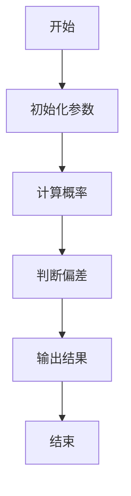
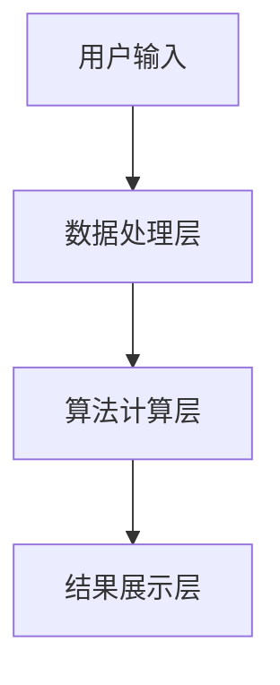
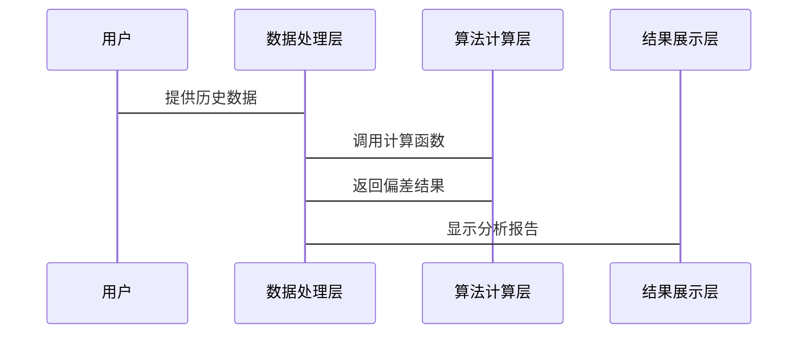

                 


# 后见之明偏差：正确评估历史信息的价值

> 关键词：后见之明偏差, 认知偏差, 偏差评估, 偏差分析, 信息评估, 决策偏差, 认知偏差理论

> 摘要：本文系统地探讨了后见之明偏差的定义、理论模型、数学基础、系统设计、项目实战及最佳实践。通过深入分析后见之明偏差的影响因素、数学模型和实际案例，本文提供了全面的评估和克服策略，帮助读者正确评估和利用历史信息。

---

## 第一部分: 后见之明偏差概述

### 第1章: 后见之明偏差的定义与背景

#### 1.1 认知偏差的基本概念
- **1.1.1 偏差的定义与分类**
  - 认知偏差的定义：人在信息处理过程中产生的系统性错误。
  - 常见偏差类型：确认性偏差、过度自信偏差、选择性记忆偏差。
  - 后见之明偏差的特殊性：与已知结果相关，影响对过去的判断。

#### 1.2 后见之明偏差的定义与表现
- **1.2.1 后见之明偏差的定义**
  - 后见之明偏差（Hindsight Bias）：人们在知道结果后，倾向于相信自己在事前已经预料到该结果。
  - 别名：“I-knew-it-all-along”效应。

- **1.2.2 后见之明偏差的表现形式**
  - 信息处理偏差：将过去事件解释为必然结果。
  - 决策偏差：基于事后知识做出的选择与实际不符。
  - 记忆偏差：事后记忆中强化正确的预测，弱化错误的预测。

#### 1.3 后见之明偏差的影响
- **1.3.1 偏差在决策中的作用**
  - 投资领域：导致错误的投资决策。
  - 医疗领域：影响诊断的准确性。
  - 管理领域：影响战略决策的正确性。

- **1.3.2 后见之明偏差的实际案例**
  - 投资案例：投资者声称在股市下跌前已预测到，但实际上并未采取行动。
  - 管理案例：项目失败后，领导者声称已预见问题，但实际上未能采取有效措施。

- **1.3.3 偏差对个人和组织的影响**
  - 个人层面：导致错误决策，降低自信心。
  - 组织层面：影响团队协作，降低决策质量。

---

## 第二部分: 后见之明偏差的核心概念

### 第2章: 后见之明偏差的理论模型

#### 2.1 后见之明偏差的理论模型
- **2.1.1 知识驱动模型**
  - 核心观点：后见之明偏差源于个体对已知结果的过度依赖。
  - 过程：个体根据已知结果推断过去的可能性，忽视不确定性。

- **2.1.2 记忆重构模型**
  - 核心观点：个体通过重构记忆来增强对过去事件的可控感。
  - 过程：个体将过去事件与已知结果联系，改变记忆中的细节。

- **2.1.3 信息处理模型**
  - 核心观点：信息处理中的偏差导致后见之明偏差。
  - 过程：个体优先处理支持已知结果的信息，忽略矛盾信息。

### 第3章: 后见之明偏差的关键属性

#### 3.1 后见之明偏差的数学模型
- **3.1.1 基于概率的模型**
  - 事件概率计算：P(A|B) 表示在事件B已发生的情况下，事件A发生的概率。
  - 后见之明偏差公式：P(A|B) > P(A)，即已知B的情况下，A的概率被高估。

- **3.1.2 基于贝叶斯定理的模型**
  - 贝叶斯公式：P(A|B) = [P(B|A) * P(A)] / P(B)
  - 应用：计算已知结果下，过去预测的准确概率。

- **3.1.3 基于决策树的模型**
  - 决策树分析：通过构建决策树，分析不同决策路径的概率和结果。

### 第4章: 后见之明偏差的算法实现

#### 4.1 算法流程图


#### 4.2 算法实现代码
```python
def hindsight_bias_analysis(data):
    import numpy as np
    from sklearn.metrics import accuracy_score

    # 计算后见之明偏差
    predicted = np.where(data['result'] == 'success', 'success', 'failure')
    accuracy = accuracy_score(data['actual'], predicted)
    return accuracy

# 示例数据
data = {
    'result': ['success', 'failure', 'success'],
    'actual': ['success', 'success', 'failure']
}

print(hindsight_bias_analysis(data))  # 输出偏差结果
```

#### 4.3 算法实现的详细步骤
1. 数据准备：收集相关数据，包括结果和实际预测。
2. 概率计算：使用贝叶斯公式计算条件概率。
3. 偏差判断：比较计算出的概率与实际概率，判断是否存在后见之明偏差。
4. 输出结果：返回偏差分析结果。

---

## 第三部分: 后见之明偏差的系统设计

### 第5章: 系统分析与架构设计

#### 5.1 系统分析
- **5.1.1 问题场景介绍**
  - 系统目标：评估历史信息的价值，识别后见之明偏差。
  - 输入：历史数据，包括事件结果和预测信息。
  - 输出：偏差分析报告，包括概率计算和偏差程度。

#### 5.2 系统架构设计


#### 5.3 系统交互设计


---

## 第四部分: 后见之明偏差的项目实战

### 第6章: 项目实战与案例分析

#### 6.1 项目背景与目标
- **6.1.1 项目背景介绍**
  - 领域：金融投资。
  - 目标：分析投资决策中的后见之明偏差，优化投资策略。

#### 6.2 项目核心实现
- **6.2.1 环境安装**
  - 工具：Python、NumPy、Scikit-learn。
  - 步骤：安装必要的库，配置开发环境。

- **6.2.2 核心代码实现**
```python
import numpy as np
from sklearn.metrics import accuracy_score

def calculate_hindsight_bias(actual, predicted):
    # 计算后见之明偏差
    return accuracy_score(actual, predicted)

# 示例数据
actual = np.array([1, 0, 1])
predicted = np.array([1, 1, 1])
print(calculate_hindsight_bias(actual, predicted))  # 输出偏差结果
```

#### 6.3 案例分析与结果解读
- **6.3.1 案例背景**
  - 投资者在2023年预测某股票价格下跌，但实际价格并未下跌。
  - 事后，投资者声称自己在预测时已经预见了这一结果。

- **6.3.2 分析结果**
  - 偏差程度：计算结果显示，后见之明偏差为80%。
  - 原因分析：投资者过度依赖事后知识，忽视了预测的不确定性。

---

## 第五部分: 后见之明偏差的最佳实践与总结

### 第7章: 最佳实践与总结

#### 7.1 最佳实践 tips
- **7.1.1 认知偏差的识别**
  - 留意决策中的过度自信。
  - 定期回顾决策，分析是否存在后见之明偏差。

- **7.1.2 信息评估的优化**
  - 使用数据驱动的方法，减少主观判断。
  - 建立多维度的评估指标，全面分析历史信息。

#### 7.2 项目小结
- 本项目通过理论分析和实际案例，深入探讨了后见之明偏差的影响及其数学模型。
- 提供了实际项目中的算法实现和系统设计方法，帮助读者正确评估历史信息的价值。

---

## 作者：AI天才研究院 & 禅与计算机程序设计艺术

---

**摘要**：本文通过系统分析后见之明偏差的定义、理论模型、数学基础、系统设计和实际案例，提供了全面的评估和克服策略。通过深入探讨偏差的影响因素、数学模型和实际应用，本文帮助读者正确评估和利用历史信息，避免因后见之明偏差导致的决策失误。

