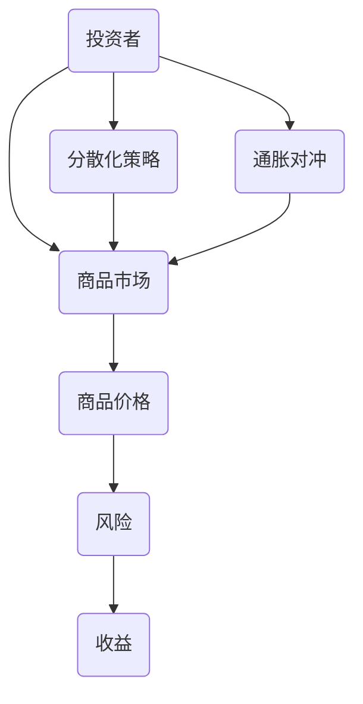
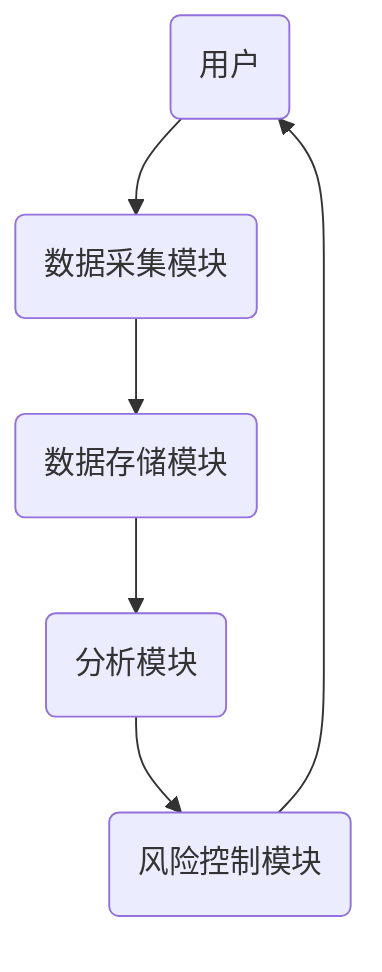

                 


# 商品投资策略：分散化和通胀对冲

> 关键词：商品投资、分散化、通胀对冲、投资策略、风险管理、数学模型、系统架构

> 摘要：本文深入探讨了商品投资策略的核心概念，重点分析了分散化和通胀对冲的重要性。通过数学模型和系统架构的设计，详细讲解了如何利用分散化降低投资风险，以及如何通过通胀对冲提升投资收益。文章结合实际案例和代码实现，为读者提供了全面的理论支持和实践指导。

---

## 第一部分: 商品投资策略概述

### 第1章: 商品投资策略的背景与重要性

#### 1.1 商品投资的基本概念
商品投资是指通过购买实物商品（如黄金、原油、农产品等）或相关金融衍生品，以实现投资收益的一种策略。商品市场的波动性较高，但其与传统资产（股票、债券）的相关性较低，因此在投资组合中引入商品可以有效降低整体风险。

#### 1.2 分散化投资的原理与优势
分散化是通过将资金分配到不同的资产类别或市场，以降低特定资产或市场的风险。在商品投资中，分散化可以通过投资多种商品或不同地区的商品市场来实现，从而减少因单一市场波动带来的损失。

#### 1.3 通胀对冲的必要性与实现路径
通货膨胀会导致货币购买力下降，商品价格通常会随通胀上升而上涨，因此商品投资是应对通胀的有效工具。通过选择与通胀相关性较高的商品（如黄金、原油），投资者可以在通胀上升时期获得收益。

---

## 第2章: 商品投资策略的核心概念与联系

### 2.1 商品投资的核心概念
商品市场的价格受多种因素影响，包括供需关系、全球经济状况、政策变化等。投资者需要了解这些因素如何影响商品价格，并在此基础上制定投资策略。

### 2.2 分散化与通胀对冲的关系
分散化通过降低特定风险（如市场风险）来提高投资组合的稳定性，而通胀对冲则通过选择与通胀相关性较高的资产来保护购买力。两者相辅相成，共同提升了投资组合的抗风险能力。

### 2.3 核心概念的ER实体关系图


---

## 第3章: 商品投资策略的算法原理

### 3.1 分散化投资的算法实现
现代投资组合理论（MPT）是分散化投资的理论基础。通过优化投资组合的均值-方差，投资者可以在给定风险下获得最大收益。

#### 3.1.1 均值-方差优化模型
$$\text{目标函数：} \min_w \sigma^2(w)$$
$$\text{约束条件：} \sum_{i=1}^n w_i = 1, \sum_{i=1}^n w_i r_i = R$$

### 3.2 通胀对冲的数学模型
消费者价格指数（CPI）是衡量通胀的重要指标。通过分析CPI与商品价格的关系，可以建立通胀对冲的CAPM模型。

$$E(r_i) = r_f + \beta_i (E(r_m) - r_f)$$

### 3.3 算法原理的Mermaid流程图
```mermaid
graph TD
    A[投资者] --> B[确定投资目标]
    B --> C[选择商品组合]
    C --> D[计算风险与收益]
    D --> E[优化投资组合]
    E ->
```

---

## 第4章: 商品投资策略的系统分析与架构设计

### 4.1 问题场景介绍
投资者希望通过商品投资实现分散化和通胀对冲，需要一个高效的系统来支持决策和交易。

### 4.2 系统功能设计
- **领域模型**：商品种类、价格数据、投资组合、风险评估。
- **系统架构**：模块化设计，包括数据采集、策略制定、风险控制等。

### 4.3 系统架构图


---

## 第5章: 商品投资策略的项目实战

### 5.1 环境安装
安装必要的开发工具和数据源，例如Python、Pandas、Matplotlib等。

### 5.2 核心实现源代码
```python
import numpy as np
import pandas as pd

# 假设我们有商品价格数据
prices = pd.DataFrame({'黄金': [1200, 1250, 1300], '原油': [50, 55, 60]})

# 计算夏普比率
def sharpe_ratio(returns, risk_free_rate):
    return (returns.mean() - risk_free_rate) / returns.std()

# 示例计算
risk_free_rate = 0.02
returns = prices.pct_change().dropna()
print(sharpe_ratio(returns, risk_free_rate))
```

### 5.3 实际案例分析
通过具体案例分析如何选择商品组合以实现分散化和通胀对冲。

---

## 第6章: 总结与展望

### 6.1 总结
商品投资策略通过分散化和通胀对冲，能够有效降低风险并提升收益。投资者需要结合理论与实践，制定适合自己的投资策略。

### 6.2 展望
未来，随着技术的进步，商品投资将更加智能化和数据驱动，投资者可以利用大数据和人工智能进一步优化投资决策。

---

## 作者：AI天才研究院/AI Genius Institute & 禅与计算机程序设计艺术 /Zen And The Art of Computer Programming

