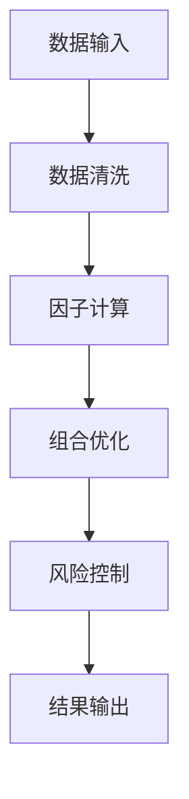

                 

# 因子投资：捕捉市场异常回报的系统方法

> 关键词：因子投资，异常回报，系统方法，投资策略，金融建模

> 摘要：本文系统地探讨了因子投资的核心概念、模型构建、系统方法及实际应用，结合数学公式、算法流程图和系统架构设计，深入分析了如何利用因子投资捕捉市场异常回报。通过案例分析和项目实战，展示了因子投资的实践价值和未来发展方向。

---

## 第一部分: 因子投资概述

### 第1章: 因子投资的背景与概念

#### 1.1 什么是因子投资

因子投资是一种基于特定金融因子构建投资组合的方法，旨在通过捕捉这些因子的超额收益（alpha）来实现超越市场基准的回报。因子可以是价值、动量、规模等可量化的变量，反映了资产价格的某种规律性。

**核心概念与联系**

| 因子类型 | 定义 | 示例 |
|----------|------|------|
| 价值因子 | 股票价格相对于其内在价值的偏离 | 市盈率（P/E） |
| 动量因子 | 过去的价格趋势对未来的预测能力 | 过去12个月的收益率 |
| 小市值因子 | 小公司股票的规模效应 | 市值（Market Cap） |

**背景介绍**

因子投资起源于20世纪中期，随着金融学的发展，投资者逐渐发现单纯依赖市场风险（beta）无法解释资产收益的全部变动，因此提出了基于因子的多维度分析方法。因子投资的核心在于识别那些能够系统性地产生超额回报的因子。

### 第2章: 因子投资的核心概念与理论基础

#### 2.1 因子模型的基本原理

因子模型将资产收益分解为因子风险溢价和特异风险两部分。常用模型包括：

- **单因子模型**：仅考虑一个因子，如市场因子。
- **多因子模型**：同时考虑多个因子，如Fama-French三因子模型。

**数学公式**

单因子模型：
$$ R_i = \alpha_i + \beta_i R_m + \epsilon_i $$

多因子模型：
$$ R_i = \alpha_i + \beta_{i1}F_1 + \beta_{i2}F_2 + \ldots + \beta_{ik}F_k + \epsilon_i $$

### 2.2 因子投资的理论基础

#### Fama-French三因子模型

该模型扩展了单因子模型，引入了规模（小市值）和价值因子：

$$ R_i = \alpha_i + \beta_{i1}R_m + \beta_{i2}SizeFactor + \beta_{i3}ValueFactor + \epsilon_i $$

**机器学习的应用**

利用机器学习算法（如随机森林、神经网络）筛选和优化因子，提升模型的预测能力。

---

## 第二部分: 因子模型的构建与应用

### 第3章: 单因子模型的构建与应用

#### 3.1 单因子模型的构建方法

- **因子筛选**：选择具有统计显著性的因子。
- **权重分配**：基于因子的重要性分配权重。
- **组合构建**：根据因子评分排序，构建投资组合。

**案例分析**

以价值因子为例，通过筛选低市盈率股票构建组合，验证其超额回报。

### 第4章: 多因子模型的构建与应用

#### 4.1 多因子模型的构建方法

- **因子相关性分析**：去除高度相关的因子，避免多重共线性。
- **因子组合优化**：使用均值-方差优化或风险中性化方法。

**系统架构设计**

- 数据处理模块：清洗和预处理金融数据。
- 因子挖掘模块：提取和筛选有效因子。
- 组合管理模块：优化投资组合。
- 风险控制模块：监控和管理投资风险。

---

## 第三部分: 因子投资的系统方法

### 第5章: 因子投资的系统架构与流程

#### 5.1 系统架构设计

- **数据层**：存储和管理金融数据。
- **计算层**：计算因子值和组合收益。
- **策略层**：制定和优化投资策略。
- **用户层**：提供交互界面和结果展示。

**系统流程图**

### 第6章: 机器学习在因子投资中的应用

#### 6.1 特征选择

- 使用Lasso回归或主成分分析（PCA）筛选重要因子。

**数学公式**

Lasso回归：
$$ \hat{\beta} = \arg \min \left( \sum_{i=1}^n (y_i - X_i\beta)^2 + \lambda \sum_{j=1}^p |\beta_j| \right) $$

#### 6.2 模型训练

- 训练监督学习模型（如随机森林）预测股票收益。

---

## 第四部分: 实际应用与案例分析

### 第7章: 因子投资的实际应用

#### 7.1 实证分析

- 使用历史数据验证因子模型的有效性。
- 计算因子组合的超额收益和风险调整后收益。

### 第8章: 因子模型的动态调整

- 定期重新优化因子组合，适应市场变化。

---

## 第五部分: 未来展望

### 第9章: 因子投资的未来趋势

#### 9.1 技术进步的影响

- 大数据和AI技术将进一步提升因子挖掘和预测能力。

---

## 小结与最佳实践

- **小结**：因子投资通过系统化的方法捕捉市场异常回报，是现代投资的重要工具。
- **最佳实践**：结合多因子模型和机器学习，动态优化投资策略，注重风险控制。

---

**作者**：AI天才研究院 & 禅与计算机程序设计艺术

---

这篇文章系统地介绍了因子投资的方法和应用，通过详细的章节划分和丰富的案例分析，帮助读者全面理解和应用因子投资策略。

