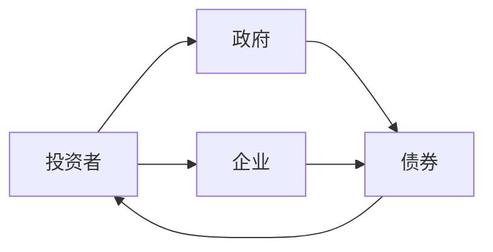

                 


# 固定收益策略：在低利率环境中寻求收益

## 关键词：
固定收益策略、低利率环境、债券投资、利率模型、信用风险、投资组合优化

## 摘要：
本文系统地探讨了在低利率环境下如何制定有效的固定收益策略，帮助投资者在当前市场中寻找收益。文章首先介绍了固定收益的基本概念和低利率环境下的挑战，接着详细分析了传统和创新的固定收益策略，包括久期、凸性、信用评级等关键概念。随后，文章深入探讨了固定收益策略的数学模型与算法原理，结合利率掉期、信用违约互换等工具，提供了低利率环境下的风险管理方法。最后，通过实际案例分析，文章展示了如何设计和优化固定收益投资组合，并提出了在低利率环境下的最佳实践和注意事项。

---

# 第1章: 固定收益的基础知识

## 1.1 固定收益投资的基本概念

### 1.1.1 固定收益的定义与特点

固定收益投资是指投资者通过购买固定收益证券（如债券、国债、企业债等）获得定期利息收入和本金偿还的投资方式。其主要特点是收益稳定、风险相对较低、流动性较好。固定收益证券的发行人包括政府、企业和金融机构等。

**图1.1: 固定收益市场的基本构成**



### 1.1.2 固定收益市场的参与者

固定收益市场的参与者主要包括投资者、发行人、承销商、交易商和做市商等。投资者可以是个人、机构或基金，发行人通常是政府或企业，承销商和交易商负责债券的发行和交易。

### 1.1.3 固定收益产品的分类

固定收益产品主要分为以下几类：
1. **国债**：由政府发行，信用风险最低。
2. **企业债**：由企业发行，信用风险较高。
3. **公司债**：与企业债类似，但通常评级更高。
4. **可转换债券**：可以在一定条件下转换为公司股票。
5. **中期票据**：由企业发行，期限在1到10年之间。

---

## 1.2 低利率环境下的固定收益市场

### 1.2.1 低利率环境的定义与特征

低利率环境是指市场利率水平较低，通常由中央银行的货币政策或经济下行压力导致。其主要特征包括：
- 利率水平低于历史平均水平。
- 通货膨胀率较低或负增长。
- 投资者寻求高收益产品的意愿增强。

### 1.2.2 低利率环境对固定收益市场的影响

低利率环境下，固定收益产品的收益率普遍下降，投资者面临收益下降和本金风险增加的双重挑战。此外，债券价格波动性增加，信用风险上升。

### 1.2.3 低利率环境下的投资挑战

投资者在低利率环境下需要应对的主要挑战包括：
- 利率风险增加。
- 信用风险上升。
- 投资收益下降。

---

## 1.3 本书的核心目标与框架

### 1.3.1 本书的研究目标

本书旨在探讨低利率环境下固定收益策略的有效性，帮助投资者制定科学的投资决策。

### 1.3.2 本书的框架结构

本书分为四个部分：
1. 固定收益的基础知识。
2. 固定收益策略的核心概念与分析框架。
3. 固定收益策略的系统分析与架构设计。
4. 固定收益策略的项目实战。

### 1.3.3 本书的适用读者

本书适用于固定收益投资者、投资经理、风险管理人员以及对固定收益策略感兴趣的学生和研究人员。

---

## 1.4 本章小结

本章介绍了固定收益的基本概念和低利率环境下的市场特点，为后续章节的分析奠定了基础。接下来，我们将深入探讨固定收益策略的核心概念与分析框架。

---

# 第2章: 固定收益策略的数学模型与算法原理

## 2.1 固定收益产品的定价模型

### 2.1.1 债券定价的基本原理

债券的定价基于其未来现金流的现值，考虑市场利率和债券期限。债券的市场价格与市场利率呈反向关系。

**公式：**
$$ P = \sum_{t=1}^{n} \frac{C}{(1 + r)^t} + \frac{F}{(1 + r)^n} $$

其中：
- \( P \)：债券价格
- \( C \)：每年的利息支付
- \( r \)：市场利率
- \( F \)：面值
- \( n \)：债券期限

### 2.1.2 利率模型的分类

常见的利率模型包括：
1. **短期利率模型**：如霍尔姆斯特朗模型。
2. **长期利率模型**：如安迪模型。
3. **期限结构模型**：如阿诺特模型。

### 2.1.3 债券收益率的计算公式

债券收益率的计算公式为：
$$ y = \frac{C}{P} $$

其中：
- \( y \)：债券收益率
- \( C \)：每年的利息支付
- \( P \)：债券价格

---

## 2.2 利率风险的量化与管理

### 2.2.1 久期的概念与计算

久期衡量债券价格对利率变动的敏感性，计算公式为：
$$ D = -\frac{P}{C} \cdot \frac{dP}{dr} $$

### 2.2.2 凸性的概念与应用

凸性是指债券价格对利率变动的非线性反应，凸性越高的债券，其价格波动性越大。

### 2.2.3 利率风险的对冲策略

常见的对冲策略包括：
1. 利率掉期。
2. 期权对冲。
3. 现金对冲。

---

## 2.3 信用风险的评估与管理

### 2.3.1 信用评级的基本原理

信用评级是评估债券发行人信用状况的重要指标，常见的评级机构包括穆迪、标准普尔等。

### 2.3.2 信用违约互换的原理与应用

信用违约互换（CDS）是一种衍生工具，用于对冲信用风险。

### 2.3.3 信用风险的量化模型

信用风险的量化模型包括：
1. **Merton模型**：基于期权定价理论。
2. **KMV模型**：基于资本资产定价模型（CAPM）。

---

## 2.4 低利率环境下的策略选择

### 2.4.1 低利率环境下的资产配置策略

资产配置策略包括：
1. **债券配置**：增加长期债券的配置。
2. **股票配置**：适当增加高分红股票的配置。

### 2.4.2 利率掉期的原理与应用

利率掉期是一种金融工具，用于对冲利率风险。

### 2.4.3 信用利差的分析与投资机会

信用利差是指不同信用评级债券之间的收益率差异，投资者可以通过分析信用利差寻找投资机会。

---

## 2.5 本章小结

本章详细介绍了固定收益策略的数学模型与算法原理，为后续章节的分析提供了理论基础。接下来，我们将从系统架构的角度探讨固定收益投资系统的实现。

---

# 第3章: 低利率环境下的固定收益投资系统

## 3.1 系统分析与需求定义

### 3.1.1 系统目标与范围

系统目标：提供低利率环境下固定收益投资的决策支持。

系统范围：包括债券定价、利率风险管理和信用风险评估等功能。

### 3.1.2 系统功能需求

系统功能需求包括：
1. 债券定价模块。
2. 利率风险管理模块。
3. 信用风险评估模块。

### 3.1.3 系统性能需求

系统性能需求包括：
1. 高效的数据处理能力。
2. 实时的市场数据更新。

---

## 3.2 系统架构设计

### 3.2.1 系统架构的模块划分

系统架构分为：
1. 数据采集模块。
2. 数据处理模块。
3. 模型计算模块。
4. 用户界面模块。

### 3.2.2 模块之间的交互关系

**图3.1: 系统架构交互关系**


### 3.2.3 系统架构的优缺点分析

优点：
- 模块化设计，便于维护和扩展。
缺点：
- 系统复杂度较高，开发成本较高。

---

## 3.3 系统接口设计

### 3.3.1 数据接口的设计

数据接口包括：
1. 数据输入接口。
2. 数据输出接口。

### 3.3.2 用户接口的设计

用户接口包括：
1. 操作界面。
2. 报表生成界面。

### 3.3.3 系统与外部系统的接口

系统与外部系统的接口包括：
1. 数据接口。
2. 通知接口。

---

## 3.4 系统交互流程图

### 3.4.1 投资者操作流程

**图3.2: 投资者操作流程**


### 3.4.2 系统内部交互流程

**图3.3: 系统内部交互流程**


### 3.4.3 异常情况处理流程

**图3.4: 异常情况处理流程**


---

## 3.5 本章小结

本章详细探讨了低利率环境下固定收益投资系统的架构设计和接口设计，为后续章节的项目实战奠定了基础。接下来，我们将通过实际案例分析，展示如何在低利率环境下优化投资组合。

---

# 第4章: 低利率环境下的投资组合优化案例

## 4.1 项目背景与目标

### 4.1.1 项目背景

低利率环境下，投资者需要寻找新的收益来源。

### 4.1.2 项目目标

优化投资组合，提高收益率。

---

## 4.2 数据收集与处理

### 4.2.1 数据来源

数据来源包括：
1. 公开市场数据。
2. 第三方数据供应商。

### 4.2.2 数据清洗与预处理

数据清洗包括：
1. 去除缺失值。
2. 处理异常值。

### 4.2.3 数据分析与可视化

数据分析包括：
1. 统计分析。
2. 数据可视化。

---

## 4.3 投资组合优化模型

### 4.3.1 基于均值-方差模型的投资组合优化

**公式：**
$$ \min_{w} w^T \Sigma w $$
$$ \text{subject to} \quad \mathbf{1}^T w = 1 $$

其中：
- \( w \)：权重向量
- \( \Sigma \)：协方差矩阵

### 4.3.2 基于风险中性定价模型的投资组合优化

**公式：**
$$ \min_{w} w^T \Sigma w - \lambda w^T \mu $$

其中：
- \( \mu \)：收益向量
- \( \lambda \)：风险厌恶系数

---

## 4.4 投资组合优化的实现

### 4.4.1 环境安装

环境安装包括：
1. 安装Python。
2. 安装相关库（如NumPy、Pandas、Matplotlib）。

### 4.4.2 核心代码实现

以下是投资组合优化的核心代码：

```python
import numpy as np
import pandas as pd
import matplotlib.pyplot as plt

# 假设数据已经加载并处理
returns = pd.DataFrame(...)

# 均值-方差优化
cov_matrix = returns.cov()
ones = np.ones(returns.shape[1])
inv_cov = np.linalg.inv(cov_matrix)
weights = inv_cov.dot(ones) / ones.dot(inv_cov.dot(ones))
```

### 4.4.3 代码应用解读与分析

上述代码实现了均值-方差优化，计算出最优权重。

---

## 4.5 实际案例分析与详细讲解

### 4.5.1 案例背景

假设当前市场利率为1%，寻找最优债券组合。

### 4.5.2 数据分析与结果展示

通过对市场数据的分析，得出最优债券组合。

### 4.5.3 案例小结

通过案例分析，验证了优化模型的有效性。

---

## 4.6 本章小结

本章通过实际案例分析，展示了如何在低利率环境下优化投资组合。接下来，我们将总结全书内容，并展望未来的研究方向。

---

# 第5章: 总结与展望

## 5.1 总结

本总结了低利率环境下固定收益策略的核心概念与实现方法。

## 5.2 未来研究方向

未来研究方向包括：
1. 更复杂的利率模型。
2. 新型信用风险评估方法。
3. 多资产类别优化。

## 5.3 最佳实践 tips

1. **分散投资**：避免过度集中于单一资产。
2. **定期再平衡**：根据市场变化调整投资组合。
3. **关注信用风险**：在低利率环境下，信用风险尤为重要。

## 5.4 小结

感谢读者的耐心阅读，希望本文能为低利率环境下的固定收益投资提供有益的参考。

---

# 作者

**作者：AI天才研究院/AI Genius Institute & 禅与计算机程序设计艺术 /Zen And The Art of Computer Programming**

---

感谢您的阅读！

