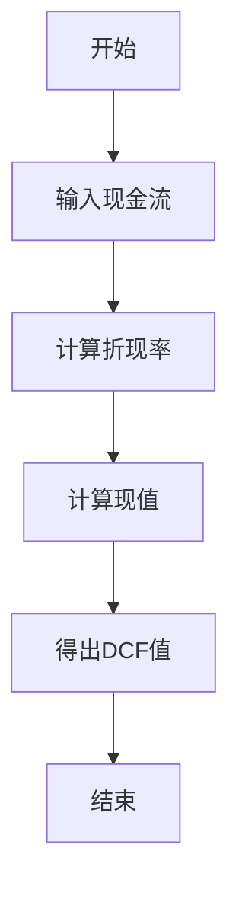
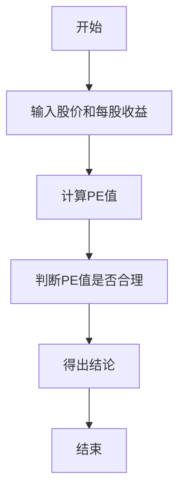
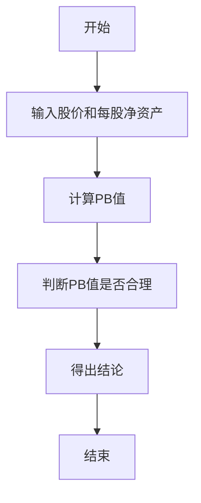

                 


# 国际化投资:全球26个经济体股市估值分析

> 关键词：国际化投资，股市估值，经济体系分析，投资策略，估值模型

> 摘要：本文深入分析了全球化背景下，如何通过估值指标和模型，分析全球26个主要经济体的股市估值情况，为投资者制定科学合理的投资策略提供参考。

---

# 第一部分: 国际化投资与股市估值分析概述

## 第1章: 国际化投资的背景与重要性

### 1.1 全球化背景下的国际化投资

#### 1.1.1 全球化对投资的影响
全球化推动了资本、信息和技术的跨境流动，使得投资者能够通过投资不同国家的股市分散风险、优化资产配置。国际化投资不仅是全球化时代的必然选择，也是投资者实现财富增长的重要途径。

#### 1.1.2 国际化投资的定义与特点
国际化投资是指投资者将资金投向不同国家或地区的金融市场，以实现资产多元化和收益最大化。其特点包括：
- **多样性**：覆盖不同国家和地区的市场。
- **风险分散**：通过投资多元化市场降低投资风险。
- **机会捕捉**：发现不同市场的投资机会。

#### 1.1.3 国际化投资的重要性和必要性
随着全球经济一体化的加深，单一市场的局限性日益显现。通过国际化投资，投资者可以捕捉全球经济增长的机会，同时降低因单一市场波动带来的风险。特别是在全球经济不确定性增加的背景下，国际化投资显得尤为重要。

---

### 1.2 股市估值分析的核心概念

#### 1.2.1 股市估值的基本原理
股市估值是通过对公司基本面的分析，评估其股票的内在价值。常用的估值指标包括市盈率（PE）、市净率（PB）、市销率（PS）等。这些指标能够帮助投资者判断股票是否被高估或低估。

#### 1.2.2 估值指标与方法的对比分析

##### 对比表格
| 估值指标 | 公式 | 适用场景 | 优缺点 |
|----------|------|----------|--------|
| 市盈率（PE） | $\text{PE} = \frac{\text{股价}}{\text{每股收益}}$ | 适用于盈利稳定的公司 | 受益于盈利能力变化 |
| 市净率（PB） | $\text{PB} = \frac{\text{股价}}{\text{每股净资产}}$ | 适用于净资产驱动的行业 | 受资产质量影响较大 |
| 市销率（PS） | $\text{PS} = \frac{\text{股价}}{\text{每股营收}}$ | 适用于高成长性公司 | 受营收质量影响 |

#### 1.2.3 估值指标与模型的实体关系图
```mermaid
erDiagram
    指标(I) --|> 公司(C) : 用于评估
    指标(I) --|> 模型(M) : 应用于
    公司(C) --|> 模型(M) : 输入
```

---

## 第2章: 全球主要经济体的股市估值框架

### 2.1 全球主要经济体概述

#### 2.1.1 全球26个主要经济体的定义与范围
本文分析的26个主要经济体包括美国、中国、日本、欧洲主要国家等，覆盖全球主要的经济区域。

#### 2.1.2 各经济体的经济特征与市场特点
不同经济体的经济结构和市场特点各异。例如，美国市场以科技股为主导，中国市场则以制造业和消费股为主。

#### 2.1.3 经济体间的相互影响与关联性
全球经济体之间存在密切的联系，特别是在贸易、资本流动和货币政策方面。这种相互影响使得股市估值分析需要考虑全球宏观经济环境。

---

### 2.2 股市估值的核心指标与模型

#### 2.2.1 常用估值指标对比（表格）
| 指标 | 定义 | 优缺点 |
|------|------|--------|
| PE | 股价/每股收益 | 受益于盈利能力变化 |
| PB | 股价/每股净资产 | 受资产质量影响较大 |
| PS | 股价/每股营收 | 受营收质量影响 |

#### 2.2.2 常用估值模型的实体关系图
```mermaid
erDiagram
    指标(I) --|> 公司(C) : 用于评估
    指标(I) --|> 模型(M) : 应用于
    公司(C) --|> 模型(M) : 输入
```

#### 2.2.3 估值模型的数学公式与应用场景

##### DCF模型
$$
\text{DCF} = \frac{\text{CF}_1}{(1+r)^1} + \frac{\text{CF}_2}{(1+r)^2} + \dots + \frac{\text{CF}_n}{(1+r)^n} + \frac{\text{TV}}{(1+r)^n}
$$
- **公式解释**：DCF模型通过折现未来现金流，计算出公司股票的内在价值。适用于盈利稳定、现金流可预测的公司。

##### 市盈率模型
$$
\text{PE} = \frac{\text{股价}}{\text{每股收益}}
$$
- **公式解释**：市盈率模型通过比较股价与每股收益的比率，判断股票是否被高估或低估。

##### 市净率模型
$$
\text{PB} = \frac{\text{股价}}{\text{每股净资产}}
$$
- **公式解释**：市净率模型通过比较股价与每股净资产的比率，适用于资产驱动型的行业。

---

## 第3章: 股市估值分析的算法原理

### 3.1 常用估值模型的算法流程

#### DCF模型算法流程


#### 市盈率模型算法流程


#### 市净率模型算法流程


### 3.2 算法原理的数学模型与公式

#### DCF模型的数学公式
$$
\text{DCF} = \frac{\text{CF}_1}{(1+r)^1} + \frac{\text{CF}_2}{(1+r)^2} + \dots + \frac{\text{CF}_n}{(1+r)^n} + \frac{\text{TV}}{(1+r)^n}
$$
- **公式解释**：DCF模型通过折现未来现金流，计算出公司股票的内在价值。适用于盈利稳定、现金流可预测的公司。

#### 市盈率模型的数学公式
$$
\text{PE} = \frac{\text{股价}}{\text{每股收益}}
$$
- **公式解释**：市盈率模型通过比较股价与每股收益的比率，判断股票是否被高估或低估。

#### 市净率模型的数学公式
$$
\text{PB} = \frac{\text{股价}}{\text{每股净资产}}
$$
- **公式解释**：市净率模型通过比较股价与每股净资产的比率，适用于资产驱动型的行业。

---

## 第4章: 系统分析与架构设计

### 4.1 系统分析

#### 4.1.1 问题场景介绍
本文分析的26个主要经济体包括美国、中国、日本、欧洲主要国家等，覆盖全球主要的经济区域。

#### 4.1.2 需求分析与系统功能设计
- **功能需求**：支持多种估值指标和模型的计算，提供可视化结果。
- **系统功能模块**：
  - 数据输入与处理模块
  - 估值模型计算模块
  - 结果可视化模块

#### 4.1.3 系统功能模块划分
- **数据输入与处理模块**：负责接收和处理输入数据。
- **估值模型计算模块**：根据选择的模型计算估值结果。
- **结果可视化模块**：将计算结果以图表形式展示。

---

## 第5章: 项目实战

### 5.1 环境安装与配置

#### 5.1.1 环境需求
- 操作系统：Windows、MacOS、Linux
- 开发工具：Python、Jupyter Notebook、Matplotlib
- 数据来源：Yahoo Finance API或其他可靠数据源

#### 5.1.2 环境配置
```python
import pandas as pd
import numpy as np
import matplotlib.pyplot as plt
import yfinance as yf
```

---

### 5.2 核心实现

#### 5.2.1 数据获取与处理
```python
# 获取股票数据
def get_stock_data(ticker):
    data = yf.download(ticker, start='2020-01-01', end='2023-12-31')
    return data['Adj Close']
```

#### 5.2.2 估值模型实现
```python
# DCF模型实现
def calculate_dcf(cash_flows, discount_rate, terminal_value):
    dcf = 0
    for i in range(len(cash_flows)):
        dcf += cash_flows[i] / (1 + discount_rate) ** i
    dcf += terminal_value / (1 + discount_rate) ** len(cash_flows)
    return dcf

# 市盈率模型实现
def calculate_pe(price, earnings):
    return price / earnings

# 市净率模型实现
def calculate_pb(price, book_value):
    return price / book_value
```

#### 5.2.3 结果可视化
```python
# 示例：绘制PE和PB的对比图
pe_values = [15, 20, 18, 12, 25]
pb_values = [1.5, 2.0, 1.8, 1.0, 2.5]
plt.figure(figsize=(10, 6))
plt.plot(pe_values, pb_values, 'ro')
plt.xlabel('PE')
plt.ylabel('PB')
plt.title('PE vs PB Visualization')
plt.grid(True)
plt.show()
```

---

## 第6章: 总结与展望

### 6.1 总结
本文通过分析全球26个主要经济体的股市估值情况，深入探讨了常用的估值指标和模型，并通过实际案例展示了如何应用这些方法进行估值分析。通过本文的分析，投资者可以更好地理解国际化投资的机遇与挑战，制定科学合理的投资策略。

### 6.2 展望
未来的研究可以进一步拓展，例如引入更多复杂的估值模型，结合宏观经济指标进行分析，或考虑不同市场的政策和法规差异对估值的影响。此外，还可以通过机器学习等技术，提升估值分析的准确性和效率。

---

# 作者：AI天才研究院/AI Genius Institute & 禅与计算机程序设计艺术 /Zen And The Art of Computer Programming

