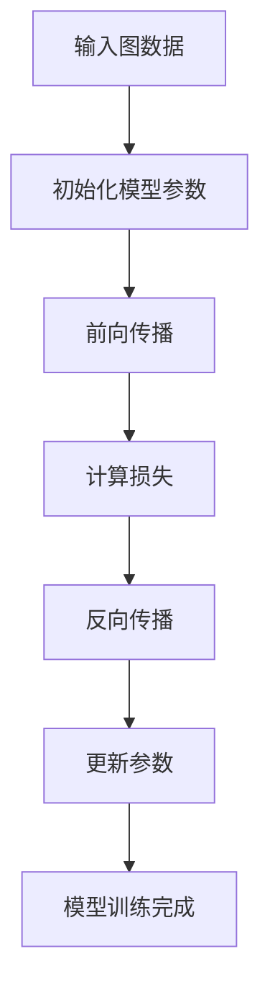

                 


# 图卷积网络在金融传染效应分析中的应用

> 关键词：图卷积网络，金融传染效应，系统性风险，深度学习，金融网络分析

> 摘要：本文深入探讨了图卷积网络（Graph Convolutional Networks, GCN）在金融传染效应分析中的应用。首先介绍了金融传染效应的背景及其在金融风险管理中的重要性，然后详细讲解了图卷积网络的核心概念、算法原理及其在金融分析中的独特优势。接着，通过实际案例分析，展示了图卷积网络在系统性金融风险中的应用，包括系统架构设计、项目实现和具体案例分析。最后，总结了图卷积网络在金融传染效应分析中的价值，并展望了未来的研究方向。

---

## 第1章：金融传染效应与图卷积网络概述

### 1.1 金融传染效应的背景与问题描述

金融传染效应是指金融市场的波动或危机在不同金融机构之间传播的现象。这种效应通常由金融机构之间的复杂关联引起，例如银行、保险公司、投资公司等通过信贷、投资或担保形成复杂的网络关系。当一家金融机构出现问题时，可能会引发连锁反应，导致整个金融系统的不稳定性。

#### 问题背景
- 2008年金融危机就是一个典型的例子，雷曼兄弟的破产引发了全球范围的金融危机，凸显了金融传染效应的严重性。
- 随着全球化和金融创新的深入，金融机构之间的关联性不断增强，金融传染效应变得更加复杂和难以预测。

#### 问题描述
- 金融机构之间的关联性可能导致系统性风险的扩散。
- 如何量化和预测这种传染效应，对于金融监管和风险管理具有重要意义。

#### 问题解决方法
- 传统的统计方法和计量经济学模型在处理复杂金融网络时存在局限性。
- 图卷积网络（GCN）作为一种基于深度学习的图数据分析技术，能够有效捕捉金融网络中的复杂关系和非线性特征。

#### 概念结构与核心要素
- **节点**：金融机构（如银行、保险公司）。
- **边**：金融机构之间的关联关系（如贷款、投资）。
- **网络属性**：节点度、网络密度、中心性等。

---

### 1.2 图卷积网络的核心概念

图卷积网络是一种基于图结构的数据进行分析的深度学习方法，其核心思想是将图的结构信息与节点特征结合起来，通过卷积操作提取有用的特征表示。

#### 图卷积网络的基本原理
- 图数据由节点和边组成，边通常带有权重表示节点之间的关系强度。
- 图卷积操作将节点的特征与其邻居节点的特征进行聚合，形成新的特征表示。

#### 与传统CNN的对比
- **输入数据**：传统CNN处理的是规则结构的数据（如图像），GCN处理的是任意结构的图数据。
- **计算方式**：传统CNN使用滑动窗口进行局部卷积，GCN基于图的邻接矩阵进行全局卷积。

---

## 第2章：图卷积网络的核心概念与联系

### 2.1 图卷积网络的原理与数学模型

图卷积网络的数学模型主要基于图的邻接矩阵和节点特征矩阵。以下是GCN的数学表达式：

$$
X^{(l+1)} = A X^{(l)} W^{(l)}
$$

其中，\(X^{(l)}\) 是第 \(l\) 层的节点特征矩阵，\(A\) 是邻接矩阵，\(W^{(l)}\) 是第 \(l\) 层的权重矩阵。

### 2.2 核心概念对比与ER实体关系图

#### 对比表格
| 对比项 | 图卷积网络（GCN） | 传统CNN |
|--------|------------------|----------|
| 输入数据 | 图结构数据       | 规则结构数据 |
| 处理方式 | 基于图的邻接矩阵进行全局卷积 | 基于滑动窗口进行局部卷积 |

#### ER实体关系图
```mermaid
er
actor:
    id: string
    name: string
    role: string
    team: string
    phone: string
    email: string
    status: string
    notes: string
```

---

## 第3章：图卷积网络的算法原理与数学模型

### 3.1 图卷积网络的数学模型

图卷积网络的数学模型可以表示为：

$$
X^{(l+1)} = A X^{(l)} W^{(l)}
$$

其中，\(A\) 是归一化的邻接矩阵，\(W^{(l)}\) 是第 \(l\) 层的权重矩阵，\(X^{(l)}\) 是第 \(l\) 层的节点特征矩阵。

### 3.2 图卷积网络的算法流程图



### 3.3 图卷积网络的Python实现示例

```python
import torch
from torch import nn

class GCN(nn.Module):
    def __init__(self, input_dim, hidden_dim, output_dim):
        super(GCN, self).__init__()
        self.A = torch.randn(input_dim, input_dim)  # 邻接矩阵
        self.W1 = nn.Parameter(torch.randn(input_dim, hidden_dim))
        self.W2 = nn.Parameter(torch.randn(hidden_dim, output_dim))
    
    def forward(self, x):
        x = torch.mm(x, self.A)  # 图卷积操作
        x = torch.relu(torch.mm(x, self.W1))
        x = torch.mm(x, self.W2)
        return x
```

---

## 第4章：金融传染效应分析的系统架构设计

### 4.1 项目背景与目标

#### 项目背景
- 金融危机的爆发往往由金融机构之间的传染效应引起。
- 如何利用图卷积网络分析金融传染效应，对于金融监管和风险管理具有重要意义。

#### 项目目标
- 构建基于GCN的金融传染效应分析系统。
- 实现金融网络的构建、传染效应的传播分析和风险预警功能。

### 4.2 系统功能设计

#### 领域模型类图

```mermaid
classDiagram
    class 金融机构 {
        id: int
        name: string
        financial_status: float
        connections: list
    }
    class 金融网络 {
        nodes: list of 金融机构
        edges: list of 关联关系
        graph: 图结构数据
    }
    class 关联关系 {
        source: 金融机构
        target: 金融机构
        weight: float
    }
    class 系统功能 {
        构建网络
        传染效应分析
        风险预警
    }
```


### 4.3 系统架构设计

#### 系统架构图


---

## 第5章：项目实战

### 5.1 环境安装

```bash
pip install torch
pip install networkx
pip install matplotlib
```

### 5.2 核心代码实现

```python
import networkx as nx
import matplotlib.pyplot as plt
import torch
from torch import nn

# 创建金融网络
G = nx.Graph()
G.add_nodes_from(["Bank1", "Bank2", "Bank3", "Bank4", "Bank5"])
G.add_edges_from([("Bank1", "Bank2"), ("Bank2", "Bank3"), ("Bank3", "Bank4"), ("Bank4", "Bank5")])

# 绘制网络图
nx.draw(G, with_labels=True, node_color="red", edge_color="blue")
plt.show()
```

### 5.3 案例分析

#### 案例：银行间贷款关系的传染效应分析

假设银行1出现流动性危机，可能会影响银行2，进而影响银行3、银行4和银行5。通过GCN模型，可以量化这种传染效应的传播路径和影响程度。

---

## 第6章：扩展与展望

### 6.1 图卷积网络的其他应用
- 金融诈骗检测
- 股票价格预测
- 信用评分

### 6.2 当前挑战
- 图数据的稀疏性
- 计算复杂度
- 模型的可解释性

### 6.3 未来研究方向
- 更高效的GCN算法优化
- 多模态数据的融合
- 图动态网络（DySAT）的研究

---

## 第7章：总结与展望

### 7.1 全文总结
- 图卷积网络在金融传染效应分析中具有独特的优势。
- 通过构建金融网络，可以有效捕捉金融机构之间的复杂关系。
- GCN模型能够量化传染效应的传播路径和影响程度，为金融监管和风险管理提供有力支持。

### 7.2 未来展望
- 结合实时数据，构建动态金融网络。
- 探索更高效、可解释的GCN模型。
- 推动GCN在金融领域的广泛应用。

---

## 作者信息

作者：AI天才研究院/AI Genius Institute & 禅与计算机程序设计艺术/Zen And The Art of Computer Programming

