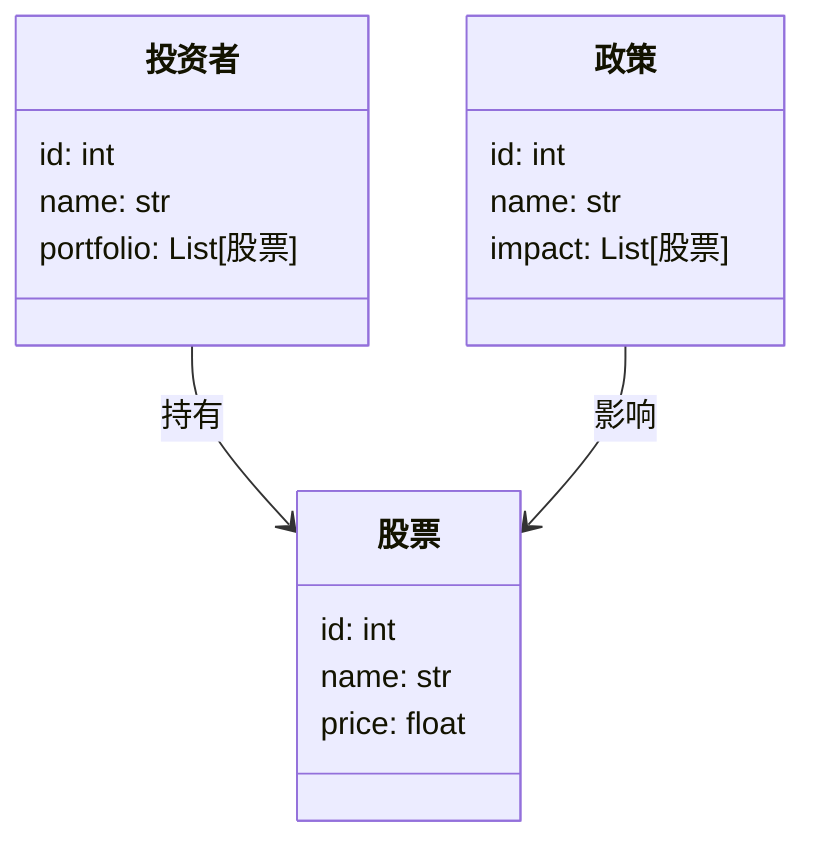
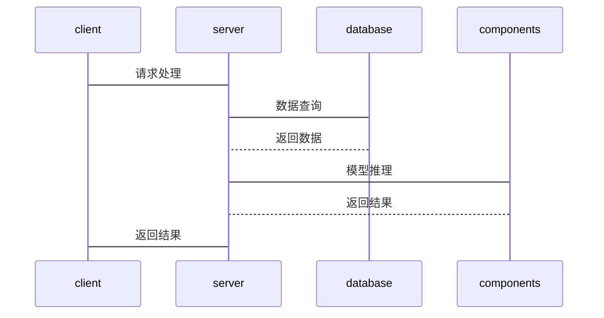

                 


# 图注意力网络在金融影响力分析中的应用

> 关键词：图注意力网络，金融影响力分析，深度学习，注意力机制，图结构数据

> 摘要：本文探讨了图注意力网络在金融影响力分析中的应用，从背景、核心概念到算法实现，再到系统设计和项目实战，详细介绍了如何利用图注意力网络模型分析金融市场中的影响力关系，提升金融分析的准确性和深度。

---

# 第一部分：图注意力网络与金融影响力分析的背景

## 第1章：图注意力网络与金融影响力分析概述

### 1.1 问题背景

#### 1.1.1 金融市场的复杂性与挑战
金融市场是一个复杂的网络，参与者包括公司、投资者、政府等，它们之间存在复杂的互动关系。传统的金融分析方法难以捕捉这些复杂关系中的关键影响因素。

#### 1.1.2 传统金融分析的局限性
传统的金融分析方法依赖于线性回归、时间序列分析等技术，难以处理非线性关系和复杂的网络结构。此外，传统方法通常只关注单一变量，忽视了整体网络的影响。

#### 1.1.3 图注意力网络的优势
图注意力网络（Graph Attention Network，GAN）是一种结合了图结构和注意力机制的深度学习模型，能够有效捕捉图中节点之间的关系，并赋予不同的注意力权重，适用于复杂的金融网络分析。

### 1.2 问题描述

#### 1.2.1 金融影响力分析的定义
金融影响力分析是指通过分析金融市场中各参与者之间的关系，确定哪些参与者对市场波动有更大的影响力。

#### 1.2.2 图注意力网络在影响力分析中的应用场景
图注意力网络可以应用于股票价格预测、风险评估、投资组合优化等领域，通过建模金融市场中的网络关系，识别关键影响因素。

#### 1.2.3 问题解决的必要性
传统的金融分析方法难以捕捉复杂的网络关系，而图注意力网络能够通过注意力机制识别关键节点，为金融决策提供更精准的支持。

### 1.3 图注意力网络的核心概念

#### 1.3.1 图结构与节点关系
图结构由节点和边组成，节点代表市场参与者，边代表它们之间的关系。节点关系可以通过边的权重表示。

#### 1.3.2 注意力机制的基本原理
注意力机制通过计算节点之间的关系权重，确定哪些节点对当前分析更重要。注意力权重反映了节点的重要性。

#### 1.3.3 图注意力网络的结合方式
图注意力网络将图结构与注意力机制结合，通过计算节点之间的注意力权重，捕捉图中的重要关系。

### 1.4 本章小结

#### 1.4.1 核心概念总结
图注意力网络通过结合图结构和注意力机制，能够有效捕捉金融市场中的复杂关系。

#### 1.4.2 图注意力网络的应用前景
图注意力网络在金融影响力分析中的应用前景广阔，能够为金融决策提供更精准的支持。

---

## 第2章：图注意力网络的核心概念与联系

### 2.1 图结构与节点关系

#### 2.1.1 图的基本概念
图由节点和边组成，节点代表市场参与者，边代表它们之间的关系。图的类型包括有向图和无向图。

#### 2.1.2 节点与边的属性
节点属性包括公司规模、市值等，边属性包括交易量、相关性等。

#### 2.1.3 图的表示方法
图可以表示为邻接矩阵或邻接表。邻接矩阵是一个二维矩阵，表示节点之间的连接情况。

### 2.2 注意力机制的基本原理

#### 2.2.1 注意力机制的定义
注意力机制是一种通过计算节点之间的关系权重，确定哪些节点对当前分析更重要。

#### 2.2.2 注意力机制的核心公式
注意力权重计算公式：
$$
\alpha_{ij} = \text{softmax}(W_q q^T W_k k)
$$
其中，$q$是查询向量，$k$是键向量，$W_q$和$W_k$是参数矩阵。

#### 2.2.3 注意力机制的实现步骤
1. 计算键向量和查询向量。
2. 计算注意力权重。
3. 加权求和得到最终向量。

### 2.3 图注意力网络的结合方式

#### 2.3.1 图注意力网络的模型结构
图注意力网络由图卷积层和注意力层组成。图卷积层用于提取节点特征，注意力层用于计算节点之间的关系权重。

#### 2.3.2 图注意力网络的计算流程
1. 对每个节点，计算其特征向量。
2. 计算节点之间的注意力权重。
3. 根据注意力权重，加权求和得到每个节点的最终表示。

#### 2.3.3 图注意力网络与传统图模型的对比
图注意力网络与传统图卷积网络（GCN）的区别在于，GCN对所有邻居赋予相同的权重，而图注意力网络对每个邻居赋予不同的注意力权重。

### 2.4 本章小结

#### 2.4.1 核心概念总结
图注意力网络通过结合图结构和注意力机制，能够有效捕捉金融市场中的复杂关系。

#### 2.4.2 图注意力网络的优势
图注意力网络能够根据节点的重要性动态调整注意力权重，捕捉关键节点的影响。

---

## 第3章：图注意力网络的算法原理

### 3.1 图注意力网络的数学模型

#### 3.1.1 图的表示方法
图可以表示为邻接矩阵$A$，其中$A_{ij}$表示节点$i$和$j$之间的边是否存在。

#### 3.1.2 注意力权重的计算公式
注意力权重计算公式：
$$
\alpha_{ij} = \frac{\exp(e_{ij})}{\sum_{k} \exp(e_{ik})}
$$
其中，$e_{ij}$是节点$i$和$j$之间的能量分数。

#### 3.1.3 图注意力网络的损失函数
损失函数通常采用交叉熵损失：
$$
\mathcal{L} = -\sum_{i,j} y_{ij} \log p_{ij} + (1-y_{ij}) \log (1-p_{ij})
$$
其中，$y_{ij}$是标签，$p_{ij}$是预测概率。

### 3.2 图注意力网络的实现步骤

#### 3.2.1 数据预处理
将金融市场数据转化为图结构，包括节点特征和边信息。

#### 3.2.2 图结构的构建
根据节点特征和边信息，构建邻接矩阵$A$。

#### 3.2.3 注意力机制的实现
通过计算注意力权重，得到每个节点的最终表示。

#### 3.2.4 模型的训练与优化
使用反向传播算法训练模型，优化注意力权重和节点表示。

### 3.3 图注意力网络的代码实现

#### 3.3.1 环境安装与配置
安装必要的库，如PyTorch、NetworkX等。

#### 3.3.2 核心代码实现
```python
import torch
import torch.nn as nn
import torch.nn.functional as F

class GraphAttention(nn.Module):
    def __init__(self, in_features, out_features):
        super(GraphAttention, self).__init__()
        self.W_q = nn.Linear(in_features, out_features)
        self.W_k = nn.Linear(in_features, out_features)
    
    def forward(self, x, A):
        q = F.relu(self.W_q(x))
        k = F.relu(self.W_k(x))
        e = torch.mm(q, k.transpose(1, 2))
        alpha = F.softmax(e, dim=-1)
        output = torch.bmm(alpha, x.unsqueeze(2)).squeeze(2)
        return output
```

#### 3.3.3 代码的功能解读
上述代码定义了一个图注意力网络模块，包括查询向量和键向量的计算、注意力权重的计算以及最终输出的生成。

### 3.4 本章小结

#### 3.4.1 算法原理总结
图注意力网络通过计算节点之间的注意力权重，动态调整节点的影响力，捕捉图中的关键关系。

#### 3.4.2 代码实现的关键点
代码实现中，注意力权重的计算和节点表示的更新是关键步骤。

---

## 第4章：图注意力网络的系统分析与架构设计

### 4.1 问题场景介绍

#### 4.1.1 金融影响力分析的场景
金融市场中的公司、投资者、政策等参与者之间存在复杂的互动关系，需要通过图注意力网络分析这些关系。

#### 4.1.2 系统目标
系统目标是通过图注意力网络模型，分析金融市场中的影响力关系，支持金融决策。

### 4.2 系统功能设计

#### 4.2.1 领域模型（Mermaid 类图）


#### 4.2.2 系统架构设计（Mermaid 架构图）


#### 4.2.3 系统接口设计
系统接口包括数据输入接口、模型推理接口和结果输出接口。

#### 4.2.4 系统交互设计（Mermaid 序列图）


### 4.3 本章小结

#### 4.3.1 系统设计总结
通过图注意力网络模型，系统能够分析金融市场中的影响力关系，支持金融决策。

#### 4.3.2 关键设计点
系统设计中，领域模型和系统架构是关键部分，确保了系统的可扩展性和可维护性。

---

## 第5章：图注意力网络的项目实战

### 5.1 项目介绍

#### 5.1.1 项目目标
通过图注意力网络模型，分析金融市场中的影响力关系，预测股票价格波动。

#### 5.1.2 数据来源
使用历史股票价格数据和投资者交易数据，构建金融市场图模型。

### 5.2 核心代码实现

#### 5.2.1 环境安装与配置
安装必要的库，如PyTorch、NetworkX、Matplotlib等。

#### 5.2.2 数据预处理
将股票价格数据转化为图结构，包括节点特征和边信息。

#### 5.2.3 模型训练与测试
使用训练数据训练模型，测试数据验证模型性能。

#### 5.2.4 模型预测与分析
通过模型预测股票价格波动，分析投资者的影响力。

### 5.3 实际案例分析

#### 5.3.1 案例背景
分析某公司股票价格波动的原因，识别关键投资者的影响。

#### 5.3.2 数据分析
通过图注意力网络模型，识别对该公司股票价格波动影响最大的投资者。

#### 5.3.3 模型结果解读
模型预测结果与实际数据对比，验证模型的有效性。

### 5.4 本章小结

#### 5.4.1 项目实现总结
通过项目实战，验证了图注意力网络在金融影响力分析中的有效性。

#### 5.4.2 模型优化方向
未来可以进一步优化模型结构，引入更多的特征和数据。

---

## 第6章：图注意力网络的最好实践与小结

### 6.1 最佳实践

#### 6.1.1 小结
图注意力网络在金融影响力分析中的应用前景广阔，能够为金融决策提供更精准的支持。

#### 6.1.2 注意事项
在实际应用中，需要注意数据质量和模型的可解释性，确保模型的稳定性和可靠性。

#### 6.1.3 拓展阅读
推荐进一步学习图注意力网络的相关论文和书籍，深入了解其原理和应用。

### 6.2 本章小结

#### 6.2.1 核心观点总结
图注意力网络通过结合图结构和注意力机制，能够有效捕捉金融市场中的复杂关系，支持金融决策。

#### 6.2.2 未来研究方向
未来可以研究图注意力网络在金融风险管理、投资组合优化等领域的应用，进一步提升模型的性能和效果。

---

# 作者：AI天才研究院 & 禅与计算机程序设计艺术

---

通过以上目录和文章内容，您可以逐步撰写完整的文章。每个部分都需要详细展开，确保内容丰富、逻辑清晰。

