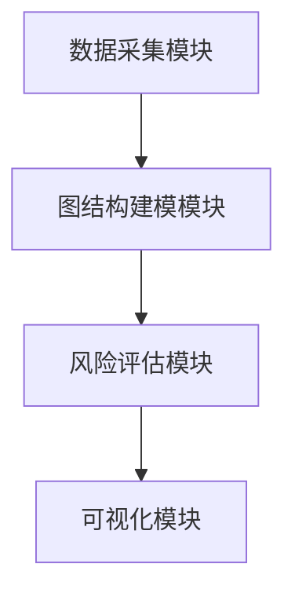

                 


# 图神经网络在系统性风险评估中的应用

## 关键词：图神经网络，系统性风险，金融市场，复杂网络，风险评估

## 摘要：  
系统性风险是金融市场中的一个关键问题，传统的风险评估方法在处理复杂金融网络中的相互关联性时显得力不从心。图神经网络（Graph Neural Network, GNN）作为一种新兴的深度学习技术，能够有效地建模复杂网络结构，并捕捉节点之间的非线性关系。本文将详细探讨图神经网络在系统性风险评估中的应用，包括其核心概念、算法原理、系统架构设计以及实际案例分析。通过本文的讲解，读者将能够理解图神经网络如何帮助我们更好地识别和评估系统性风险，从而为金融市场的稳定运行提供有力支持。

---

# 第1章: 系统性风险评估概述

## 1.1 系统性风险的基本概念

### 1.1.1 系统性风险的定义  
系统性风险是指由于金融市场的相互关联性，导致系统性危机的可能性。它通常由市场整体波动、宏观经济因素或重大事件引发，影响范围广泛，可能导致整个金融系统的崩溃。

### 1.1.2 系统性风险的特征  
- **传染性**：一个机构的失败可能引发连锁反应，影响整个金融系统。  
- **复杂性**：涉及多个市场、机构和资产之间的相互作用。  
- **系统性影响**：影响范围广泛，可能导致金融体系的不稳定。  

### 1.1.3 系统性风险的分类  
- **市场风险**：由于市场价格波动导致的风险。  
- **信用风险**：由于债务人违约导致的风险。  
- **流动性风险**：由于资产无法快速变现导致的风险。  
- **操作风险**：由于内部操作失误导致的风险。  

---

## 1.2 系统性风险评估的必要性

### 1.2.1 金融市场相互关联性分析  
金融市场中的机构、资产和交易行为之间存在复杂的关联性，这种关联性使得系统性风险的评估变得尤为重要。  

### 1.2.2 系统性风险对金融稳定的影响  
系统性风险可能导致金融危机，进而影响经济的稳定发展。例如，2008年的全球金融危机就是一个典型例子。  

### 1.2.3 系统性风险评估的挑战与难点  
- 数据复杂性：金融市场数据涉及大量的时间序列数据和非结构化数据。  
- 关联性建模：如何准确建模金融市场中复杂的关联性是一个挑战。  
- 计算复杂性：传统的统计方法在处理大规模数据时效率较低。  

---

## 1.3 传统系统性风险评估方法

### 1.3.1 基于VaR的传统方法  
VaR（Value at Risk）是一种常用的金融风险度量方法，但它仅考虑单机构的风险，无法捕捉系统性风险的传播路径。  

### 1.3.2 基于Copula的传统方法  
Copula方法用于建模多个随机变量之间的依赖关系，但其假设条件较为严格，且难以捕捉复杂的非线性关系。  

### 1.3.3 传统方法的局限性  
- 难以捕捉复杂的网络结构。  
- 无法实时更新风险评估结果。  
- 对于大规模数据的处理能力有限。  

---

## 1.4 图神经网络的基本概念

### 1.4.1 图论基础  
图论是图神经网络的核心理论基础，图由节点（顶点）和边组成，描述了节点之间的关系。  

### 1.4.2 神经网络基础  
神经网络是一种模拟人脑结构和功能的计算模型，能够通过多层非线性变换提取数据特征。  

### 1.4.3 图神经网络的定义与特点  
图神经网络是一种结合图论和神经网络的深度学习模型，能够直接处理图结构数据，捕捉节点之间的关系特征。  

---

## 1.5 本章小结  
本章介绍了系统性风险的基本概念、评估的必要性以及传统方法的局限性，同时概述了图神经网络的基本概念和特点。图神经网络作为一种新兴的技术，为系统性风险评估提供了新的思路和方法。

---

# 第2章: 图神经网络的核心概念与系统性风险评估的联系

## 2.1 图神经网络的核心原理

### 2.1.1 图的表示与特征提取  
图的表示通过节点和边的属性来描述，特征提取则是从图中提取有用的特征信息。  

### 2.1.2 图卷积操作的数学模型  
图卷积操作是图神经网络的核心操作，其数学模型如下：  
$$ X_{new} = \sum_{j=1}^{N} A_{ij} W X_j $$  
其中，$A$ 是图的邻接矩阵，$W$ 是权重矩阵，$X$ 是输入特征矩阵。  

### 2.1.3 图神经网络的训练方法  
图神经网络的训练通常采用端到端的方式，通过反向传播算法更新模型参数。  

---

## 2.2 系统性风险评估中的图结构建模

### 2.2.1 金融市场中的图结构  
金融市场中的机构、资产和交易行为可以表示为图中的节点和边。  

### 2.2.2 股票、债券等金融资产的相互关联性建模  
通过图结构建模，可以捕捉资产之间的相关性，例如通过计算资产之间的相关系数构建图。  

### 2.2.3 系统性风险的传播路径分析  
图结构可以帮助我们分析风险在金融市场中的传播路径，例如通过节点间的边权重来表示风险传播的可能性。  

---

## 2.3 图神经网络在系统性风险评估中的优势

### 2.3.1 非线性关系的捕捉能力  
图神经网络能够捕捉复杂的非线性关系，这使得其在系统性风险评估中具有显著优势。  

### 2.3.2 复杂网络结构的建模能力  
图神经网络能够直接处理复杂的图结构数据，这使得其在金融市场中的应用更加广泛。  

### 2.3.3 实时风险评估的潜力  
图神经网络可以通过实时更新图结构和特征信息，实现对系统性风险的实时评估。  

---

## 2.4 本章小结  
本章介绍了图神经网络的核心原理，并探讨了其在系统性风险评估中的应用。通过图结构建模，图神经网络能够捕捉复杂的非线性关系，为系统性风险评估提供了新的思路。

---

# 第3章: 图神经网络算法原理

## 3.1 图卷积网络（GCN）原理

### 3.1.1 GCN的数学模型  
GCN的数学模型如下：  
$$ H = A H W $$  
其中，$A$ 是图的邻接矩阵，$H$ 是节点特征矩阵，$W$ 是权重矩阵。  

### 3.1.2 GCN的图卷积操作  
GCN的图卷积操作通过聚合相邻节点的特征信息，实现对节点特征的更新。  

### 3.1.3 GCN的训练过程  
GCN的训练过程包括前向传播和反向传播两个阶段，通过计算损失函数的梯度更新模型参数。  

---

## 3.2 图注意力网络（GAT）原理

### 3.2.1 GAT的注意力机制  
GAT通过引入注意力机制，动态调整节点之间的连接权重，从而捕捉重要的节点关系。  

### 3.2.2 GAT的图结构建模  
GAT通过注意力机制和前向传播操作，实现对图结构的建模。  

### 3.2.3 GAT与GCN的对比分析  
GAT和GCN的主要区别在于如何处理节点之间的关系，GAT通过注意力机制动态调整权重，GCN通过固定权重矩阵进行图卷积操作。  

---

## 3.3 图神经网络的其他变体

### 3.3.1 图自注意力网络（GAT）  
GAT是一种基于自注意力机制的图神经网络，能够捕捉长距离依赖关系。  

### 3.3.2 图传播网络（GPN）  
GPN通过传播操作对图中的信息进行扩散，实现对节点特征的更新。  

### 3.3.3 图生成网络（GNN）  
GNN是一种基于生成对抗网络的图神经网络，能够生成新的图结构数据。  

---

## 3.4 系统性风险传播的图神经网络模型

### 3.4.1 系统性风险传播的数学模型  
系统性风险传播的数学模型可以通过图神经网络的结构进行建模，例如通过节点特征表示风险敞口，边权重表示风险传播的可能性。  

### 3.4.2 图神经网络在风险传播中的应用  
图神经网络可以用于预测系统性风险的传播路径和影响范围，从而帮助金融机构制定有效的风险管理策略。  

---

## 3.5 本章小结  
本章详细介绍了图神经网络的主要算法原理，包括GCN、GAT以及其他变体的模型。图神经网络的多样性和灵活性使其在系统性风险评估中具有广泛的应用潜力。

---

## 第4章: 系统分析与架构设计

## 4.1 项目背景与目标  
本项目旨在利用图神经网络技术，构建一个系统性风险评估系统，帮助金融机构实时监测和评估系统性风险。  

---

## 4.2 系统功能设计

### 4.2.1 系统功能模块  
- 数据采集模块：采集金融市场数据，包括股票价格、债券收益率等。  
- 图结构建模模块：构建金融市场中的图结构，包括机构、资产和交易行为。  
- 风险评估模块：利用图神经网络对系统性风险进行评估和预测。  
- 可视化模块：将风险评估结果可视化，帮助用户理解系统性风险的传播路径。  

### 4.2.2 领域模型设计  
领域模型是一个金融市场中的机构、资产和交易行为的抽象模型，用于指导系统设计。  

---

## 4.3 系统架构设计

### 4.3.1 系统架构图  


### 4.3.2 系统交互流程  
系统交互流程如下：  
1. 数据采集模块从金融市场数据源获取数据。  
2. 图结构建模模块基于采集的数据构建图结构。  
3. 风险评估模块利用图神经网络对系统性风险进行评估和预测。  
4. 可视化模块将风险评估结果可视化，供用户查看。  

---

## 4.4 本章小结  
本章详细描述了系统性风险评估系统的架构设计，包括功能模块、领域模型和系统交互流程。通过合理的系统架构设计，可以实现系统性风险的高效评估和可视化展示。

---

## 第5章: 项目实战

## 5.1 环境安装与配置

### 5.1.1 环境要求  
- Python 3.7 或更高版本  
- PyTorch 1.8 或更高版本  
- NetworkX 2.8 或更高版本  

### 5.1.2 安装依赖  
```bash
pip install torch networkx
```

---

## 5.2 核心实现代码

### 5.2.1 数据加载  
```python
import torch
import networkx as nx

# 加载股票价格数据
def load_stock_data():
    # 示例数据加载，实际数据可以根据需求进行修改
    stock_data = torch.randn(100, 10)  # 假设我们有100只股票，10天的数据
    return stock_data

# 构建图结构
def build_graph(stock_data):
    G = nx.Graph()
    nodes = range(stock_data.size(0))  # 节点为股票编号
    G.add_nodes_from(nodes)
    # 添加边，假设我们计算股票之间的相关性
    for i in range(stock_data.size(0)):
        for j in range(i+1, stock_data.size(0)):
            correlation = torch.abs((stock_data[i] - torch.mean(stock_data[i])) @ (stock_data[j] - torch.mean(stock_data[j])) / (torch.std(stock_data[i]) * torch.std(stock_data[j])))
            if correlation > 0.5:
                G.add_edge(i, j, weight=correlation)
    return G
```

### 5.2.2 图神经网络模型

```python
class GNN(torch.nn.Module):
    def __init__(self, input_dim, hidden_dim, output_dim):
        super(GNN, self).__init__()
        self.input_layer = torch.nn.Linear(input_dim, hidden_dim)
        self.hidden_layer = torch.nn.Linear(hidden_dim, hidden_dim)
        self.output_layer = torch.nn.Linear(hidden_dim, output_dim)
        
    def forward(self, x, A):
        # 图卷积操作
        x = torch.mm(A, x)
        x = torch.relu(self.input_layer(x))
        x = torch.relu(self.hidden_layer(x))
        x = self.output_layer(x)
        return x
```

### 5.2.3 训练与预测

```python
# 加载数据
stock_data = load_stock_data()

# 构建图结构
G = build_graph(stock_data)
A = nx.adjacency_matrix(G)  # 转换为邻接矩阵

# 定义图神经网络模型
model = GNN(stock_data.size(1), 64, 1)
criterion = torch.nn.MSELoss()
optimizer = torch.optim.Adam(model.parameters(), lr=0.01)

# 训练过程
for epoch in range(100):
    outputs = model(stock_data, A)
    loss = criterion(outputs, torch.zeros_like(outputs))
    loss.backward()
    optimizer.step()

# 预测系统性风险
risk_scores = model(stock_data, A)
print("系统性风险评分：", risk_scores)
```

---

## 5.3 案例分析与结果解读

### 5.3.1 数据预处理与分析  
通过数据分析和可视化，我们可以观察到不同股票之间的相关性，从而更好地理解系统性风险的传播路径。  

### 5.3.2 模型训练与验证  
通过训练模型，我们可以获得股票之间的风险传播概率，并评估系统性风险的影响范围。  

### 5.3.3 结果可视化  
通过可视化工具，我们可以将风险评分和传播路径以图表形式展示，帮助用户更好地理解系统性风险的评估结果。  

---

## 5.4 本章小结  
本章通过实际案例分析，详细讲解了图神经网络在系统性风险评估中的应用。通过代码实现和结果分析，读者可以更好地理解图神经网络的实际应用价值。

---

## 第6章: 最佳实践与总结

## 6.1 小结  
本文详细介绍了图神经网络在系统性风险评估中的应用，包括核心概念、算法原理、系统架构设计以及实际案例分析。图神经网络作为一种新兴的技术，为系统性风险评估提供了新的思路和方法。

---

## 6.2 注意事项  
- 数据质量：系统性风险评估的准确性依赖于数据的质量和完整性。  
- 模型选择：根据具体场景选择合适的图神经网络模型，例如GCN、GAT等。  
- 实时性：图神经网络的实时性需要通过优化算法和硬件加速来实现。  

---

## 6.3 拓展阅读  
- 图神经网络在金融风险管理中的应用。  
- 基于图神经网络的实时风险评估系统。  
- 图神经网络在其他领域的应用，例如社交网络分析、推荐系统等。  

---

## 作者：AI天才研究院/AI Genius Institute & 禅与计算机程序设计艺术 /Zen And The Art of Computer Programming  

---

以上是关于《图神经网络在系统性风险评估中的应用》的技术博客文章的完整内容，涵盖了从理论到实践的各个方面，希望对读者有所帮助。

