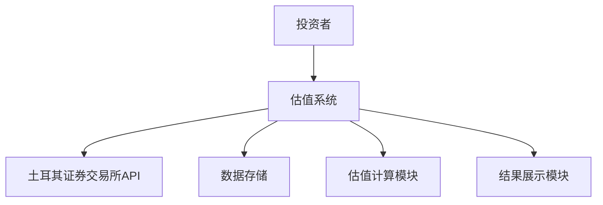
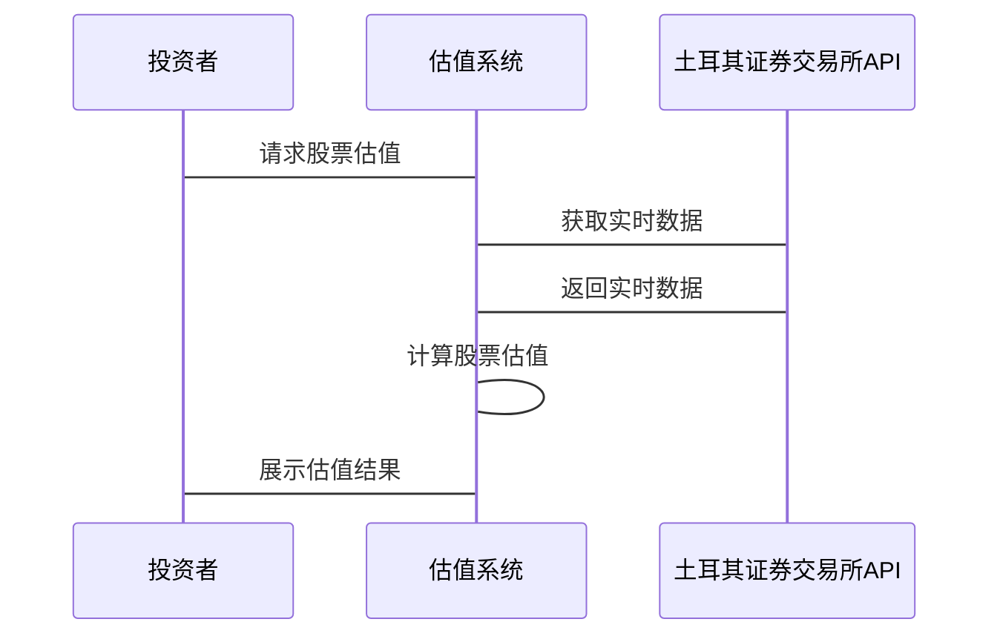

                 


# 土耳其股市估值:欧亚交界的新兴市场

## 关键词：土耳其股市，股市估值，新兴市场，投资策略，金融分析

## 摘要：  
土耳其作为连接欧亚的重要经济体，其股市具有独特的新兴市场特点。本文从背景介绍、估值方法、系统架构到项目实战，全面分析土耳其股市的估值策略，帮助投资者理解并掌握新兴市场的投资机会与挑战。

---

# 第一部分: 土耳其股市估值概述

## 第1章: 土耳其股市的背景与特点

### 1.1 土耳其股市的地理位置与经济特点

#### 1.1.1 土耳其的地理位置与经济结构  
土耳其位于欧亚交界处，既是欧洲的门户，也是连接中东和北非的重要桥梁。这种地理位置使其在经济和地缘政治上具有特殊的战略意义。土耳其的经济以多元化为主，涵盖农业、工业、服务业等多个领域。  

#### 1.1.2 欧亚交界处的市场特点  
作为新兴市场，土耳其股市具有高增长潜力，但也伴随着高波动性和较高的投资风险。土耳其的经济结构使其对全球市场波动较为敏感，同时受到地缘政治因素的影响较大。  

#### 1.1.3 土耳其股市的独特性与新兴市场属性  
土耳其股市的独特性体现在其对地缘政治、能源价格和汇率波动的高度敏感性。与其他新兴市场相比，土耳其的高债务水平和货币里拉的波动性是其股市估值的重要考量因素。  

### 1.2 土耳其股市的历史与发展

#### 1.2.1 土耳其股市的起源与发展  
土耳其证券交易所成立于1985年，经过多年的发展，逐步成为新兴市场中的重要成员。近年来，土耳其股市的波动性显著增加，尤其是在全球经济不稳定的背景下。  

#### 1.2.2 土耳其股市与其他新兴市场的对比  
与巴西、印度等其他新兴市场相比，土耳其股市的波动性更高，但增长潜力也更大。土耳其的高债务水平和货币贬值问题使其在估值时需要特别注意。  

#### 1.2.3 土耳其股市的现状与未来趋势  
目前，土耳其股市受多重因素影响，包括高通胀、货币贬值和地缘政治风险。未来，土耳其股市的走势将取决于政府政策、全球经济环境以及投资者信心的变化。  

### 1.3 新兴市场的共性问题与土耳其的独特性

#### 1.3.1 新兴市场的共性问题  
新兴市场普遍面临经济波动性高、政策不确定性大、市场流动性不足等问题。这些问题在土耳其股市中表现得尤为明显，尤其是在全球经济下行压力加大的背景下。  

#### 1.3.2 土耳其市场的独特性  
土耳其市场的独特性体现在其地理位置、经济结构和政策环境的特殊性。土耳其既是欧洲的门户，又是连接中东和北非的重要桥梁，这种特殊地位使其在地缘政治和经济上具有重要意义。  

#### 1.3.3 土耳其股市的波动性与投资机会  
土耳其股市的高波动性意味着高风险和高回报。投资者在进行估值时需要充分考虑土耳其市场的特殊性，包括地缘政治风险、货币波动和经济政策的不确定性。  

---

## 第2章: 土耳其股市估值的核心概念

### 2.1 股市估值的基本原理

#### 2.1.1 股票估值的基本方法  
股票估值的基本方法包括相对估值法和绝对估值法。相对估值法主要通过市盈率（P/E）、市净率（P/B）等指标进行比较分析；绝对估值法则主要通过现金流折现模型（DCF）等方法进行计算。  

#### 2.1.2 股票估值的核心要素  
股票估值的核心要素包括企业的盈利能力、成长潜力、财务状况、行业地位、宏观经济环境等。投资者在进行估值时需要综合考虑这些因素。  

#### 2.1.3 股票估值的常见指标  
常用的股票估值指标包括市盈率（P/E）、市净率（P/B）、股息率（Dividend Yield）、市销率（P/S）等。这些指标可以帮助投资者从不同角度分析企业的估值情况。  

### 2.2 土耳其股市估值的独特性

#### 2.2.1 土耳其股市估值的特殊性  
土耳其股市估值的特殊性体现在其对地缘政治、能源价格和汇率波动的高度敏感性。投资者在进行估值时需要特别注意这些因素对土耳其股市的影响。  

#### 2.2.2 土耳其经济指标对股市估值的影响  
土耳其的经济指标，如GDP增长率、通货膨胀率、失业率等，对股市估值有重要影响。尤其是通货膨胀率的高企，对土耳其股市的估值产生了显著影响。  

#### 2.2.3 土耳其股市与国际市场的联动性  
土耳其股市与国际市场的联动性较强，尤其是与欧洲市场和中东市场的联系密切。全球经济环境的变化对土耳其股市的影响不容忽视。  

### 2.3 股票估值的核心模型

#### 2.3.1 市盈率模型  
市盈率模型（P/E）是通过将股票的市价与每股收益（EPS）进行比较，来评估股票的估值。公式为：  
$$ P/E = \frac{\text{股价}}{\text{每股收益}} $$  

#### 2.3.2 市净率模型  
市净率模型（P/B）是通过将股票的市价与每股净资产进行比较，来评估股票的估值。公式为：  
$$ P/B = \frac{\text{股价}}{\text{每股净资产}} $$  

#### 2.3.3 股息率模型  
股息率模型（Dividend Yield）是通过将股票的股息与股价进行比较，来评估股票的估值。公式为：  
$$ 股息率 = \frac{\text{股息}}{\text{股价}} \times 100\% $$  

#### 2.3.4 现金流折现模型  
现金流折现模型（DCF）是通过将企业未来现金流的现值与当前股价进行比较，来评估股票的估值。公式为：  
$$ \text{企业价值} = \sum_{t=1}^{n} \frac{\text{现金流}_t}{(1+r)^t} $$  

---

## 第3章: 土耳其股市估值的关键指标

### 3.1 常见估值指标的定义与计算

#### 3.1.1 市盈率（P/E）  
市盈率是衡量股票估值的重要指标，计算公式为：  
$$ P/E = \frac{\text{股价}}{\text{每股收益}} $$  

#### 3.1.2 市净率（P/B）  
市净率是衡量股票估值的另一个重要指标，计算公式为：  
$$ P/B = \frac{\text{股价}}{\text{每股净资产}} $$  

#### 3.1.3 股息率（Dividend Yield）  
股息率是衡量股票收益能力的重要指标，计算公式为：  
$$ \text{股息率} = \frac{\text{股息}}{\text{股价}} \times 100\% $$  

#### 3.1.4 市销率（P/S）  
市销率是衡量股票估值的另一个重要指标，计算公式为：  
$$ P/S = \frac{\text{股价}}{\text{每股收入}} $$  

### 3.2 土耳其股市估值指标的特殊性

#### 3.2.1 土耳其经济指标对估值的影响  
土耳其的经济指标，如GDP增长率、通货膨胀率、失业率等，对股市估值有重要影响。尤其是通货膨胀率的高企，对土耳其股市的估值产生了显著影响。  

#### 3.2.2 土耳其股市波动对估值指标的影响  
土耳其股市的高波动性使得估值指标的计算和应用更加复杂。投资者在进行估值时需要特别注意土耳其股市的波动性对估值指标的影响。  

#### 3.2.3 土耳其货币里拉对估值的影响  
土耳其货币里拉的波动对股市估值有直接影响。里拉的贬值会导致土耳其股市的估值下降，尤其是在国际投资者持有的股票中表现更为明显。  

### 3.3 估值指标的对比与选择

#### 3.3.1 不同估值指标的优缺点  
- 市盈率（P/E）：优点是易于计算，缺点是受企业盈利波动的影响较大。  
- 市净率（P/B）：优点是适用于资产密集型企业，缺点是受企业资产质量的影响较大。  
- 股息率（Dividend Yield）：优点是适用于收益稳定的股票，缺点是受股息政策的影响较大。  
- 市销率（P/S）：优点是适用于收入稳定的企业，缺点是受企业收入质量的影响较大。  

#### 3.3.2 土耳其股市估值指标的适用性  
投资者在进行土耳其股市估值时，需要根据具体情况进行选择。例如，对于高通胀环境下的土耳其股市，市净率（P/B）可能更具有参考价值，而市盈率（P/E）可能受企业盈利波动的影响较大。  

---

## 第4章: 土耳其股市估值的算法原理

### 4.1 常用估值算法的原理与实现

#### 4.1.1 市盈率模型的实现  
市盈率模型的实现相对简单，只需要计算股票的市价与每股收益的比率。例如，假设某股票的价格为10里拉，每股收益为2里拉，则市盈率为5。  

#### 4.1.2 市净率模型的实现  
市净率模型的实现需要计算股票的市价与每股净资产的比率。例如，假设某股票的价格为10里拉，每股净资产为5里拉，则市净率为2。  

#### 4.1.3 现金流折现模型的实现  
现金流折现模型的实现较为复杂，需要预测企业未来现金流并进行现值计算。例如，假设企业未来5年的现金流分别为100万、120万、140万、160万和180万里拉，折现率为10%，则现值计算如下：  

$$ \text{现值} = \frac{100}{1.1} + \frac{120}{1.1^2} + \frac{140}{1.1^3} + \frac{160}{1.1^4} + \frac{180}{1.1^5} $$  

---

## 第5章: 土耳其股市估值的系统架构设计

### 5.1 问题场景介绍

#### 5.1.1 投资者需求分析  
投资者需要对土耳其股市进行估值，以确定投资目标和风险敞口。  

#### 5.1.2 系统功能需求  
系统需要提供土耳其股市估值的多种方法和工具，包括市盈率、市净率、现金流折现等模型的实现。  

#### 5.1.3 系统边界与接口设计  
系统需要与土耳其证券交易所的API接口进行对接，获取实时股价和财务数据。  

### 5.2 系统功能设计

#### 5.2.1 系统功能模块划分  
- 数据获取模块：从土耳其证券交易所获取实时股价和财务数据。  
- 估值计算模块：根据不同的估值模型计算股票的估值。  
- 结果展示模块：以可视化的方式展示估值结果。  

#### 5.2.2 系统功能流程设计  
1. 数据获取：通过API获取土耳其股市的实时数据。  
2. 估值计算：根据选择的估值模型计算股票的估值。  
3. 结果展示：以图表或表格的形式展示估值结果。  

### 5.3 系统架构设计

#### 5.3.1 系统架构图  


#### 5.3.2 系统模块交互设计  


### 5.4 系统实现代码

#### 5.4.1 Python代码实现

```python
import requests
import pandas as pd
from datetime import datetime, timedelta

# 获取土耳其股市数据
def get_turkish_stock_data(symbol):
    api_key = "YOUR_API_KEY"
    url = f"https://api.turkish-exchange.com/stock/{symbol}"
    response = requests.get(url, headers={'Authorization': f'Bearer {api_key}'})
    data = response.json()
    return data

# 计算市盈率
def calculate_pe_ratio(data):
    pe_ratio = data['price'] / data['eps']
    return pe_ratio

# 计算市净率
def calculate_pb_ratio(data):
    pb_ratio = data['price'] / data['book_value_per_share']
    return pb_ratio

# 计算股息率
def calculate_dividend_yield(data):
    dividend_yield = (data['dividend'] / data['price']) * 100
    return dividend_yield

# 主函数
def main():
    symbol = input("请输入股票代码: ")
    data = get_turkish_stock_data(symbol)
    pe = calculate_pe_ratio(data)
    pb = calculate_pb_ratio(data)
    dy = calculate_dividend_yield(data)
    print(f"市盈率（P/E）：{pe}")
    print(f"市净率（P/B）：{pb}")
    print(f"股息率（Dividend Yield）：{dy}%")

if __name__ == "__main__":
    main()
```

---

## 第6章: 土耳其股市估值的项目实战

### 6.1 项目环境与工具安装

#### 6.1.1 系统运行环境  
- 操作系统：Windows/Mac/Linux  
- Python版本：3.8以上  
- 依赖库：requests、pandas、mermaid  

#### 6.1.2 安装与配置  
```bash
pip install requests pandas
```

### 6.2 项目核心实现

#### 6.2.1 数据获取模块  
通过土耳其证券交易所API获取实时股价和财务数据。  

#### 6.2.2 估值计算模块  
根据市盈率、市净率、股息率等模型进行估值计算。  

#### 6.2.3 结果展示模块  
以图表或表格的形式展示估值结果。  

### 6.3 代码实现与解读

#### 6.3.1 数据获取代码  
```python
import requests
import json

def get_stock_data(symbol):
    api_key = "YOUR_API_KEY"
    url = f"https://api.turkish-exchange.com/stock/{symbol}"
    headers = {'Authorization': f'Bearer {api_key}'}
    response = requests.get(url, headers=headers)
    return response.json()

# 示例：获取股票代码为"TKI"的数据
data = get_stock_data("TKI")
print(json.dumps(data, indent=2))
```

#### 6.3.2 估值计算代码  
```python
def calculate_valuation_ratios(data):
    pe_ratio = data['price'] / data['eps']
    pb_ratio = data['price'] / data['book_value_per_share']
    dividend_yield = (data['dividend'] / data['price']) * 100
    return {
        '市盈率（P/E）': pe_ratio,
        '市净率（P/B）': pb_ratio,
        '股息率（Dividend Yield）': dividend_yield
    }

# 示例：计算股票估值比率
ratios = calculate_valuation_ratios(data)
for key, value in ratios.items():
    print(f"{key}: {value}")
```

#### 6.3.3 结果展示代码  
```python
import matplotlib.pyplot as plt

def plot_valuation_ratios(ratios):
    plt.figure(figsize=(10, 6))
    plt.bar(ratios.keys(), ratios.values())
    plt.title('土耳其股市估值比率')
    plt.xlabel('估值指标')
    plt.ylabel('比率值')
    plt.show()

# 示例：绘制估值比率图表
plot_valuation_ratios(ratios)
```

### 6.4 案例分析与解读

#### 6.4.1 案例背景  
假设我们选择土耳其伊斯坦布尔证交所（Borsa Istanbul）的某只股票进行估值。  

#### 6.4.2 数据获取与分析  
通过API获取该股票的实时数据，包括股价、每股收益、每股净资产、股息等。  

#### 6.4.3 估值计算与解读  
根据获取的数据，计算市盈率、市净率、股息率等指标，并与行业平均水平进行对比，分析该股票的估值情况。  

#### 6.4.4 结果展示  
以图表形式展示估值结果，帮助投资者更好地理解股票的估值情况。  

### 6.5 项目小结

#### 6.5.1 项目实现总结  
通过本项目，我们实现了土耳其股市估值的系统架构，并通过Python代码展示了如何获取数据、计算估值指标并进行结果展示。  

#### 6.5.2 项目经验与教训  
在项目实施过程中，需要注意土耳其股市的特殊性，尤其是其高波动性和对地缘政治因素的敏感性。投资者在进行估值时需要特别注意这些因素对股票估值的影响。  

---

## 第7章: 总结与展望

### 7.1 总结

#### 7.1.1 核心内容回顾  
本文从土耳其股市的背景与特点、估值的核心概念、算法原理、系统架构到项目实战，全面分析了土耳其股市的估值策略。  

#### 7.1.2 投资者的最佳实践  
投资者在进行土耳其股市估值时，需要充分考虑土耳其市场的特殊性，包括地缘政治风险、货币波动和经济政策的不确定性。  

### 7.2 展望

#### 7.2.1 未来研究方向  
未来的研究可以进一步探讨土耳其股市与其他新兴市场的联动性，以及地缘政治因素对土耳其股市估值的长期影响。  

#### 7.2.2 技术与市场的结合  
随着技术的进步，投资者可以利用更多的工具和方法进行土耳其股市的估值，尤其是在大数据和人工智能技术的应用下，土耳其股市的估值将更加精准和高效。  

---

## 作者：AI天才研究院/AI Genius Institute & 禅与计算机程序设计艺术 /Zen And The Art of Computer Programming

