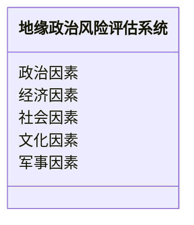
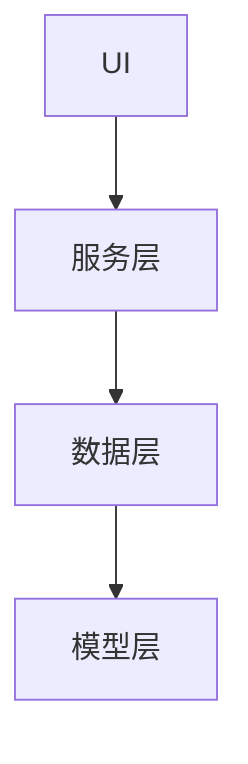
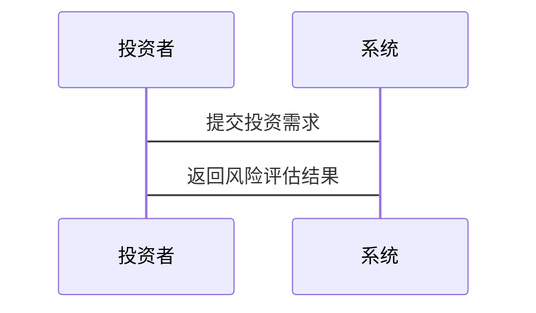

                 


```markdown
# 地缘政治风险评估：全球投资的关键考量

> 关键词：地缘政治风险，全球投资，风险评估，政治稳定性，经济政策，社会因素

> 摘要：地缘政治风险是影响全球投资决策的重要因素。本文从地缘政治风险的定义、核心要素、评估方法、系统架构、项目实战到最佳实践，全面分析地缘政治风险在全球投资中的关键考量。通过层次分析法和模糊综合评价法构建风险评估模型，结合具体案例分析，为投资者提供科学的决策支持。

---

## 第一部分: 地缘政治风险评估概述

### 第1章: 地缘政治风险的定义与背景

#### 1.1 地缘政治风险的核心概念
地缘政治风险是指由于政治、经济、社会、文化、军事等因素的变化，对特定区域或国家的投资活动产生的负面影响。其核心在于分析这些因素如何相互作用，影响投资的安全性和收益性。

#### 1.2 地缘政治风险的产生背景
全球化背景下，跨国投资日益频繁，但地缘政治风险也随之增加。政治不稳定、经济政策变动、社会动荡等因素，都可能对投资产生重大影响。

### 第2章: 地缘政治风险评估的必要性与意义
地缘政治风险评估是投资决策的重要环节。通过科学评估，投资者可以识别潜在风险，制定应对策略，降低投资损失。

---

## 第二部分: 地缘政治风险评估的核心要素

### 第3章: 地缘政治风险的多维度分析

#### 3.1 政治因素
政治稳定性是影响投资的关键因素。政治动荡、政策变化可能导致投资损失。

#### 3.2 经济因素
经济政策的不确定性、经济波动、贸易壁垒等经济因素，直接影响投资收益。

#### 3.3 社会因素
社会稳定、社会矛盾、文化差异等因素，影响投资环境的稳定性和可预测性。

#### 3.4 文化与宗教因素
文化差异和宗教冲突可能引发社会动荡，增加投资风险。

#### 3.5 军事与安全因素
地缘政治冲突、军事干预等安全因素，直接威胁投资安全。

---

## 第三部分: 地缘政治风险评估的理论与方法

### 第4章: 地缘政治风险评估的理论基础

#### 4.1 风险评估的基本理论
风险评估是通过分析潜在风险因素，量化其对目标的影响，为决策提供依据。

#### 4.2 地缘政治风险的属性对比
| 属性 | 政治因素 | 经济因素 | 社会因素 |
|------|----------|----------|----------|
| 稳定性 | 政治动荡 | 经济波动 | 社会矛盾 |
| 可预测性 | 中高 | 中 | 低 |

#### 4.3 风险评估的流程
1. **风险识别**：识别潜在风险因素。
2. **风险量化**：评估每个风险的影响力和发生概率。
3. **风险分析**：分析风险之间的相互作用。
4. **风险应对**：制定应对策略。

### 第5章: 地缘政治风险评估的算法与模型

#### 5.1 层次分析法（AHP）
**层次分析法**用于评估多个因素的相对重要性。

1. **步骤**：
   - 构建层次分析模型。
   - 计算各因素的权重。
   - 综合评估风险。

2. **数学模型**：
   - 权重计算：$w_i = \frac{\sum \lambda_{ij}}{\sum \lambda_{jj}}}$

3. **流程图**：
   ```mermaid
   graph TD
   A[目标层] --> B[准则层]
   B --> C[因素层]
   C --> D[方案层]
   ```

#### 5.2 模糊综合评价法（FCE）
**模糊综合评价法**用于处理模糊性较高的风险因素。

1. **步骤**：
   - 确定评价指标。
   - 构建模糊评价矩阵。
   - 计算综合评价结果。

2. **数学模型**：
   - 综合评价：$R = \sum_{i=1}^{n} w_i \cdot r_i}$

3. **流程图**：
   ```mermaid
   graph TD
   A[因素层] --> B[评价指标]
   B --> C[模糊评价矩阵]
   C --> D[综合评价结果]
   ```

---

## 第四部分: 地缘政治风险评估的系统架构

### 第6章: 系统功能设计

#### 6.1 领域模型


#### 6.2 系统架构


#### 6.3 接口设计
- 输入接口：接收政治、经济等数据。
- 输出接口：生成风险评估报告。

#### 6.4 交互设计


---

## 第五部分: 项目实战

### 第7章: 地缘政治风险评估的案例分析

#### 7.1 环境安装
- Python 3.8+
- 数据处理库：pandas、numpy
- 可视化库：matplotlib、seaborn
- 模糊计算库：scipy

#### 7.2 核心实现代码
```python
import numpy as np
from scipy import stats

def calculate_weights(matrix):
    """
    计算层次分析法权重
    """
    n = matrix.shape[0]
    total = np.sum(matrix, axis=1)
    weights = total / np.sum(total)
    return weights

def fuzzy_evaluation(factors, weights):
    """
    模糊综合评价
    """
    normalized_factors = factors / np.max(factors)
    evaluation = np.sum(weights * normalized_factors.T, axis=0)
    return evaluation

# 示例数据
matrix = np.array([[0.5, 0.3, 0.2],
                   [0.3, 0.6, 0.1],
                   [0.2, 0.1, 0.7]])

weights = calculate_weights(matrix)
print("权重:", weights)

factors = np.array([[0.8, 0.6, 0.4],
                    [0.7, 0.5, 0.3],
                    [0.6, 0.4, 0.2]])

evaluation = fuzzy_evaluation(factors, weights)
print("综合评价:", evaluation)
```

#### 7.3 案例分析
以某国为例，分析政治、经济、社会因素对投资的影响，展示如何通过代码实现风险评估。

---

## 第六部分: 总结与展望

### 第8章: 总结与最佳实践

#### 8.1 最佳实践
- 数据收集要全面。
- 模型选择要合理。
- 结果分析要深入。

#### 8.2 小结
地缘政治风险评估是全球投资的关键考量。通过科学的方法和系统的架构，投资者可以更好地应对风险，做出明智的决策。

#### 8.3 注意事项
- 数据的准确性和完整性。
- 模型的局限性和适用性。

#### 8.4 拓展阅读
- 推荐相关书籍和文献。

---

作者：AI天才研究院/AI Genius Institute & 禅与计算机程序设计艺术/Zen And The Art of Computer Programming
```

