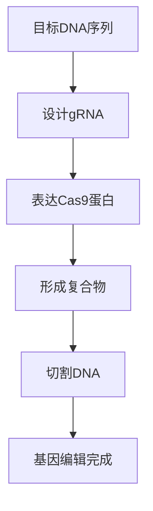

                 

# 基因治疗技术的突破与生物制药投资机会

> 关键词：基因治疗，生物制药，基因编辑，CRISPR，投资机会，生物技术

> 摘要：基因治疗作为一种革命性的医疗技术，正在改变我们治疗疾病的方式。随着基因编辑技术的突破，基因治疗在癌症、遗传病和慢性病等领域展现出巨大的潜力。本文将深入分析基因治疗的核心技术、临床应用、市场前景以及投资机会，帮助读者理解这一领域的最新动态和未来趋势。

---

# 第一部分: 基因治疗技术的基础与突破

## 第1章: 基因治疗的基本概念与背景

### 1.1 基因治疗的定义与历史发展

#### 1.1.1 基因治疗的定义
基因治疗（Gene Therapy）是指通过引入、删除或修正基因来治疗或预防疾病的治疗方法。它利用基因工程技术，直接针对疾病的根源——基因层面进行干预。

#### 1.1.2 基因治疗的历史发展
基因治疗的概念可以追溯到20世纪70年代，但真正的发展始于1972年，当时科学家首次提出了将健康基因导入细胞以治疗遗传病的想法。20世纪90年代，基因治疗进入临床试验阶段，但早期的技术限制和安全性问题导致进展缓慢。近年来，随着基因编辑技术（如CRISPR-Cas9）的突破，基因治疗进入快速发展阶段。

#### 1.1.3 基因治疗的现状与未来展望
目前，基因治疗已在多种疾病中取得显著进展，尤其是在癌症和遗传病领域。未来的基因治疗将更加精准化、个性化，并可能扩展到更多疾病领域。

### 1.2 基因治疗的核心原理

#### 1.2.1 基因的基本结构与功能
基因是DNA分子上的一段编码特定蛋白质的序列，通过转录和翻译的过程，基因决定蛋白质的结构和功能，从而影响细胞的功能和个体的特征。

#### 1.2.2 基因治疗的作用机制
基因治疗通过以下方式发挥作用：
1. **基因替换**：将缺陷基因替换为正常基因。
2. **基因修复**：修复缺陷基因的突变。
3. **基因沉默**：抑制有害基因的表达。
4. **基因添加**：引入新的基因以增强或补充功能。

#### 1.2.3 基因治疗与传统制药的区别
传统制药通过化学药物作用于细胞或蛋白质，而基因治疗直接作用于基因层面，从根本上解决问题，具有更深远的治疗效果。

### 1.3 基因治疗的适应症与应用领域

#### 1.3.1 基因治疗在癌症治疗中的应用
癌症基因治疗包括：
- **免疫疗法**：通过修改T细胞基因，增强其识别和杀死癌细胞的能力。
- **靶向治疗**：直接作用于癌细胞中的突变基因。

#### 1.3.2 基因治疗在遗传病治疗中的应用
遗传病是由基因突变引起的，基因治疗可以直接修复或替代缺陷基因，为患者提供根治的可能性。

#### 1.3.3 基因治疗在慢性病治疗中的潜力
基因治疗在慢性病（如糖尿病、高血压）中的应用仍处于研究阶段，但其潜力巨大。

---

## 第2章: 基因治疗的关键技术与突破

### 2.1 基因编辑技术

#### 2.1.1 CRISPR-Cas9技术的原理与应用
CRISPR-Cas9是一种强大的基因编辑工具，通过引导RNA（gRNA）与DNA配对，Cas9蛋白切割特定的DNA序列，从而实现基因的敲除、插入或替换。

#### 2.1.2 其他基因编辑工具（如TALEN、ZFN）的比较
- **TALEN**：通过特定蛋白与DNA结合，实现精准编辑。
- **ZFN**：利用锌指蛋白与DNA结合，进行基因编辑。

CRISPR-Cas9因其高效、低成本和易用性，成为基因编辑领域的主流工具。

#### 2.1.3 基因编辑技术的最新进展
最新研究集中在提高CRISPR的精度和减少脱靶效应，例如使用高保真Cas9变体和AI辅助设计工具。

### 2.2 基因递送技术

#### 2.2.1 病毒载体的种类与特点
常用病毒载体包括腺病毒（AdV）、腺相关病毒（AAV）和慢病毒（LV）。AAV因其低免疫原性和高安全性，广泛应用于基因治疗。

#### 2.2.2 非病毒载体的技术挑战
非病毒载体包括脂质纳米颗粒和阳离子聚合物，但其效率和稳定性仍需进一步提高。

#### 2.2.3 基因递送技术的优化与创新
研究集中在提高载体的靶向性和稳定性，例如通过表面修饰和纳米技术优化载体性能。

### 2.3 基因修复与替换技术

#### 2.3.1 基因修复的原理与方法
基因修复包括碱基编辑和Prime编辑，通过化学修饰或酶促反应修复突变。

#### 2.3.2 基因替换的技术难点
基因替换需要精准的基因匹配和高效的递送系统，且需避免免疫反应。

#### 2.3.3 基因修复与替换的临床应用案例
例如，治疗镰状细胞贫血症和先天性失明的基因治疗临床试验已取得显著成果。

---

## 第3章: 基因治疗的临床试验与安全性评估

### 3.1 基因治疗的临床试验阶段

#### 3.1.1 临床试验的分期与流程
基因治疗临床试验分为I期（安全性评估）、II期（剂量优化）和III期（疗效验证）。

#### 3.1.2 基因治疗的疗效评估标准
疗效评估包括安全性指标（如不良反应发生率）和有效性指标（如疾病缓解率）。

#### 3.1.3 临床试验的成功案例分析
例如，治疗脊髓小脑性共济失调的基因治疗临床试验取得突破性进展。

### 3.2 基因治疗的安全性问题

#### 3.2.1 基因治疗的潜在副作用
包括脱靶效应、免疫反应和基因沉默的不确定性。

#### 3.2.2 基因编辑的脱靶效应
脱靶效应是基因治疗的主要风险之一，需通过技术优化和精准设计降低。

#### 3.2.3 安全性评估的最新进展
包括体外模型和动物实验的优化，以及实时监测技术的应用。

### 3.3 基因治疗的伦理与法律问题

#### 3.3.1 基因治疗的伦理争议
包括基因增强、人权和公平性问题。

#### 3.3.2 基因治疗的法律框架与监管政策
各国对基因治疗的监管政策不一，需建立统一的国际标准。

#### 3.3.3 基因治疗的伦理与法律挑战
需平衡技术创新与伦理约束，确保基因治疗的安全性和伦理性。

---

# 第二部分: 生物制药的投资机会与策略

## 第4章: 基因治疗的市场分析与投资热点

### 4.1 基因治疗的市场现状与未来预测

#### 4.1.1 全球基因治疗市场的规模与增长
2022年，全球基因治疗市场规模约为100亿美元，预计年均增长率超过20%。

#### 4.1.2 区域市场的分布与特点
北美市场占据主导地位，欧洲和亚洲市场增长迅速。

#### 4.1.3 基因治疗市场的驱动因素
包括技术进步、政策支持和患者需求。

### 4.2 基因治疗的投资热点领域

#### 4.2.1 基因编辑技术的研发
投资重点包括CRISPR-Cas9的优化和新工具的开发。

#### 4.2.2 基因递送系统的改进
优化病毒载体和非病毒载体的技术性能。

#### 4.2.3 基因治疗的临床应用
关注具有广阔市场潜力的疾病领域，如癌症和遗传病。

### 4.3 基因治疗的投资风险与对策

#### 4.3.1 基因治疗的技术风险
技术瓶颈可能导致项目失败。

#### 4.3.2 基因治疗的政策风险
监管政策的变化可能影响市场发展。

#### 4.3.3 基因治疗的市场竞争
技术同质化可能导致价格战和利润压缩。

---

## 第5章: 基因治疗的商业模式与投资策略

### 5.1 基因治疗的商业模式

#### 5.1.1 技术授权与合作
通过技术授权和合作开发，分散风险并加速产业化。

#### 5.1.2 �垂直整合
建立完整的研发、生产和服务链条，确保技术控制和成本优势。

#### 5.1.3 市场化推广
通过学术会议和行业展会，提升品牌影响力和市场占有率。

### 5.2 基因治疗的投资策略

#### 5.2.1 风险投资与私募股权
风险投资适合早期项目，私募股权适合后期项目。

#### 5.2.2 战略合作与并购
与大型制药公司合作或并购，快速进入市场。

#### 5.2.3 创新驱动与技术领先
通过技术创新保持竞争优势，降低技术风险。

---

## 第6章: 基因治疗的未来展望与投资机会

### 6.1 基因治疗的未来技术趋势

#### 6.1.1 更精准的基因编辑工具
包括高保真CRISPR和新型基因编辑技术。

#### 6.1.2 智能递送系统
结合AI和物联网技术，实现精准递送和实时监测。

#### 6.1.3 基因治疗的个性化与智能化
通过基因组大数据和人工智能，实现个性化治疗方案。

### 6.2 基因治疗的投资机会

#### 6.2.1 早期技术创新
投资于新技术研发，抢占技术高地。

#### 6.2.2 中期临床应用
关注进入临床试验的项目，分享商业化成果。

#### 6.2.3 长期生态系统建设
构建完整的基因治疗产业链，推动行业长期发展。

---

# 结语

基因治疗正在改变医疗行业的格局，为患者和投资者带来前所未有的机遇。随着技术的进步和市场的成熟，基因治疗的投资机会将更加多元化和广泛化。投资者需密切关注技术发展和市场动态，制定科学的投资策略，抓住这一领域的黄金发展期。

---

作者：AI天才研究院/AI Genius Institute & 禅与计算机程序设计艺术 /Zen And The Art of Computer Programming

