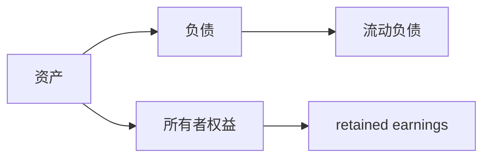
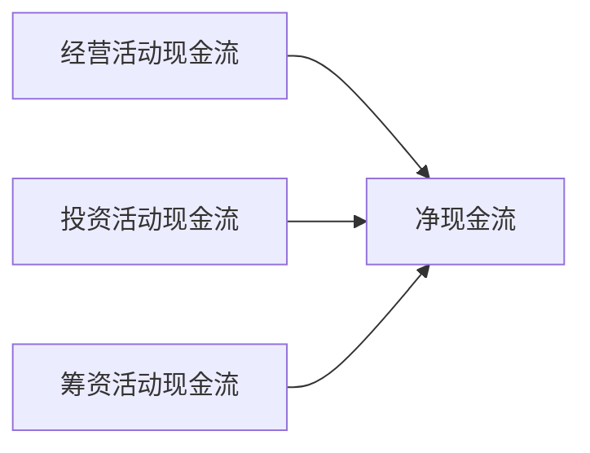
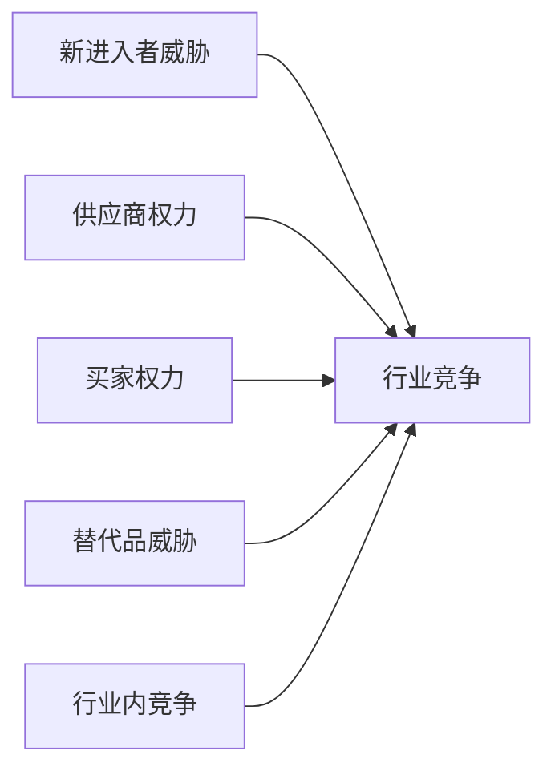

                 


# 基本面分析：识别长期优质投资标的的关键

> 关键词：基本面分析，投资标的，长期投资，财务报表，估值方法，行业分析，风险管理

> 摘要：基本面分析是识别长期优质投资标的的关键方法，通过分析企业的财务报表、估值指标、行业地位和宏观经济因素，帮助投资者做出明智的投资决策。本文详细介绍了基本面分析的核心概念、财务报表分析、估值方法、行业分析、系统架构、项目实战以及最佳实践，为读者提供了全面的分析框架和实战指导。

---

# 第1章: 基本面分析的背景与核心概念

## 1.1 基本面分析的定义与背景

### 1.1.1 什么是基本面分析
基本面分析是通过对企业的财务报表、行业地位、竞争优势和宏观经济环境等“基本面”因素的分析，评估企业内在价值和未来发展前景的投资方法。与技术分析不同，基本面分析注重企业的实际经营状况和长期发展潜力。

### 1.1.2 基本面分析的必要性
在金融市场中，价格波动受多种因素影响，但企业的内在价值是长期投资的核心依据。通过基本面分析，投资者可以识别出那些具有持续竞争优势和良好财务状况的优质企业，从而做出更明智的投资决策。

### 1.1.3 基本面分析与技术分析的区别
- **基本面分析**：关注企业的内在价值，侧重长期投资。
- **技术分析**：关注价格和成交量的历史数据，侧重短期交易。

---

## 1.2 基本面分析的核心要素

### 1.2.1 财务报表分析
财务报表是基本面分析的核心工具，主要包括利润表、资产负债表和现金流量表。

#### 利润表
- 反映企业在一定时期内的收入和利润情况。
- 关键指标：营业收入、净利润、毛利率。

#### 资产负债表
- 反映企业在某一特定时点的资产、负债和所有者权益情况。
- 关键指标：资产总额、负债总额、股东权益。

#### 现金流量表
- 反映企业在一定时期内的现金流情况。
- 关键指标：经营活动现金流、投资活动现金流、筹资活动现金流。

### 1.2.2 估值方法
估值方法是基本面分析的重要组成部分，主要包括相对估值法和绝对估值法。

#### 相对估值法
- 常用指标：市盈率（P/E）、市净率（P/B）、股息率。
- 优点：简单易用，适用于横向比较。
- 缺点：受市场情绪影响较大。

#### 绝对估值法
- 常用模型：股利折现模型（DDM）、自由现金流模型（DCF）。
- 优点：能够反映企业的内在价值。
- 缺点：需要假设合理的折现率。

### 1.2.3 行业分析与宏观经济因素
行业分析和宏观经济分析是基本面分析的重要补充。

#### 行业分析
- 行业生命周期：幼稚期、成长期、成熟期、衰退期。
- 行业竞争结构：波特五力模型（供应商权力、买家权力、新进入者威胁、替代品威胁、行业内部竞争）。

#### 宏观经济因素
- 经济周期：复苏、繁荣、衰退、萧条。
- 宏观经济指标：GDP增长率、通货膨胀率、利率、汇率。

---

## 1.3 基本面分析的目标与意义

### 1.3.1 投资决策的核心依据
基本面分析为投资者提供了企业财务健康状况和未来发展前景的评估依据，帮助投资者识别出具有长期竞争优势的优质企业。

### 1.3.2 基本面分析在长期投资中的作用
- 通过分析企业的财务状况和行业地位，识别出具有持续增长潜力的企业。
- 为投资组合的构建提供依据，降低投资风险。

### 1.3.3 基本面分析的局限性与改进方向
- 局限性：基本面分析依赖于财务数据，无法完全预测市场情绪和突发事件。
- 改进方向：结合技术分析和行业动态，动态调整投资策略。

---

# 第2章: 财务报表分析基础

## 2.1 财务报表的核心内容

### 2.1.1 利润表
利润表反映了企业在一定时期内的收入和利润情况，是评估企业盈利能力的重要指标。

#### 利润表的结构


### 2.1.2 资产负债表
资产负债表反映了企业在某一特定时点的资产、负债和所有者权益情况。

#### 资产负债表的结构


### 2.1.3 现金流量表
现金流量表反映了企业在一定时期内的现金流情况，是评估企业财务健康状况的重要指标。

#### 现金流量表的结构


---

## 2.2 财务指标分析

### 2.2.1 盈利能力指标
盈利能力指标是评估企业赚钱能力的重要指标。

#### 常见盈利能力指标
| 指标名称       | 公式                     | 作用                     |
|----------------|--------------------------|--------------------------|
| 净利率         | 净利润 / 营业收入        | 评估企业盈利能力         |
| 毛利率         | 毛利 / 营业收入          | 评估企业产品盈利能力     |
| 净资产收益率（ROE） | 净利润 / 平均净资产      | 评估股东资金的使用效率   |

### 2.2.2 偿债能力指标
偿债能力指标是评估企业财务健康状况的重要指标。

#### 常见偿债能力指标
| 指标名称       | 公式                     | 作用                     |
|----------------|--------------------------|--------------------------|
| 资产负债率     | 总负债 / 总资产          | 评估企业杠杆风险         |
| 速动比率       | (流动资产 - 存货) / 流动负债 | 评估企业短期偿债能力     |

### 2.2.3 运营效率指标
运营效率指标是评估企业经营效率的重要指标。

#### 常见运营效率指标
| 指标名称       | 公式                     | 作用                     |
|----------------|--------------------------|--------------------------|
| 存货周转率     | 营业成本 / 平均存货      | 评估企业库存管理效率     |
| 资产周转率     | 营业收入 / 平均总资产     | 评估企业资产使用效率     |

---

## 2.3 财务报表分析的步骤与方法

### 2.3.1 数据收集与清洗
- 数据来源：上市公司财报、财经网站、数据库。
- 数据清洗：处理缺失值、异常值、单位不一致等问题。

### 2.3.2 财务指标计算与对比
- 计算各项财务指标。
- 对比同行业企业或历史数据，分析企业的财务状况。

### 2.3.3 财务健康状况评估
- 结合各项财务指标，评估企业的财务健康状况。
- 识别潜在风险，如高负债率、低利润率等。

---

# 第3章: 估值方法与模型

## 3.1 常见估值指标

### 3.1.1 市盈率（P/E）
市盈率是评估企业估值的重要指标。

#### 市盈率公式
$$ P/E = \frac{\text{股价}}{\text{每股净利润}} $$

#### 市盈率分析
- 市盈率低，可能意味着股价被低估。
- 市盈率高，可能意味着市场对企业未来盈利有高预期。

### 3.1.2 市净率（P/B）
市净率是评估企业估值的另一个重要指标。

#### 市净率公式
$$ P/B = \frac{\text{股价}}{\text{每股净资产}} $$

#### 市净率分析
- 适用于银行、房地产等资产密集型行业。
- 市净率低，可能意味着股价被低估。

### 3.1.3 股息率
股息率是评估企业投资回报的重要指标。

#### 股息率公式
$$ \text{股息率} = \frac{\text{每股股息}}{\text{股价}} \times 100\% $$

#### 股息率分析
- 股息率高，可能意味着企业有稳定的分红能力。
- 股息率低，可能意味着企业将利润用于再投资。

---

## 3.2 股权自由现金流模型

### 3.2.1 DCF模型的基本原理
自由现金流模型是评估企业内在价值的重要方法。

#### DCF模型公式
$$ \text{内在价值} = \sum_{t=1}^{n} \frac{\text{自由现金流}_t}{(1 + r)^t} + \frac{\text{终值}}{(1 + r)^n} $$

其中，$r$ 是折现率，$n$ 是预测期数，$\text{终值}$ 是永续年的现金流假设。

### 3.2.2 内在价值的计算公式
$$ \text{内在价值} = \frac{\text{自由现金流}}{\text{折现率}} $$

### 3.2.3 折现率的确定方法
- 无风险利率 + 风险溢价。
- 使用可比公司的加权平均资本成本（WACC）。

---

## 3.3 估值方法的比较与选择

### 3.3.1 相对估值法与绝对估值法的区别
- **相对估值法**：基于市场数据，适用于横向比较。
- **绝对估值法**：基于企业基本面，适用于评估内在价值。

### 3.3.2 不同行业的估值方法适用性
- **成长型行业**：适合使用绝对估值法（DCF模型）。
- **成熟型行业**：适合使用相对估值法（市盈率、市净率）。

### 3.3.3 估值结果的验证与调整
- 比较不同估值方法的结果，找出合理区间。
- 结合市场环境和行业动态，动态调整估值模型。

---

# 第4章: 行业分析与宏观经济因素

## 4.1 行业分析的核心要素

### 4.1.1 行业生命周期
行业生命周期分为四个阶段：幼稚期、成长期、成熟期、衰退期。

#### 行业生命周期的阶段划分


### 4.1.2 行业竞争结构
波特五力模型是分析行业竞争结构的重要工具。

#### 波特五力模型


---

## 4.2 宏观经济因素对投资的影响

### 4.2.1 经济周期
经济周期分为四个阶段：复苏、繁荣、衰退、萧条。

#### 经济周期对投资的影响
- **复苏期**：企业盈利能力逐步恢复。
- **繁荣期**：企业盈利能力达到顶峰。
- **衰退期**：企业盈利能力下降。
- **萧条期**：企业盈利能力最低。

### 4.2.2 宏观经济指标
- **GDP增长率**：反映经济整体增长情况。
- **通货膨胀率**：影响企业的成本和利润。
- **利率**：影响企业的融资成本和投资意愿。
- **汇率**：影响出口型企业的产品竞争力。

---

## 4.3 宏观经济环境下的投资策略

### 4.3.1 不同经济周期下的投资策略
- **复苏期**：重点投资于周期性行业（如房地产、汽车）。
- **繁荣期**：重点投资于成长性行业（如科技、消费）。
- **衰退期**：重点投资于防御性行业（如公用事业、医疗）。
- **萧条期**：重点投资于低估值行业（如金融、能源）。

### 4.3.2 宏观经济风险的管理
- 通过多元化投资分散风险。
- 通过期权、期货等金融工具对冲风险。

---

# 第5章: 基本面分析的系统架构与实现

## 5.1 系统架构设计

### 5.1.1 系统功能模块
- 数据采集模块：采集企业的财务数据、行业数据和宏观经济数据。
- 数据分析模块：计算各项财务指标、估值指标和行业分析指标。
- 投资决策模块：基于分析结果，生成投资建议。

### 5.1.2 系统架构图


---

## 5.2 数据分析模块实现

### 5.2.1 数据清洗与预处理
- 处理缺失值、异常值。
- 标准化数据格式。

### 5.2.2 财务指标计算
- 使用Python编写财务指标计算函数。

#### Python代码示例
```python
def calculate_profitability_ratios(revenue, net_profit, assets, liabilities):
    net_margin = net_profit / revenue
    roe = net_profit / (assets - liabilities)
    return net_margin, roe
```

### 5.2.3 估值指标计算
- 使用Python编写估值指标计算函数。

#### Python代码示例
```python
def calculate_valuation_ratios(price, eps, book_value_per_share):
    pe_ratio = price / eps
    pb_ratio = price / book_value_per_share
    return pe_ratio, pb_ratio
```

---

## 5.3 投资决策模块实现

### 5.3.1 投资策略设计
- 基于财务指标和估值指标，制定买入、卖出策略。

### 5.3.2 系统实现
- 使用Python编写投资决策逻辑。

#### Python代码示例
```python
def investment_decision(pe_ratio, pb_ratio, roe):
    if pe_ratio < 15 and pb_ratio < 2 and roe > 10:
        return "买入"
    elif pe_ratio > 20 or pb_ratio > 3 or roe < 5:
        return "卖出"
    else:
        return "观望"
```

---

# 第6章: 项目实战与案例分析

## 6.1 项目背景与目标

### 6.1.1 项目背景
以某上市公司为例，分析其基本面情况，评估其投资价值。

### 6.1.2 项目目标
- 分析企业的财务状况。
- 评估企业的估值水平。
- 提出投资建议。

---

## 6.2 数据收集与清洗

### 6.2.1 数据来源
- 公司财报：营业收入、净利润、总资产、负债总额、每股收益。
- 行业数据：行业平均市盈率、行业平均市净率。
- 宏观经济数据：GDP增长率、通货膨胀率、利率。

### 6.2.2 数据清洗
- 处理缺失值、异常值。
- 标准化数据格式。

---

## 6.3 数据分析与估值

### 6.3.1 财务指标计算
- 净利率 = 净利润 / 营业收入
- ROE = 净利润 / 平均净资产
- 存货周转率 = 营业成本 / 平均存货

### 6.3.2 估值指标计算
- 市盈率 = 股价 / 每股净利润
- 市净率 = 股价 / 每股净资产
- 股息率 = 每股股息 / 股价

---

## 6.4 投资决策与建议

### 6.4.1 投资决策
- 基于财务指标和估值指标，结合行业分析和宏观经济因素，提出买入、卖出或观望的建议。

### 6.4.2 投资建议
- 如果企业的财务状况良好，估值指标合理，行业地位稳固，宏观经济环境有利，可以考虑买入。
- 如果企业的财务状况恶化，估值指标偏高，行业环境不利，可以考虑卖出。

---

# 第7章: 基本面分析的最佳实践与小结

## 7.1 最佳实践

### 7.1.1 持续学习与更新
- 关注行业动态和宏观经济变化。
- 学习新的分析方法和工具。

### 7.1.2 动态调整与风险管理
- 定期复评估企业的财务状况和估值水平。
- 通过分散投资和对冲工具降低风险。

### 7.1.3 保持理性与纪律
- 避免情绪化投资。
- 严格按照分析结果和投资策略进行操作。

---

## 7.2 小结

基本面分析是识别长期优质投资标的的关键方法，通过分析企业的财务报表、估值指标、行业地位和宏观经济环境，投资者可以更好地理解企业的内在价值和未来发展前景。本文详细介绍了基本面分析的核心概念、财务报表分析、估值方法、行业分析、系统架构、项目实战以及最佳实践，为读者提供了全面的分析框架和实战指导。希望读者能够通过本文，掌握基本面分析的精髓，做出明智的投资决策。

---

# 作者：AI天才研究院 & 禅与计算机程序设计艺术

