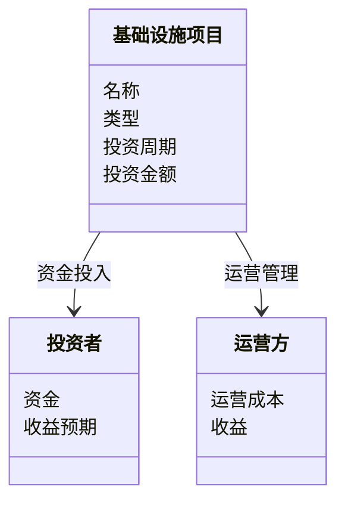

                 


# 基础设施投资：长期稳定收益的另类选择

---

## 关键词：  
基础设施投资、长期收益、稳定性、另类选择、风险管理、经济推动、可持续发展

---

## 摘要：  
本文深入探讨了基础设施投资这一长期稳定收益的另类选择，从背景概念到算法原理，再到系统设计和项目实战，全面解析了基础设施投资的核心要素、发展趋势和实际应用。文章通过详细的数学模型、系统架构图和实际案例分析，展示了如何通过基础设施投资实现稳健的财务回报，同时推动社会经济发展和可持续目标的实现。

---

# 第1章 基础设施投资的背景与概念

## 1.1 基础设施投资的定义与分类

### 1.1.1 基础设施的基本概念  
基础设施是支撑社会经济活动的物质基础，包括交通、能源、通信、水利等领域的设施。  

### 1.1.2 基础设施投资的定义  
基础设施投资是指将资金投入基础设施项目的建设和运营，以获取长期收益的过程。  

### 1.1.3 基础设施投资的分类  
1. **公共基础设施**：由政府投资，服务于公共利益，如道路、桥梁、学校、医院等。  
2. **商业基础设施**：由企业投资，服务于商业需求，如工业园区、物流中心、数据中心等。  

---

## 1.2 基础设施投资的背景与重要性

### 1.2.1 经济发展的基础设施需求  
基础设施是经济发展的基石，没有完善的基础设施，经济活动难以高效运转。  

### 1.2.2 基础设施投资对经济的推动作用  
1. **促进区域经济发展**：基础设施投资可以带动周边区域的经济发展。  
2. **创造就业机会**：基础设施建设需要大量劳动力，直接带动就业。  

### 1.2.3 基础设施投资的社会效益  
1. **改善民生**：如供水、供电、交通等基础设施的建设，显著提升了居民生活质量。  
2. **促进社会公平**：通过基础设施投资，缩小地区间的发展差距。  

---

# 第2章 基础设施投资的核心概念与联系

## 2.1 基础设施投资的核心原理

### 2.1.1 基础设施投资的基本原理  
基础设施投资通常具有周期长、回报稳定的特点，但同时也伴随着较高的风险。  

### 2.1.2 基础设施投资的收益模式  
1. **直接收益**：通过收费模式（如 tolls、rents）获取收益。  
2. **间接收益**：通过提升区域价值间接获得收益。  

---

## 2.2 基础设施投资的核心概念对比分析

### 2.2.1 基础设施投资与房地产投资的对比  
| 对比维度       | 基础设施投资                     | 房地产投资                     |  
|----------------|----------------------------------|----------------------------------|  
| 投资对象       | 公共设施（如道路、桥梁）         | 商业房产、住宅                  |  
| 投资周期       | 长期（10-30年）                  | 中短期（3-10年）               |  
| 风险           | 系统性风险较高                   | 市场风险和流动性风险较高        |  

### 2.2.2 基础设施投资与其他金融投资的对比  
1. **与股票投资的对比**：  
   - 股票投资收益波动大，周期短；基础设施投资收益稳定，周期长。  

2. **与债券投资的对比**：  
   - 债券投资收益相对固定，风险较低；基础设施投资收益较高，但风险也较高。  

---

# 第3章 基础设施投资的算法原理

## 3.1 基础设施项目的可行性分析

### 3.1.1 现金流分析  
现金流分析是评估基础设施项目可行性的重要工具。  

公式：  
$$ \text{净现值} = \sum_{t=0}^{n} \frac{CF_t}{(1 + r)^t} $$  

其中，\( CF_t \) 是第 \( t \) 年的现金流，\( r \) 是折现率。  

### 3.1.2 净现值计算  
净现值（Net Present Value，NPV）是衡量项目收益的重要指标。  

---

## 3.2 基础设施投资的风险管理

### 3.2.1 风险评估模型  
$$ \text{风险值} = \text{概率} \times \text{影响程度} $$  

### 3.2.2 风险对冲策略  
1. **保险对冲**：通过购买保险降低自然灾害等风险。  
2. **多元化投资**：通过投资不同领域的基础设施项目分散风险。  

---

# 第4章 基础设施投资的系统分析与架构设计

## 4.1 系统功能设计

### 4.1.1 领域模型（Mermaid 类图）  



---

## 4.2 系统架构设计

### 4.2.1 系统架构图（Mermaid 架构图）  


---

# 第5章 基础设施投资的项目实战

## 5.1 项目环境安装与配置

### 5.1.1 环境需求  
- 操作系统：Linux/Windows/MacOS  
- 开发工具：Python、Jupyter Notebook  
- 数据库：MySQL/PostgreSQL  

---

## 5.2 核心代码实现

### 5.2.1 现金流分析代码  

```python
def calculate_net_present_value(cash_flows, discount_rate):
    npv = 0
    for t, cf in enumerate(cash_flows):
        npv += cf / (1 + discount_rate) ** t
    return npv

# 示例数据
cash_flows = [100, 200, 300]
discount_rate = 0.05

npv = calculate_net_present_value(cash_flows, discount_rate)
print(f"净现值为：{npv:.2f}")
```

---

## 5.3 项目小结  
通过实际案例分析，我们可以看到基础设施投资的数学模型和系统架构在实际应用中的重要性。现金流分析和净现值计算是评估项目可行性的重要工具，而系统的架构设计则确保了投资过程的高效性和安全性。

---

# 第6章 基础设施投资的最佳实践与总结

## 6.1 小结  
基础设施投资是一种长期稳定收益的另类选择，其核心在于通过科学的评估和风险管理实现稳健的财务回报。  

---

## 6.2 注意事项  
1. **风险控制**：高度重视基础设施项目的风险管理，避免重大损失。  
2. **政策支持**：密切关注政策变化，利用政策红利提升投资收益。  

---

## 6.3 拓展阅读  
1. 《投资学基础》  
2. 《项目管理实战指南》  
3. 《风险管理与控制》  

---

作者：AI天才研究院/AI Genius Institute & 禅与计算机程序设计艺术 /Zen And The Art of Computer Programming

