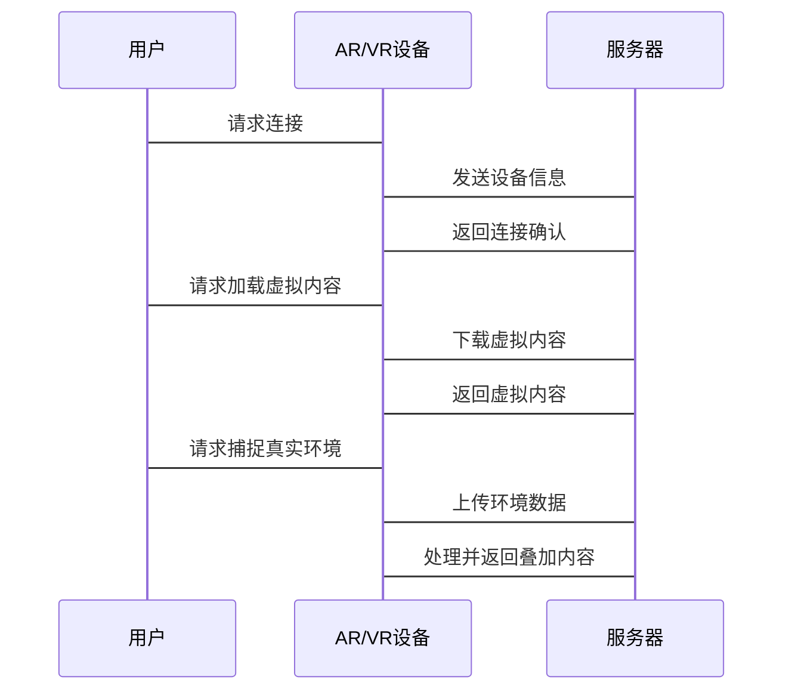

                 


# 增强现实（AR）和虚拟现实（VR）技术的商业化与投资前景

## 关键词：增强现实（AR）、虚拟现实（VR）、商业化、投资前景、技术分析

## 摘要：  
本文深入分析了增强现实（AR）和虚拟现实（VR）技术的商业化与投资前景，探讨了其在游戏、教育、医疗等领域的应用，以及其技术原理和核心要素。文章从背景介绍、核心技术、商业化模式、市场分析、投资机会、系统架构、实际案例、未来趋势等方面进行了详细论述，并结合实际案例分析了AR和VR技术的商业化潜力和投资价值。通过对AR和VR技术的全面分析，本文为投资者和技术从业者提供了深入的技术见解和市场洞察。

---

# 第一部分：增强现实（AR）和虚拟现实（VR）技术的背景与核心概念

## 第1章：AR和VR技术的概述

### 1.1 增强现实（AR）和虚拟现实（VR）的基本概念

#### 1.1.1 增强现实（AR）的定义与特点
- **定义**：AR（Augmented Reality）是一种将数字信息叠加在真实世界上的技术，通过计算机视觉、图形学和传感器等技术，将虚拟内容与真实环境无缝结合。
- **特点**：
  - 实时性：AR技术能够实时捕捉环境并叠加虚拟内容。
  - 互动性：用户可以通过手势、语音等方式与虚拟内容互动。
  - 无缝融合：AR的虚拟内容与真实环境高度融合，用户难以区分虚拟与现实。

#### 1.1.2 虚拟现实（VR）的定义与特点
- **定义**：VR（Virtual Reality）是一种通过计算机生成的虚拟环境，让用户沉浸其中，通过头显设备、手柄等设备与虚拟世界进行交互。
- **特点**：
  - 沉浸式体验：VR通过遮挡用户视野，让用户完全沉浸在一个虚拟的世界中。
  - 互动性：用户可以通过手柄、头显等设备与虚拟环境进行实时互动。
  - 高精度：VR需要高精度的传感器和图形处理能力，以提供流畅的用户体验。

#### 1.1.3 AR与VR的核心区别与应用场景
- **核心区别**：
  - **沉浸性**：VR是完全沉浸式的虚拟世界，而AR是将虚拟内容叠加在真实世界中。
  - **设备要求**：VR需要专门的头显设备，而AR可以通过手机、平板等设备实现。
- **应用场景**：
  - AR：广泛应用于游戏、教育、医疗、旅游等领域。
  - VR：主要用于游戏、影视、虚拟仿真、教育培训等领域。

### 1.2 AR和VR技术的发展历程

#### 1.2.1 AR和VR技术的起源与发展
- **起源**：AR和VR技术的起源可以追溯到20世纪60年代，当时计算机科学家Ivan Sutherland提出了第一个VR头显设备的概念。
- **发展**：随着计算机图形学、传感器技术和网络技术的进步，AR和VR技术逐渐从实验室走向商业化应用。

#### 1.2.2 关键技术的进步与突破
- **图形处理技术**：从早期的简单图形渲染到现在的高精度3D建模。
- **传感器技术**：从简单的加速度计到高精度的IMU（惯性测量单元）。
- **网络技术**：从有线连接到无线传输，支持实时数据处理和云渲染。

#### 1.2.3 当前技术的瓶颈与未来趋势
- **瓶颈**：硬件成本高、内容匮乏、用户体验不一致等问题。
- **未来趋势**：随着5G技术的普及、AI算法的优化，AR和VR技术将更加智能化、轻量化。

### 1.3 AR和VR技术的核心要素

#### 1.3.1 显示技术：从屏幕到现实
- **显示技术**：AR和VR设备的核心技术之一，包括LCD、OLED、Micro-OLED等显示技术。
- **分辨率与视场角**：高分辨率和大视场角是提升用户体验的关键因素。

#### 1.3.2 交互技术：从被动观察到主动参与
- **手势识别**：通过摄像头或传感器捕捉用户的 gesture，实现与虚拟世界的交互。
- **语音识别**：通过语音指令控制虚拟设备。
- **触觉反馈**：通过震动、力反馈等方式增强用户的交互体验。

#### 1.3.3 定位与追踪：精准定位与实时追踪的技术实现
- **定位技术**：包括GPS、WiFi、蓝牙等，用于确定用户的位置。
- **追踪技术**：通过摄像头、IMU等传感器，实时跟踪用户的运动轨迹。

#### 1.3.4 内容生成：虚拟与现实的无缝融合
- **3D建模**：通过扫描、建模等技术生成虚拟物体的三维模型。
- **实时渲染**：通过高性能的图形处理器实时渲染虚拟内容，与真实环境无缝融合。

## 第2章：AR和VR技术的核心原理

### 2.1 AR的核心原理

#### 2.1.1 图像识别与跟踪技术
- **图像识别**：通过摄像头捕捉真实环境中的图像，识别出特定的特征点。
- **图像跟踪**：基于识别的特征点，计算出摄像头的运动姿态，实现虚拟内容的动态叠加。

#### 2.1.2 图像叠加与渲染技术
- **图像叠加**：将虚拟内容叠加到真实环境中，要求虚拟内容与真实环境的高度对齐。
- **渲染技术**：通过图形处理单元（GPU）实时渲染虚拟内容，确保画面的流畅性和逼真度。

#### 2.1.3 用户交互与反馈机制
- **用户交互**：通过手势、语音等方式与虚拟内容互动。
- **反馈机制**：通过触觉反馈、视觉反馈等方式，让用户感受到与虚拟世界的互动。

### 2.2 VR的核心原理

#### 2.2.1 三维建模与渲染技术
- **三维建模**：通过建模软件创建虚拟场景中的三维物体。
- **渲染技术**：通过GPU渲染三维场景，生成高质量的虚拟画面。

#### 2.2.2 视觉与听觉的沉浸式体验
- **视觉沉浸**：通过高分辨率的显示屏和立体渲染技术，让用户看到立体的虚拟场景。
- **听觉沉浸**：通过3D音效技术，让用户听到来自不同方向的声音，增强沉浸感。

#### 2.2.3 人体运动捕捉与实时反馈
- **运动捕捉**：通过摄像头、传感器等设备捕捉用户的运动轨迹。
- **实时反馈**：通过头显设备和手柄，实时调整虚拟场景中的角色或视角，让用户感受到沉浸式的互动体验。

### 2.3 AR和VR技术的融合与协同

#### 2.3.1 AR与VR技术的互补性
- **互补性**：AR更注重现实与虚拟的结合，而VR更注重完全沉浸式的虚拟体验。

#### 2.3.2 融合技术在实际应用中的优势
- **混合现实（MR）**：将AR和VR技术结合，创造出更加真实的混合现实体验。
- **协同工作**：在某些场景中，AR和VR技术可以协同工作，提升用户体验。

#### 2.3.3 融合技术对用户体验的提升
- **沉浸感**：通过融合技术，用户可以在虚拟与现实之间无缝切换，获得更丰富的体验。
- **互动性**：融合技术可以实现更复杂的人机交互，提升用户的参与感。

---

# 第二部分：AR和VR技术的商业化模式与市场分析

## 第3章：AR和VR技术的商业化模式

### 3.1 B2B市场的商业化模式

#### 3.1.1 企业级AR/VR解决方案
- **行业应用**：AR和VR技术在企业培训、建筑设计、医疗手术模拟等领域的应用。
- **定制化服务**：根据企业需求，提供定制化的AR/VR解决方案。

#### 3.1.2 行业定制化应用
- **教育行业**：通过AR和VR技术进行虚拟教学和实验模拟。
- **医疗行业**：利用AR和VR技术进行手术模拟和患者教育。
- **制造业**：通过AR技术进行设备操作培训和维修指导。

#### 3.1.3 SaaS模式的应用
- **云服务**：通过云平台提供AR/VR内容的渲染和分发服务。
- **订阅模式**：用户按月或按年订阅AR/VR平台服务，获取所需的内容和功能。

### 3.2 B2C市场的商业化模式

#### 3.2.1 消费级AR/VR硬件销售
- **头显设备**：如Oculus Rift、HTC Vive等VR头显设备的销售。
- **AR眼镜**：如Google Glass、Microsoft HoloLens等AR设备的销售。

#### 3.2.2 内容分发与订阅模式
- **内容平台**：通过平台提供AR/VR游戏、影视等内容，用户按需购买或订阅。
- **应用商店**：类似于手机应用商店，提供各种AR/VR应用的下载和购买。

#### 3.2.3 平台化运营与生态建设
- **开放平台**：提供SDK（软件开发工具包）和API（应用程序编程接口），鼓励开发者创建AR/VR内容。
- **生态系统**：通过生态系统的建设和完善，吸引更多的用户和开发者加入，形成良性循环。

### 3.3 典型商业化案例分析

#### 3.3.1 游戏行业中的AR/VR应用
- **AR游戏**：如《Pokémon Go》，通过AR技术将虚拟角色叠加在真实环境中，吸引了大量的用户。
- **VR游戏**：如《Half-Life: Alyx》，通过VR技术提供沉浸式的射击游戏体验，获得了广泛的好评。

#### 3.3.2 教育行业的AR/VR应用
- **虚拟实验室**：通过VR技术，学生可以在虚拟实验室中进行化学实验、解剖学实验等，降低实验风险。
- **历史重现**：通过AR技术，学生可以“看到”历史事件的发生场景，增强学习兴趣。

#### 3.3.3 医疗行业的AR/VR应用
- **手术模拟**：通过VR技术，医生可以在虚拟环境中进行手术模拟，提高手术成功率。
- **患者教育**：通过AR技术，医生可以向患者展示手术过程和注意事项，帮助患者更好地理解治疗方案。

## 第4章：AR和VR技术的市场分析与投资机会

### 4.1 全球AR和VR市场的现状与发展趋势

#### 4.1.1 市场规模与增长预测
- **市场规模**：根据市场研究机构的数据，2023年全球AR和VR市场的规模约为1000亿美元，预计未来几年将以超过30%的年增长率增长。
- **增长预测**：到2030年，全球AR和VR市场的规模有望达到数千亿美元。

#### 4.1.2 各区域市场的特点与发展趋势
- **北美市场**：美国和加拿大是AR和VR技术的早期采用者，市场成熟度高，企业应用广泛。
- **欧洲市场**：欧洲市场注重AR和VR技术在教育、医疗等领域的应用，政策支持力度大。
- **亚洲市场**：中国、日本等国家在AR和VR技术的商业化应用方面进展迅速，市场需求旺盛。

#### 4.1.3 技术进步对市场的影响
- **技术进步**：随着硬件性能的提升、算法的优化，AR和VR技术的用户体验不断提升，推动市场需求增长。
- **成本下降**：随着规模化生产和技术进步，AR和VR设备的成本逐渐下降，进一步推动市场普及。

### 4.2 AR和VR技术的主要投资领域

#### 4.2.1 硬件设备：从芯片到显示技术
- **芯片技术**：高性能计算芯片是AR和VR设备的核心部件，投资芯片研发可以提升设备性能。
- **显示技术**：高分辨率、低延迟的显示屏是提升用户体验的关键，投资显示技术可以增强设备的竞争力。
- **传感器技术**：高精度的传感器是实现精准定位和追踪的核心，投资传感器技术可以提升设备的性能。

#### 4.2.2 软件与内容：从开发工具到用户体验
- **内容创作**：高质量的AR/VR内容是吸引用户的的关键，投资内容创作可以提升平台的吸引力。
- **开发工具**：提供易于使用的开发工具，降低内容创作的门槛，吸引更多开发者加入生态。
- **用户体验优化**：通过数据分析和用户反馈，不断优化用户体验，提升用户粘性。

#### 4.2.3 SaaS模式的应用
- **云服务**：投资云渲染和云存储服务，为AR/VR内容的分发和渲染提供支持。
- **订阅模式**：通过订阅模式获取稳定的收入来源，同时积累用户数据，为后续的产品优化提供依据。

### 4.3 AR和VR技术的投资机会与风险评估

#### 4.3.1 投资机会
- **硬件设备**：随着技术的进步，硬件设备的性能不断提升，市场需求稳步增长。
- **内容创作**：高质量的内容是吸引用户的的关键，内容创作领域具有较大的投资潜力。
- **平台建设**：构建开放的平台，吸引更多的开发者和用户，形成良性循环的生态系统。

#### 4.3.2 投资风险
- **技术风险**：AR和VR技术尚处于快速发展阶段，技术不稳定性和不确定性较高。
- **市场竞争**：市场竞争激烈，技术门槛高，新进入者面临较大的竞争压力。
- **用户接受度**：AR和VR技术的普及需要用户行为的改变，用户接受度和使用习惯的培养需要时间。

---

# 第三部分：AR和VR技术的系统架构与实现

## 第5章：AR和VR技术的系统架构设计

### 5.1 问题场景介绍
- **AR/VR系统的核心问题**：如何实现虚拟内容与真实环境的无缝融合，提供流畅的用户体验。
- **系统需求分析**：包括硬件性能需求、软件功能需求、用户交互需求等。

### 5.2 项目介绍
- **项目目标**：开发一个基于AR/VR技术的沉浸式体验系统。
- **项目范围**：包括硬件选型、软件开发、内容创作、用户测试等。

### 5.3 系统功能设计
#### 5.3.1 领域模型设计
- **领域模型**：通过Mermaid类图描述系统的核心实体和它们之间的关系。
```mermaid
classDiagram
    class User {
        id: integer
        name: string
        role: string
    }
    class AR/VR设备 {
        id: integer
        type: string
        status: string
    }
    class 虚拟内容 {
        id: integer
        name: string
        type: string
    }
    class 真实环境 {
        id: integer
        location: string
        timestamp: datetime
    }
    User --> AR/VR设备: 使用
    AR/VR设备 --> 虚拟内容: 加载
    AR/VR设备 --> 真实环境: 捕捉
```

#### 5.3.2 系统架构设计
- **系统架构**：通过Mermaid架构图描述系统的整体架构。


#### 5.3.3 系统接口设计
- **API接口**：定义系统内部和外部的接口，例如：
  - `/api/devices`: 设备管理接口
  - `/api/content`: 内容分发接口
  - `/api/users`: 用户管理接口

#### 5.3.4 系统交互设计
- **交互流程**：通过Mermaid序列图描述用户与系统的交互流程。


### 5.4 系统实现

#### 5.4.1 环境安装
- **开发环境**：安装必要的开发工具和库，例如：
  - 操作系统：Linux/Windows/MacOS
  - 开发工具：Unity、Unreal Engine、Blender等
  - 依赖库：OpenCV、OpenGL、WebGL等

#### 5.4.2 核心实现
- **AR/VR算法实现**：
  - 图像识别与跟踪算法：使用OpenCV库实现图像特征点检测和跟踪。
  - 图像叠加与渲染算法：使用OpenGL或WebGL进行3D图形渲染。
  - 用户交互与反馈机制：通过传感器数据实现手势识别和触觉反馈。

#### 5.4.3 代码实现
- **示例代码**：
  ```python
  import cv2

  def ar_image_recognition(image):
      # 使用OpenCV进行图像特征点检测
      gray = cv2.cvtColor(image, cv2.COLOR_BGR2GRAY)
      # 使用SIFT算法检测特征点
      sift = cv2.SIFT_create()
      kp, des = sift.detectAndCompute(gray, None)
      return kp, des

  def main():
      # 读取图像
      image = cv2.imread('target.jpg')
      # 进行图像识别
      kp, des = ar_image_recognition(image)
      print("检测到的特征点数：", len(kp))

  if __name__ == "__main__":
      main()
  ```

### 5.5 项目实战

#### 5.5.1 实际案例分析
- **案例1：AR游戏开发**
  - 项目目标：开发一个基于AR技术的LBS（基于位置的服务）游戏。
  - 关键技术：图像识别、位置跟踪、手势识别。
  - 开发工具：Unity、Vuforia、Google Cloud Vision。

#### 5.5.2 代码实现与应用解读
- **代码实现**：
  ```python
  import numpy as np
  import cv2

  def detect_ar_tag(image):
      # 将图像转换为灰度图
      gray = cv2.cvtColor(image, cv2.COLOR_BGR2GRAY)
      # 使用Harris Corner Detector检测角点
      gray = np.float32(gray)
      dst = cv2.cornerHarris(gray, 2, 3, 0.04)
      # 确定角点的位置
      rows, cols = dst.shape
      result = np.zeros((rows, cols), dtype=np.int32)
      for i in range(rows):
          for j in range(cols):
              if dst[i, j] > 0.01 * dst.max():
                  result[i, j] = 1
      return result

  def main():
      image = cv2.imread('ar_tag.jpg')
      ar_tag = detect_ar_tag(image)
      cv2.imwrite('result.jpg', ar_tag)

  if __name__ == "__main__":
      main()
  ```

#### 5.5.3 项目小结
- **项目总结**：通过实际案例分析，展示了AR技术在游戏开发中的应用，详细解读了代码实现和应用逻辑。
- **经验分享**：在AR项目中，图像识别和跟踪是关键，需要选择合适的算法和库，同时注意优化代码性能。

### 5.6 系统优化与扩展

#### 5.6.1 系统优化
- **算法优化**：通过优化图像识别和跟踪算法，提升系统的运行效率。
- **硬件优化**：选择更高性能的硬件设备，提升用户体验。

#### 5.6.2 功能扩展
- **多设备支持**：支持多种AR/VR设备，提升系统的兼容性。
- **云渲染**：通过云技术实现远程渲染，降低设备性能需求。

---

# 第四部分：AR和VR技术的未来趋势与投资建议

## 第6章：AR和VR技术的未来趋势

### 6.1 技术融合与创新
- **AI与AR/VR的结合**：通过人工智能技术提升AR/VR系统的智能化水平。
- **5G技术的支持**：5G的高带宽和低延迟将推动AR/VR技术的普及和应用。

### 6.2 市场扩展与应用深化
- **企业市场**：AR/VR技术在企业培训、远程协作等领域的应用将进一步深化。
- **消费者市场**：随着硬件成本的降低和用户体验的提升，消费者市场将快速增长。

### 6.3 投资建议
- **技术驱动型投资**：关注具有技术创新能力的公司，尤其是硬件和算法领域。
- **内容生态型投资**：投资于优质内容创作公司，构建强大的内容生态。
- **平台型投资**：投资于构建开放平台的公司，打造良性发展的生态系统。

---

# 第五部分：总结与展望

## 第7章：总结与展望

### 7.1 总结
- AR和VR技术作为新一代信息技术的重要组成部分，正在改变我们的生活方式和工作方式。
- 通过技术创新和商业化应用，AR和VR技术将在更多领域发挥重要作用。

### 7.2 展望
- 随着技术的不断进步和市场的逐步成熟，AR和VR技术的商业化应用将更加广泛。
- 投资者和企业应该抓住机遇，积极布局AR和VR领域，迎接未来的科技革命。

---

# 作者：AI天才研究院/AI Genius Institute & 禅与计算机程序设计艺术 /Zen And The Art of Computer Programming

