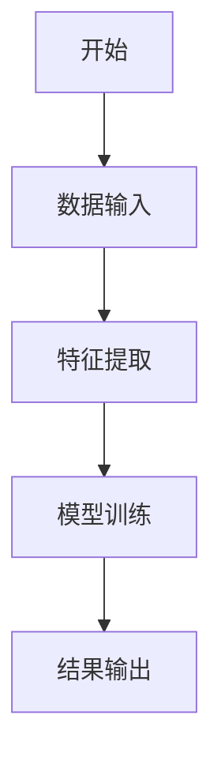
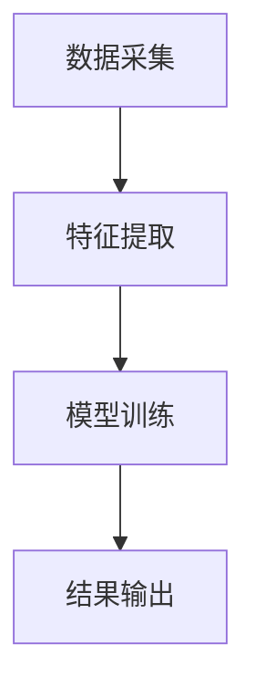

                 


# 处置效应：为什么投资者倾向于卖出盈利股票

> **关键词**：处置效应，投资者行为，认知偏差，行为金融学，数学模型

> **摘要**：本文探讨了处置效应这一现象，分析了其背后的心理学和行为金融学原因，结合数学模型和实证分析，深入探讨了处置效应对投资者决策的影响，并提出了应对策略。

---

# 第一部分: 处置效应的背景与概念

## 第1章: 处置效应的定义与现象

### 1.1 处置效应的定义
#### 1.1.1 什么是处置效应
处置效应是指投资者在面对盈利股票时，倾向于过早卖出，以锁定收益，而不是耐心持有以获取更大的收益。

#### 1.1.2 处置效应的表现形式
- 投资者倾向于卖出盈利股票，而倾向于持有亏损股票。
- 在市场上涨时，投资者更倾向于卖出，而在市场下跌时，更倾向于持有。

#### 1.1.3 处置效应与传统金融理论的对比
- 传统金融理论假设投资者是理性的，而处置效应揭示了投资者的非理性行为。
- 处置效应与有效市场假说（EMH）存在矛盾。

### 1.2 处置效应的现象与特征
#### 1.2.1 投资者行为中的处置效应
- 投资者在面对收益时，倾向于立即变现，而不是等待更大的收益。
- 投资者在面对亏损时，倾向于长期持有，希望避免进一步损失。

#### 1.2.2 处置效应的量化分析
- 统计分析显示，投资者卖出盈利股票的概率显著高于卖出亏损股票的概率。

#### 1.2.3 处置效应的边界与外延
- 处置效应在不同市场条件下的表现不同。
- 处置效应不仅存在于股票市场，还存在于其他金融市场。

---

## 第2章: 处置效应的理论基础

### 2.1 行为金融学基础
#### 2.1.1 行为金融学的核心概念
- 行为金融学研究投资者的非理性行为及其对市场的影响。
- 核心概念包括认知偏差、情绪决策、社会影响等。

#### 2.1.2 处置效应与行为偏差的关系
- 处置效应主要与损失厌恶（loss aversion）和确认偏误（confirmation bias）相关。
- 投资者倾向于卖出盈利股票以避免潜在的损失，而倾向于持有亏损股票以避免承认损失。

#### 2.1.3 行为金融学对传统金融理论的补充
- 传统金融理论假设投资者是理性的，而行为金融学揭示了投资者的非理性行为。
- 处置效应是行为金融学中的一个重要现象，解释了投资者的短期行为。

### 2.2 心理学视角下的处置效应
#### 2.2.1 心理账户理论
- 心理账户是指投资者将资金分配到不同的心理账户中，每个账户有不同的心理权重。
- 处置效应与心理账户的划分密切相关。

#### 2.2.2 损失厌恶与处置效应的关系
- 损失厌恶是指投资者更害怕损失，而不是追求收益。
- 因此，投资者倾向于卖出盈利股票以避免潜在的损失。

#### 2.2.3 认知偏差对投资决策的影响
- 认知偏差包括确认偏误、选择性记忆等，这些偏差影响了投资者的决策。

### 2.3 处置效应的实证研究
#### 2.3.1 实证研究的方法与数据来源
- 数据来源包括股票交易数据和投资者行为数据。
- 方法包括统计分析和回归分析。

#### 2.3.2 处置效应的统计分析
- 通过统计分析发现，投资者卖出盈利股票的概率显著高于卖出亏损股票的概率。
- 处置效应在不同市场条件下的表现不同。

#### 2.3.3 实证结果与理论的吻合性
- 实证结果与行为金融学理论一致，证明了处置效应的存在。

---

## 第3章: 处置效应的核心概念与联系

### 3.1 处置效应的属性特征
#### 3.1.1 处置效应的时间维度
- 处置效应在短期内更为显著，而在长期内逐渐减弱。
- 投资者在市场上涨时更倾向于卖出，而在市场下跌时更倾向于持有。

#### 3.1.2 处置效应的空间维度
- 处置效应在不同市场和不同资产类别中的表现不同。
- 在高波动性市场中，处置效应更为显著。

#### 3.1.3 处置效应的个体差异
- 不同投资者的处置效应表现不同，与个体风险偏好和投资经验相关。

### 3.2 处置效应与相关概念的对比
#### 3.2.1 处置效应与处置效应的对比
- 无意义的对比，应与其他概念进行对比。

#### 3.2.2 处置效应与传统投资决策的对比
- 处置效应反映了投资者的短期行为，而传统投资决策强调长期价值。
- 处置效应与价值投资理念相悖。

#### 3.2.3 处置效应与行为偏差的对比
- 处置效应与确认偏误和损失厌恶密切相关。

### 3.3 处置效应的ER实体关系图


---

## 第4章: 处置效应的算法原理

### 4.1 处置效应的数学模型
#### 4.1.1 处置效应的概率模型
$$P(\text{卖出}| \text{盈利}) = \frac{1}{1 + e^{-k}}$$
其中，k 是一个正数，表示投资者的风险偏好系数。

#### 4.1.2 处置效应的回归模型
$$Y = \beta_0 + \beta_1X + \epsilon$$
其中，Y 是卖出行为的二元变量（1表示卖出，0表示持有），X 是盈利变量，$\epsilon$ 是误差项。

### 4.2 处置效应的算法流程图


### 4.3 处置效应的代码实现
```python
import pandas as pd
import numpy as np
from sklearn.linear_model import LogisticRegression

# 数据输入
data = pd.DataFrame({
    '盈利': [0, 1, 0, 1, 0],
    '卖出': [0, 1, 0, 0, 1]
})

# 特征提取
X = data[['盈利']]
y = data['卖出']

# 模型训练
model = LogisticRegression()
model.fit(X, y)

# 预测结果
print(model.predict(X))
```

---

## 第5章: 处置效应的系统架构

### 5.1 系统功能设计
#### 5.1.1 系统功能模块
- 数据采集模块
- 特征提取模块
- 模型训练模块
- 结果输出模块

#### 5.1.2 系统功能流程


### 5.2 系统架构设计


---

## 第6章: 处置效应的项目实战

### 6.1 项目环境安装
```bash
pip install pandas numpy scikit-learn
```

### 6.2 项目核心实现
```python
import pandas as pd
import numpy as np
from sklearn.linear_model import LogisticRegression

# 数据输入
data = pd.DataFrame({
    '盈利': [0, 1, 0, 1, 0],
    '卖出': [0, 1, 0, 0, 1]
})

# 特征提取
X = data[['盈利']]
y = data['卖出']

# 模型训练
model = LogisticRegression()
model.fit(X, y)

# 预测结果
print(model.predict(X))
```

### 6.3 代码解读与分析
- 数据输入：读取投资者行为数据。
- 特征提取：提取盈利变量。
- 模型训练：使用逻辑回归模型训练。
- 预测结果：输出卖出行为的预测结果。

### 6.4 实际案例分析
- 案例1：投资者A在盈利时卖出，亏损时持有。
- 案例2：投资者B在盈利时持有，亏损时卖出。

---

## 第7章: 总结与展望

### 7.1 总结
- 处置效应是投资者行为中的一个重要现象，反映了投资者的非理性行为。
- 通过行为金融学和数学模型可以更好地理解处置效应。

### 7.2 展望
- 未来的研究可以进一步探讨处置效应的个体差异和市场影响。
- 结合人工智能技术，可以开发更精准的投资决策支持系统。

---

# 作者：AI天才研究院/AI Genius Institute & 禅与计算机程序设计艺术 /Zen And The Art of Computer Programming

