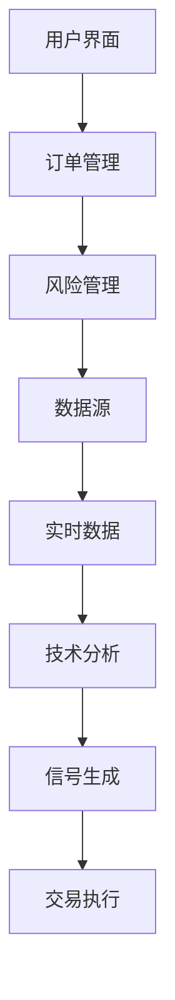

                 

# 外汇投资：把握全球货币市场机会

---

## 关键词
外汇投资、货币市场、汇率分析、交易策略、风险管理、技术分析、宏观经济

---

## 摘要
外汇投资是全球金融市场的重要组成部分，涉及复杂的经济、金融和数学原理。本文从外汇市场的基本概念、宏观经济分析、技术分析、交易策略、风险管理、系统设计和未来趋势等多方面展开，深入探讨如何在全球货币市场中把握投资机会。通过结合理论与实践，本文旨在为投资者提供一套系统化的外汇投资方法，帮助其在波动的市场中实现稳健收益。

---

# 第一部分: 外汇投资概述

## 第1章: 外汇市场的基本概念

### 1.1 外汇市场的定义与特点
#### 1.1.1 外汇市场的定义
外汇市场是全球最大的金融市场，参与者通过买卖不同货币对（如美元/欧元、英镑/日元）进行交易。外汇市场的特点包括24小时交易、高流动性和全球化。

#### 1.1.2 外汇市场的特点
- **24小时交易**：覆盖全球主要金融中心，包括伦敦、纽约和东京。
- **高流动性**：每天交易额巨大，确保了市场的流动性和价格的稳定性。
- **全球化**：不受单一国家经济状况影响，涉及全球多个国家和地区的货币政策。

#### 1.1.3 外汇市场的参与者
- **银行和金融机构**：作为主要参与者，提供流动性并进行大额交易。
- **中央银行**：通过干预市场影响汇率。
- **企业和个人投资者**：企业和个人通过外汇市场进行国际贸易和投资。

### 1.2 外汇交易的基本原理
#### 1.2.1 汇率的形成机制
汇率是两种货币之间的兑换比例，由市场供需、经济基本面和政策因素决定。基本公式为：
$$ 汇率 = \frac{货币A}{货币B} $$

#### 1.2.2 外汇交易的四种方式
- **即期交易**：当日或两个工作日内完成的交易。
- **远期交易**：约定在未来某一日期以预定汇率买卖货币。
- **掉期交易**：同时买入和卖出不同到期日的外汇合约。
- **期权交易**：买入或卖出外汇期权，获得汇率变动的收益或保护。

#### 1.2.3 外汇市场的运作机制
- **撮合交易**：交易者通过电子交易平台直接匹配买卖订单。
- **点差**：买卖价差，是市场参与者的主要收入来源。

### 1.3 外汇市场的分类与结构
#### 1.3.1 主要外汇市场及其特点
- **伦敦市场**：全球最大的外汇交易中心，24小时交易。
- **纽约市场**：全球第二大外汇交易中心，交易时间与伦敦重叠，提供连续交易。
- **东京市场**：主要交易时间在亚洲市场，提供补充流动性。

#### 1.3.2 外汇市场的层次结构
- **批发市场**：大额交易，参与者包括银行和机构投资者。
- **零售市场**：散户投资者参与的市场，通常通过经纪商进行交易。

#### 1.3.3 外汇市场的流动性分析
- **流动性高低**：影响汇率波动和交易成本，高流动性市场通常点差较小。

### 1.4 外汇市场的历史与发展
#### 1.4.1 外汇市场的起源
外汇交易起源于古代的国际贸易，但现代外汇市场的形成与布雷顿森林体系（1944年）密切相关。

#### 1.4.2 外汇市场的演变
- **固定汇率制**：布雷顿森林体系下的固定汇率，1973年被浮动汇率取代。
- **浮动汇率制**：汇率由市场供需决定，央行通过干预影响汇率。

#### 1.4.3 当今外汇市场的现状
- **电子交易平台**：如MetaTrader、TradingView等，使交易更加便捷和高效。
- **去中心化金融（DeFi）**：通过区块链技术提供新的外汇交易方式。

### 1.5 本章小结
本章介绍了外汇市场的基本概念、运作机制、参与者和市场结构，为后续章节奠定了基础。

---

## 第2章: 外汇市场的宏观经济分析

### 2.1 宏观经济指标对外汇市场的影响
#### 2.1.1 GDP与外汇市场的关系
国内生产总值（GDP）是衡量经济健康的重要指标，高增长的经济体通常具有较强的货币吸引力。

#### 2.1.2 利率对外汇市场的影响
利率差异是影响汇率的重要因素，高利率国家的货币通常具有更高的吸引力。

#### 2.1.3 通货膨胀率与汇率的关系
高通货膨胀率可能导致货币贬值，影响汇率走势。

### 2.2 汇率理论与模型
#### 2.2.1 汇率决定的购买力平价理论
购买力平价（PPP）认为，两种货币的汇率应使其购买力相等。

#### 2.2.2 汇率决定的利率平价理论
利率平价理论指出，高利率国家的货币应升值，低利率国家的货币应贬值。

#### 2.2.3 汇率决定的市场供需理论
市场供需理论强调，汇率由市场供需决定，受多种因素影响。

### 2.3 外汇市场的供需分析
#### 2.3.1 外汇市场的供需均衡
当买卖力量平衡时，汇率稳定。

#### 2.3.2 外汇市场的供需失衡
供需失衡导致汇率波动，市场参与者通过套利和投机活动恢复均衡。

#### 2.3.3 外汇市场的价格发现机制
价格发现是市场参与者通过买卖订单确定汇率的过程。

### 2.4 本章小结
本章分析了宏观经济指标和理论对外汇市场的影响，帮助投资者理解汇率波动的原因。

---

## 第3章: 外汇交易策略与技术分析

### 3.1 外汇交易的基本策略
#### 3.1.1 基本面分析策略
基于宏观经济数据、政策变化和国际新闻进行交易决策。

#### 3.1.2 技术分析策略
通过分析价格走势和交易量预测未来汇率变动。

#### 3.1.3 组合投资策略
通过多元化投资降低风险，提高收益。

### 3.2 技术分析的核心方法
#### 3.2.1 K线图的解读
K线图显示了货币对在特定时间段内的价格波动。

#### 3.2.2 移动平均线的应用
移动平均线（MA）用于平滑价格波动，帮助识别趋势。

#### 3.2.3 布林带的使用
布林带用于衡量价格波动范围，预测超买或超卖状态。

### 3.3 技术指标的综合应用
#### 3.3.1 MACD指标的使用
MACD指标通过移动平均线的差异，帮助识别趋势和潜在的买卖信号。

#### 3.3.2 RSI指标的应用
相对强度指数（RSI）用于衡量超买和超卖状态。

#### 3.3.3 威廉指标的解读
威廉指标（WMS）用于预测价格反转点。

### 3.4 本章小结
本章介绍了技术分析的核心方法和常见指标，帮助投资者制定交易策略。

---

## 第4章: 外汇交易的风险管理

### 4.1 外汇交易的主要风险
#### 4.1.1 市场风险
汇率波动可能导致的损失。

#### 4.1.2 利率风险
利率变动可能导致的损失。

#### 4.1.3 汇率波动风险
汇率短期剧烈波动可能导致的损失。

### 4.2 风险管理的策略与方法
#### 4.2.1 资金管理策略
合理分配资金，避免过度杠杆化。

#### 4.2.2 止损与止盈策略
设置止损点以限制损失，设置止盈点以锁定收益。

#### 4.2.3 风险分散策略
通过投资多元化货币对降低风险。

### 4.3 本章小结
本章强调了风险管理的重要性，并提供了实用的策略和方法。

---

## 第5章: 外汇交易系统的设计与实现

### 5.1 外汇交易系统的核心功能
#### 5.1.1 实时数据获取
通过API获取实时汇率数据。

#### 5.1.2 信号生成
基于技术分析生成买入或卖出信号。

#### 5.1.3 自动化交易执行
通过算法自动执行交易指令。

### 5.2 系统架构设计

### 5.3 系统接口设计
#### 5.3.1 数据接口
- **输入**：实时汇率数据。
- **输出**：技术分析结果。

#### 5.3.2 交易接口
- **输入**：交易信号。
- **输出**：交易订单执行结果。

### 5.4 本章小结
本章介绍了外汇交易系统的设计与实现，强调了自动化交易的重要性。

---

## 第6章: 外汇投资的心理学与行为分析

### 6.1 投资者心理对外汇交易的影响
#### 6.1.1 贪婪与恐惧
过度贪婪可能导致追涨杀跌，过度恐惧可能导致错失机会。

#### 6.1.2 羊群效应
投资者盲目跟随市场趋势，可能导致非理性决策。

### 6.2 行为分析与交易决策
#### 6.2.1 认知偏差
投资者常见的认知偏差，如确认偏差和忽略概率。

#### 6.2.2 情绪控制
通过冥想、计划和纪律来控制情绪，避免非理性交易。

### 6.3 本章小结
本章分析了投资者心理和行为对外汇交易的影响，强调了情绪控制的重要性。

---

## 第7章: 外汇投资的未来趋势

### 7.1 人工智能与外汇交易
#### 7.1.1 机器学习在外汇预测中的应用
通过机器学习算法预测汇率走势。

#### 7.1.2 自然语言处理（NLP）在新闻分析中的应用
通过NLP技术分析新闻和社交媒体情绪，预测汇率波动。

### 7.2 区块链技术在外汇交易中的应用
#### 7.2.1 去中心化金融（DeFi）
通过区块链技术提供去中心化的外汇交易和借贷服务。

#### 7.2.2 智能合约
智能合约自动执行交易和结算，减少中间环节。

### 7.3 未来的发展方向
#### 7.3.1 更高的自动化
通过AI和自动化交易系统提高交易效率。

#### 7.3.2 更多的监管合规
随着市场的成熟，监管机构将加强对外汇交易的监管。

### 7.4 本章小结
本章展望了外汇投资的未来趋势，强调了技术创新和监管的重要性。

---

## 作者：AI天才研究院/AI Genius Institute & 禅与计算机程序设计艺术 /Zen And The Art of Computer Programming

---

这篇文章通过系统化的分析和深入的讲解，为投资者提供了外汇投资的理论基础、交易策略和风险管理方法，同时结合技术分析和未来趋势，帮助投资者在全球货币市场中把握机会，实现稳健投资。

