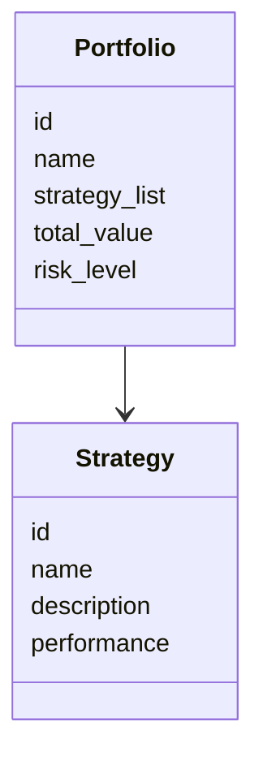
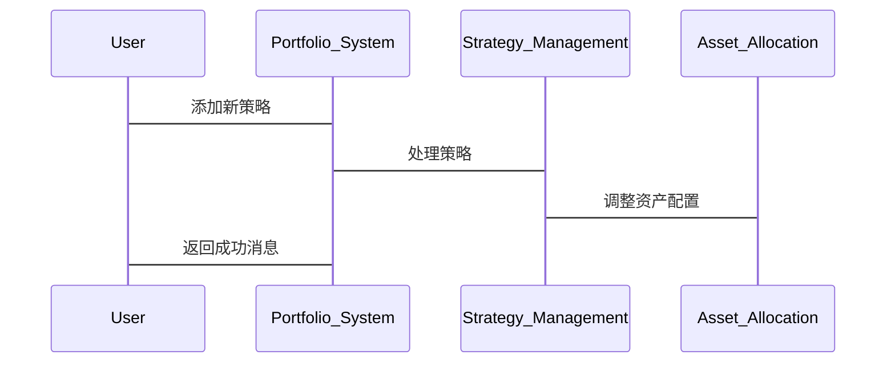

                 


# 多策略投资组合：综合运用不同投资方法

## 关键词
多策略投资组合、投资策略、风险管理、资产配置、组合优化、投资组合管理

## 摘要
多策略投资组合是一种结合多种投资策略来优化风险和收益的高级投资方法。本文将从多策略投资的基本概念、核心原理、算法设计、系统架构到实际项目案例，全面分析如何构建和管理一个多策略投资组合。通过详细的技术分析和实际案例，本文旨在为读者提供一个从理论到实践的完整指南。

---

## 第一部分: 多策略投资组合的背景与基础

### 第1章: 多策略投资组合概述

#### 1.1 多策略投资组合的核心概念
- **什么是多策略投资组合？**
  - 多策略投资组合是指将多种投资策略结合在一起，通过优化资产配置和策略权重来实现风险可控、收益最大化的目标。
- **多策略投资组合的特点**
  - **分散风险**：通过结合不同类型的策略，降低单一策略的风险。
  - **收益增强**：多种策略的协同作用可以提升整体收益。
  - **灵活性**：根据市场变化动态调整策略权重。
- **多策略投资组合的优缺点**
  - 优点：风险分散、收益稳定、适应性强。
  - 缺点：策略复杂、管理难度大、流动性风险。

#### 1.2 多策略投资的背景与发展趋势
- **投资市场的复杂性**
  - 金融市场波动性增加，单一策略难以应对复杂环境。
- **多策略投资的兴起**
  - 机构投资者和个人投资者对多样化投资的需求增加。
- **多策略投资的未来趋势**
  - 数据驱动的投资策略、人工智能在策略优化中的应用。

#### 1.3 多策略投资组合的应用场景
- **机构投资者的应用**
  - 基金公司、保险公司等通过多策略投资优化资产配置。
- **个人投资者的应用**
  - 个人投资者通过多策略投资实现财富保值和增值。
- **不同市场环境下的应用**
  - 牛市、熊市、震荡市中多策略投资的应用方式。

---

### 第2章: 多策略投资的核心概念与联系

#### 2.1 多策略投资的原理
- **多策略投资的基本原理**
  - 通过组合不同类型的策略，利用策略间的低相关性降低整体风险。
- **不同策略的协同效应**
  - 例如，股票策略和债券策略在市场波动时的互补性。
- **策略间的相互影响**
  - 策略权重的调整会影响整体组合的收益和风险。

#### 2.2 多策略投资的核心要素
- **投资目标**
  - 确定是追求绝对收益还是相对收益。
- **资产配置**
  - 根据策略类型分配不同资产的比例。
- **风险管理**
  - 设置止损、止盈机制，控制整体组合的风险。

#### 2.3 多策略投资的ER实体关系图
```mermaid
erDiagram
    portfolio
    {
        id
        name
        strategy_type
        asset Allocation
        risk_level
    }
    strategy
    {
        id
        name
        description
        risk_return_ratio
    }
    portfolio_strategy
    {
        portfolio_id
        strategy_id
        weight
        performance
    }
    portfolio --| portfolio_strategy
    strategy --| portfolio_strategy
```

---

## 第二部分: 多策略投资组合的算法与实现

### 第3章: 多策略投资组合的算法原理

#### 3.1 多策略组合优化算法
- **均值-方差优化**
  - 使用马科维茨的有效前沿模型。
  - 公式：$$\text{Minimize } \sigma^2 \text{ subject to } \mathbf{w}^T \mathbf{r} = R$$
  - 其中，$\sigma^2$ 是组合的方差，$\mathbf{w}$ 是权重向量，$\mathbf{r}$ 是收益向量，$R$ 是目标收益。

#### 3.2 策略权重分配算法
- **基于风险贡献的权重分配**
  - 根据每个策略的风险贡献比例分配权重。

#### 3.3 动态调整算法
- **基于市场信号的动态调整**
  - 使用技术指标（如RSI、MACD）动态调整策略权重。

---

### 第4章: 多策略投资组合的系统架构

#### 4.1 系统功能设计
- **领域模型类图**


- **系统架构设计**
```mermaid
containerDiagram
    container Portfolio_System {
        component Strategy_Management
        component Asset_Allocation
        component Risk_Management
    }
```

#### 4.2 系统接口设计
- **策略管理接口**
  - 添加策略、删除策略、修改策略权重。
- **资产分配接口**
  - 根据市场数据调整资产比例。

#### 4.3 系统交互流程


---

## 第三部分: 多策略投资组合的项目实战

### 第5章: 项目实战

#### 5.1 环境安装与配置
- **工具安装**
  - Python、Pandas、NumPy、Matplotlib、Plotly。
- **数据源**
  - 使用Yahoo Finance获取历史数据。

#### 5.2 核心实现代码
```python
import pandas as pd
import numpy as np
import matplotlib.pyplot as plt

# 数据获取
def get_data(tickers, start, end):
    data = pd.DataFrame()
    for ticker in tickers:
        data[ticker] = pd.read_csv(f"../data/{ticker}.csv")['Close']
    return data

# 多策略组合优化
def portfolio_optimization(data, start, end):
    returns = data.pct_change().dropna()
    cov_matrix = returns.cov()
    returns_mean = returns.mean(axis=0)
    
    # 使用马科维茨模型
    n = len(returns.columns)
    return np.linalg.solve(cov_matrix, returns_mean)
```

#### 5.3 代码应用解读与分析
- **数据预处理**
  - 清洗数据，处理缺失值。
- **策略回测**
  - 计算不同策略的收益和风险指标。

#### 5.4 案例分析
- **案例：股票与债券组合**
  - 60%股票+40%债券。
  - 回测结果：收益稳定，风险较低。

#### 5.5 项目小结
- **经验总结**
  - 动态调整策略权重可以有效应对市场变化。
  - 数据质量对回测结果影响重大。

---

## 第四部分: 总结与展望

### 第6章: 总结与展望

#### 6.1 最佳实践 tips
- 定期评估和调整投资组合。
- 使用数据驱动的方法优化策略。

#### 6.2 小结
- 多策略投资组合是实现风险可控、收益优化的重要方法。
- 通过算法优化和系统设计可以提升投资组合的管理效率。

#### 6.3 注意事项
- 避免过度复杂的策略组合。
- 定期监控市场变化，及时调整策略。

#### 6.4 拓展阅读
- 《投资学》——金融经典教材。
- 《算法交易：执行与分析》——算法交易的实践指南。

---

## 作者：AI天才研究院/AI Genius Institute & 禅与计算机程序设计艺术 /Zen And The Art of Computer Programming

