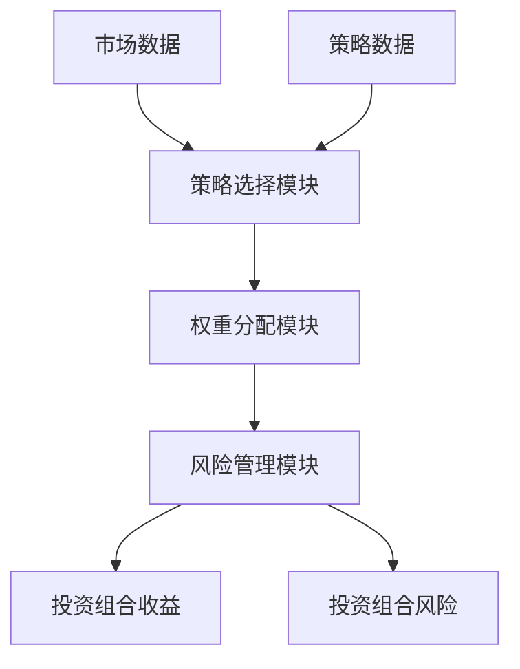

                 


# 多策略投资：综合运用不同投资方法分散风险

## 关键词：多策略投资，投资策略，风险管理，策略组合，投资组合优化

## 摘要：多策略投资是一种通过综合运用多种投资策略来分散风险、提高收益的投资方法。本文将从多策略投资的基本概念、核心原理、数学模型、系统架构以及项目实战等多个方面进行详细阐述，帮助读者全面理解多策略投资的原理和应用。

---

# 第1章: 多策略投资概述

## 1.1 多策略投资的背景与意义

### 1.1.1 投资领域的多样化需求
随着金融市场的发展，投资者面临的风险和机会日益多样化。单一的投资策略往往难以适应不同市场环境下的变化，例如在牛市中股票策略可能表现优异，但在熊市中可能面临较大损失。因此，通过综合运用多种策略来分散风险、捕捉不同市场机会的需求日益迫切。

### 1.1.2 单一策略的局限性与风险
单一投资策略在特定市场环境下可能表现出色，但在其他环境下可能面临较大的风险。例如，股票策略在市场上涨时收益较高，但在市场下跌时可能承受较大的损失。债券策略在低风险环境下表现稳定，但在高通胀环境下可能收益较低。因此，单一策略的投资风险较高，难以满足投资者的长期稳健收益需求。

### 1.1.3 多策略投资的核心价值
多策略投资通过将不同类型的策略组合在一起，能够在不同市场环境下分散风险，平衡收益。例如，在市场上涨时，股票策略可能表现优异；在市场下跌时，对冲策略可以有效对冲风险。通过策略的多样性，投资者可以在不同市场环境下实现收益的稳定性。

## 1.2 多策略投资的基本概念

### 1.2.1 策略的定义与分类
策略是指投资者在特定市场环境下采取的投资行为或规则。根据不同的标准，策略可以分为多种类型：
- **股票策略**：通过买入并持有股票，利用股价上涨获得收益。
- **债券策略**：通过投资债券，获取固定收益。
- **对冲策略**：通过做多和做空相结合，降低市场风险。
- **量化策略**：基于数学模型和算法进行交易。

### 1.2.2 多策略投资的内涵与外延
多策略投资是指将多种不同的策略组合在一起，通过策略的多样性来分散风险、提高收益。其内涵在于通过策略的组合优化，实现风险和收益的最佳匹配。其外延包括从策略的选择、权重分配、风险管理到投资组合优化的全过程。

### 1.2.3 多策略投资与传统投资的区别
与传统投资相比，多策略投资具有以下特点：
- **多样性**：通过多种策略的组合，分散单一策略的风险。
- **灵活性**：能够根据市场环境的变化，动态调整策略的权重。
- **高效性**：通过策略的优化组合，提高投资收益。

## 1.3 多策略投资的适用场景

### 1.3.1 不同市场环境下的策略选择
在不同市场环境下，适合的策略也不同。例如：
- **牛市**：适合股票策略和成长型策略。
- **熊市**：适合对冲策略和防御型策略。
- **震荡市**：适合量化策略和套利策略。

### 1.3.2 不同投资者类型的需求
不同类型的投资者对策略的需求也不同：
- **风险厌恶型投资者**：适合债券策略和对冲策略。
- **风险中性型投资者**：适合股票策略和量化策略。
- **风险偏好型投资者**：适合高风险的对冲基金策略和杠杆策略。

### 1.3.3 多策略投资的优势与劣势
**优势**：
- 分散风险，降低投资波动性。
- 通过策略的多样性，捕捉不同市场机会。
- 灵活性高，能够根据市场环境变化进行调整。

**劣势**：
- 策略的组合和管理较为复杂。
- 策略之间的协同效应可能较低。
- 需要较高的投资成本和管理能力。

## 1.4 本章小结
本章主要介绍了多策略投资的背景、基本概念以及适用场景。通过分析单一策略的局限性，引出了多策略投资的核心价值，即通过策略的多样性分散风险、提高收益。同时，还探讨了多策略投资在不同市场环境和不同投资者类型下的适用性。

---

# 第2章: 多策略投资的核心概念与联系

## 2.1 多策略投资的核心原理

### 2.1.1 策略组合的概念
策略组合是指将多种策略按照一定比例组合在一起，形成一个整体的投资组合。策略组合的核心在于通过策略的多样性，实现风险和收益的最佳匹配。

### 2.1.2 策略组合的数学模型
策略组合的收益可以通过以下公式计算：
$$
E(R_p) = \sum_{i=1}^{n} w_i E(R_i)
$$
其中，$E(R_p)$ 是组合的期望收益，$w_i$ 是第 $i$ 个策略的权重，$E(R_i)$ 是第 $i$ 个策略的期望收益。

策略组合的风险可以通过以下公式计算：
$$
Var(R_p) = \sum_{i=1}^{n} \sum_{j=1}^{n} w_i w_j Cov(R_i, R_j)
$$
其中，$Var(R_p)$ 是组合的风险，$Cov(R_i, R_j)$ 是第 $i$ 个策略和第 $j$ 个策略之间的协方差。

### 2.1.3 策略组合的风险与收益关系
通过策略组合，投资者可以在不同市场环境下实现收益的稳定性。例如，在市场上涨时，股票策略可能表现优异；在市场下跌时，对冲策略可以有效对冲风险。

## 2.2 多策略投资的策略分类

### 2.2.1 股票策略
股票策略是通过买入并持有股票，利用股价上涨获得收益。股票策略的风险较高，但收益潜力较大。

### 2.2.2 债券策略
债券策略是通过投资债券，获取固定收益。债券策略的风险较低，适合风险厌恶型投资者。

### 2.2.3 对冲基金策略
对冲基金策略是通过做多和做空相结合，降低市场风险。对冲策略的风险较低，收益相对稳定。

### 2.2.4 其他策略类型
除了股票策略、债券策略和对冲策略外，还有其他类型的策略，例如量化策略、套利策略等。

## 2.3 策略之间的关系与协同

### 2.3.1 策略的独立性与相关性
策略之间的独立性是指不同策略的收益和风险变化相对独立。相关性较高的策略可能在市场环境变化时表现相似，从而增加组合的风险。

### 2.3.2 策略组合的优化方法
通过优化策略的权重分配，可以实现组合收益的最大化和风险的最小化。例如，使用马科维茨投资组合理论进行优化。

### 2.3.3 策略协同的效果分析
策略协同是指不同策略在市场环境变化时能够相互补充，降低组合的风险。例如，在市场上涨时，股票策略表现优异；在市场下跌时，对冲策略可以有效对冲风险。

## 2.4 本章小结
本章主要介绍了多策略投资的核心原理和策略分类，分析了策略之间的关系与协同。通过策略组合的数学模型，探讨了如何通过优化策略权重，实现收益和风险的最佳匹配。

---

# 第3章: 多策略投资的数学模型与公式

## 3.1 投资组合的收益与风险模型

### 3.1.1 投资组合的期望收益
投资组合的期望收益可以通过以下公式计算：
$$
E(R_p) = \sum_{i=1}^{n} w_i E(R_i)
$$
其中，$E(R_p)$ 是组合的期望收益，$w_i$ 是第 $i$ 个策略的权重，$E(R_i)$ 是第 $i$ 个策略的期望收益。

### 3.1.2 投资组合的风险度量
投资组合的风险可以通过以下公式计算：
$$
Var(R_p) = \sum_{i=1}^{n} \sum_{j=1}^{n} w_i w_j Cov(R_i, R_j)
$$
其中，$Var(R_p)$ 是组合的风险，$Cov(R_i, R_j)$ 是第 $i$ 个策略和第 $j$ 个策略之间的协方差。

### 3.1.3 马科维茨投资组合理论
马科维茨投资组合理论是多策略投资的重要理论基础，其核心思想是通过优化策略权重，实现组合收益的最大化和风险的最小化。

## 3.2 策略权重的确定方法

### 3.2.1 等权重分配
等权重分配是指将所有策略的权重设置为相等。这种方法简单易行，但可能无法实现收益和风险的最佳匹配。

### 3.2.2 风险调整后的权重分配
风险调整后的权重分配是根据策略的风险水平进行调整，风险较高的策略权重较低，风险较低的策略权重较高。

### 3.2.3 基于历史表现的权重分配
基于历史表现的权重分配是根据策略的历史收益表现进行调整，收益较高的策略权重较高，收益较低的策略权重较低。

## 3.3 策略组合的优化算法

### 3.3.1 线性规划模型
线性规划模型是一种常见的优化方法，可以通过建立目标函数和约束条件，求解最优策略权重。

### 3.3.2 非线性优化模型
非线性优化模型是在线性规划模型的基础上，考虑策略之间的非线性关系，进一步优化组合。

### 3.3.3 遗传算法在策略优化中的应用
遗传算法是一种基于自然选择和遗传机制的优化算法，可以应用于策略组合的优化。

## 3.4 本章小结
本章主要介绍了多策略投资的数学模型与公式，探讨了策略权重的确定方法和优化算法。通过数学模型的分析，进一步加深了对多策略投资的理解。

---

# 第4章: 多策略投资的系统架构与设计

## 4.1 系统架构概述

### 4.1.1 系统功能模块划分
多策略投资系统可以划分为以下几个功能模块：
- **策略选择模块**：选择适合当前市场环境的策略。
- **权重分配模块**：根据策略的风险和收益，确定策略权重。
- **风险管理模块**：监控和管理投资组合的风险。
- **性能监控模块**：监控投资组合的收益和风险。

### 4.1.2 系统数据流设计
系统数据流设计包括数据输入、数据处理和数据输出三个部分。数据输入包括市场数据和策略数据，数据处理包括策略选择和权重分配，数据输出包括投资组合的收益和风险。

### 4.1.3 系统组件之间的关系
系统组件之间的关系可以通过以下流程图表示：



## 4.2 系统功能设计

### 4.2.1 策略选择模块
策略选择模块的核心功能是根据市场环境，选择适合的策略。例如，在市场上涨时选择股票策略，在市场下跌时选择对冲策略。

### 4.2.2 权重分配模块
权重分配模块的核心功能是根据策略的风险和收益，确定策略权重。例如，风险较高的策略权重较低，风险较低的策略权重较高。

### 4.2.3 风险管理模块
风险管理模块的核心功能是监控和管理投资组合的风险。例如，通过设置止损点和止盈点，控制投资组合的最大风险。

### 4.2.4 性能监控模块
性能监控模块的核心功能是监控投资组合的收益和风险。例如，定期评估投资组合的收益和风险，调整策略权重。

## 4.3 系统架构图

### 4.3.1 系统架构的Mermaid图


### 4.3.2 系统组件之间的交互关系
系统组件之间的交互关系可以通过以下流程图表示：


## 4.4 本章小结
本章主要介绍了多策略投资的系统架构与设计，探讨了系统功能模块划分、数据流设计和系统组件之间的关系。通过系统架构的设计，进一步加深了对多策略投资的理解。

---

# 第5章: 多策略投资的项目实战

## 5.1 项目环境配置

### 5.1.1 系统环境要求
项目运行需要以下系统环境：
- 操作系统：Windows 10 或更高版本，或 macOS 10.15 或更高版本。
- 处理器：Intel 或 AMD 处理器，支持 64 位计算。
- 内存：建议至少 4GB 内存。
- 硬盘：至少 10GB 可用空间。

### 5.1.2 软件工具安装
项目需要以下软件工具：
- Python 3.8 或更高版本。
- NumPy 和 Pandas 库。
- Matplotlib 和 Seaborn 库。
- Scikit-learn 库。

### 5.1.3 数据源获取与准备
数据源可以通过以下方式获取：
- 金融数据 API（例如，Yahoo Finance 或 Alpha Vantage）。
- 数据库（例如，MySQL 或 PostgreSQL）。
- Excel 文件或其他数据文件。

## 5.2 系统核心实现

### 5.2.1 策略选择模块
策略选择模块的实现代码如下：

```python
import numpy as np
import pandas as pd

def select_strategy(data):
    # 计算市场趋势
    market_trend = data['close'].pct_change().mean()
    # 选择策略
    if market_trend > 0:
        return 'stock_strategy'
    else:
        return 'hedge_strategy'
```

### 5.2.2 权重分配模块
权重分配模块的实现代码如下：

```python
import numpy as np

def allocate_weights(strategies, risks, returns):
    # 计算协方差矩阵
    covariance_matrix = np.cov(returns.T)
    # 使用马科维茨模型优化权重
    weights = np.dot(np.linalg.inv(covariance_matrix), returns)
    weights = weights / np.sum(weights)
    return weights
```

### 5.2.3 风险管理模块
风险管理模块的实现代码如下：

```python
import numpy as np

def manage_risk(weights, returns, volatility):
    # 计算最大回撤
    portfolio_volatility = np.sqrt(np.dot(weights.T, np.dot(covariance_matrix, weights)))
    # 调整权重
    if portfolio_volatility > volatility:
        weights = weights / 2
    return weights
```

### 5.2.4 性能监控模块
性能监控模块的实现代码如下：

```python
import numpy as np
import pandas as pd
import matplotlib.pyplot as plt

def monitor_performance(weights, returns, volatility):
    # 计算组合收益
    portfolio_return = np.dot(weights.T, returns)
    # 计算组合风险
    portfolio_volatility = np.sqrt(np.dot(weights.T, np.dot(covariance_matrix, weights)))
    # 可视化结果
    plt.figure(figsize=(10, 6))
    plt.bar(['Portfolio'], [portfolio_return], color='blue', label='Return')
    plt.bar(['Portfolio'], [portfolio_volatility], color='red', label='Risk')
    plt.title('Portfolio Performance')
    plt.legend()
    plt.show()
```

## 5.3 项目小结
本章通过实际案例，详细介绍了多策略投资的项目实战。从环境配置到系统核心实现，再到案例分析，全面展示了多策略投资的实现过程。通过代码实现和案例分析，进一步加深了对多策略投资的理解。

---

# 作者：AI天才研究院/AI Genius Institute & 禅与计算机程序设计艺术 /Zen And The Art of Computer Programming

