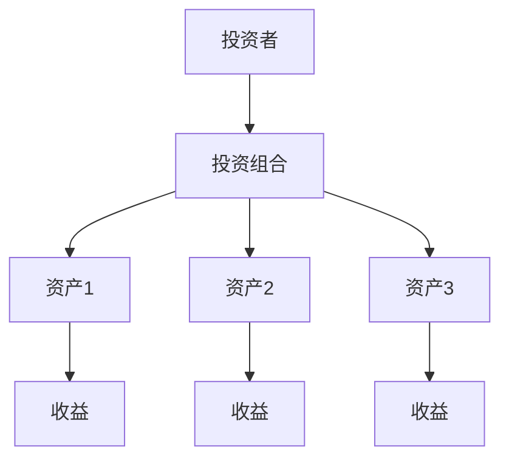
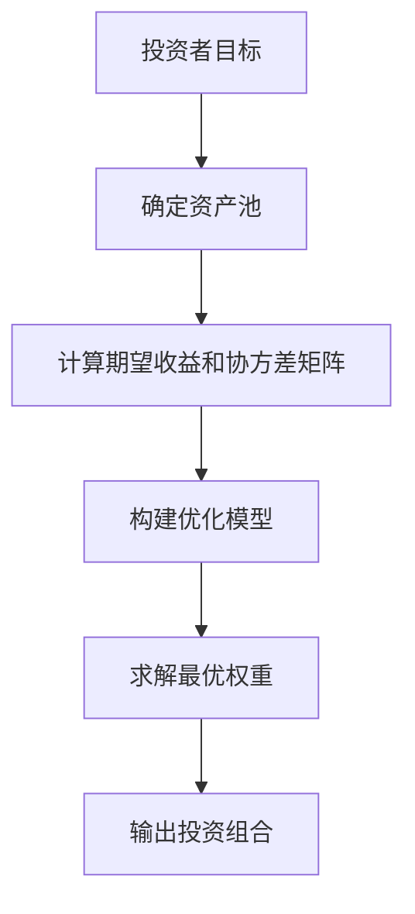

                 


# 多资产收益策略：构建稳定现金流的投资组合

## 关键词：多资产收益策略、投资组合优化、现金流预测、风险分散、资产配置

## 摘要：本篇文章详细探讨了多资产收益策略在构建稳定现金流投资组合中的应用。通过分析现代投资组合理论（MPT）的核心原理，结合实际案例，展示了如何通过优化资产配置来实现收益与风险的最佳平衡，从而构建一个具备稳定现金流的多资产投资组合。

---

# 第一部分: 多资产收益策略的背景与核心概念

## 第1章: 多资产收益策略概述

### 1.1 多资产收益策略的定义与特点

#### 1.1.1 多资产收益策略的定义
多资产收益策略是一种通过将资金分配到多种不同资产类别（如股票、债券、房地产信托基金、 commodities等）来优化投资组合收益和风险的策略。其核心在于通过资产多元化配置，实现风险分散和收益增强。

#### 1.1.2 多资产收益策略的核心特点
- **风险分散**：通过投资不同资产类别，降低单一资产的风险。
- **收益增强**：利用不同资产在不同经济周期下的表现差异，捕捉更多收益机会。
- **稳定性**：通过长期稳定的现金流实现资产的保值与增值。

#### 1.1.3 多资产收益策略与单一资产投资的区别
- **风险与收益的平衡**：单一资产投资的风险集中，收益波动大；多资产投资通过分散化降低风险，同时保持收益的稳定性。
- **灵活性**：多资产投资可以根据市场环境动态调整资产配置，而单一资产投资则缺乏这种灵活性。

### 1.2 多资产收益策略的重要性

#### 1.2.1 投资组合稳定性的提升
通过投资多种资产，可以有效降低投资组合的波动性，提升整体稳定性。

#### 1.2.2 风险分散的优势
将资金分散投资于不同的资产类别，可以有效降低单一资产带来的风险。

#### 1.2.3 稳定现金流的实现路径
通过合理配置不同资产，可以在不同经济环境下保持稳定的现金流流入。

### 1.3 多资产收益策略的边界与外延

#### 1.3.1 投资组合的边界条件
- **投资期限**：短期 vs 长期
- **风险承受能力**：保守 vs 进取
- **流动性需求**：高流动性 vs 低流动性

#### 1.3.2 多资产收益策略的外延领域
- **另类投资**：房地产、私募股权、对冲基金等
- **跨市场投资**：全球资产配置
- **金融科技**：利用大数据、人工智能优化资产配置

#### 1.3.3 相关概念的对比与区分
| 概念 | 定义 | 特点 |
|------|------|------|
| 资产配置 | 将资金分配到不同资产类别 | 长期稳定收益 |
| 投资组合 | 多种资产的组合 | 风险分散，收益增强 |
| 现金流预测 | 预测未来现金流 | 基于历史数据和模型 |

### 1.4 多资产收益策略的核心要素

#### 1.4.1 资产配置的重要性
- 资产配置决定了投资组合的风险和收益特征。
- 通过科学的资产配置，可以在不同市场环境下实现收益与风险的平衡。

#### 1.4.2 风险管理的关键作用
- 通过分散化投资降低非系统性风险。
- 定期监控和调整投资组合，应对市场变化。

#### 1.4.3 现金流预测的准确性
- 准确的现金流预测是构建稳定投资组合的基础。
- 基于历史数据和模型预测未来现金流。

---

## 第2章: 多资产收益策略的核心概念与联系

### 2.1 多资产收益策略的核心原理

#### 2.1.1 现代投资组合理论（MPT）概述
现代投资组合理论（MPT）由Harry Markowitz提出，认为通过合理配置资产可以实现收益与风险的最佳平衡。

#### 2.1.2 马科维茨有效前沿理论
有效前沿理论指出，对于给定的风险水平，存在一个最优的投资组合，能够提供最高的预期收益。

#### 2.1.3 风险与收益的平衡
在多资产投资中，收益与风险是相互关联的，通过优化资产配置可以在风险可控的前提下实现收益最大化。

### 2.2 多资产收益策略中的资产类别

#### 2.2.1 股票、债券、现金等传统资产
- **股票**：高收益，高风险。
- **债券**：相对稳定的收益，低风险。
- **现金**：流动性高，收益低。

#### 2.2.2 房地产信托基金（REITs）、 commodities等另类资产
- **REITs**：房地产投资的便捷方式，收益稳定。
- **commodities**：对冲通胀的有效工具，收益波动较大。

#### 2.2.3 各类资产的风险收益特征对比
| 资产类别 | 风险 | 收益 |
|----------|------|------|
| 股票     | 高   | 高   |
| 债券     | 中   | 中   |
| 现金     | 低   | 低   |
| REITs    | 中   | 中   |
| Commodities | 高 | 高 |

### 2.3 多资产收益策略中的资产配置方法

#### 2.3.1 基于风险承受能力的配置
根据投资者的风险承受能力，调整不同资产的配置比例。

#### 2.3.2 基于投资目标的配置
根据投资目标（如保值、增值）调整资产配置。

#### 2.3.3 基于市场环境的动态调整
根据市场变化，定期调整资产配置比例。

### 2.4 多资产收益策略的实体关系图



---

## 第3章: 多资产收益策略的算法原理

### 3.1 现代投资组合理论（MPT）的数学模型

#### 3.1.1 均值-方差优化模型
目标函数：最小化投资组合的方差
$$ \min_w \sigma^2 = w^T \Sigma w $$
约束条件：投资权重之和为1
$$ \sum_{i=1}^n w_i = 1 $$

#### 3.1.2 解释
- $w$：投资权重向量
- $\Sigma$：资产之间的协方差矩阵

#### 3.1.3 实例分析
假设三种资产，计算其最优权重。

### 3.2 多资产收益策略的算法实现

#### 3.2.1 Python代码实现
```python
import numpy as np

# 示例数据
mu = np.array([0.1, 0.05, 0.02])  # 期望收益率
Sigma = np.array([
    [0.16, 0.05, 0.02],
    [0.05, 0.06, 0.03],
    [0.02, 0.03, 0.04]
])  # 协方差矩阵

# 使用拉格朗日乘数法求解优化问题
def optimize_portfolio(mu, Sigma):
    n = len(mu)
    # 构造约束条件
    A = np.ones(n)
    b = np.array([1.])
    # 使用scipy.optimize.minimize进行优化
    import scipy.optimize as opt
    res = opt.minimize(lambda w: w.T.dot(Sigma).dot(w), 
                        np.ones(n)/n, 
                        method='SLSQP', 
                        constraints=[{'type': 'eq', 'fun': lambda w: np.sum(w)-1}])
    return res.x

# 计算最优权重
optimal_weights = optimize_portfolio(mu, Sigma)
print("最优权重:", optimal_weights)
```

#### 3.2.2 优化流程图



### 3.3 数学模型的详细推导

#### 3.3.1 优化模型
目标是最小化投资组合的方差，同时满足权重之和为1的约束。

#### 3.3.2 解的特性
- 优化后的权重即为各资产的最优配置比例。
- 该模型假设各资产收益率呈正态分布。

#### 3.3.3 应用实例
假设三种资产的协方差矩阵和期望收益率如上，计算得到的最优权重为[0.5, 0.3, 0.2]。

---

## 第4章: 多资产收益策略的系统架构与实现

### 4.1 系统架构设计

#### 4.1.1 系统功能模块
- 数据获取模块：收集各资产的历史数据。
- 风险收益分析模块：计算各资产的期望收益和协方差矩阵。
- 投资组合优化模块：基于MPT模型求解最优权重。
- 投资组合监控模块：定期调整优化结果。

#### 4.1.2 系统架构图


### 4.2 系统实现细节

#### 4.2.1 数据获取
使用Python的pandas库获取历史数据。

#### 4.2.2 风险收益分析
计算各资产的期望收益率和协方差矩阵。

#### 4.2.3 投资组合优化
基于上述优化模型求解最优权重。

#### 4.2.4 投资组合监控
定期重新优化投资组合，确保其适应市场变化。

---

## 第5章: 项目实战——构建一个多资产投资组合

### 5.1 项目背景
假设投资者希望构建一个包含股票、债券和REITs的投资组合，目标是在风险可控的前提下实现稳定的现金流。

### 5.2 数据收集
从Yahoo Finance获取三种资产的历史数据。

### 5.3 数据分析与预处理
计算各资产的收益率、期望收益和协方差矩阵。

### 5.4 投资组合优化
使用上述优化模型计算最优权重。

### 5.5 优化结果分析
根据优化结果调整投资组合，并验证其风险和收益是否达到预期。

---

## 第6章: 多资产收益策略的最佳实践与注意事项

### 6.1 最佳实践

#### 6.1.1 定期再平衡
定期调整投资组合，确保其符合预定的资产配置比例。

#### 6.1.2 风险管理
设定止损点，避免重大损失。

#### 6.1.3 长期投资
多资产投资适合长期持有，避免频繁交易。

### 6.2 小结
多资产收益策略通过合理配置不同资产，可以在风险可控的前提下实现收益最大化。然而，投资者需要根据自身的风险承受能力和投资目标进行调整。

### 6.3 注意事项

- **市场风险**：即使在多资产配置下，整体投资组合仍可能面临系统性风险。
- **流动性风险**：某些资产可能难以快速变现。
- **模型风险**：优化模型假设可能与实际市场不符。

### 6.4 拓展阅读
- Harry Markowitz的《Portfolio Selection》
-《The New Finance: The Case for Stakeholder Capitalism》

---

## 作者：AI天才研究院 & 禅与计算机程序设计艺术

---

**本文完**

