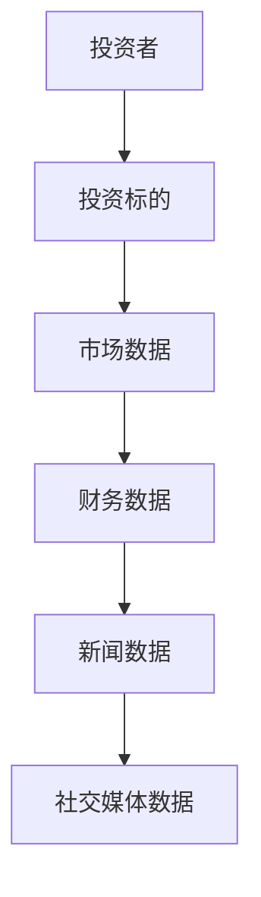

                 


# 大数据驱动的投资决策模型构建

> 关键词：大数据、投资决策模型、机器学习、算法原理、系统架构

> 摘要：随着大数据技术的飞速发展，金融投资领域正经历着一场深刻的变革。传统投资决策方式逐渐被数据驱动的智能决策所取代。本文将深入探讨大数据在投资决策中的应用，结合实际案例，详细分析投资决策模型的构建过程，涵盖数据预处理、特征工程、算法选择、模型训练与优化等方面，为读者提供一套完整的解决方案。

---

## 目录

### 第一部分: 大数据驱动的投资决策模型概述

#### 第1章: 大数据与投资决策的背景介绍

##### 1.1 大数据在金融投资中的应用现状

- 1.1.1 传统投资决策的局限性
  - 依赖主观判断，难以捕捉市场全貌
  - 数据来源单一，信息不全面
  - 计算能力有限，难以处理海量数据

- 1.1.2 大数据时代的投资机会
  - 数据量大、维度多，捕捉市场机会更精准
  - 利用非结构化数据，发现市场潜在信号
  - 高频交易与实时数据分析能力提升

- 1.1.3 投资决策中的大数据挑战
  - 数据质量参差不齐，清洗成本高
  - 数据隐私与合规性问题
  - 模型过拟合与稳定性风险

##### 1.2 投资决策模型的核心概念

- 1.2.1 投资决策模型的定义
  - 数据驱动的投资决策模型是通过分析历史数据、市场信息、财务指标等多维度数据，利用机器学习算法构建预测模型，辅助投资决策的过程。

- 1.2.2 大数据在投资决策中的作用
  - 数据量大：捕捉更多市场信息
  - 数据多样性：结合结构化与非结构化数据
  - 实时性：支持高频交易与实时监控

- 1.2.3 投资决策模型的分类与特点
  - 分类：
    - 基于传统统计的模型
    - 基于机器学习的模型
    - 基于深度学习的模型
  - 特点：
    - 数据驱动
    - 高维特征处理能力
    - 可解释性与不可解释性并存

##### 1.3 大数据驱动投资决策的必要性

- 1.3.1 数据量与数据源的多样性
  - 结构化数据：财务报表、市场行情
  - 非结构化数据：新闻、社交媒体、语音

- 1.3.2 数据分析技术的进步
  - 机器学习算法的快速发展
  - 大数据处理技术的成熟
  - 自然语言处理（NLP）与图像识别技术的应用

- 1.3.3 投资决策的精准化与智能化
  - 利用大数据预测市场趋势
  - 发现数据中的隐藏规律
  - 降低人为情绪干扰

##### 1.4 本章小结

---

### 第二部分: 投资决策模型的核心概念与联系

#### 第2章: 投资决策模型的核心概念与联系

##### 2.1 投资决策模型的基本原理

- 2.1.1 数据采集与处理
  - 数据来源：市场行情、公司财务、新闻媒体
  - 数据清洗：缺失值处理、异常值剔除
  - 数据预处理：标准化、归一化

- 2.1.2 数据分析与特征提取
  - 统计分析：均值、方差、相关性分析
  - 特征工程：特征选择、特征组合
  - 数据可视化：散点图、折线图、热力图

- 2.1.3 模型训练与优化
  - 训练数据集划分：训练集、验证集、测试集
  - 模型调参：学习率、迭代次数、正则化参数
  - 模型评估：准确率、召回率、F1值

##### 2.2 数据特征与模型性能的关系

- 2.2.1 数据特征的分类与对比
  - 表格对比：
    | 数据特征 | 优点 | 缺点 |
    |----------|------|------|
    | 结构化数据 | 易处理 | 信息量有限 |
    | 非结构化数据 | 信息丰富 | 预处理复杂 |

- 2.2.2 数据特征对模型性能的影响
  - 特征冗余：增加模型复杂度
  - 特征缺失：降低模型准确性
  - 特征相关性：影响模型稳定性

- 2.2.3 数据特征选择的策略
  - 过滤法：基于统计指标筛选特征
  - 包装法：通过模型性能评估特征重要性
  - 嵌入法：在模型训练过程中自动学习特征权重

##### 2.3 投资决策模型的ER实体关系图



##### 2.4 本章小结

---

### 第三部分: 投资决策模型的算法原理

#### 第3章: 投资决策模型的算法原理

##### 3.1 常见的机器学习算法及其应用

- 3.1.1 线性回归
  - 原理：通过最小化预测值与真实值的平方差之和，找到最佳拟合直线。
  - 应用：预测股票价格走势
  - 优缺点：简单易懂，但只能处理线性关系，不适合复杂场景

- 3.1.2 支持向量机（SVM）
  - 原理：通过寻找超平面，将数据点分为两类。
  - 应用：分类问题，如股票涨跌预测
  - 优缺点：适用于小数据集，但处理高维数据时性能下降

- 3.1.3 随机森林
  - 原理：通过构建多棵决策树，取其预测结果的平均值。
  - 应用：特征重要性分析，分类与回归
  - 优缺点：抗过拟合能力强，但计算复杂度高

- 3.1.4 神经网络
  - 原理：通过多层神经元网络，学习数据特征。
  - 应用：处理非线性问题，如时间序列预测
  - 优缺点：训练时间长，但模型表达能力强

##### 3.2 算法原理的数学模型

- 3.2.1 线性回归的数学公式
  $$ y = \beta_0 + \beta_1x + \epsilon $$
  
- 3.2.2 随机森林的决策树算法
  - 决策树结构：内部节点为特征分割，叶子节点为预测结果
  - 随机性：随机选择特征与样本

- 3.2.3 神经网络的激活函数
  $$ a = \sigma(wx + b) $$

##### 3.3 算法实现的Python代码示例

- 3.3.1 线性回归实现

```python
import numpy as np
from sklearn.linear_model import LinearRegression

# 示例数据
X = np.array([1, 2, 3, 4]).reshape(-1, 1)
y = np.array([2, 4, 5, 4])

# 模型训练
model = LinearRegression()
model.fit(X, y)

# 预测
print(model.predict(X))  # 输出预测值
```

---

通过以上内容，我们可以看到，大数据驱动的投资决策模型构建需要从数据预处理、特征工程、算法选择、模型训练与优化等多个方面进行详细分析。同时，还需要结合实际案例，验证模型的有效性，并不断优化模型性能。下一章将重点介绍系统分析与架构设计，帮助我们更好地理解如何将理论应用于实际投资决策中。

