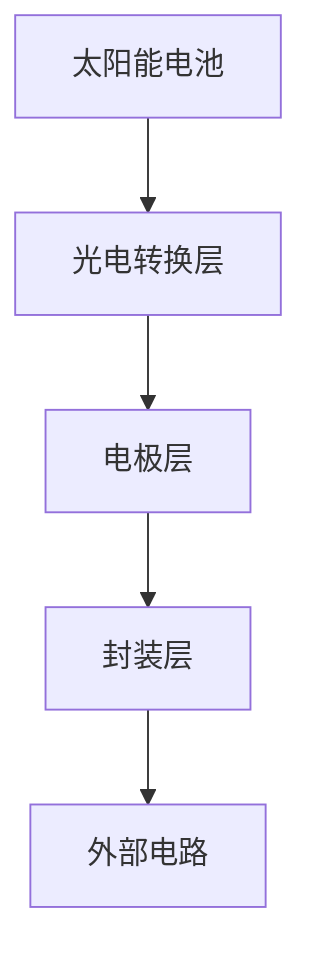
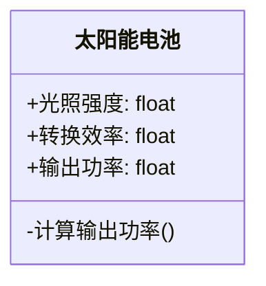
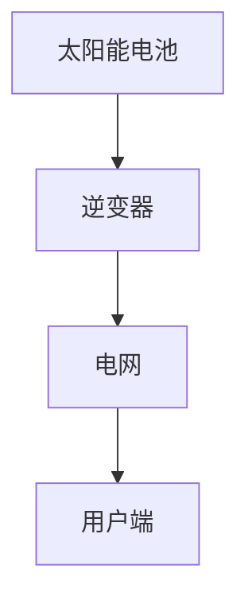
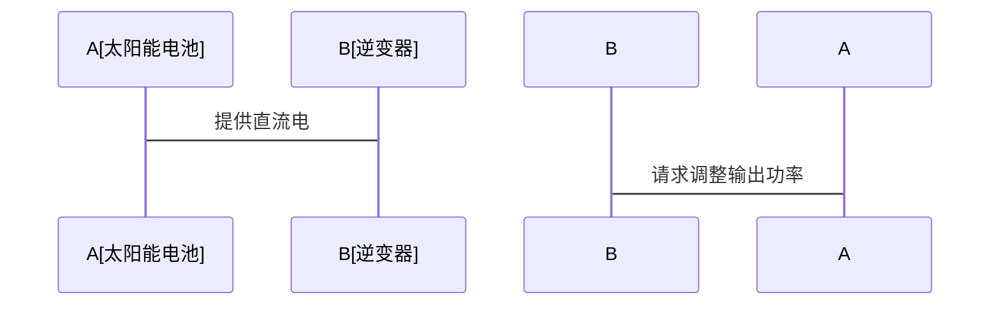

                 


# 太阳能技术进步带来的投资机会

## 关键词：
太阳能技术，技术进步，投资机会，技术分析，投资策略，市场趋势

## 摘要：
本文深入分析了太阳能技术的进步如何带来投资机会。通过探讨技术发展、市场需求、政策支持和商业模式创新，揭示了太阳能行业的投资潜力。文章从技术背景、核心概念、系统架构到实际案例，全面解析太阳能投资的机会与挑战，为投资者提供有价值的参考。

---

# 第一部分: 太阳能技术进步的背景与现状

## 第1章: 太阳能技术的定义与现状

### 1.1 太阳能技术的定义

#### 1.1.1 太阳能的基本概念
太阳能是指利用太阳辐射的能量进行发电或提供热能的技术。其核心是将光能转化为电能或热能，主要通过光伏效应实现电能转换。

#### 1.1.2 太阳能技术的核心要素
- **光伏效应**：基于半导体材料的光电转换原理。
- **材料科学**：单晶硅、多晶硅、薄膜电池等。
- **能量转换效率**：影响系统成本和收益的关键因素。

#### 1.1.3 太阳能技术的分类与特点
- **光伏发电系统**：利用光伏电池将阳光直接转化为电能。
- **光热发电系统**：将阳光转化为热能，再转化为电能。
- **特点**：清洁、可再生、分布广泛。

### 1.2 太阳能技术的发展历程

#### 1.2.1 太阳能技术的历史演变
从19世纪的初步研究到现代商业化应用，太阳能技术经历了实验室阶段、小规模应用到大规模部署的发展过程。

#### 1.2.2 太阳能技术的现状分析
- 全球装机容量持续增长。
- 技术成熟度高，成本显著下降。
- 市场竞争加剧，技术创新成为核心驱动力。

#### 1.2.3 太阳能技术的未来趋势
- 高效电池技术：提升转换效率。
- 储能技术：解决间歇性问题。
- 智能电网：优化能源分配。

## 第2章: 太阳能技术进步的驱动因素

### 2.1 技术创新的驱动

#### 2.1.1 材料科学的进步
新型材料如 PERC 电池材料的应用，显著提升了转换效率。

#### 2.1.2 设备效率的提升
高效电池技术和组件设计，如双面电池，提高了能源捕获能力。

#### 2.1.3 制造工艺的优化
自动化生产流程和无损切割技术降低了生产成本。

### 2.2 市场需求的推动

#### 2.2.1 全球能源结构的变化
减少化石能源依赖，推动可再生能源发展。

#### 2.2.2 可再生能源政策的支持
政府补贴、税收优惠等政策刺激了市场增长。

#### 2.2.3 环保意识的增强
全球气候变化问题促使各国加速向可再生能源转型。

### 2.3 经济因素的影响

#### 2.3.1 太阳能成本的下降
技术进步导致成本降低，提高了经济性。

#### 2.3.2 规模效应的显现
大规模生产降低了单位成本，提升了市场竞争力。

#### 2.3.3 投资回报的吸引力
稳定的政策支持和电价上涨预期增强了投资吸引力。

---

# 第二部分: 太阳能技术进步的核心概念与联系

## 第3章: 太阳能技术的核心原理

### 3.1 太阳能电池的工作原理

#### 3.1.1 光电转换的基本过程
- 光子撞击半导体材料，产生电子-空穴对。
- 在PN结的作用下，电子和空穴分别流向两侧，形成电流。

#### 3.1.2 光电转换效率的计算公式
$$ \text{效率} = \frac{\text{输出功率}}{\text{入射光功率}} \times 100\% $$

#### 3.1.3 光电转换效率的影响因素
- 光照强度：直接影响发电量。
- 组件材料：影响转换效率。
- 温度：高温会降低效率。

### 3.2 太阳能电池的材料特性

#### 3.2.1 单晶硅与多晶硅的区别
- 单晶硅：纯度高，效率高，成本较高。
- 多晶硅：效率略低，成本较低，适合大规模应用。

#### 3.2.2 其他新型材料的应用
- 氮化镓：宽禁带半导体，适合高温和高频应用。
- 薄膜电池：轻薄、柔性，适合特殊场景。

#### 3.2.3 材料性能对效率的影响
材料的导电性、吸收光谱直接影响电池效率。

### 3.3 太阳能电池的结构设计

#### 3.3.1 电池结构的基本组成
- PN结：核心光电转换结构。
- 表面涂层：提高光吸收率。
- 电极：收集电流。

#### 3.3.2 表面处理技术的作用
- 抗反射涂层：减少光损失。
- 扩散层：提高载流子收集效率。

#### 3.3.3 结构优化对效率的提升
- 双面电池：吸收两侧的阳光。
- 集中式结构：优化电流收集路径。

## 第4章: 太阳能技术的核心概念与联系

### 4.1 核心概念的原理分析

#### 4.1.1 太阳能电池的光电转换效率公式
$$ \eta = \frac{P_{\text{out}}}{P_{\text{in}}} \times 100\% $$

#### 4.1.2 光伏系统的能量转换流程
1. 太阳光射入电池。
2. 光电转换产生电流。
3. 电流通过电路输出。

#### 4.1.3 系统效率的综合评估
- 考虑系统各部分效率的乘积，包括逆变器效率、传输损耗等。

### 4.2 核心概念的属性对比

#### 4.2.1 不同类型太阳能电池的效率对比
| 电池类型 | 转换效率 |
|----------|----------|
| 单晶硅 | 15-22% |
| 多晶硅 | 12-18% |
| 薄膜电池 | 8-12% |

#### 4.2.2 不同材料的性能对比
| 材料 | 优点 | 缺点 |
|------|------|------|
| 单晶硅 | 高效率 | 高成本 |
| 多晶硅 | 低成本 | 较低效率 |
| 薄膜电池 | 轻薄灵活 | 低效率 |

#### 4.2.3 不同结构的优缺点对比
| 结构 | 优点 | 缺点 |
|------|------|------|
| 单面电池 | 简单易造 | 仅吸收单面光 |
| 双面电池 | 提高效率 | 制造复杂 |

### 4.3 实体关系图


---

# 第三部分: 太阳能技术进步的算法原理与系统架构

## 第5章: 太阳能技术进步的算法原理

### 5.1 光伏发电系统的能量平衡

#### 5.1.1 系统模型
$$ P_{\text{out}} = \eta \times P_{\text{in}} $$

#### 5.1.2 算法流程
1. 输入光照强度。
2. 计算光电转换效率。
3. 输出发电功率。

### 5.2 高效电池技术的数学模型

#### 5.2.1 转换效率模型
$$ \eta = \frac{A \times I}{1 + B \times I} $$
其中，$I$为光照强度，$A$和$B$为材料常数。

#### 5.2.2 优化算法
使用遗传算法优化电池结构参数，如厚度、掺杂浓度等。

## 第6章: 太阳能技术进步的系统架构

### 6.1 系统功能设计

#### 6.1.1 领域模型


#### 6.1.2 系统架构


### 6.2 系统接口设计

#### 6.2.1 逆变器接口
- 输入：直流电。
- 输出：交流电。

#### 6.2.2 电网接口
- 输入：交流电。
- 输出：用户负载。

### 6.3 系统交互设计

#### 6.3.1 逆变器与电池的交互


#### 6.3.2 电网与用户的交互


---

# 第四部分: 太阳能技术进步的投资机会与项目实战

## 第7章: 太阳能技术进步的投资机会分析

### 7.1 投资机会分析

#### 7.1.1 市场趋势
全球太阳能市场持续增长，预计未来几年年复合增长率超过8%。

#### 7.1.2 政策支持
各国政府纷纷出台政策支持可再生能源发展，提供补贴和优惠。

#### 7.1.3 商业模式创新
- BOT模式：建设-运营-转让。
- 合同能源管理：降低客户成本，分享收益。

### 7.2 投资策略

#### 7.2.1 技术驱动投资
- 投资高效电池技术。
- 投资新型储能技术。

#### 7.2.2 市场驱动投资
- 投资分布式光伏发电系统。
- 投资智能电网技术。

#### 7.2.3 风险管理
- 技术风险：技术落后导致竞争力下降。
- 市场风险：市场需求不足或政策变化。
- 政策风险：政策支持减弱或取消。

## 第8章: 太阳能技术进步的项目实战

### 8.1 环境安装

#### 8.1.1 系统配置
- 光伏组件：选用高效单晶硅电池。
- 逆变器：选择组串式逆变器。
- 储能系统：配置磷酸铁锂电池。

#### 8.1.2 代码实现
```python
def calculate_power(output_voltage, efficiency):
    return output_voltage * efficiency

# 示例
voltage = 220  # 交流电压
efficiency = 0.85  # 转换效率
power = calculate_power(voltage, efficiency)
print(f"输出功率为：{power}W")
```

### 8.2 核心实现

#### 8.2.1 逆变器控制
```python
def invert_control(vin, vout):
    if vin > 100:
        return vout * 0.95
    else:
        return vout * 0.8

# 示例
vin = 150  # 输入电压
vout = 220  # 输出电压
control = invert_control(vin, vout)
print(f"逆变器输出控制为：{control}V")
```

#### 8.2.2 系统监控
```python
import serial

ser = serial.Serial('COM1', 9600)
data = ser.readline().decode()
print(data)
```

### 8.3 案例分析

#### 8.3.1 某公司案例
- 投资额：1000万美元。
- 项目规模：50MW光伏发电站。
- 投资回报期：5年，年均收益超过20%。

#### 8.3.2 技术应用
- 使用高效单晶硅电池，转换效率达20%。
- 配套储能系统，解决电网调峰问题。

---

# 第五部分: 总结与展望

## 第9章: 总结

### 9.1 小结
- 技术进步推动太阳能成本下降，投资回报率提高。
- 市场需求和政策支持为投资者提供了广阔的机会。
- 技术创新和商业模式创新是未来发展的关键。

### 9.2 投资建议
- 关注高效电池和储能技术。
- 选择有技术优势和成本优势的企业。
- 注意政策变化和市场风险。

## 第10章: 展望

### 10.1 未来发展趋势
- 技术方面：高效电池、智能电网、储能技术将继续突破。
- 市场方面：分布式能源、能源互联网将成主流。
- 政策方面：全球碳中和目标将推动太阳能发展。

---

# 作者：AI天才研究院/AI Genius Institute & 禅与计算机程序设计艺术 /Zen And The Art of Computer Programming

