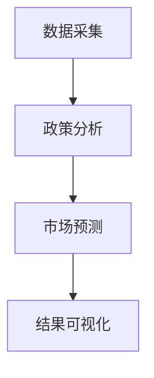
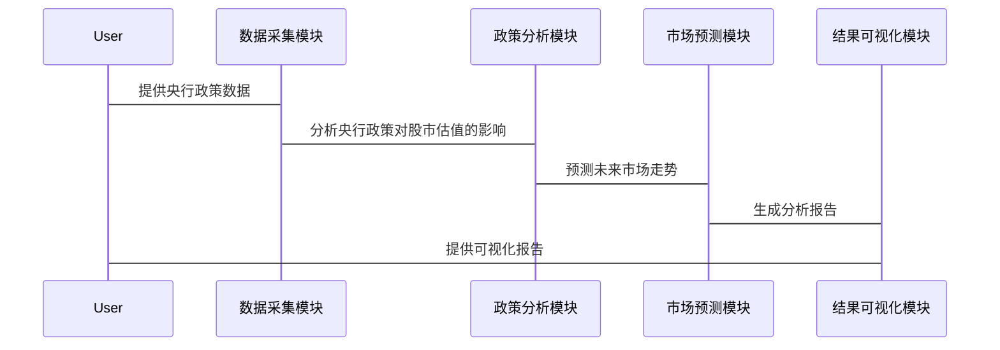

                 


# 央行政策对全球股市估值的影响

> 关键词：央行政策，全球股市估值，货币政策，利率政策，市场预期

> 摘要：本文探讨了央行政策对全球股市估值的影响，重点分析了利率政策、货币政策工具、市场预期等对股市估值的具体机制，并通过历史案例和跨国比较，揭示了不同市场环境下央行政策的差异化影响。本文还提供了系统分析与架构设计，帮助读者更好地理解央行政策与股市估值之间的复杂关系。

---

## 第一部分: 央行政策与全球股市估值的背景与概念

### 第1章: 央行政策与全球股市估值的概述

#### 1.1 央行政策的定义与作用

- **1.1.1 央行政策的定义**  
  央行政策是指中央银行为实现货币政策目标而采取的一系列政策措施，包括利率调整、货币供应量调控、外汇干预等。

- **1.1.2 央行政策的主要工具与目标**  
  - 主要工具：利率政策、量化宽松、公开市场操作、存款准备金率调整等。  
  - 主要目标：控制通货膨胀、促进就业、维护金融稳定、推动经济增长。

- **1.1.3 央行政策对经济的影响机制**  
  - 通过调整利率影响企业和个人的借贷成本，进而影响投资和消费行为。  
  - 通过调节货币供应量影响市场流动性，从而影响资产价格。

#### 1.2 全球股市估值的核心概念

- **1.2.1 股市估值的定义与指标**  
  股市估值是指对上市公司股票价格的合理评估，常用指标包括市盈率（P/E）、市净率（P/B）、股息率等。

- **1.2.2 全球股市的结构与特点**  
  - 全球股市由多个国家和地区的股市组成，具有高度的全球化特征。  
  - 不同市场的波动性和政策环境存在差异。

- **1.2.3 央行政策与股市估值的关系**  
  央行政策通过影响经济环境、企业盈利能力和市场流动性，进而影响股市估值。

#### 1.3 本章小结

本章通过定义和分析央行政策及其作用，介绍了全球股市估值的核心概念，并揭示了央行政策与股市估值之间的基本关系。

---

### 第2章: 央行政策对股市估值的影响机制

#### 2.1 利率政策对股市估值的影响

- **2.1.1 利率政策的定义与类型**  
  - 利率政策是央行政策的核心工具之一，包括存款利率、贷款利率和基准利率的调整。  
  - 利率政策可以分为宽松政策（降低利率）和紧缩政策（提高利率）。

- **2.1.2 利率与股市估值的关系**  
  - 低利率环境通常会降低借贷成本，刺激企业和个人投资，从而推高股市估值。  
  - 高利率环境则会增加借贷成本，抑制投资，可能导致股市估值下降。

- **2.1.3 利率政策对股市估值的具体影响路径**  
  1. 通过降低融资成本，增加企业盈利，提升股票吸引力。  
  2. 通过影响债券收益率，间接影响股市估值（债券收益率上升，股票相对吸引力下降）。  
  3. 通过改变投资者风险偏好，影响股市资金流动。

#### 2.2 货币政策工具对股市估值的影响

- **2.2.1 货币政策的主要工具**  
  - 公开市场操作：通过买卖政府债券调节市场流动性。  
  - 量化宽松：在经济低迷时，央行大量购买资产以增加市场流动性。  
  - 存款准备金率调整：影响商业银行的放贷能力。

- **2.2.2 货币政策工具对股市流动性的具体影响**  
  - 公开市场操作：直接影响市场流动性，进而影响股市估值。  
  - 量化宽松：通过增加市场流动性，推高股市估值。  
  - 存款准备金率调整：通过影响银行放贷能力，间接影响股市流动性。

- **2.2.3 货币政策工具对投资者行为的影响**  
  - 货币政策宽松时，投资者倾向于将资金投入风险较高的资产（如股票），推高股市估值。  
  - 货币政策紧缩时，投资者倾向于转移资金至低风险资产（如债券），导致股市估值下降。

#### 2.3 央行政策对市场预期的影响

- **2.3.1 市场预期的定义与作用**  
  市场预期是指市场参与者对未来经济和市场走势的心理预测，对资产价格具有重要影响。

- **2.3.2 央行政策对市场预期的塑造**  
  - 通过政策声明和经济数据发布，引导市场预期。  
  - 政策透明度越高，市场预期越稳定。

- **2.3.3 市场预期对股市估值的反馈效应**  
  - 正向预期增强投资者信心，推高股市估值。  
  - 负向预期导致投资者恐慌，降低股市估值。

#### 2.4 本章小结

本章分析了利率政策、货币政策工具和市场预期对股市估值的具体影响机制，揭示了央行政策如何通过多种途径影响股市估值。

---

## 第二部分: 央行政策对全球股市估值的历史案例分析

### 第3章: 央行政策对全球股市估值的历史案例分析

#### 3.1 2008年全球金融危机后的央行政策与股市估值

- **3.1.1 金融危机前的股市估值状况**  
  - 2007年，全球股市估值处于高位，尤其是美国股市。  
  - 次贷危机爆发前，市场对风险的定价过于乐观。

- **3.1.2 央行政策的实施与股市估值的变化**  
  - 美联储实施零利率政策（ZIRP）和量化宽松（QE）。  
  - 欧洲央行和日本央行也采取了类似的宽松政策。

- **3.1.3 历史案例的启示**  
  - 央行政策在危机期间能够有效稳定市场，但长期宽松政策可能导致资产泡沫。

#### 3.2 美联储加息周期对全球股市估值的影响

- **3.2.1 美联储加息周期的定义与特点**  
  - 加息周期是指央行在经济过热时提高利率以抑制通胀的政策周期。  
  - 加息周期通常伴随着经济增长放缓和市场流动性收紧。

- **3.2.2 加息周期对全球股市估值的具体影响**  
  - 利率上升增加了企业的融资成本，可能导致企业盈利下降。  
  - 投资者倾向于将资金转移至债券等固定收益资产，导致股市估值下降。

- **3.2.3 不同市场环境下的加息周期效应**  
  - 在经济复苏期，加息周期可能导致股市估值大幅波动。  
  - 在经济过热时，加息周期有助于抑制股市泡沫。

#### 3.3 欧洲央行量化宽松政策对股市估值的影响

- **3.3.1 欧洲央行量化宽松政策的实施背景**  
  - 2011年欧债危机后，欧洲央行通过量化宽松政策刺激经济。  
  - 量化宽松政策包括购买政府债券和私营部门资产。

- **3.3.2 量化宽松政策对欧洲股市估值的影响**  
  - 量化宽松增加了市场流动性，推高了欧洲股市估值。  
  - 部分国家（如德国）的股市表现优于其他国家。

- **3.3.3 量化宽松政策对全球股市估值的溢出效应**  
  - 欧洲央行的量化宽松政策通过汇率和贸易渠道影响全球股市。  
  - 美国和亚洲股市也受到溢出效应的影响。

#### 3.4 本章小结

本章通过分析2008年金融危机后的央行政策、美联储加息周期和欧洲央行量化宽松政策，揭示了不同历史背景下央行政策对全球股市估值的具体影响。

---

## 第三部分: 央行政策对全球股市估值的跨国比较分析

### 第4章: 央行政策对全球股市估值的跨国比较分析

#### 4.1 美国、欧洲与新兴市场央行的政策差异

- **4.1.1 美国央行的政策特点**  
  - 美联储的政策目标是最大化就业和稳定物价。  
  - 美联储政策具有较高的透明度和灵活性。

- **4.1.2 欧洲央行的政策特点**  
  - 欧洲央行的政策目标是保持价格稳定。  
  - 欧洲央行的政策更加注重长期通胀目标。

- **4.1.3 新兴市场央行的政策特点**  
  - 新兴市场央行的政策目标通常是保持经济增长和金融稳定。  
  - 新兴市场央行在政策操作上更具灵活性。

#### 4.2 不同市场环境下央行政策对股市估值的影响差异

- **4.2.1 经济周期对政策效果的影响**  
  - 在经济衰退期，宽松政策对股市估值的提振作用更明显。  
  - 在经济过热期，紧缩政策对股市估值的抑制作用更显著。

- **4.2.2 市场结构对政策效果的影响**  
  - 成熟市场对政策变化的反应较为理性。  
  - 新兴市场对政策变化的反应更为敏感。

- **4.2.3 政策协调与冲突对股市估值的影响**  
  - 全球性政策协调能够有效稳定市场预期。  
  - 政策冲突可能导致市场波动加剧。

#### 4.3 本章小结

本章通过比较分析美国、欧洲和新兴市场央行的政策差异，揭示了不同市场环境下央行政策对股市估值的差异化影响。

---

## 第四部分: 央行政策对全球股市估值的系统分析与架构设计

### 第5章: 央行政策对全球股市估值的系统分析与架构设计

#### 5.1 问题场景介绍

- **系统目标**：分析央行政策对全球股市估值的影响，建立一个可量化的分析框架。  
- **系统功能模块**：数据采集、政策分析、市场预测、结果可视化。  
- **系统输入**：央行政策数据、市场数据、经济指标。  
- **系统输出**：政策对股市估值的影响分析报告。

#### 5.2 系统功能设计

- **5.2.1 系统目标与功能模块**  
  - 数据采集模块：收集央行政策、市场数据和经济指标。  
  - 政策分析模块：分析央行政策对股市估值的具体影响机制。  
  - 市场预测模块：预测未来市场走势。  
  - 结果可视化模块：生成可视化报告。

- **5.2.2 系统架构设计（Mermaid图）**



- **5.2.3 系统交互设计（Mermaid序列图）**



#### 5.3 本章小结

本章通过系统分析与架构设计，提出了一个可量化的分析框架，帮助读者更好地理解央行政策与股市估值之间的复杂关系。

---

## 第五部分: 央行政策对全球股市估值的项目实战

### 第6章: 项目实战

#### 6.1 环境安装与数据准备

- **环境安装**：安装Python、Pandas、NumPy、Matplotlib等工具。  
- **数据准备**：收集央行政策数据、市场数据和经济指标。

#### 6.2 系统核心实现源代码

```python
import pandas as pd
import numpy as np
import matplotlib.pyplot as plt

# 数据准备
data = pd.read_csv('market_data.csv')
policy_data = pd.read_csv('policy_data.csv')

# 数据清洗
data = data.dropna()
policy_data = policy_data.dropna()

# 数据合并
merged_data = pd.merge(data, policy_data, on='date')

# 数据分析
merged_data['stock_price'] = merged_data['stock_price'].apply(lambda x: x * (1 + merged_data['interest_rate'].values))

# 数据可视化
plt.figure(figsize=(10,6))
plt.plot(merged_data['date'], merged_data['stock_price'], label='Stock Price')
plt.plot(merged_data['date'], merged_data['interest_rate'], label='Interest Rate')
plt.xlabel('Date')
plt.ylabel('Value')
plt.legend()
plt.show()
```

#### 6.3 代码应用解读与分析

- **代码功能**：上述代码展示了如何通过Python分析央行政策（如利率政策）对股市估值的影响。  
- **代码实现**：通过数据合并和数据清洗，将央行政策数据与市场数据结合，分析利率政策对股票价格的影响。

#### 6.4 实际案例分析

- **案例背景**：以2008年金融危机后的美联储量化宽松政策为例。  
- **案例分析**：量化宽松政策通过增加市场流动性，推高了股市估值。  
- **案例结论**：量化宽松政策在短期内有效稳定了市场，但长期可能导致资产泡沫。

#### 6.5 本章小结

本章通过项目实战，展示了如何通过编程和数据分析的方法，具体分析央行政策对股市估值的影响。

---

## 第六部分: 央行政策对全球股市估值的结论与展望

### 第7章: 结论与展望

#### 7.1 核心发现总结

- 央行政策通过利率政策、货币政策工具和市场预期等多种途径影响股市估值。  
- 不同市场环境下，央行政策对股市估值的影响存在差异。  
- 系统分析与实证研究是理解央行政策与股市估值关系的重要方法。

#### 7.2 未来研究方向

- 进一步研究央行政策与其他经济变量之间的复杂关系。  
- 探讨新兴市场央行政策的差异化影响。  
- 开发更复杂的模型，分析央行政策对股市估值的长期影响。

#### 7.3 最佳实践 tips

- 投资者应关注央行政策变化，合理配置资产。  
- 政策制定者应注重政策透明度和协调性，避免市场波动。

#### 7.4 本章小结

本章总结了全文的核心发现，并提出了未来研究方向和最佳实践建议。

---

## 作者：AI天才研究院/AI Genius Institute & 禅与计算机程序设计艺术 /Zen And The Art of Computer Programming

---

**关键词**：央行政策，全球股市估值，货币政策，利率政策，市场预期

