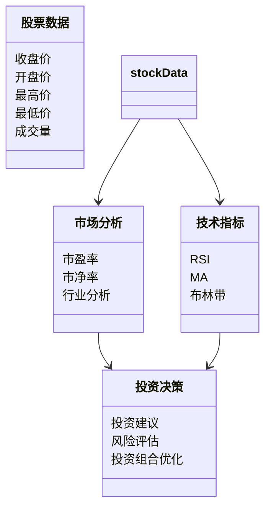
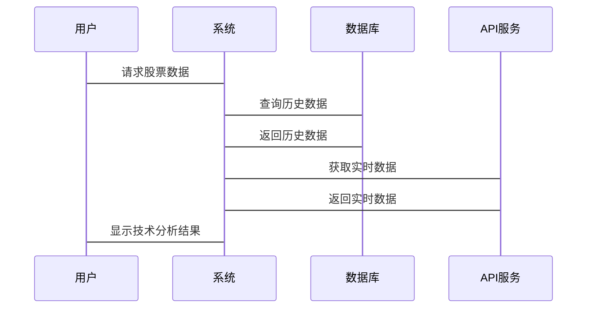

                 


# 如何利用特价股票投资应对全球经济数字化转型

> **关键词**：特价股票、全球经济数字化转型、投资策略、技术分析、风险管理  
> 
> **摘要**：随着全球经济加速数字化转型，企业价值和市场格局发生了根本性变化。特价股票作为一种投资工具，在数字化转型背景下展现出独特的优势。本文从数字化转型对企业的影响入手，结合技术分析方法，探讨如何利用特价股票投资应对全球经济变化，帮助投资者制定科学的投资策略，优化投资组合，实现稳健收益。

---

## 第一章：全球经济数字化转型的背景与影响

### 1.1 数字化转型的定义与核心概念

#### 1.1.1 数字化转型的定义
数字化转型是指企业利用数字技术（如人工智能、大数据、云计算等）重构商业模式、业务流程和客户体验的过程。它不仅仅是技术的升级，更是对传统业务模式的根本性变革。

#### 1.1.2 数字化转型的核心特征
- **数据驱动**：依赖数据进行决策，而非传统的经验或直觉。
- **技术创新**：广泛应用AI、区块链、物联网等技术。
- **客户-centric**：以客户为中心，提供个性化服务。
- **敏捷性**：快速响应市场变化，实现灵活调整。

#### 1.1.3 数字化转型对企业的影响
- **竞争优势**：通过技术创新提升效率和产品质量。
- **成本降低**：自动化流程减少人力和时间成本。
- **市场扩展**：数字化转型帮助企业进入新市场，拓展客户群体。

### 1.2 全球经济数字化转型的现状

#### 1.2.1 当前全球经济的数字化趋势
近年来，全球经济正经历一场深刻的数字化变革，尤其是疫情后，远程办公、在线教育、电子商务等数字化业务迅速崛起。

#### 1.2.2 数字化转型对传统产业的冲击
传统行业（如零售、制造）面临数字化转型的压力，部分企业因无法适应变化而被淘汰，但也有企业通过转型实现了增长。

#### 1.2.3 数字化转型带来的投资机会
数字化转型催生了许多新兴行业，如云计算、AI、区块链等，这些领域成为投资热点。

### 1.3 特价股票的概念与重要性

#### 1.3.1 特价股票的定义
特价股票是指价格远低于其内在价值的股票，通常因为市场波动、暂时性问题或被市场低估。

#### 1.3.2 特价股票的特点
- **价格低估**：市场价格低于内在价值。
- **高波动性**：价格波动较大，存在短期机会。
- **高风险**：投资风险较高，需谨慎选择。

#### 1.3.3 特价股票在投资中的作用
- **高回报潜力**：一旦价值回归，股价可能大幅上涨。
- **分散投资风险**：通过选择不同行业的特价股票，降低整体风险。
- **周期性投资机会**：在经济周期低谷时，特价股票往往表现良好。

---

## 第二章：特价股票的投资策略与分析

### 2.1 特价股票的筛选标准

#### 2.1.1 市盈率分析
市盈率（P/E）=股价/每股收益。P/E低于行业平均水平的股票可能被低估。

#### 2.1.2 市净率分析
市净率（P/B）=股价/每股净资产。P/B低于1的股票可能被低估。

#### 2.1.3 财务指标评估
重点关注企业的盈利能力（ROE）、成长性（收入增长率）和财务健康状况（资产负债率）。

### 2.2 特价股票的投资时机

#### 2.2.1 市场周期分析
- **熊市**：市场低迷时，许多股票被低估，是投资特价股票的好时机。
- **牛市**：市场过热时，应谨慎选择，避免追高。

#### 2.2.2 经济周期对投资的影响
- **经济衰退**：企业利润下降，但部分股票可能被错杀，提供投资机会。
- **经济复苏**：企业利润回升，股价可能反弹。

#### 2.2.3 特价股票的投资窗口选择
- **短期投资**：抓住市场波动带来的短期机会。
- **长期投资**：基于企业基本面，长期持有优质特价股票。

### 2.3 风险管理与投资组合优化

#### 2.3.1 风险评估方法
- **波动性分析**：评估股票价格波动风险。
- **行业风险**：选择抗跌性强的行业。
- **市场风险**：分散投资，避免过度集中。

#### 2.3.2 投资组合的构建
- **资产配置**：将资金分配到不同资产类别，降低风险。
- **分散投资**：选择不同行业的股票，避免单一风险。

#### 2.3.3 风险控制策略
- **止损机制**：设定止损点，避免亏损过大。
- **定期调整**：根据市场变化，及时调整投资组合。

---

## 第三章：数字化转型对股票市场的影响

### 3.1 数字化转型对企业价值的影响

#### 3.1.1 数字化转型的成本分析
- **初期投入高**：需要大量资金和技术支持。
- **长期成本降低**：自动化和智能化减少人力和运营成本。

#### 3.1.2 数字化转型对企业收入的提升
- **新业务模式**：数字化转型催生新的收入来源。
- **客户粘性**：通过个性化服务提升客户忠诚度。

#### 3.1.3 数字化转型对利润率的优化
- **效率提升**：通过数据分析优化运营流程。
- **成本控制**：减少浪费，提高资源利用率。

### 3.2 数字化转型对行业格局的影响

#### 3.2.1 行业整合与并购
- **优胜劣汰**：数字化能力强的企业收购弱企业。
- **生态构建**：企业间形成战略合作，构建数字化生态。

#### 3.2.2 新兴行业的发展机会
- **科技初创企业**：AI、大数据等领域有巨大发展潜力。
- **数字化服务提供商**：为企业提供数字化转型解决方案。

#### 3.2.3 传统行业面临的挑战
- **竞争力下降**：传统企业因技术落后而失去市场份额。
- **转型压力**：需要投入大量资源进行数字化改造。

### 3.3 数字化转型对股票估值的影响

#### 3.3.1 估值模型的调整
- **市盈率重估**：数字化能力强的企业市盈率可能上升。
- **市净率调整**：技术创新型企业市净率可能被重新评估。

#### 3.3.2 市场预期的变化对股价的影响
- **正面预期**：市场预期数字化转型将带来收益，股价上涨。
- **负面预期**：市场对数字化转型效果持怀疑态度，股价下跌。

#### 3.3.3 数字化转型带来的投资机会
- **科技股投资**：投资于AI、大数据等领域的科技股。
- **传统产业升级股**：投资于正在进行数字化转型的传统企业。

---

## 第四章：技术分析与投资决策

### 4.1 技术分析在特价股票投资中的应用

#### 4.1.1 技术分析的基本原理
技术分析基于价格和成交量数据，预测未来价格走势，认为市场行为包含所有信息。

#### 4.1.2 技术分析的核心假设
- **市场行为反映信息**：价格已经反映了所有相关信息。
- **价格趋势可预测**：历史价格走势可以预测未来趋势。
- **历史模式重复**：市场行为具有周期性，历史模式会重复出现。

#### 4.1.3 技术分析与基本面分析的区别
- **技术分析**：基于价格和成交量数据。
- **基本面分析**：基于企业财务数据和行业分析。

### 4.2 常用的技术分析指标

#### 4.2.1 移动平均线（MA）
- **定义**：一定时期内的平均价格。
- **应用**：用于判断价格趋势和支撑/阻力位。
- **示例**：50日MA和200日MA常用于判断中期和长期趋势。

#### 4.2.2 相对强弱指数（RSI）
- **定义**：衡量价格变动的超买或超卖状态。
- **应用**：RSI高于70表示超买，低于30表示超卖。
- **示例**：RSI可以用来识别短期反转点。

#### 4.2.3 布林带（Bollinger Bands）
- **定义**：价格波动的范围，由标准差计算得出。
- **应用**：判断价格是否在超买或超卖区域。
- **示例**：布林带宽度变大表示价格波动加剧。

### 4.3 技术分析的数学模型

#### 4.3.1 移动平均线公式
$$ MA_n = \frac{1}{n} \sum_{i=1}^{n} P_i $$
其中，$P_i$为第i天的价格，$n$为天数。

#### 4.3.2 RSI公式
$$ RSI = \frac{100}{1 + \frac{D}{S}} $$
其中，$D$为下跌幅度，$S$为上升幅度。

#### 4.3.3 布林带公式
$$ BB = \mu \pm z \times \sigma $$
其中，$\mu$为平均值，$\sigma$为标准差，$z$为标准差倍数（通常为2）。

### 4.4 技术分析的应用案例

#### 4.4.1 案例：某科技股的技术分析
- **价格走势**：股票价格近期从高位下跌，进入超卖区域。
- **技术指标**：RSI低于30，布林带下轨，可能触底反弹。
- **投资决策**：买入该股票，预期短期内反弹。

---

## 第五章：系统分析与架构设计方案

### 5.1 项目介绍
本项目旨在构建一个基于数字化转型的股票投资分析系统，帮助投资者利用技术分析和基本面分析，制定科学的投资策略。

### 5.2 系统功能设计

#### 5.2.1 领域模型（Mermaid类图）


#### 5.2.2 系统架构设计（Mermaid架构图）
```mermaid
idp
    define frontend
    define backend
    define database
    define api

    frontend --> backend: 用户请求
    backend --> database: 数据查询
    backend --> api: 调用外部API
    database --> backend: 返回数据
    backend --> frontend: 返回响应
```

### 5.3 系统接口设计

#### 5.3.1 用户界面
- **输入**：用户输入股票代码和时间范围。
- **输出**：显示技术指标图表和投资建议。

#### 5.3.2 数据接口
- **输入**：API调用获取实时股票数据。
- **输出**：返回JSON格式的数据，供系统处理。

### 5.4 系统交互（Mermaid序列图）


---

## 第六章：项目实战

### 6.1 环境安装
- **编程语言**：Python 3.8+
- **库的安装**：pandas、numpy、matplotlib、requests
  ```bash
  pip install pandas numpy matplotlib requests
  ```

### 6.2 核心实现源代码

#### 6.2.1 数据获取模块
```python
import requests

def get_stock_data(ticker, start_date, end_date):
    url = f"https://api.example.com/stock/{ticker}"
    params = {
        "start": start_date,
        "end": end_date
    }
    response = requests.get(url, params=params)
    return response.json()
```

#### 6.2.2 技术分析模块
```python
import pandas as pd
import numpy as np

def calculate_rsi(data, period=14):
    close = data['收盘价']
    delta = close.diff()
    up = delta.where(delta > 0, 0)
    down = delta.where(delta < 0, 0)
    rs = up.rolling(period).sum() / down.rolling(period).sum()
    rsi = 100 - 100 * (1 - rs)
    return rsi
```

#### 6.2.3 可视化模块
```python
import matplotlib.pyplot as plt

def plot_rsi(rsi, ax=None):
    if ax is None:
        plt.figure(figsize=(10, 6))
        ax = plt.gca()
    ax.plot(rsi.index, rsi.values, label='RSI')
    ax.axhline(y=30, color='r', linestyle='--', label='超卖')
    ax.axhline(y=70, color='b', linestyle='--', label='超买')
    ax.legend()
    plt.show()
```

### 6.3 实际案例分析

#### 6.3.1 案例背景
假设我们要分析某科技股的RSI指标，判断是否进入超卖区域。

#### 6.3.2 数据处理
```python
data = get_stock_data('AAPL', '2023-01-01', '2023-12-31')
df = pd.DataFrame(data)
rsi = calculate_rsi(df)
```

#### 6.3.3 图表展示
```python
plot_rsi(rsi)
```

### 6.4 代码应用解读与分析
通过上述代码，我们可以实时获取股票数据，计算RSI指标，并通过图表直观判断投资机会。RSI低于30时，可能是买入信号；RSI高于70时，可能是卖出信号。

---

## 第七章：总结与最佳实践

### 7.1 总结
全球经济数字化转型为投资带来了新的机遇和挑战。通过技术分析和基本面分析，投资者可以更好地识别特价股票的投资机会，制定科学的投资策略。

### 7.2 最佳实践 tips

#### 7.2.1 投资心态
- **理性投资**：避免情绪化决策。
- **长期视角**：关注企业长期价值，而非短期波动。

#### 7.2.2 风险管理
- **分散投资**：避免过度集中。
- **止损机制**：设定止损点，控制亏损。

#### 7.2.3 持续学习
- **关注市场动态**：及时了解行业趋势和政策变化。
- **更新知识库**：学习新技术和新投资策略。

### 7.3 小结
数字化转型正在重塑全球经济格局，投资者需要与时俱进，灵活调整投资策略。通过技术分析和基本面分析，合理配置资产，分散风险，才能在市场中立于不败之地。

### 7.4 拓展阅读
- **书籍推荐**：《股票作手回忆录》、《投资学原理》
- **工具推荐**：TradingView、Yahoo Finance、Python金融分析库

---

## 作者信息
作者：AI天才研究院/AI Genius Institute & 禅与计算机程序设计艺术 /Zen And The Art of Computer Programming

