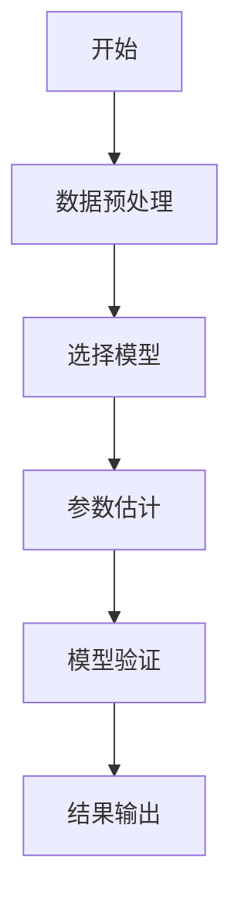
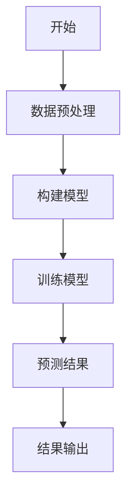
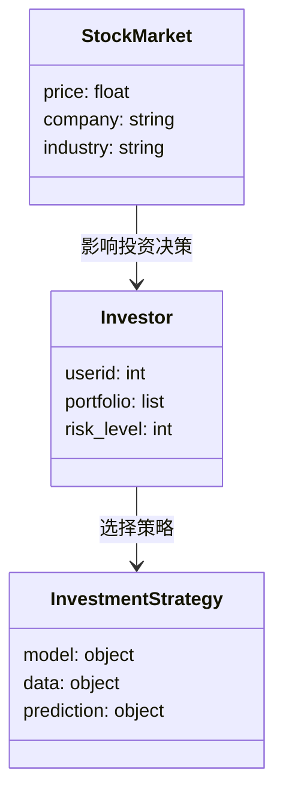
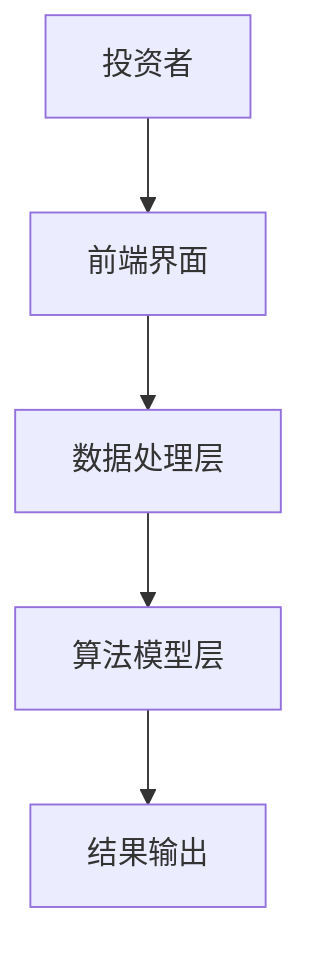
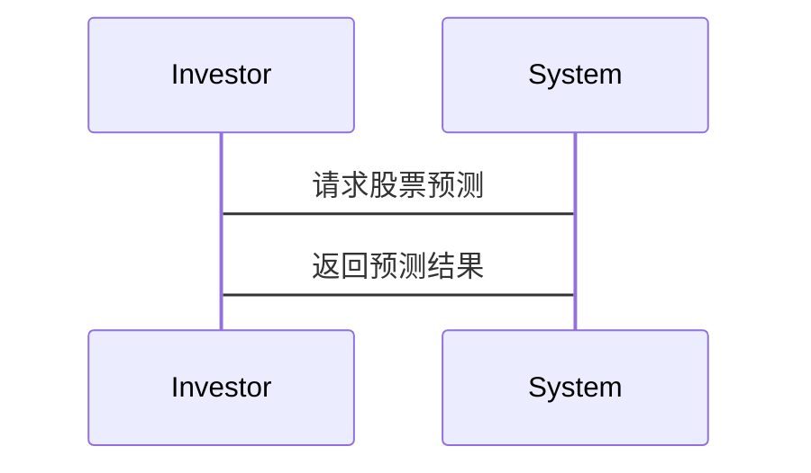

                 


# 如何利用特价股票投资应对全球经济数字化重构

## 关键词：特价股票、经济数字化重构、投资策略、算法、风险管理

## 摘要：
在全球经济数字化重构的背景下，特价股票投资成为应对市场波动和抓住机遇的重要策略。本文将详细探讨如何通过分析经济数字化重构的趋势，利用特价股票进行投资，结合算法分析和风险管理，为投资者提供系统化的投资策略。

---

## 第1章：背景介绍

### 1.1 问题背景
#### 1.1.1 经济全球化与数字化重构的背景
- 经济全球化加速，数字化技术广泛应用，推动全球经济结构发生变化。
- 数字化重构带来市场波动，投资者需适应新的经济环境。

#### 1.1.2 特价股票的定义与特点
- 特价股票：价格低于其实际价值的股票，通常具有较高的增长潜力。
- 特点：低估值、高成长性、风险与收益并存。

#### 1.1.3 问题解决：如何利用特价股票应对经济重构
- 通过分析经济趋势，选择具有长期增长潜力的特价股票，分散投资风险。

### 1.2 问题描述
#### 1.2.1 经济数字化重构的核心问题
- 市场波动加剧，传统投资策略面临挑战。
- 数字化工具的应用改变了投资方式。

#### 1.2.2 特价股票投资的挑战与机遇
- 挑战：市场波动大，信息不对称。
- 机遇：低价股票具有较高的增值空间。

#### 1.2.3 投资者面临的决策困境
- 如何识别具有长期增长潜力的特价股票。
- 如何在市场波动中保持投资策略的稳定性。

### 1.3 问题解决
#### 1.3.1 特价股票投资的策略选择
- 价值投资：寻找被低估的股票。
- 成长投资：投资于高成长性企业。

#### 1.3.2 数字化工具在投资中的应用
- 数据分析工具：利用大数据进行市场预测。
- 人工智能算法：辅助投资决策。

#### 1.3.3 风险管理与投资组合优化
- 分散投资：降低单一股票风险。
- 风险控制：设定止损点，避免重大损失。

### 1.4 边界与外延
#### 1.4.1 投资范围的界定
- 限定行业：如科技、医疗等高增长行业。
- 投资地域：关注新兴市场。

#### 1.4.2 数字化重构的边界条件
- 技术进步：人工智能、大数据对经济的影响。
- 政策变化：政府政策对市场的调节作用。

#### 1.4.3 特价股票投资的外延领域
- 私募基金：利用专业管理进行投资。
- 投资教育：提升投资者的市场分析能力。

### 1.5 核心概念与组成
#### 1.5.1 经济数字化重构的核心要素
- 数字化技术：如人工智能、大数据。
- 市场波动：经济重构带来的不确定性。

#### 1.5.2 特价股票投资的关键因素
- 企业基本面：市盈率、市净率等。
- 市场趋势：宏观经济指标、行业前景。

#### 1.5.3 投资策略与工具的组合关系
- 策略：价值投资、成长投资。
- 工具：数据分析、风险管理模型。

---

## 第2章：核心概念与联系

### 2.1 特价股票与经济重构的关系
#### 2.1.1 特价股票的市场定位
- 通常出现在市场低迷时期，具有较高的投资潜力。
- 价格低于内在价值，吸引长期投资者。

#### 2.1.2 数字化重构对股票市场的影响
- 市场波动加剧，投资机会增加。
- 数字化工具提高市场分析效率。

#### 2.1.3 特价股票在经济重构中的作用
- 作为投资工具，帮助投资者在市场低谷时期布局。
- 通过价值发现，推动市场复苏。

### 2.2 核心概念原理
#### 2.2.1 经济数字化重构的驱动力
- 技术进步：人工智能、区块链等技术推动经济变革。
- 市场需求：消费者行为的变化推动企业转型。

#### 2.2.2 特价股票投资的逻辑
- 价值投资：寻找被低估的企业。
- 风险控制：分散投资，降低风险。

### 2.3 概念属性对比
| 概念 | 属性 |
|------|------|
| 经济数字化重构 | 技术驱动、市场波动、企业转型 |
| 特价股票投资 | 低估值、高潜力、风险可控 |

### 2.4 ER实体关系图
```mermaid
erd
  table EconomicDigitalReconstruction {
    ID
    Factor
    Impact
  }
  table PennyStockInvestment {
    StockID
    Price
    RiskLevel
  }
  table Investor {
    UserID
    InvestmentStrategy
    RiskTolerance
  }
  EconomicDigitalReconstruction --> PennyStockInvestment : 影响
  PennyStockInvestment --> Investor : 影响投资策略
```

---

## 第3章：算法原理

### 3.1 时间序列分析
#### 3.1.1 ARIMA模型
- 模型简介：自回归积分滑动平均模型。
- 公式：$ARIMA(p, d, q)$，其中$p$为自回归阶数，$d$为差分阶数，$q$为滑动平均阶数。
- 应用：用于预测股票价格的短期趋势。

#### 3.1.2 算法流程


#### 3.1.3 代码实现
```python
import pandas as pd
from statsmodels.tsa.arima_model import ARIMA

data = pd.read_csv('stock_price.csv')
model = ARIMA(data['price'], order=(1, 1, 1))
model_fit = model.fit()
forecast = model_fit.forecast(steps=5)
print(forecast)
```

### 3.2 机器学习模型
#### 3.2.1 LSTM网络
- 模型简介：长短期记忆网络，适合处理时间序列数据。
- 结构：输入层、LSTM层、全连接层、输出层。
- 公式：$f(t) = \sigma(g(t))$，其中$\sigma$为激活函数。

#### 3.2.2 算法流程


#### 3.2.3 代码实现
```python
import numpy as np
from tensorflow.keras.layers import LSTM, Dense
from tensorflow.keras.models import Sequential

model = Sequential()
model.add(LSTM(64, input_shape=(1, 1)))
model.add(Dense(1))
model.compile(optimizer='adam', loss='mean_squared_error')
model.fit(X_train, y_train, epochs=10, batch_size=32)
predictions = model.predict(X_test)
```

---

## 第4章：系统分析与架构设计

### 4.1 问题场景介绍
- 投资者需要一个系统化的工具，帮助他们分析市场趋势，选择合适的特价股票进行投资。

### 4.2 系统功能设计
#### 4.2.1 领域模型


### 4.3 系统架构设计


### 4.4 接口设计
- API接口：RESTful API，用于数据获取和模型调用。
- 接口示例：`GET /api/predict/stock?symbol=MSFT`

### 4.5 交互流程


---

## 第5章：项目实战

### 5.1 环境安装
- 安装Python和必要的库：numpy、pandas、tensorflow、statsmodels。

### 5.2 核心代码实现
#### 5.2.1 数据获取与预处理
```python
import pandas as pd
data = pd.read_csv('stock.csv')
data['price'] = data['price'].apply(lambda x: x/1000)
```

#### 5.2.2 模型训练与预测
```python
from tensorflow.keras.models import Sequential
from tensorflow.keras.layers import LSTM, Dense

model = Sequential()
model.add(LSTM(64, input_shape=(1, 1)))
model.add(Dense(1))
model.compile(optimizer='adam', loss='mean_squared_error')
model.fit(X_train, y_train, epochs=10, batch_size=32)
```

### 5.3 案例分析
- 案例：假设某科技公司股票价格被低估，预测其未来价格增长，投资者选择在低价时买入，高价时卖出。

### 5.4 项目小结
- 成功的关键在于准确的模型选择和有效的风险管理。
- 需要注意市场波动和政策变化，及时调整投资策略。

---

## 第6章：风险管理与心理因素

### 6.1 风险管理
#### 6.1.1 风险控制工具
- 止损订单：设定最大损失容忍度。
- 投资组合分散化：避免过度集中。

#### 6.1.2 风险管理策略
- 定期评估投资组合，调整持仓。
- 关注市场动态，及时应对风险。

### 6.2 投资者心理因素
#### 6.2.1 情绪化决策的负面影响
- 过度乐观导致高位买入，过度悲观导致低位卖出。

#### 6.2.2 理性决策的重要性
- 坚持长期投资，避免短期波动干扰。

---

## 第7章：未来展望与持续优化

### 7.1 全球经济数字化重构的趋势
- 技术进步将继续推动经济变革，投资者需关注新兴行业。
- 人工智能和大数据在投资中的应用将更加广泛。

### 7.2 投资策略的演变
- 从传统价值投资向量化投资转型。
- 结合技术分析和基本面分析，优化投资决策。

### 7.3 持续优化
- 定期回顾投资结果，总结经验教训。
- 持续学习新技术，优化投资策略。

---

## 最佳实践 Tips

1. **风险管理**：始终将风险管理放在首位，避免重大损失。
2. **持续学习**：关注市场动态和技术进步，优化投资策略。
3. **分散投资**：避免过度集中，降低风险。

---

## 总结

全球经济数字化重构为投资者提供了新的机遇，但也带来了更大的挑战。通过利用特价股票投资，结合算法分析和风险管理，投资者可以在波动的市场中找到稳定的收益。未来，随着技术的进步，投资策略将更加多样化和智能化，投资者需要不断学习和适应，才能在竞争中立于不败之地。

---

## 作者：AI天才研究院  
邮箱：contact@aitalentinstitute.com  
网址：https://aitalentinstitute.com

