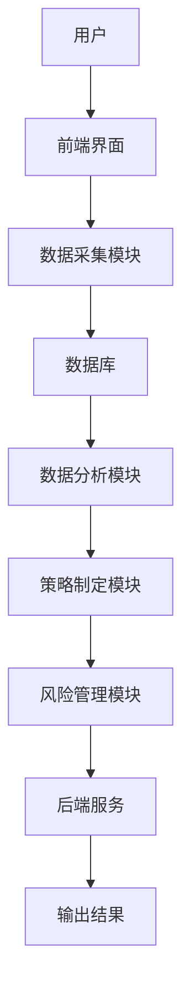

                 


# 如何利用特价股票投资应对经济衰退风险

## 关键词：特价股票、经济衰退、投资风险管理、系统架构设计、投资策略

## 摘要：本文详细探讨了如何利用特价股票进行投资，以应对经济衰退带来的风险。文章首先介绍了经济衰退的背景和投资风险管理的重要性，接着分析了特价股票的基本概念与分类，提出了经济衰退中的投资策略。然后从系统架构设计的角度，构建了一个投资决策系统，最后通过项目实战部分，详细指导如何进行环境安装、数据获取与处理、策略实现及回测分析。通过本文的学习，读者将能够掌握利用特价股票进行投资的基本方法，并在实际操作中应用这些策略来应对经济衰退的风险。

---

## 第1章：经济衰退的背景与投资风险管理

### 1.1 经济衰退的定义与特征

经济衰退是指经济活动的显著下降，通常表现为国内生产总值（GDP）的持续减少、失业率上升、企业利润下降以及消费者信心的降低。经济衰退的主要特征包括：

1. **GDP下降**：连续两个季度或更长时间的经济收缩。
2. **失业率上升**：企业裁员或倒闭，导致失业率上升。
3. **消费下降**：消费者信心不足，导致消费支出减少。
4. **企业利润下降**：企业盈利能力下降，影响股市表现。

### 1.2 投资风险管理的重要性

投资风险管理是指通过识别、评估和应对投资风险，以降低投资损失的过程。在经济衰退期间，投资风险管理尤为重要，因为市场波动性增加，投资风险也随之上升。

#### 1.2.1 投资风险管理的核心原则

1. **分散投资**：将资金分配到不同资产类别、行业和地域，以降低风险。
2. **止损机制**：设定止损点，避免重大损失。
3. **长期视角**：关注长期投资目标，避免短期波动的干扰。

---

## 第2章：特价股票的基本概念与分类

### 2.1 特价股票的定义与特点

特价股票是指价格低于其内在价值，或者价格相对市场平均水平大幅折价的股票。其特点包括：

1. **价格低估**：市场可能未充分反映其真实价值。
2. **高波动性**：价格波动较大，可能带来短期机会。
3. **低流动性**：交易量可能较低，影响价格发现。

### 2.2 特价股票的分类与应用场景

特价股票可以根据不同的标准进行分类，如行业、公司规模、地理位置等。在经济衰退期间，投资者可以关注以下类型的特价股票：

1. **周期性股票**：在经济复苏时表现较好的行业，如制造业、建筑业等。
2. **防御性股票**：在经济衰退期间表现相对稳定的行业，如公用事业、医疗保健等。

---

## 第3章：特价股票的投资策略与实施

### 3.1 特价股票投资的基本策略

#### 3.1.1 价值投资策略

价值投资策略强调购买价格低于内在价值的股票。投资者需要进行基本面分析，评估公司的财务状况、盈利能力、行业地位等因素。

#### 3.1.2 技术分析策略

技术分析通过研究股票价格的历史走势，预测未来的价格变动。常用的技术指标包括移动平均线、相对强弱指数（RSI）和MACD等。

#### 3.1.3 股票筛选与评估标准

投资者可以通过以下标准筛选特价股票：

1. **低市盈率（P/E）**：市盈率低于行业平均水平。
2. **低市净率（P/B）**：市净率低于行业平均水平。
3. **高股息率**：公司派发的股息相对于股票价格较高。

### 3.2 经济衰退中的特价股票投资策略

#### 3.2.1 经济衰退初期的投资策略

经济衰退初期，市场情绪较差，但一些优质股票可能被市场低估。投资者可以关注那些财务状况稳健、行业前景较好的公司。

#### 3.2.2 经济衰退中期的投资策略

经济衰退中期，市场可能继续下跌，但一些股票可能已经接近底部。投资者可以逐步建仓，或者增加对防御性股票的配置。

#### 3.2.3 经济衰退后期的投资策略

经济衰退后期，市场可能逐渐复苏，投资者可以关注那些在衰退期间表现较好的股票，或者行业复苏预期较高的股票。

---

## 第4章：系统分析与架构设计

### 4.1 投资决策系统的功能设计

#### 4.1.1 系统功能模块划分

1. **数据采集模块**：获取股票价格、财务数据等。
2. **数据分析模块**：对数据进行清洗、分析和建模。
3. **策略制定模块**：根据分析结果制定投资策略。
4. **风险管理模块**：监控风险，执行止损等操作。

#### 4.1.2 数据采集与处理模块

- 数据来源：股票市场数据API、数据库等。
- 数据清洗：处理缺失值、异常值等。
- 数据存储：将清洗后的数据存储到数据库中。

### 4.2 系统架构设计

#### 4.2.1 系统架构图



---

## 第5章：项目实战

### 5.1 环境安装与数据获取

#### 5.1.1 环境安装

1. 安装Python：`python --version`
2. 安装Pandas：`pip install pandas`
3. 安装Matplotlib：`pip install matplotlib`

#### 5.1.2 数据获取

使用Yahoo Finance API获取股票数据：

```python
import pandas_datareader as pdr

data = pdr.get_data_yahoo('AAPL', start='2020-01-01', end='2023-12-31')
```

---

### 5.2 策略实现与回测分析

#### 5.2.1 策略实现

编写一个简单的价值投资策略：

```python
import pandas as pd

# 筛选低市盈率股票
data['P/E'] = data['Price'] / data['Earnings Per Share']
low_pe_stocks = data[data['P/E'] < data['P/E'].mean()]

# 输出结果
print(low_pe_stocks.head())
```

#### 5.2.2 回测分析

使用回测框架（如Backtrader）进行策略回测：

```python
import backtrader as bt

class MyStrategy(bt.Strategy):
    def __init__(self):
        self.data = self.datas[0]
        self.order = None

    def next(self):
        if self.order:
            return
        if self.data.close < self.data.close.mean():
            self.order = self.buy()

data = bt.feeds.PandasData(dataname=data)
cerebro = bt.Cerebro()
cerebro.addstrategy(MyStrategy)
cerebro.run()
```

---

## 第6章：结论与展望

### 6.1 结论

通过本文的分析，我们可以得出以下结论：

1. 特价股票在经济衰退期间具有较高的投资价值。
2. 组合投资和风险管理是降低投资风险的重要手段。
3. 投资决策系统的构建能够提高投资决策的科学性和效率。

### 6.2 展望

未来的研究可以进一步探讨以下方向：

1. 更复杂的算法模型，如机器学习在股票预测中的应用。
2. 多因子模型在股票筛选中的应用。
3. 更加精细的风险管理策略，如动态止损机制。

---

## 附录

### 附录A：术语表

- **P/E**：市盈率
- **P/B**：市净率
- **RSI**：相对强弱指数

### 附录B：参考文献

- 禅与计算机程序设计艺术
- 经济学原理

---

## 作者：AI天才研究院 & 禅与计算机程序设计艺术

