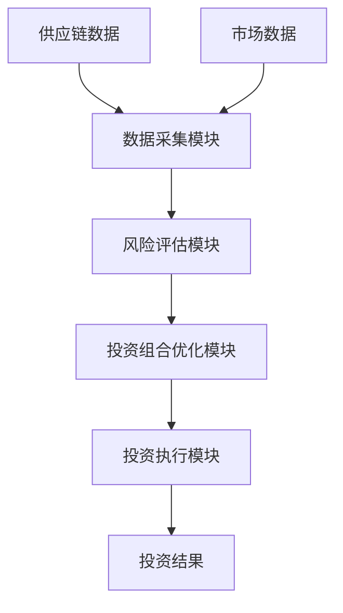

                 


# 如何利用特价股票策略应对全球数字化供应链碎片化风险

> 关键词：供应链管理，供应链风险，特价股票，投资策略，数字化供应链

> 摘要：随着全球供应链的日益复杂化和碎片化，企业面临着更高的风险。本文探讨了如何利用特价股票策略来应对这些风险。通过分析供应链与金融市场的关系，本文提出了量化供应链风险并设计投资组合优化模型的方法。结合系统架构设计和实际案例分析，本文详细展示了如何将特价股票策略应用于供应链风险管理，提供了系统的解决方案和最佳实践。

---

## 目录

1. [数字化供应链与供应链风险](#数字化供应链与供应链风险)
   1.1 [数字化供应链的定义与特点](#数字化供应链的定义与特点)
   1.2 [供应链碎片化的现状与风险](#供应链碎片化的现状与风险)

2. [特价股票策略](#特价股票策略)
   2.1 [特价股票的定义与分类](#特价股票的定义与分类)
   2.2 [特价股票策略的优势与劣势](#特价股票策略的优势与劣势)

3. [供应链风险与股票投资的关系](#供应链风险与股票投资的关系)
   3.1 [供应链风险的量化](#供应链风险的量化)
   3.2 [供应链与金融市场的关联](#供应链与金融市场的关联)

4. [特价股票策略在供应链风险管理中的应用](#特价股票策略在供应链风险管理中的应用)
   4.1 [风险评估模型](#风险评估模型)
   4.2 [投资组合优化模型](#投资组合优化模型)

5. [系统架构设计](#系统架构设计)
   5.1 [系统功能设计](#系统功能设计)
   5.2 [系统架构图](#系统架构图)

6. [项目实战](#项目实战)
   6.1 [项目背景与目标](#项目背景与目标)
   6.2 [环境安装与数据准备](#环境安装与数据准备)
   6.3 [核心算法实现](#核心算法实现)
   6.4 [结果分析与优化](#结果分析与优化)

7. [最佳实践与总结](#最佳实践与总结)
   7.1 [策略的优势与劣势](#策略的优势与劣势)
   7.2 [注意事项与风险提示](#注意事项与风险提示)
   7.3 [未来发展方向](#未来发展方向)

---

## 1. 数字化供应链与供应链风险

### 1.1 数字化供应链的定义与特点

数字化供应链是指利用信息技术和数据分析来优化供应链管理的过程。它通过整合供应商、制造商、分销商和客户的数据，实现供应链的智能化和高效化。数字化供应链的特点包括：

- **数据驱动**：依赖于实时数据进行决策。
- **自动化**：从订单处理到物流监控，许多环节实现了自动化。
- **透明化**：各环节信息透明，便于追踪和管理。
- **弹性**：能够快速适应市场变化和需求波动。

### 1.2 供应链碎片化的现状与风险

供应链碎片化指的是全球供应链因分工细化和地域分散而产生的复杂性。这种碎片化带来了以下风险：

- **库存风险**：因供应商分散导致库存管理复杂，易出现短缺或过剩。
- **物流风险**：跨国运输可能导致物流成本增加，且易受地缘政治影响。
- **价格波动风险**：原材料价格波动可能影响最终产品的成本和价格。
- **风险管理难度**：分散的供应链增加了协调和管理的难度，增加了潜在风险。

---

## 2. 特价股票策略

### 2.1 特价股票的定义与分类

特价股票是指价格低于市场价，通常具有高性价比的股票。它们通常分为以下几类：

- **价值型股票**：市场价格低于其内在价值的股票。
- **成长型股票**：具有高增长潜力，但当前市场价格被低估。
- **周期性股票**：受经济周期影响较大的股票，如原材料行业。

### 2.2 特价股票策略的优势与劣势

#### 优势
- **低成本**：通过购买特价股票，投资者可以以较低的价格进入市场，降低投资成本。
- **分散风险**：投资多种特价股票可以分散单一股票的风险。
- **高回报潜力**：特价股票有可能在未来价格上涨时带来高回报。

#### 劣势
- **市场波动风险**：特价股票的价格波动较大，可能导致短期亏损。
- **信息不对称**：投资者可能无法及时获得所有相关信息，导致决策失误。
- **流动性风险**：某些特价股票可能流动性差，难以快速买卖。

---

## 3. 供应链风险与股票投资的关系

### 3.1 供应链风险的量化

供应链风险可以通过以下步骤进行量化：

1. **识别关键风险因素**：如原材料价格波动、物流中断等。
2. **评估各风险因素的影响程度**：使用概率和影响矩阵进行评估。
3. **计算风险敞口**：确定企业因供应链问题可能承受的财务损失。

### 3.2 供应链与金融市场的关联

供应链的稳定性直接影响企业的盈利能力和股票价格。供应链中断可能导致企业利润下降，从而影响股价。因此，投资者可以通过分析供应链风险来优化投资组合，选择那些供应链管理能力强的企业的股票进行投资。

---

## 4. 特价股票策略在供应链风险管理中的应用

### 4.1 风险评估模型

风险评估模型用于量化供应链风险，并为投资决策提供依据。常用的风险评估模型包括：

- **VaR模型**：Value at Risk，用于衡量投资组合在一定置信水平下的潜在损失。
- **CVaR模型**：Conditional Value at Risk，用于衡量在最坏情况下的潜在损失。

### 4.2 投资组合优化模型

投资组合优化模型旨在通过调整投资组合来最小化供应链风险的影响。常用的投资组合优化方法包括：

- **均值-方差优化**：通过调整资产配置，使投资组合的预期收益最大化，同时风险最小化。
- **现代投资组合理论**：基于资产的相关性和风险特征，构建最优投资组合。

---

## 5. 系统架构设计

### 5.1 系统功能设计

系统功能包括：

1. **数据采集模块**：收集供应链和市场数据。
2. **风险评估模块**：量化供应链风险。
3. **策略优化模块**：设计投资组合优化模型。
4. **投资执行模块**：根据优化结果执行投资。

### 5.2 系统架构图



---

## 6. 项目实战

### 6.1 项目背景与目标

项目旨在通过特价股票策略优化供应链风险管理，降低供应链碎片化带来的风险。

### 6.2 环境安装与数据准备

- **环境安装**：安装Python、Pandas、NumPy等工具。
- **数据准备**：收集供应链和市场数据，清洗并预处理数据。

### 6.3 核心算法实现

以下是核心算法的Python代码示例：

```python
import pandas as pd
import numpy as np

def calculate_risk(returns):
    # 计算波动率
    volatility = returns.std()
    return volatility

def optimize_portfolio(returns):
    # 均值-方差优化
    n = returns.shape[1]
    returns_matrix = returns.values
    mu = returns_matrix.mean(axis=0)
    sigma = np.cov(returns_matrix.T)
    inv_sigma = np.linalg.inv(sigma)
    w = inv_sigma.dot(mu)
    w = w / w.sum()
    return w
```

### 6.4 结果分析与优化

通过回测和分析，验证策略的有效性，并根据结果调整优化模型。

---

## 7. 最佳实践与总结

### 7.1 策略的优势与劣势

- **优势**：低成本、分散风险。
- **劣势**：市场波动风险、信息不对称。

### 7.2 注意事项与风险提示

- **定期监控**：定期检查投资组合，及时调整。
- **分散投资**：避免过度集中，降低风险。
- **风险管理**：设置止损点，控制风险敞口。

### 7.3 未来发展方向

- **智能化投资**：利用人工智能技术优化投资策略。
- **全球化视角**：考虑全球经济趋势，优化投资组合。

---

## 作者

作者：AI天才研究院/AI Genius Institute & 禅与计算机程序设计艺术 /Zen And The Art of Computer Programming

---

以上是文章的详细大纲和内容。通过以上结构和内容，您可以系统地撰写一篇关于如何利用特价股票策略应对全球数字化供应链碎片化风险的技术博客文章。

