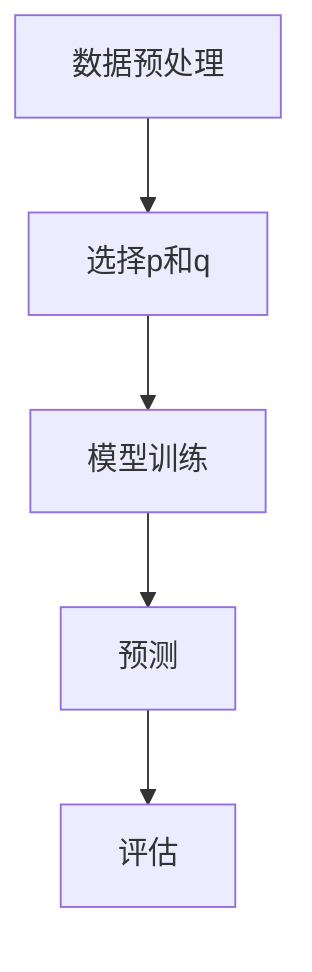

                 


# 如何利用特价股票策略应对全球数字化供应链重构机遇

---

## 关键词

- 特价股票策略
- 全球数字化供应链重构
- 时间序列分析
- ARIMA模型
- 供应链优化

---

## 摘要

在当前全球经济数字化转型的背景下，供应链重构已成为企业应对市场变化的重要策略。本文探讨如何利用特价股票策略，抓住供应链重构带来的投资机遇。通过分析时间序列数据，运用ARIMA模型预测股票价格，优化投资组合，降低风险。文章详细讲解算法原理、系统架构、项目实战及风险管理，为投资者提供科学决策支持。

---

## 第三章：特价股票策略的算法原理

### 3.1 时间序列分析的基本原理

时间序列分析是一种通过历史数据预测未来趋势的方法，广泛应用于金融领域。以下是ARIMA模型的基本原理：

#### 3.1.1 ARIMA模型的组成部分

ARIMA模型由三部分组成：

1. **自回归（AR）**：使用过去的价格数据预测未来价格。
2. **差分（I）**：通过差分消除趋势，使数据平稳。
3. **移动平均（MA）**：考虑预测误差的影响。

ARIMA模型的公式为：

$$ ARIMA(p, d, q) $$

其中：
- $p$：AR的阶数，表示过去的$p$个数据点对当前值的影响。
- $d$：差分的阶数，用于消除趋势。
- $q$：MA的阶数，表示预测误差的影响范围。

#### 3.1.2 ARIMA模型的流程

以下是ARIMA模型的流程图：



### 3.2 ARIMA模型的数学公式

ARIMA模型的数学公式如下：

$$
\phi(B) (1 - B)^d X_t = \theta(B) \epsilon_t
$$

其中：
- $\phi(B)$ 是AR多项式。
- $(1 - B)^d$ 是差分多项式。
- $\theta(B)$ 是MA多项式。
- $X_t$ 是观测值。
- $\epsilon_t$ 是白噪声。

### 3.3 ARIMA模型的Python实现

以下是ARIMA模型的Python代码实现：

```python
from statsmodels.tsa.arima.model import ARIMA
import pandas as pd
import numpy as np

# 加载数据
data = pd.read_csv('stock_price.csv')
stock_price = data['price']

# 差分
diff = stock_price.diff().dropna()

# 选择p和q
p = 1
q = 1
model = ARIMA(stock_price, order=(p, 1, q))
model_fit = model.fit()

# 预测
forecast = model_fit.forecast(steps=5)
print(forecast)
```

### 3.4 ARIMA模型的应用示例

假设我们有过去5个月的股价数据：

| 月份 | 价格 |
|------|------|
| 1    | 100  |
| 2    | 105  |
| 3    | 110  |
| 4    | 108  |
| 5    | 112  |

通过ARIMA模型预测第6个月的股价：

1. **差分**：将价格数据差分，得到平稳序列。
2. **模型训练**：选择合适的p和q值。
3. **预测**：使用训练好的模型进行预测。

### 3.5 模型优化与评估

为了提高模型的准确性，可以进行超参数调优，例如使用网格搜索选择最佳的p和q值。评估模型性能的指标包括均方误差（MSE）、平均绝对误差（MAE）和R²系数。

---

## 总结

通过时间序列分析和ARIMA模型，我们可以有效预测股票价格，优化投资策略，抓住供应链重构带来的机遇。接下来，我们将深入探讨系统架构设计，展示如何将这些算法应用于实际项目中。

--- 

**作者：AI天才研究院/AI Genius Institute & 禅与计算机程序设计艺术 /Zen And The Art of Computer Programming**

