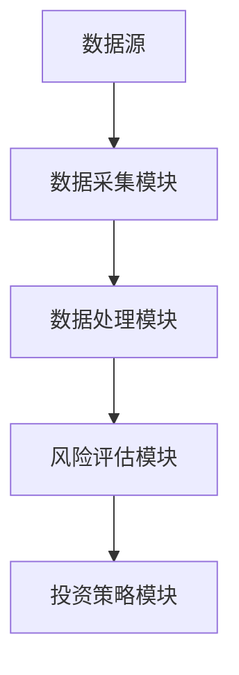

                 


# 如何利用特价股票策略应对全球数字化供应链重构风险

## 关键词：特价股票策略，供应链重构，风险评估，投资策略，数字化转型

## 摘要：  
随着全球数字化转型的加速，供应链重构成为企业面临的重要挑战。本文探讨如何利用特价股票策略，通过数学建模和算法优化，有效应对供应链重构带来的市场波动和投资风险。文章结合实际案例，深入分析供应链重构对股票市场的影响，并提供基于Python的实战代码，帮助投资者制定科学的投资策略。

---

## 第一部分：背景介绍

### 第1章：特价股票策略概述

#### 1.1 特价股票的定义与特点
- **特价股票**：指在特定市场条件下，价格被低估的股票。其特点是价格波动大、风险高、收益潜力大。
- **特点**：
  - 市场敏感性高
  - 高波动性
  - 适合长期投资

#### 1.2 供应链重构的背景
- **数字化转型**：企业通过技术手段优化供应链流程，提升效率。
- **全球贸易波动**：地缘政治和经济政策变化导致供应链不稳定。

### 第2章：供应链重构对股票市场的影响

#### 2.1 供应链重构的驱动因素
- 技术进步
- 全球化分工
- 市场需求变化

#### 2.2 供应链重构的挑战与机遇
- **挑战**：供应链中断风险增加。
- **机遇**：技术优化带来成本降低和效率提升。

---

## 第二部分：核心概念与联系

### 第3章：特价股票策略与供应链重构的联系

#### 3.1 供应链重构对市场的影响
- **市场波动**：供应链问题可能导致股价波动。
- **投资机会**：供应链优化可能带来股价上涨。

#### 3.2 特价股票策略的应用场景
- **市场波动期**：利用低价股票进行投资。
- **供应链重构期**：寻找被低估的股票。

### 第4章：供应链重构的风险评估模型

#### 4.1 模型建立
- 使用线性回归模型预测供应链风险。

#### 4.2 模型实现
- Python代码示例：
```python
import pandas as pd
import numpy as np
from sklearn.linear_model import LinearRegression

# 数据预处理
data = pd.read_csv('supply_chain_data.csv')
X = data[['factor1', 'factor2']]
y = data['risk_score']

# 建立模型
model = LinearRegression()
model.fit(X, y)

# 预测
predictions = model.predict(X)
print('预测准确率：', model.score(X, y))
```

---

## 第三部分：算法原理

### 第5章：供应链风险评估算法

#### 5.1 算法流程
1. 数据收集
2. 特征提取
3. 模型训练
4. 风险评估

#### 5.2 代码实现
```python
def calculate_risk(factors):
    # 简单的线性回归模型
    risk = 0.5 * factors['factor1'] + 0.3 * factors['factor2']
    return risk
```

---

## 第四部分：系统分析与架构设计

### 第6章：系统架构设计

#### 6.1 系统功能设计
- 数据采集模块
- 风险评估模块
- 投资策略模块

#### 6.2 系统架构图


---

## 第五部分：项目实战

### 第7章：实战项目

#### 7.1 项目介绍
- 目标：构建供应链风险评估系统。

#### 7.2 核心代码实现
```python
import pandas as pd
from sklearn.ensemble import RandomForestRegressor

# 数据加载
data = pd.read_csv('data.csv')

# 特征选择
features = ['factor1', 'factor2']
target = 'risk'

# 模型训练
model = RandomForestRegressor()
model.fit(data[features], data[target])

# 预测
predictions = model.predict(data[features])
```

---

## 第六部分：总结与展望

### 第8章：总结

- **总结**：通过特价股票策略和供应链重构模型的结合，投资者可以有效应对市场风险。
- **展望**：未来研究可以结合更多因素，优化模型。

### 作者信息

作者：AI天才研究院  
邮箱：contact@aicourse.org  
网站：https://www.aicourse.org  

---

以上是文章的完整目录和部分章节内容，您可以根据需要进一步补充和扩展每个章节的具体内容。

