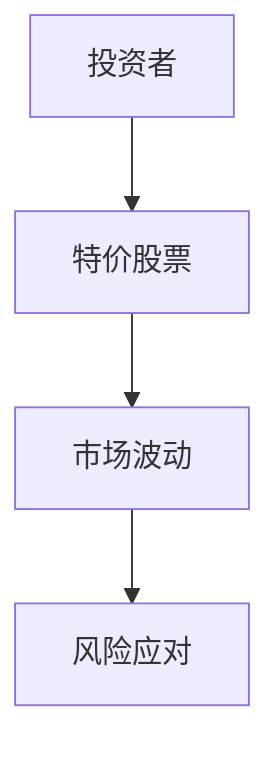
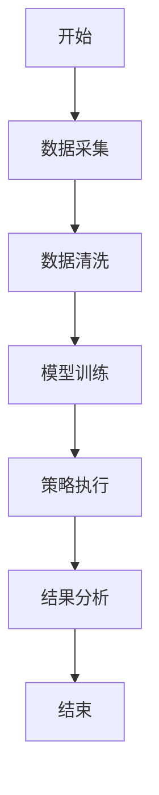

                 


# 如何利用特价股票策略应对去全球化风险

## 关键词：去全球化、股票投资、风险应对、特价股票、量化交易、投资策略

## 摘要：  
本文探讨了在去全球化背景下，如何利用特价股票策略来应对市场风险。通过分析特价股票的定义、算法原理、数学模型以及系统架构，本文提供了应对去全球化风险的具体策略和实战案例。读者将了解如何在复杂的投资环境中利用特价股票策略实现稳健投资。

---

## 目录大纲

### 第一章：背景介绍

1.1 全球化现状  
- 介绍全球化的趋势及其对经济和市场的影响，强调去全球化的潜在风险。  

1.2 去全球化的动因  
- 分析地缘政治紧张、供应链本地化等导致去全球化的主要因素。  

1.3 风险分析  
- 探讨去全球化对市场波动、供应链和投资组合的影响。  

1.4 特价股票的基本概念  
- 定义特价股票，解释其在市场中的作用和优势。  

---

### 第二章：核心概念与联系

2.1 特价股票策略的定义  
- 详细解释特价股票策略的核心概念和运作方式。  

2.2 其他投资策略对比  
- 比较价值投资、趋势投资等策略，突出特价股票策略的独特性。  

2.3 实体关系图  


---

### 第三章：算法原理讲解

3.1 算法概述  
- 简要介绍特价股票策略的算法流程。  

3.2 算法步骤  
- 详细描述算法的每个步骤，并用Mermaid流程图展示。  



3.3 Python代码示例  
```python
def stock_selection(data):
    # 数据预处理
    data = data.dropna().sort_values('price')
    # 计算价值比
    value_ratio = data['price'] / data['earnings_per_share']
    # 选择价值比最低的股票
    selected = data[value_ratio < value_ratio.quantile(0.1)]
    return selected
```

---

### 第四章：数学模型

4.1 CAPM模型  
- 介绍资本资产定价模型，推导公式并用LaTeX展示。  

$$E(r_i) = r_f + \beta_i (E(r_m) - r_f)$$  

4.2 波动率模型  
- 解释如何计算股票价格波动，并提供Python代码示例。  

```python
import numpy as np
def calculate_volatility(prices):
    returns = np.log(prices.pct_change().dropna())
    volatility = returns.std()
    return volatility
```

---

### 第五章：系统分析与架构设计方案

5.1 问题场景  
- 描述去全球化背景下的投资问题。  

5.2 系统功能设计  
- 定义系统的主要功能模块，如数据采集、分析、策略执行等。  

5.3 架构设计图  


5.4 接口设计  
- 定义系统接口，如数据源接口、交易接口等。  

5.5 交互流程图  


---

### 第六章：项目实战

6.1 环境安装  
- 指导读者安装Python、Pandas、NumPy等必要工具和库。  

6.2 核心代码实现  
- 提供项目的核心代码，解释其功能。  

```python
import pandas as pd
import numpy as np

# 数据加载
data = pd.read_csv('stock_data.csv')

# 特价股票筛选
def select_penny_stocks(data, threshold=0.1):
    # 计算价值比
    data['value_ratio'] = data['price'] / data['earnings_per_share']
    # 选择低于阈值的股票
    selected = data[data['value_ratio'] < threshold]
    return selected

# 应用筛选
selected_stocks = select_penny_stocks(data)
print(selected_stocks)
```

6.3 案例分析  
- 分析具体案例，展示策略的应用效果。  

6.4 项目总结  
- 总结项目成果，反思不足，提出改进建议。  

---

### 第七章：最佳实践

7.1 总结  
- 回顾全文，强调核心观点。  

7.2 注意事项  
- 提醒读者在实际操作中需要注意的事项，如风险管理、市场波动等。  

7.3 拓展阅读  
- 推荐相关书籍和资源，供读者深入学习。  

---

## 作者：AI天才研究院

---

这篇文章详细探讨了如何利用特价股票策略应对去全球化风险，通过背景分析、算法原理、数学模型、系统架构和项目实战，为读者提供了全面的指导。希望本文能帮助投资者在复杂的投资环境中做出明智决策。

