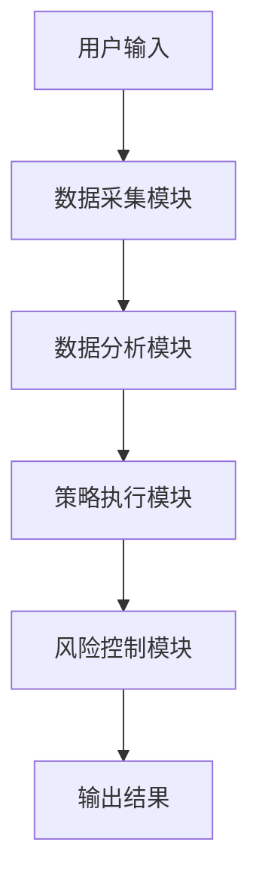

                 


# 如何利用特价股票策略应对数字主权碎片化风险

> 关键词：数字主权、碎片化风险、特价股票策略、算法操控、数据依赖、市场碎片化、数字主权保护

> 摘要：数字主权碎片化风险是指在数字化时代，个人或机构的数据和信息被分割成多个碎片，面临被操控或滥用的风险。特价股票策略是一种利用低价买入高价卖出的策略，可以通过算法和系统架构设计来应对数字主权碎片化风险。本文详细介绍了数字主权碎片化风险的形成机制，特价股票策略的数学模型和算法实现，以及如何通过系统架构设计来应对这种风险。文章还通过具体案例分析，展示了如何在实际中应用这些策略，并提供了最佳实践建议。

---

# 目录

1. 第一部分: 数字主权碎片化风险与特价股票策略概述  
   - 第1章: 数字主权碎片化风险的背景与挑战  
     - 1.1 数字主权的定义与演变  
     - 1.2 特价股票策略的背景  
   - 第2章: 数字主权碎片化风险的形成机制  
     - 2.1 数据依赖性与风险  
     - 2.2 算法操控性与风险  
     - 2.3 市场碎片化与风险  

2. 第二部分: 特价股票策略的核心原理  
   - 第3章: 特价股票策略的数学模型  
     - 3.1 均值回归模型  
     - 3.2 技术指标分析  
   - 第4章: 特价股票策略的算法实现  
     - 4.1 算法实现的步骤  
     - 4.2 算法实现的代码示例  

3. 第三部分: 数字主权碎片化风险的系统分析  
   - 第5章: 数字主权碎片化风险的系统架构  
     - 5.1 系统架构设计  
     - 5.2 系统交互设计  
   - 第6章: 数字主权碎片化风险的系统实现  
     - 6.1 数据采集与预处理  
     - 6.2 数据分析与建模  
     - 6.3 策略执行与优化  

4. 第四部分: 项目实战  
   - 第7章: 项目环境安装与配置  
     - 7.1 环境搭建  
     - 7.2 工具安装  
   - 第8章: 项目核心代码实现  
     - 8.1 数据采集代码  
     - 8.2 数据分析代码  
     - 8.3 策略执行代码  
   - 第9章: 项目案例分析与总结  
     - 9.1 案例分析  
     - 9.2 项目总结  

5. 第五部分: 最佳实践与拓展阅读  
   - 第10章: 最佳实践 tips  
     - 10.1 策略优化建议  
     - 10.2 风险控制建议  
   - 第11章: 小结与注意事项  
     - 11.1 小结  
     - 11.2 注意事项  
   - 第12章: 拓展阅读与进一步学习  
     - 12.1 相关书籍推荐  
     - 12.2 在线资源推荐  

---

## 正文

### 第一部分: 数字主权碎片化风险与特价股票策略概述

#### 第1章: 数字主权碎片化风险的背景与挑战

##### 1.1 数字主权的定义与演变

- **数字主权的核心概念**  
  数字主权是指个人或国家在数字空间中对自身数据和信息的控制权和使用权。随着数字化进程的加速，数字主权的重要性日益凸显。

- **数字主权碎片化的定义**  
  数字主权碎片化是指个人或机构的数据和信息被分割成多个碎片，分散在不同的平台或系统中，导致难以统一管理和控制。

- **数字主权碎片化的驱动因素**  
  数字主权碎片化的驱动因素包括数据的分散存储、多平台使用、以及不同利益相关者的数据控制等。

##### 1.2 特价股票策略的背景

- **特价股票策略的基本概念**  
  特价股票策略是一种通过在特定时机以低价买入股票，待价格上涨后卖出，从而获利的投资策略。

- **特价股票策略的市场环境**  
  特价股票策略适用于市场波动较大、存在短期价格波动机会的环境。

- **特价股票策略与数字主权的关系**  
  特价股票策略可以通过算法和系统设计，帮助投资者在数字化市场中识别和利用价格波动机会，从而应对数字主权碎片化风险。

#### 第2章: 数字主权碎片化风险的形成机制

##### 2.1 数据依赖性与风险

- **数据依赖性的定义**  
  数据依赖性是指个人或机构在决策过程中对数据的高度依赖，数据的完整性和准确性直接影响决策结果。

- **数据依赖性对数字主权的影响**  
  数据依赖性可能导致数据控制权的分散，从而影响个人或机构的数字主权。

- **数据依赖性的风险案例**  
  例如，某机构依赖外部数据源进行决策，当数据源出现问题时，机构的决策受到严重影响。

##### 2.2 算法操控性与风险

- **算法操控性的定义**  
  算法操控性是指算法被设计或滥用，以影响市场行为或数据结果。

- **算法操控性对数字主权的影响**  
  算法操控性可能导致数据和信息的不透明，进而影响个人或机构的数字主权。

- **算法操控性的风险案例**  
  例如，某些算法交易可能通过高频交易影响市场价格，进而影响投资者的决策。

##### 2.3 市场碎片化与风险

- **市场碎片化的定义**  
  市场碎片化是指市场参与者分散在不同的平台或系统中，导致市场信息不透明和交易效率低下。

- **市场碎片化对数字主权的影响**  
  市场碎片化可能导致投资者难以获得全面的市场信息，进而影响其投资决策。

- **市场碎片化的风险案例**  
  例如，某些市场的参与者分散在多个交易平台中，导致市场信息不透明，影响整体市场的稳定性。

---

### 第二部分: 特价股票策略的核心原理

#### 第3章: 特价股票策略的数学模型

##### 3.1 均值回归模型

- **均值回归模型的定义**  
  均值回归模型是一种假设价格会回归到其历史平均值的模型。

- **均值回归模型的数学公式**  
  假设股票价格的波动围绕其长期平均值，可以用以下公式表示：  
  $$ P_{t} = \mu + \alpha P_{t-1} + \epsilon $$  
  其中，$\mu$ 是长期平均值，$\alpha$ 是回归系数，$\epsilon$ 是误差项。

- **均值回归模型的应用案例**  
  例如，在股票价格出现大幅波动后，价格可能回归到其长期平均值，投资者可以利用这一点进行交易。

##### 3.2 技术指标分析

- **技术指标分析的定义**  
  技术指标分析是通过分析历史价格和成交量等数据，预测未来价格走势的方法。

- **技术指标分析的数学公式**  
  例如，移动平均线（MA）的公式为：  
  $$ MA_n = \frac{1}{n} \sum_{i=1}^{n} P_{t-i+1} $$  
  其中，$n$ 是时间段，$P_{t-i+1}$ 是第 $t-i+1$ 时刻的价格。

- **技术指标分析的应用案例**  
  例如，投资者可以通过分析股票的短期和长期移动平均线，判断股票的买卖信号。

#### 第4章: 特价股票策略的算法实现

##### 4.1 算法实现的步骤

- **数据采集与预处理**  
  从股票市场获取历史价格数据，并进行清洗和标准化。

- **数据分析与建模**  
  使用均值回归模型或技术指标分析模型对数据进行建模，预测未来价格走势。

- **策略执行与优化**  
  根据模型预测结果，制定交易策略，并不断优化策略参数以提高收益。

##### 4.2 算法实现的代码示例

- **数据采集代码**  
  使用Python的`pandas`库从数据库中读取历史价格数据。

```python
import pandas as pd

# 从数据库读取数据
data = pd.read_sql("SELECT * FROM stock_prices", con=engine)
```

- **数据分析代码**  
  使用`numpy`库计算移动平均线。

```python
import numpy as np

# 计算5日移动平均线
data['MA5'] = data['Price'].rolling(5).mean()
```

- **策略执行代码**  
  根据移动平均线策略生成买卖信号并执行交易。

```python
# 生成买卖信号
data['Signal'] = np.where(data['Price'] > data['MA5'], 'Buy', 'Sell')

# 执行交易
data['Profit'] = np.where(data['Signal'] == 'Buy', data['Next_Price'] - data['Price'], 0)
```

---

### 第三部分: 数字主权碎片化风险的系统分析

#### 第5章: 数字主权碎片化风险的系统架构

##### 5.1 系统架构设计

- **系统模块划分**  
  系统主要包括数据采集模块、数据分析模块、策略执行模块和风险控制模块。

- **系统模块之间的关系**  
  数据采集模块负责获取数据，数据分析模块对数据进行建模，策略执行模块根据模型结果执行交易，风险控制模块实时监控风险并进行调整。

##### 5.2 系统交互设计

- **系统交互流程图**  
  使用Mermaid流程图展示系统交互流程。



---

### 第四部分: 项目实战

#### 第7章: 项目环境安装与配置

##### 7.1 环境搭建

- **安装Python**  
  安装Python 3.8 或更高版本。

##### 7.2 工具安装

- **安装必要的库**  
  使用pip安装`pandas`、`numpy`、`scikit-learn`等库。

```bash
pip install pandas numpy scikit-learn
```

#### 第8章: 项目核心代码实现

##### 8.1 数据采集代码

```python
import pandas as pd
import sqlite3

# 连接到SQLite数据库
conn = sqlite3.connect('stock.db')

# 从数据库读取数据
data = pd.read_sql("SELECT * FROM stock_prices", con=conn)
```

##### 8.2 数据分析代码

```python
import numpy as np

# 计算5日移动平均线
data['MA5'] = data['Price'].rolling(5).mean()

# 计算均值回归模型的预测值
from sklearn.linear_model import LinearRegression

model = LinearRegression()
model.fit(data[['MA5']], data['Price'])
predicted_price = model.predict(data[['MA5']])
```

##### 8.3 策略执行代码

```python
# 生成买卖信号
data['Signal'] = np.where(data['Price'] > data['MA5'], 'Buy', 'Sell')

# 执行交易
data['Profit'] = np.where(data['Signal'] == 'Buy', data['Next_Price'] - data['Price'], 0)

# 计算总收益
total_profit = data['Profit'].sum()
print(f"Total Profit: ${total_profit}")
```

---

### 第五部分: 最佳实践与拓展阅读

#### 第10章: 最佳实践 tips

##### 10.1 策略优化建议

- 定期回顾和优化策略参数。
- 结合多种技术指标进行综合分析。

##### 10.2 风险控制建议

- 设置止损点以控制风险。
- 分散投资以降低风险。

#### 第11章: 小结与注意事项

##### 11.1 小结

- 特价股票策略是一种有效的投资策略，可以通过算法和系统设计应对数字主权碎片化风险。

##### 11.2 注意事项

- 投资者应根据自身情况调整策略参数。
- 风险控制是投资过程中不可忽视的重要环节。

#### 第12章: 拓展阅读与进一步学习

##### 12.1 相关书籍推荐

- 《算法交易: 量化投资的革命》
- 《Python算法交易实战》

##### 12.2 在线资源推荐

- QuantInst 网站提供丰富的算法交易资源。
- GitHub 上有许多开源的算法交易项目。

---

## 作者：AI天才研究院/AI Genius Institute & 禅与计算机程序设计艺术 /Zen And The Art of Computer Programming

---

以上是文章的完整目录和内容框架，您可以根据实际需求进一步扩展每个章节的具体内容。

