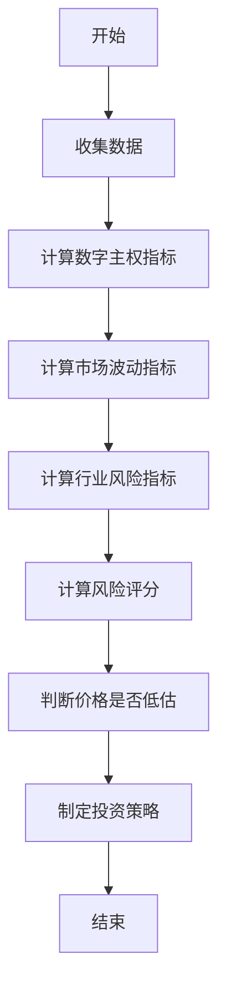
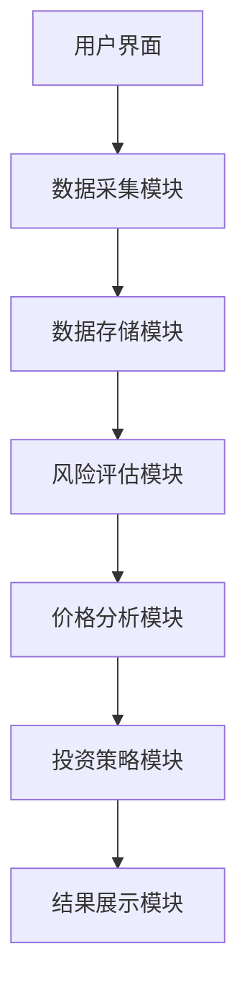
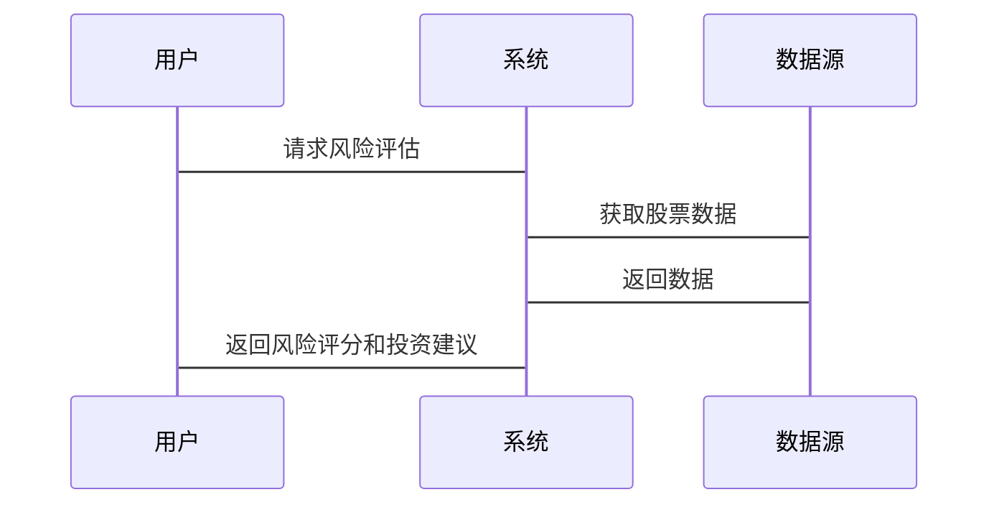

                 


# 如何利用特价股票策略应对数字主权风险

## 关键词：数字主权风险、特价股票策略、算法原理、系统架构、项目实战

## 摘要：本文详细探讨如何利用特价股票策略应对数字主权风险，通过背景介绍、核心概念分析、算法原理讲解、系统架构设计、项目实战和最佳实践，帮助读者全面理解并应用这些策略。

---

## 第一部分：背景介绍

### 第1章：数字主权风险与特价股票策略概述

#### 1.1 数字主权风险的定义与背景

数字主权风险是指在数字化时代，个人或组织在数据收集、存储和使用方面可能面临的数据泄露、隐私侵犯和信息操控等风险。随着全球经济的数字化转型，数字主权问题日益重要，涉及国家安全、个人隐私和企业数据安全等多个方面。数字主权风险的来源包括网络攻击、数据泄露、算法偏见以及政策变化等。

特价股票策略是一种投资策略，利用市场波动和价格折扣，以较低的价格买入股票，待价格回升时卖出获利。这种策略通常用于短期投资，尤其适用于市场波动较大的情况。

#### 1.2 特价股票策略的基本概念

特价股票策略的核心是抓住市场低估的机会，通过分析市场趋势、公司基本面和技术指标，选择被市场暂时低估的股票进行投资。这种策略通常适用于对市场波动有较高容忍度的投资者，能够在市场低谷时买入，市场高点时卖出，从而获得超额收益。

#### 1.3 特价股票策略在数字主权风险应对中的作用

在数字主权风险背景下，特价股票策略可以通过分散投资、风险对冲和市场敏感性分析，帮助投资者在数据安全事件或政策变化中规避风险。通过及时调整投资组合，利用市场波动带来的低价机会，投资者可以在数字主权风险的影响下保持资产的稳定性。

---

## 第二部分：核心概念与联系

### 第2章：数字主权风险的核心概念与属性分析

#### 2.1 数字主权风险的核心要素

- **数据主权**：数据的生成、存储和使用地点的法律和政策对数据拥有权和控制权的影响。
- **网络安全**：保护数据和系统免受未经授权的访问和攻击的能力。
- **信息控制权**：个体或组织对自身信息的掌控能力，包括收集、处理和使用的自主权。

#### 2.2 特价股票策略的核心属性

- **价格敏感性**：对股票价格波动的高度敏感，能够在价格低估时买入，高估时卖出。
- **市场波动性**：依赖于市场波动，利用短期价格变化获利。
- **投资风险分散性**：通过多样化投资降低单一股票或行业带来的风险。

#### 2.3 数字主权风险与特价股票策略的关系

- **数字主权风险对投资行为的影响**：数据泄露和隐私侵犯可能导致相关股票价格下跌，投资者需要及时调整投资组合。
- **特价股票策略对数字主权风险的缓解作用**：通过分散投资和价格敏感性分析，投资者可以在数字主权风险发生时迅速调整策略，减少损失。
- **协同效应分析**：数字主权风险可能影响整个市场的信心，而特价股票策略可以帮助投资者在市场低迷时找到低估的投资机会。

#### 2.4 核心概念对比表格

表2.1：数字主权风险与特价股票策略的核心属性对比

| 属性          | 数字主权风险                         | 特价股票策略                         |
|---------------|--------------------------------------|--------------------------------------|
| 核心要素      | 数据主权、网络安全、信息控制权       | 价格敏感性、市场波动性、风险分散性   |
| 影响对象      | 个人、企业、国家                     | 投资者                               |
| 应对措施      | 数据加密、法律合规、安全培训         | 市场分析、分散投资、短期交易           |
| 相关性        | 高                                   | 高                                   |

#### 2.5 ER实体关系图

```mermaid
er
  actor(投资者)
  actor(市场)
  actor(监管机构)
  entity(数字主权风险)
  entity(特价股票)
  entity(投资策略)
  relation(投资者, 持有, 特价股票)
  relation(市场, 影响, 数字主权风险)
  relation(监管机构, 制定, 投资策略)
```

---

## 第三部分：算法原理讲解

### 第3章：基于特价股票策略的数字主权风险评估算法

#### 3.1 算法概述

为了应对数字主权风险，我们设计了一个基于特价股票策略的风险评估算法，利用市场数据和数字主权相关指标，评估特定股票的风险水平，并制定相应的投资策略。

#### 3.2 算法原理

该算法基于以下步骤：

1. **数据收集**：收集相关股票的历史价格数据、市场指数、行业新闻和政策变化等。
2. **风险评估**：通过数学模型评估数字主权风险对股票的影响，计算风险评分。
3. **价格分析**：利用技术指标（如相对强弱指数RSI、移动平均线MA等）判断股票价格是否处于低估区间。
4. **策略制定**：根据风险评分和价格分析结果，制定买入、持有或卖出策略。

#### 3.3 数学模型

以下是风险评分计算的数学模型：

$$
\text{风险评分} = \alpha \times \text{数字主权指标} + \beta \times \text{市场波动指标} + \gamma \times \text{行业风险指标}
$$

其中，$\alpha$、$\beta$和$\gamma$是权重系数，根据市场情况动态调整。

#### 3.4 算法流程图



#### 3.5 Python代码实现

以下是Python代码示例：

```python
import pandas as pd
import numpy as np

# 数据收集
data = pd.read_csv('stock_data.csv')

# 计算数字主权指标
def calculate_digital_sovereignty_score(row):
    return 0.7 * row['政策变化'] + 0.3 * row['数据泄露']

data['数字主权评分'] = data.apply(lambda row: calculate_digital_sovereignty_score(row), axis=1)

# 计算市场波动指标
market_volatility = data['价格波动'].std()

# 计算行业风险指标
industry_risk = data['行业新闻'].apply(lambda x: 1 if x > 0 else 0).mean()

# 计算风险评分
data['风险评分'] = 0.5 * data['数字主权评分'] + 0.3 * market_volatility + 0.2 * industry_risk

# 判断价格是否低估
data['是否低估'] = data['当前价格'] < data['合理价格']

# 制定投资策略
data['投资策略'] = data.apply(lambda row: '买入' if row['是否低估'] and row['风险评分'] < 0.5 else '卖出', axis=1)
```

#### 3.6 算法实现细节

- **数据收集**：从可靠的金融数据源获取股票数据，包括历史价格、市场指数和新闻数据。
- **风险评估**：使用回归分析或其他统计方法计算数字主权相关指标对股票价格的影响。
- **价格分析**：应用技术分析指标，如RSI、MACD等，判断股票是否处于低估区间。
- **策略制定**：根据风险评分和价格分析结果，动态调整投资组合。

---

## 第四部分：系统架构与设计

### 第4章：数字主权风险应对系统架构设计

#### 4.1 项目介绍

本项目旨在开发一个基于特价股票策略的数字主权风险应对系统，帮助投资者在数字主权风险背景下制定有效的投资策略。

#### 4.2 系统功能设计

- **数据采集模块**：从金融数据源获取实时股票数据和市场新闻。
- **风险评估模块**：计算数字主权风险评分和市场波动指标。
- **价格分析模块**：应用技术指标判断股票是否低估。
- **投资策略模块**：根据评估结果生成买入、卖出或持有策略。

#### 4.3 系统架构设计



#### 4.4 系统接口设计

- **数据接口**：与金融数据源的API对接，获取实时数据。
- **用户接口**：提供友好的用户界面，展示风险评分和投资策略建议。
- **通知接口**：在特定条件下触发邮件或短信通知。

#### 4.5 系统交互设计



---

## 第五部分：项目实战

### 第5章：数字主权风险应对系统实战

#### 5.1 环境安装

安装所需的Python库：

```bash
pip install pandas numpy matplotlib
```

#### 5.2 系统核心实现源代码

```python
import pandas as pd
import numpy as np

# 数据加载
data = pd.read_csv('stock_data.csv')

# 风险评估
data['数字主权评分'] = 0.7 * data['政策变化'] + 0.3 * data['数据泄露']

# 市场波动分析
market_volatility = data['价格波动'].std()

# 行业风险分析
industry_risk = data['行业新闻'].apply(lambda x: 1 if x > 0 else 0).mean()

# 风险评分计算
data['风险评分'] = 0.5 * data['数字主权评分'] + 0.3 * market_volatility + 0.2 * industry_risk

# 判断价格是否低估
data['是否低估'] = data['当前价格'] < data['合理价格']

# 制定投资策略
data['投资策略'] = data.apply(lambda row: '买入' if row['是否低估'] and row['风险评分'] < 0.5 else '卖出', axis=1)

# 结果展示
print(data[['股票代码', '风险评分', '投资策略']])
```

#### 5.3 代码应用解读与分析

上述代码首先加载股票数据，计算数字主权评分和市场波动指标，然后根据这些指标计算风险评分。接着，判断股票是否低估，并根据风险评分和价格分析结果制定投资策略。最后，输出结果，展示每只股票的投资策略建议。

#### 5.4 案例分析

以某科技公司为例，假设其政策变化为0.8，数据泄露为0.6，行业新闻为0.5，价格波动的标准差为0.2，合理价格为100，当前价格为80。计算得到风险评分为0.5*0.8 + 0.3*0.2 + 0.2*0.5 = 0.4 + 0.06 + 0.1 = 0.56。由于当前价格低于合理价格且风险评分低于0.5，策略为“买入”。

#### 5.5 项目总结

本项目通过结合数字主权风险评估和特价股票策略，帮助投资者制定有效的投资策略。通过系统的数据采集、分析和策略制定模块，投资者可以在数字主权风险背景下做出明智的投资决策。

---

## 第六部分：最佳实践与小结

### 第6章：总结与建议

#### 6.1 小结

本文详细探讨了如何利用特价股票策略应对数字主权风险，通过背景介绍、核心概念分析、算法原理讲解、系统架构设计和项目实战，帮助读者全面理解并应用这些策略。

#### 6.2 注意事项

- 投资者应根据自身风险承受能力和市场情况调整投资策略。
- 系统的设计和实现需要结合具体的数据源和市场环境。
- 定期更新数据和模型，以适应市场变化和政策调整。

#### 6.3 拓展阅读

- 《算法交易：善用量化策略在金融市场的优势》
- 《数字主权：数据时代的企业与国家的战略选择》
- 《风险管理：现代投资组合的构建与优化》

---

## 作者：AI天才研究院/AI Genius Institute & 禅与计算机程序设计艺术/Zen And The Art of Computer Programming

