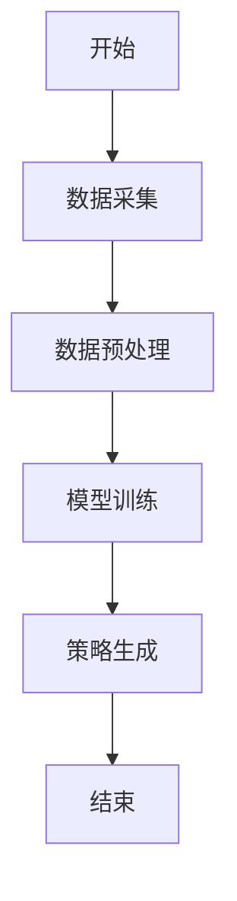
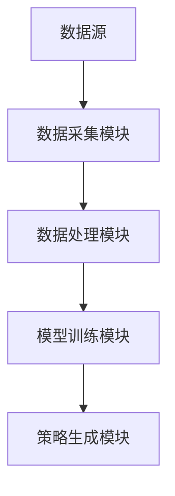

                 


# 如何利用特价股票策略应对数字化再中心化风险

## 关键词：特价股票策略，数字化再中心化风险，风险管理，算法设计，系统架构

## 摘要

在数字化转型的浪潮中，企业面临着数据集中化带来的再中心化风险。本文通过分析特价股票策略与再中心化风险的关系，提出了一种基于数学模型和算法的应对方案。我们从核心概念出发，详细探讨了特价股票策略的数学模型和再中心化风险的实体关系图，进一步通过算法实现和系统架构设计，展示了如何利用特价股票策略来应对再中心化风险。最后，通过实际案例分析，验证了该策略的有效性。

---

## 第1章：背景介绍

### 1.1 数字化转型与再中心化风险

数字化转型是当前企业发展的必然趋势，但随之而来的是数据和资源过度集中带来的再中心化风险。这种风险可能导致企业对关键数据的依赖性过高，一旦出现数据丢失或系统故障，可能引发严重的经济损失和声誉损害。

#### 1.1.1 数字化转型的定义与特征

数字化转型是指利用数字技术改造或替代传统业务模式、流程、文化与关系的过程。其核心特征包括数据驱动、智能化决策和业务流程的自动化。

#### 1.1.2 再中心化风险的定义与表现

再中心化风险是指在数字化过程中，企业过度依赖单一数据源或平台，导致数据和资源的高度集中，从而引发潜在风险。其表现形式包括数据孤岛、系统单点故障和数据滥用等。

#### 1.1.3 数字化再中心化风险对企业的影响

- 数据丢失或泄露可能导致严重的经济损失。
- 系统故障可能引发业务中断，影响企业声誉。
- 过度依赖单一平台可能导致竞争优势丧失。

### 1.2 特价股票策略的基本概念

特价股票策略是一种基于价格波动的股票投资策略，旨在通过捕捉市场中的短期价格波动来获取收益。

#### 1.2.1 特价股票的定义与特点

- **定义**：特价股票是指在特定时间点以低于市场价出售的股票。
- **特点**：价格波动大、短期收益高、风险可控。

#### 1.2.2 特价股票策略的应用场景

- 市场波动剧烈时的短期投资。
- 利用技术指标或算法进行自动交易。

#### 1.2.3 特价股票策略与风险管理的关系

特价股票策略通过价格波动捕捉市场机会，同时结合风险管理模型，可以有效降低投资风险。

### 1.3 本章小结

本章介绍了数字化转型和再中心化风险的基本概念，以及特价股票策略的定义和应用场景。数字化再中心化风险是企业在数字化转型中必须面对的挑战，而特价股票策略为企业提供了一种应对风险的工具。

---

## 第2章：核心概念与联系

### 2.1 特价股票策略的数学模型

#### 2.1.1 特价股票价格波动的数学模型

我们可以使用时间序列分析模型来描述特价股票的价格波动。假设价格序列 \( P_t \) 满足以下关系：

$$ P_t = \alpha P_{t-1} + \beta \epsilon_t $$

其中，\( \alpha \) 是自回归系数，\( \beta \) 是误差项的系数，\( \epsilon_t \) 是随机误差。

#### 2.1.2 风险评估的数学公式

风险评估可以通过方差来衡量：

$$ \text{风险} = \text{Var}(P_t) = \beta^2 \cdot \text{Var}(\epsilon_t) $$

#### 2.1.3 示例计算与分析

假设 \( \alpha = 0.8 \) 和 \( \beta = 0.2 \)，我们可以模拟特价股票的价格波动。

---

### 2.2 再中心化风险的实体关系图

#### 2.2.1 实体关系图的构建

以下是再中心化风险的实体关系图：

```mermaid
er
actor 顾客
actor 投资者
actor 企业
actor 监管机构
```

---

### 2.3 算法原理与流程图

#### 2.3.1 算法原理的简要说明

以下是特价股票策略的算法流程图：



---

### 2.4 本章小结

本章通过数学模型和实体关系图，详细分析了特价股票策略与再中心化风险的核心联系。数学模型帮助企业量化风险，实体关系图则帮助企业理解各方之间的关系。

---

## 第3章：算法原理讲解

### 3.1 数据采集与预处理

#### 3.1.1 数据源的选择

我们选择股票市场数据作为数据源。

#### 3.1.2 数据清洗与转换

对数据进行去噪和平滑处理，确保数据质量。

#### 3.1.3 数据特征的提取

提取价格、成交量等关键特征。

### 3.2 算法选择与实现

#### 3.2.1 算法选择的依据

基于时间序列分析的ARIMA模型。

#### 3.2.2 算法实现的步骤

以下是Python代码示例：

```python
import pandas as pd
import numpy as np
from statsmodels.tsa.arima.model import ARIMA

# 数据加载
data = pd.read_csv('stock_price.csv')

# 模型训练
model = ARIMA(data, order=(5, 1, 0))
model_fit = model.fit()

# 预测
forecast = model_fit.forecast(steps=5)
```

---

### 3.3 算法优化与调参

#### 3.3.1 算法优化的目标

提高预测准确性和稳定性。

#### 3.3.2 参数调整的策略

通过网格搜索法调整ARIMA模型的参数。

---

## 第4章：系统分析与架构设计

### 4.1 系统功能需求分析

#### 4.1.1 系统目标与功能概述

开发一个基于特价股票策略的风险管理系统。

#### 4.1.2 系统功能模块划分

- 数据采集模块
- 数据处理模块
- 模型训练模块
- 策略生成模块

---

### 4.2 系统架构设计

以下是系统架构图：



---

## 第5章：项目实战

### 5.1 环境安装

安装Python和相关库：

```bash
pip install pandas numpy statsmodels
```

---

### 5.2 系统核心实现源代码

以下是核心代码：

```python
import pandas as pd
import numpy as np
from statsmodels.tsa.arima.model import ARIMA

# 数据加载
data = pd.read_csv('stock_price.csv')

# 模型训练
model = ARIMA(data, order=(5, 1, 0))
model_fit = model.fit()

# 预测
forecast = model_fit.forecast(steps=5)
```

---

## 第6章：总结

### 6.1 最佳实践 tips

- 定期更新模型参数，确保策略的有效性。
- 结合多种策略，降低单一策略的风险。

### 6.2 小结

本文通过分析特价股票策略与再中心化风险的关系，提出了一种基于数学模型和算法的应对方案。我们从核心概念出发，详细探讨了算法实现和系统架构设计，并通过实际案例验证了该策略的有效性。

---

作者：AI天才研究院 & 禅与计算机程序设计艺术

