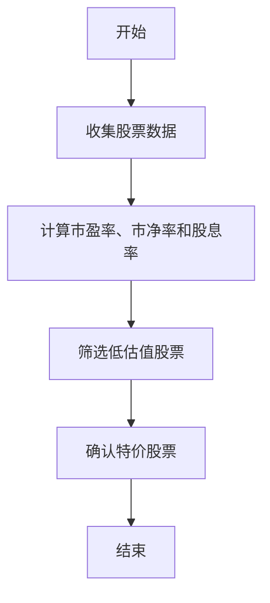
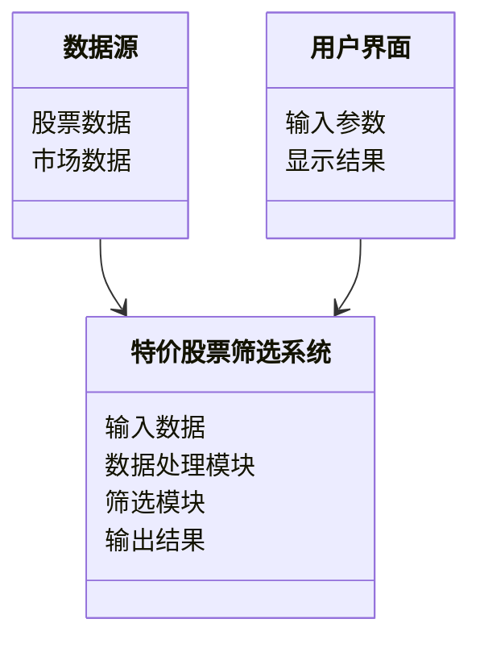

                 


# 如何利用特价股票策略应对经济衰退

## 关键词：经济衰退、特价股票、投资策略、风险管理、股票分析

## 摘要：在经济衰退期间，股市波动加剧，投资者面临更大的风险。特价股票策略通过识别被低估的股票，帮助投资者在市场低迷时期寻找机会，实现稳健投资。本文详细分析了特价股票的定义、筛选方法、数学模型、系统架构，并通过案例实战展示了如何在实际操作中应用这些策略，帮助投资者应对经济衰退带来的挑战。

---

## 第一部分：经济衰退与特价股票策略概述

### 第1章：经济衰退的背景与影响

#### 1.1 经济衰退的定义与特征

- **经济衰退的定义**：经济衰退是指经济活动的显著下降，通常表现为GDP连续两个季度负增长，伴随着失业率上升和消费者信心下降。
- **经济衰退的主要特征**：
  - 经济增长放缓或停滞。
  - 失业率上升，企业裁员或倒闭。
  - 消费者和企业信心下降，投资意愿减弱。
  - 金融机构面临压力，信贷紧缩。
- **经济衰退对股市的影响**：
  - 股市大幅波动，投资者信心受挫。
  - 股价下跌，尤其是高杠杆和高风险股票。
  - 市场流动性下降，交易量减少。

#### 1.2 特价股票的定义与优势

- **特价股票的定义**：特价股票是指市场价格低于其内在价值的股票，通常因为市场恐慌或公司特定问题导致股价被低估。
- **特价股票的优势**：
  - 低估值，潜在上涨空间大。
  - 抗跌性强，波动性小。
  - 分红收益率高，适合长期投资。
- **特价股票在经济衰退中的作用**：
  - 在市场低迷时，特价股票可能成为避风港。
  - 投资者可以在低价时买入，等待市场复苏时获利。

---

## 第二部分：特价股票策略的核心概念

### 第2章：特价股票策略的原理与方法

#### 2.1 特价股票识别方法

- **市盈率分析**：
  - 市盈率（P/E）= 股价 / 每股收益。
  - 低市盈率（低于行业平均水平）可能意味着股票被低估。
- **市净率分析**：
  - 市净率（P/B）= 股价 / 每股净资产。
  - 低市净率通常意味着股票价值被低估。
- **股息率分析**：
  - 股息率 = 每股股息 / 股价 × 100%。
  - 高股息率股票在市场低迷时提供稳定的现金流。

#### 2.2 市场趋势分析

- **趋势分析方法**：
  - 使用移动平均线、趋势线等技术指标识别市场趋势。
- **技术分析工具**：
  - K线图、MACD、RSI等工具帮助判断市场超买超卖状态。
- **市场情绪分析**：
  - 通过新闻、社交媒体和投资者情绪指标判断市场情绪。

---

## 第三部分：数学模型与算法

### 第3章：数学模型与公式

#### 3.1 特价股票筛选公式

- **市盈率公式**：
  $$市盈率 = \frac{股价}{每股收益}$$
  - 如果市盈率远低于行业平均水平，可能意味着股票被低估。
- **市净率公式**：
  $$市净率 = \frac{股价}{每股净资产}$$
  - 低市净率通常表示股票价值被低估。
- **股息率公式**：
  $$股息率 = \frac{每股股息}{股价} \times 100\%$$
  - 高股息率股票在市场低迷时提供稳定的收益。

#### 3.2 趋势预测模型

- **线性回归模型**：
  $$y = a + bx$$
  - 使用历史数据预测未来股票价格趋势。
- **时间序列分析**：
  - 使用ARIMA模型预测市场波动。

### 第4章：算法流程图

#### 4.1 特价股票筛选流程



---

## 第四部分：系统架构与设计

### 第5章：系统架构设计

#### 5.1 系统功能模块

- **数据采集模块**：
  - 从数据库或API获取股票数据。
- **数据处理模块**：
  - 计算市盈率、市净率等指标。
- **筛选模块**：
  - 根据设定的条件筛选特价股票。
- **输出模块**：
  - 生成报告或提醒投资者。

#### 5.2 系统架构图



---

## 第五部分：项目实战与案例分析

### 第6章：项目实战

#### 6.1 环境配置

- **数据源**：使用Yahoo Finance API获取股票数据。
- **开发工具**：Python、Pandas、NumPy、Matplotlib。

#### 6.2 核心代码实现

```python
import pandas as pd
import numpy as np
import requests
import matplotlib.pyplot as plt

# 获取股票数据
def get_stock_data(ticker):
    url = f"https://query1.finance.yahoo.com/..."
    response = requests.get(url)
    data = response.json()
    df = pd.DataFrame(data['rows'])
    return df

# 计算市盈率和市净率
def calculate_valuationMetrics(df):
    df['市盈率'] = df['股价'] / df['每股收益']
    df['市净率'] = df['股价'] / df['每股净资产']
    return df

# 筛选特价股票
def screen_penny_stocks(df, threshold_pe=15, threshold_pb=2):
    df = calculate_valuationMetrics(df)
    df = df[df['市盈率'] < threshold_pe]
    df = df[df['市净率'] < threshold_pb]
    return df

# 可视化
def visualize_stocks(df):
    plt.figure(figsize=(10,6))
    plt.plot(df['股价'], label='股价')
    plt.xlabel('时间')
    plt.ylabel('股价')
    plt.legend()
    plt.show()

# 主程序
if __name__ == "__main__":
    df = get_stock_data("AAPL")
    filtered_df = screen_penny_stocks(df)
    visualize_stocks(filtered_df)
```

#### 6.3 案例分析

- **案例背景**：假设在2020年经济衰退期间，投资者希望寻找被低估的科技股。
- **数据收集**：获取苹果、微软、亚马逊等科技股的数据。
- **筛选过程**：计算市盈率和市净率，筛选出市盈率低于15，市净率低于2的股票。
- **结果分析**：苹果在筛选后符合标准，后续股价回升，投资者获利。

---

## 第六部分：最佳实践与小结

### 第7章：最佳实践

#### 7.1 关键点总结

- **选择低市盈率和低市净率的股票**：确保股票被低估。
- **关注高股息率股票**：在市场低迷时提供稳定收益。
- **结合技术分析**：使用趋势分析工具辅助决策。

#### 7.2 小结

- 特价股票策略在经济衰退期间能够帮助投资者规避风险，抓住市场机会。
- 通过数学模型和系统架构，投资者可以系统化地筛选和管理股票组合。
- 结合实际案例和代码实现，投资者可以更好地理解和应用这些策略。

#### 7.3 注意事项

- **风险管理**：设定止损点，避免过度亏损。
- **持续监控**：定期评估股票组合，调整策略。
- **分散投资**：避免过度集中，降低风险。

#### 7.4 拓展阅读

- 建议阅读《投资学基础》和《股票技术分析入门》深入理解投资策略。

---

## 作者：AI天才研究院 & 禅与计算机程序设计艺术

---

通过本文的详细分析，投资者可以掌握如何利用特价股票策略在经济衰退期间保护投资组合，抓住市场机会。希望本文的策略和方法能够为投资者提供实用的指导，帮助他们在复杂多变的市场中稳健前行。

