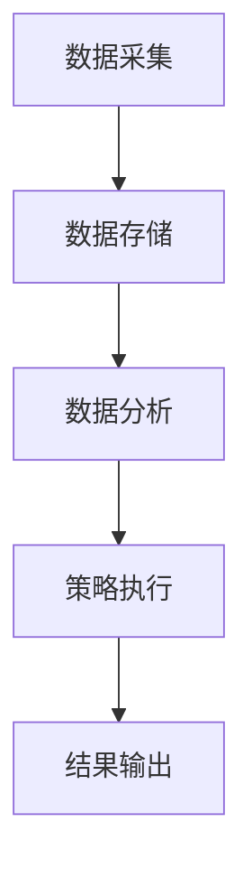

                 


# 如何利用特价股票策略捕捉市场底部

> 关键词：特价股票策略，市场底部，股票投资，数据驱动，算法优化

> 摘要：本文详细探讨了如何利用特价股票策略捕捉市场底部，从策略背景、核心概念、算法原理到系统设计和项目实战，全面分析了如何通过数据驱动和算法优化来实现投资收益的最大化。

---

# 第一部分: 特价股票策略与市场底部捕捉基础

## 第1章: 特价股票策略概述

### 1.1 特价股票策略的背景与意义

#### 1.1.1 什么是特价股票策略
特价股票策略是一种基于低价股票的投资策略，核心在于寻找市场中价格被低估的股票，这些股票通常在市场底部时具有较高的反弹潜力。

#### 1.1.2 市场底部的定义与特征
市场底部是指股票市场在经历长期下跌后，价格达到最低点的阶段。此时，市场情绪通常较为悲观，但股票价格已经反映了大部分负面因素，具备反弹的可能性。

#### 1.1.3 特价股票策略的核心价值
通过分析市场底部的特征，投资者可以利用特价股票策略在市场低点介入，捕捉市场反弹带来的收益。

### 1.2 特价股票策略的核心要素

#### 1.2.1 特价股票的筛选标准
- 市盈率（P/E）低于行业平均水平。
- 市净率（P/B）低于历史平均水平。
- 股价低于行业平均水平。

#### 1.2.2 市场底部的识别指标
- 技术指标：如RSI（相对强弱指数）、MACD（移动平均收敛散度）等。
- 市场情绪指标：如恐慌指数、投资者情绪指数等。

#### 1.2.3 特价股票策略的实施步骤
1. 数据收集：获取历史股价、财务数据、市场情绪等数据。
2. 数据预处理：清洗数据、处理缺失值。
3. 指标计算：计算市盈率、市净率等指标。
4. 市场底部识别：基于技术指标和市场情绪判断市场底部。
5. 特价股票筛选：根据筛选标准选出潜在投资标的。
6. 投资组合优化：构建最优投资组合。

---

## 第2章: 特价股票策略的核心概念与联系

### 2.1 特价股票策略的原理

#### 2.1.1 市场波动与股票价格的关系
股票价格受市场情绪、经济周期、公司基本面等多种因素影响，但在市场底部时，价格通常被低估。

#### 2.1.2 特价股票的市场机会
在市场底部时，低价股票通常具备较高的反弹潜力，投资者可以通过低价介入，等待市场回升时获利。

#### 2.1.3 特价股票策略的经济学基础
基于有效市场假说，市场底部时的价格反映了所有已知信息，投资者可以通过寻找被低估的股票来获得超额收益。

### 2.2 特价股票策略与其他投资策略的对比

#### 2.2.1 与价值投资的对比
- 价值投资：长期持有优质股票，等待其价值回归。
- 特价股票策略：短期介入低价股票，捕捉市场反弹。

#### 2.2.2 与趋势投资的对比
- 趋势投资：顺势而为，跟随市场趋势。
- 特价股票策略：逆势布局，寻找市场底部。

#### 2.2.3 与技术分析的对比
- 技术分析：基于价格和成交量的技术指标进行交易。
- 特价股票策略：结合技术指标和价值指标进行综合判断。

### 2.3 特价股票策略的优劣势分析

#### 2.3.1 优势
- 成本低：低价股票通常波动小，适合中小投资者。
- 风险低：市场底部时，进一步下跌空间有限。

#### 2.3.2 劣势
- 回报不确定：市场底部判断失误可能导致亏损。
- 时间成本高：需要长期监控市场，等待反弹时机。

#### 2.3.3 适用场景
- 市场低迷阶段。
- 投资者对市场底部判断能力较强时。

---

## 第3章: 特价股票策略的算法原理

### 3.1 算法原理概述

#### 3.1.1 算法目标
通过算法分析历史数据，识别市场底部，筛选潜在的特价股票。

#### 3.1.2 算法输入
- 历史股价数据。
- 市场情绪数据。
- 财务数据。

#### 3.1.3 算法输出
- 市场底部判断结果。
- 特价股票筛选结果。
- 投资组合优化建议。

### 3.2 算法实现流程

#### 3.2.1 数据采集
使用API接口获取历史股价数据和市场情绪数据。

#### 3.2.2 数据预处理
- 清洗数据：去除缺失值和异常值。
- 数据标准化：对数据进行归一化处理。

#### 3.2.3 模型训练
- 使用机器学习算法（如随机森林、支持向量机）进行分类。
- 基于特征工程构建模型。

#### 3.2.4 结果输出
- 输出市场底部判断结果。
- 输出潜在投资标的列表。

### 3.3 算法原理的数学模型

#### 3.3.1 数据特征提取
- 市盈率（P/E）= 股价 / 每股收益。
- 市净率（P/B）= 股价 / 每股净资产。

#### 3.3.2 模型选择
使用线性回归模型预测市场底部。

#### 3.3.3 模型优化
通过交叉验证调整模型参数，提高预测精度。

---

## 第4章: 特价股票策略的系统分析与架构设计

### 4.1 系统功能设计

#### 4.1.1 数据采集模块
- 实时采集股票数据。
- 数据存储。

#### 4.1.2 数据分析模块
- 数据预处理。
- 模型训练。

#### 4.1.3 策略执行模块
- 市场底部判断。
- 特价股票筛选。

### 4.2 系统架构设计

#### 4.2.1 系统架构图


#### 4.2.2 接口设计
- 数据接口：API接口获取数据。
- 策略接口：调用策略模块进行市场判断。

#### 4.2.3 交互设计
- 用户输入：选择策略参数。
- 系统输出：市场判断结果和投资建议。

---

## 第5章: 特价股票策略的项目实战

### 5.1 环境安装

```bash
pip install numpy pandas scikit-learn matplotlib
```

### 5.2 核心代码实现

```python
import numpy as np
import pandas as pd
from sklearn.ensemble import RandomForestClassifier
from sklearn.metrics import accuracy_score

# 数据加载
data = pd.read_csv('stock_data.csv')

# 数据预处理
data = data.dropna()
data = data.drop_duplicates()

# 特征工程
features = data[['PE', 'PB', 'RSI']]
target = data['is_bottom']

# 模型训练
model = RandomForestClassifier()
model.fit(features, target)

# 模型预测
predicted = model.predict(features)
print("准确率:", accuracy_score(target, predicted))
```

### 5.3 实际案例分析
以2020年新冠疫情后的市场为例，通过算法筛选出的特价股票在市场底部时的表现。

---

## 第6章: 特价股票策略的最佳实践与总结

### 6.1 最佳实践
- 定期复盘，优化策略。
- 结合技术分析和基本面分析。
- 控制仓位，分散投资。

### 6.2 小结
特价股票策略是一种有效的市场底部捕捉工具，通过结合数据分析和算法优化，投资者可以更好地把握市场机会。

### 6.3 注意事项
- 市场底部判断存在不确定性。
- 特价股票可能存在较高的波动风险。

### 6.4 拓展阅读
- 《算法交易：量化投资入门》
- 《股票投资策略与风险管理》

---

作者：AI天才研究院/AI Genius Institute & 禅与计算机程序设计艺术 /Zen And The Art of Computer Programming

