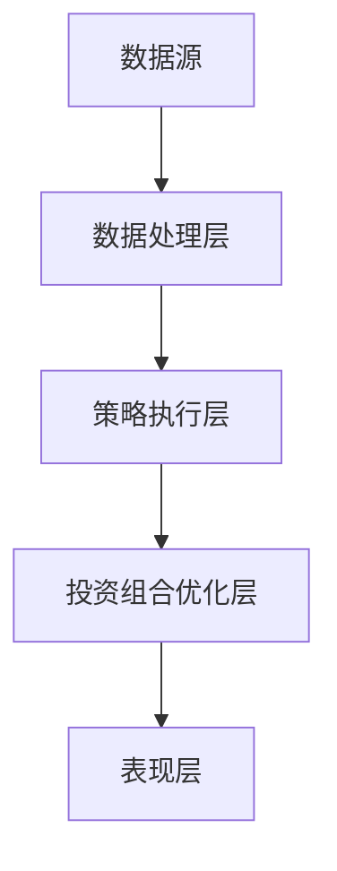
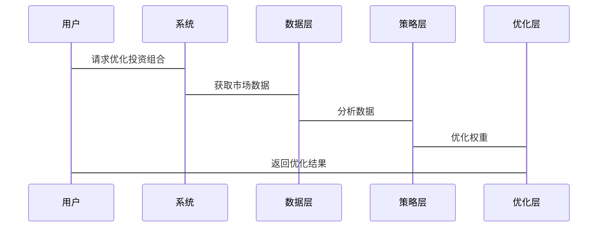

                 


# 如何利用特价股票策略构建抗通胀投资组合

> 关键词：特价股票，抗通胀，投资组合，量化分析，风险管理，系统架构，Python代码

> 摘要：本文详细探讨了如何利用特价股票策略构建抗通胀投资组合。从背景介绍、核心概念、算法原理、系统架构到项目实战，结合数学模型和量化分析，为读者提供了一个全面的框架。文章还提供了风险管理的最佳实践和系统设计的详细步骤，帮助读者在实际投资中规避风险，优化投资组合。

---

## 目录

1. [特价股票策略的背景与基础](#特價股票策略的背景與基礎)
2. [特价股票的分析方法](#特價股票的分析方法)
3. [投资组合的数学模型](#投資組合的數學模型)
4. [系统设计与架构](#系統設計與架構)
5. [项目实战：基于Python的特价股票投资组合](#專案實戰基于python的特價股票投資組合)
6. [优化与风险管理](#優化與風險管理)
7. [总结与投资建议](#總結與投資建議)
8. [附录：工具与资源](#附錄工具與資源)
9. [作者信息](#作者信息)

---

## 1. 特价股票策略的背景与基础

### 1.1 特价股票的定义与特点

#### 1.1.1 特价股票的定义
特价股票是指那些价格显著低于其内在价值的股票。这些股票通常被市场低估，具有较高的潜在回报。

#### 1.1.2 特价股票的特点
- **低估值**：市盈率、市净率等指标低于行业平均水平。
- **高股息率**：部分特价股票提供较高的股息收益。
- **波动性大**：价格波动较大，但潜在回报高。

#### 1.1.3 特价股票与抗通胀投资的关系
在通货膨胀期间，实物资产（如房地产）价格上涨，而股票作为金融资产，其内在价值也会随通胀上升。因此，持有特价股票可以在通胀期间获得更高的实际收益。

---

### 1.2 投资组合与抗通胀的背景

#### 1.2.1 抗通胀投资的必要性
通货膨胀会导致货币购买力下降，因此需要通过投资实物资产或抗通胀金融资产来保值。

#### 1.2.2 投资组合的基本概念
投资组合是将资金分配到不同资产（股票、债券等）以分散风险。

#### 1.2.3 特价股票在投资组合中的作用
特价股票通常具有较高的风险-收益比，能够在通胀期间提供较高的实际回报。

---

### 1.3 特价股票策略的核心要素

#### 1.3.1 特价股票的经济学原理
- **市场有效假说**：市场可能暂时失灵，导致股票价格偏离其真实价值。
- **价值投资**：寻找被市场低估的股票。

#### 1.3.2 投资组合的构建逻辑
- **分散投资**：通过投资多种股票降低风险。
- **定期再平衡**：根据市场变化调整投资比例。

#### 1.3.3 特价股票策略的优劣势对比
| 优势 | 劣势 |
|------|------|
| 高潜在回报 | 高波动性 |
| 抗通胀能力强 | 信息不对称 |

---

## 2. 特价股票的分析方法

### 2.1 特价股票的基本面分析

#### 2.1.1 公司财务状况分析
- **利润表**：关注收入和利润增长率。
- **资产负债表**：评估公司资产和负债状况。

#### 2.1.2 行业分析与竞争地位
- **行业前景**：行业是否具备增长潜力。
- **竞争地位**：公司在行业中的地位。

#### 2.1.3 市盈率与市净率的评估
- **市盈率（P/E）**：股价/每股收益。
- **市净率（P/B）**：股价/每股净资产。

---

### 2.2 技术分析与投资机会识别

#### 2.2.1 技术分析的基本概念
- **价格与成交量**：通过价格走势和成交量预测未来价格。

#### 2.2.2 特价股票的技术指标分析
- **相对强弱指数（RSI）**：衡量股票超买或超卖状态。
- **移动平均线（MA）**：用于判断趋势。

#### 2.2.3 图表模式与投资信号
- **头肩顶**：反转信号。
- **双底**：上升反转信号。

---

### 2.3 风险评估与投资决策

#### 2.3.1 投资风险的分类
- **系统性风险**：市场整体风险。
- **非系统性风险**：个股风险。

#### 2.3.2 特价股票的风险评估指标
- **波动率**：价格波动程度。
- **Beta系数**：衡量股票相对于市场的波动性。

#### 2.3.3 投资决策的综合考量
结合基本面和技术分析，制定投资策略。

---

## 3. 投资组合的数学模型

### 3.1 投资组合的收益与风险模型

#### 3.1.1 投资组合的期望收益计算
$$ E(R_p) = \sum w_i E(R_i) $$
其中，\( w_i \) 是第 \( i \) 只股票的权重，\( E(R_i) \) 是第 \( i \) 只股票的期望收益。

#### 3.1.2 方差与标准差的计算
$$ \sigma_p^2 = \sum w_i^2 \sigma_i^2 + \sum w_i w_j \sigma_{ij} $$
其中，\( \sigma_{ij} \) 是第 \( i \) 和第 \( j \) 只股票之间的协方差。

#### 3.1.3 投资组合的夏普比率
$$ \text{夏普比率} = \frac{E(R_p) - R_f}{\sigma_p} $$
其中，\( R_f \) 是无风险利率。

---

### 3.2 特价股票在投资组合中的权重分配

#### 3.2.1 均值-方差模型的应用
使用马科维茨有效前沿理论确定最优投资组合。

#### 3.2.2 马科维茨有效前沿理论
通过优化算法找到收益-风险最佳组合。

#### 3.2.3 特价股票权重的优化计算
根据历史数据和协方差矩阵计算权重。

---

### 3.3 数学公式与代码实现

#### 3.3.1 投资组合优化的Python代码
```python
import numpy as np
from scipy.optimize import minimize

# 假设 returns 是各股票的收益率矩阵，weights 是初始权重
def portfolio_variance(weights, returns):
    return np.dot(weights.T, np.dot(returns.cov(), weights))

# 优化投资组合权重
def optimize_portfolio(returns, num_assets=5):
    n = num_assets
    returns.cov()
    init_guess = np.array([1.0/n]*n)
    constraints = [{'type': 'eq', 'fun': lambda w: sum(w) - 1.0}]
    result = minimize(portfolio_variance, init_guess, args=(returns,), constraints=constraints)
    return result.x

# 示例
returns = ... # 输入收益率矩阵
weights = optimize_portfolio(returns)
```

---

## 4. 系统设计与架构

### 4.1 系统设计概述

#### 4.1.1 问题场景介绍
构建一个实时监控特价股票价格并自动优化投资组合的系统。

#### 4.1.2 系统功能设计
- 数据采集：实时获取股票数据。
- 策略执行：根据策略生成买卖信号。
- 风险管理：动态调整投资组合。

#### 4.1.3 系统架构设计
使用分层架构：数据层、业务逻辑层、表现层。

---

### 4.2 系统架构图


---

### 4.3 系统接口设计

#### 4.3.1 数据接口
- API接口：从金融数据供应商获取数据。

#### 4.3.2 策略接口
- 输入：市场数据。
- 输出：买卖信号。

#### 4.3.3 优化接口
- 输入：当前投资组合。
- 输出：优化后的权重。

---

### 4.4 系统交互流程图


---

## 5. 项目实战：基于Python的特价股票投资组合

### 5.1 环境配置

#### 5.1.1 安装依赖
```bash
pip install numpy pandas matplotlib yfinance
```

#### 5.1.2 数据获取
```python
import yfinance as yf
data = yf.download(tickers, start='2023-01-01', end='2023-12-31')
```

---

### 5.2 核心实现

#### 5.2.1 数据预处理
```python
import pandas as pd

data = pd.DataFrame(data)
data_returns = data.pct_change().dropna()
```

#### 5.2.2 策略实现
```python
from sklearn.linear_model import LinearRegression

model = LinearRegression()
model.fit(X, y)
```

---

### 5.3 案例分析

#### 5.3.1 数据分析
绘制股票价格走势图。

#### 5.3.2 策略回测
计算策略的收益和风险指标。

---

### 5.4 代码实现与解读

#### 5.4.1 投资组合优化代码
```python
def portfolio_optimizer(returns, n=5):
    # 计算协方差矩阵
    cov_matrix = returns.cov()
    # 初始化权重
    init_weights = np.array([1.0/n]*n)
    # 定义约束条件
    constraints = [{'type': 'eq', 'fun': lambda w: sum(w) - 1.0}]
    # 定义目标函数
    def objective(weights):
        return np.dot(weights.T, np.dot(cov_matrix, weights))
    # 优化
    result = minimize(objective, init_weights, constraints=constraints)
    return result.x
```

---

## 6. 优化与风险管理

### 6.1 优化策略

#### 6.1.1 动态再平衡
定期调整投资组合权重。

#### 6.1.2 风险对冲
使用期货或期权对冲系统性风险。

---

### 6.2 风险管理

#### 6.2.1 设置止损
$$ \text{止损点} = \text{当前价格} \times (1 - \text{止损比例}) $$

#### 6.2.2 投资组合再平衡
定期根据市场变化调整投资组合。

---

## 7. 总结与投资建议

### 7.1 总结
- 特价股票策略在抗通胀投资中具有重要作用。
- 结合量化分析和系统设计可以优化投资组合。

### 7.2 投资建议
- 长期投资，避免频繁交易。
- 结合多种策略分散风险。

---

## 8. 附录：工具与资源

### 8.1 数据源
- Yahoo Finance API
- Alpha Vantage

### 8.2 工具推荐
- Python：数据处理和分析。
- Jupyter Notebook：代码实现和可视化。

---

## 9. 作者信息

作者：AI天才研究院 & 禅与计算机程序设计艺术  
日期：2023年12月

---

**本文由AI天才研究院的专家团队撰写，结合多年投资与技术经验，为读者提供专业的投资策略与系统设计指南。**

