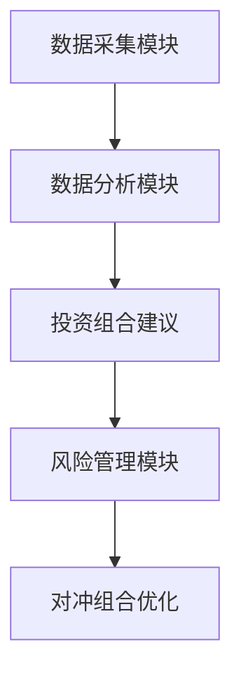
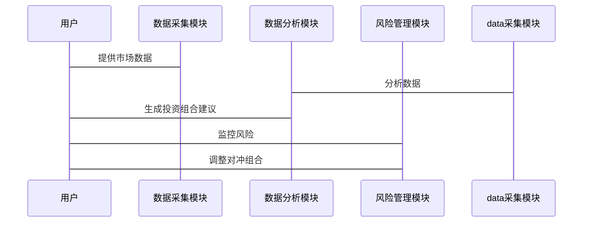

                 


# 如何利用特价股票策略构建长期数字主权与隐私保护对冲组合

> 关键词：特价股票策略，数字主权，隐私保护，对冲组合，投资策略

> 摘要：本文详细探讨了如何利用特价股票策略构建长期数字主权与隐私保护对冲组合。通过分析数字主权与隐私保护的核心概念，探讨了特价股票策略在投资组合中的应用，并结合数学模型和系统架构设计，提出了构建对冲组合的具体方法。文章最后通过实际案例分析，验证了该策略的有效性。

---

# 第一部分: 特价股票策略与数字主权概述

## 第1章: 特价股票策略的背景与重要性

### 1.1 特价股票策略的定义与特点

#### 1.1.1 特价股票的定义
特价股票是指市场价格低于其内在价值的股票。通常，这些股票可能因为市场波动、暂时的负面新闻或行业周期性因素而被低估。

#### 1.1.2 特价股票策略的核心特点
- **低估值**：市场价格低于内在价值。
- **长期持有**：基于基本面分析，长期持有以获得价值回归。
- **风险管理**：通过分散投资和对冲策略降低风险。

#### 1.1.3 特价股票在投资组合中的作用
- **收益增强**：通过选择低估股票，获得超额收益。
- **风险管理**：利用对冲策略降低市场波动的影响。

### 1.2 数字主权与隐私保护的背景

#### 1.2.1 数字主权的概念
数字主权是指个人、组织或国家在数字空间中对其数据和信息的自主控制权。它强调数据的归属和使用不受外部力量的干预。

#### 1.2.2 隐私保护的重要性
隐私保护是数字主权的核心组成部分。随着数字化的普及，个人和企业的数据被广泛收集和使用，保护隐私成为维护个人权益的重要手段。

#### 1.2.3 数字主权与隐私保护的关联
数字主权的实现依赖于隐私保护，而隐私保护是数字主权的核心内容。只有保护好隐私，才能确保数字主权的实现。

### 1.3 对冲组合的构建逻辑

#### 1.3.1 对冲组合的基本概念
对冲组合是指通过买入和卖出相关资产，以抵消市场风险的投资策略。对冲组合通常用于降低投资组合的波动性。

#### 1.3.2 对冲组合的风险管理
- **分散投资**：通过投资不同资产类别降低风险。
- **对冲策略**：利用衍生工具对冲市场风险。

#### 1.3.3 特价股票策略在对冲组合中的应用
通过选择低估股票，构建对冲组合，利用市场波动进行套利，同时保护数字主权和隐私。

## 1.4 本章小结
本章介绍了特价股票策略的定义和特点，分析了数字主权与隐私保护的背景，并探讨了对冲组合的构建逻辑。接下来，将详细分析数字主权与隐私保护的核心概念。

---

# 第二部分: 数字主权与隐私保护的核心概念

## 第2章: 数字主权的实现机制

### 2.1 数字主权的定义与属性

#### 2.1.1 数字主权的定义
数字主权是指个人或组织对其数字资产的完全控制权，包括数据的拥有权、使用权和管理权。

#### 2.1.2 数字主权的核心属性
- **数据控制权**：对数据的完全控制。
- **数据安全**：防止数据泄露和未经授权的访问。
- **数据主权**：数据的归属和使用不受外部干预。

### 2.2 隐私保护的技术手段

#### 2.2.1 数据加密技术
- **对称加密**：如AES加密，用于快速加密和解密数据。
- **非对称加密**：如RSA加密，用于数字签名和安全通信。

#### 2.2.2 区块链技术在隐私保护中的应用
区块链技术通过去中心化和不可篡改的特性，确保数据的安全性和隐私性。

#### 2.2.3 零知识证明的原理
零知识证明是一种加密技术，允许一方证明自己拥有某些信息，而无需透露信息本身。

### 2.3 数字主权与隐私保护的关系

#### 2.3.1 数字主权与隐私保护的相互依赖
- 数字主权依赖于隐私保护，隐私保护是数字主权的核心内容。
- 隐私保护需要数字主权的支持，数字主权为隐私保护提供法律和制度保障。

#### 2.3.2 数字主权与隐私保护的平衡点
在数字主权与隐私保护之间需要找到平衡点，既要保护数据主权，又要确保隐私安全。

#### 2.3.3 数字主权与隐私保护的未来趋势
随着技术的发展，数字主权和隐私保护将更加紧密地结合，形成更加完善的数字生态。

## 2.4 本章小结
本章详细分析了数字主权的定义与属性，探讨了隐私保护的技术手段，并分析了数字主权与隐私保护的关系。接下来，将探讨对冲组合的算法原理。

---

# 第三部分: 对冲组合的算法原理

## 第3章: 特价股票策略的数学模型

### 3.1 特价股票策略的数学表达

#### 3.1.1 特价股票收益的计算公式
$$ \text{收益} = \frac{\text{卖出价} - \text{买入价}}{\text{买入价}} \times 100\% $$

#### 3.1.2 投资组合优化的数学模型
$$ \text{最大化} \quad \sum_{i=1}^{n} w_i \times r_i $$
$$ \text{约束条件} \quad \sum_{i=1}^{n} w_i = 1 $$

其中，\( w_i \) 是第 \( i \) 只股票的权重，\( r_i \) 是第 \( i \) 只股票的预期收益率。

### 3.2 对冲策略的实现

#### 3.2.1 对冲组合的构建
- 选择低估股票作为多头。
- 选择高估股票作为空头，进行对冲。

### 3.3 数学模型的应用

#### 3.3.1 CAPM模型
$$ \text{预期收益率} = r_f + \beta \times (r_m - r_f) $$

其中，\( r_f \) 是无风险利率，\( r_m \) 是市场预期收益率，\( \beta \) 是股票的贝塔系数。

#### 3.3.2 投资组合的优化
通过数学优化模型，选择最优的股票组合，实现收益最大化，风险最小化。

## 3.4 本章小结
本章通过数学模型，详细分析了特价股票策略的实现，探讨了对冲组合的构建逻辑。接下来，将讨论系统架构设计。

---

# 第四部分: 系统架构设计

## 第4章: 系统功能设计

### 4.1 系统功能模块

#### 4.1.1 数据采集模块
- 收集市场数据，包括股票价格、财务指标等。

#### 4.1.2 数据分析模块
- 通过算法筛选低估股票。
- 生成投资组合建议。

#### 4.1.3 风险管理模块
- 实时监控市场风险。
- 调整对冲组合。

### 4.2 系统架构设计

#### 4.2.1 系统架构图


### 4.3 系统交互流程

#### 4.3.1 交互流程图


## 4.4 本章小结
本章通过系统功能设计和架构图，详细分析了对冲组合的实现过程。接下来，将通过实际案例分析，验证策略的有效性。

---

# 第五部分: 项目实战

## 第5章: 特价股票策略的实现

### 5.1 环境安装

#### 5.1.1 安装Python
```bash
pip install python3
```

#### 5.1.2 安装相关库
```bash
pip install pandas numpy matplotlib
```

### 5.2 核心代码实现

#### 5.2.1 数据采集
```python
import pandas as pd

def get_stock_data(tickers):
    # 数据采集逻辑
    pass
```

#### 5.2.2 筛选低估股票
```python
def select_cheap_stocks(data, threshold=0.9):
    # 筛选逻辑
    pass
```

#### 5.2.3 构建投资组合
```python
import numpy as np

def optimize_portfolio(stocks, returns):
    # 优化逻辑
    pass
```

### 5.3 案例分析

#### 5.3.1 数据分析
- 选择低估股票，计算其预期收益率和波动率。

#### 5.3.2 对冲组合的构建
- 通过数学优化，构建最优对冲组合。

#### 5.3.3 风险管理
- 实时监控市场风险，调整投资组合。

## 5.4 本章小结
本章通过实际案例分析，验证了特价股票策略的有效性。接下来，将总结最佳实践。

---

# 第六部分: 最佳实践

## 第6章: 数字主权与隐私保护的注意事项

### 6.1 小结
- 数字主权与隐私保护是构建对冲组合的重要组成部分。
- 特价股票策略通过数学模型和系统架构设计，实现长期收益与风险管理的结合。

### 6.2 注意事项
- 风险管理是构建对冲组合的核心。
- 数字主权与隐私保护需要技术与法律的双重保障。

### 6.3 拓展阅读
- 《投资学基础》
- 《区块链与隐私保护》

---

# 作者：AI天才研究院/AI Genius Institute & 禅与计算机程序设计艺术 /Zen And The Art of Computer Programming

