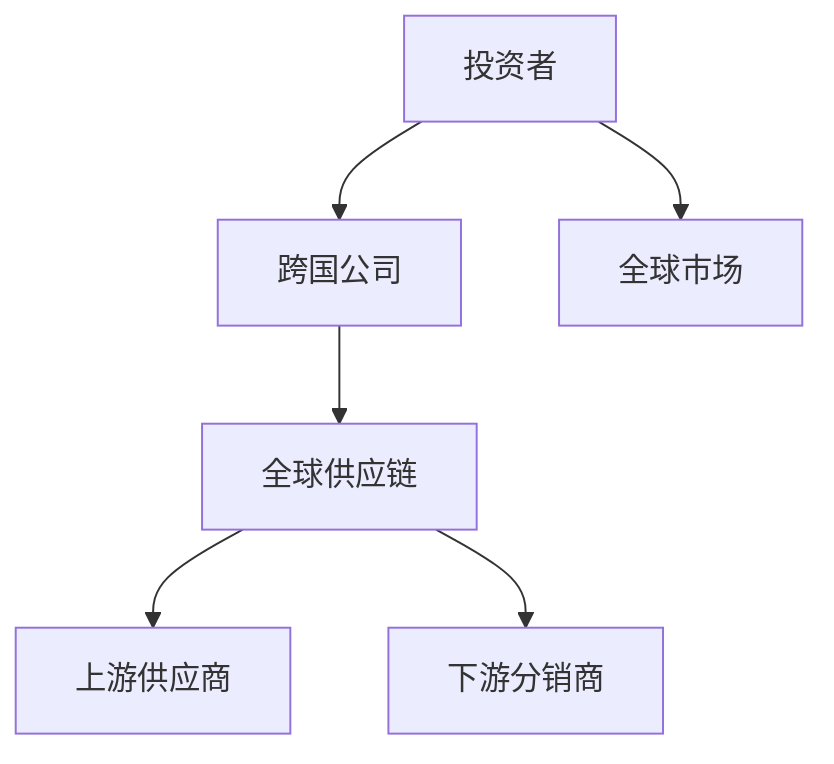
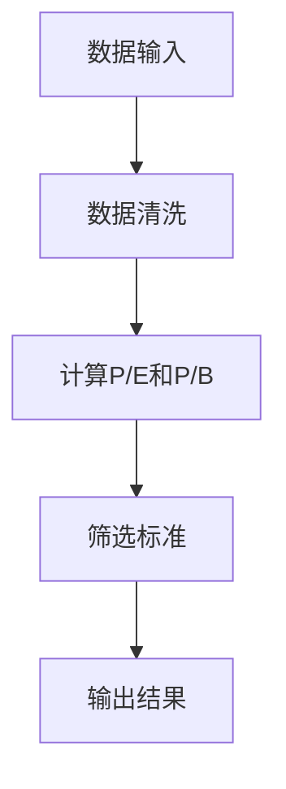
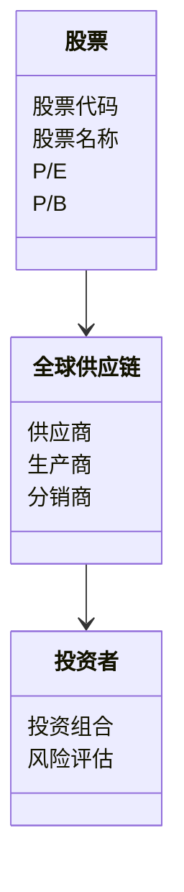
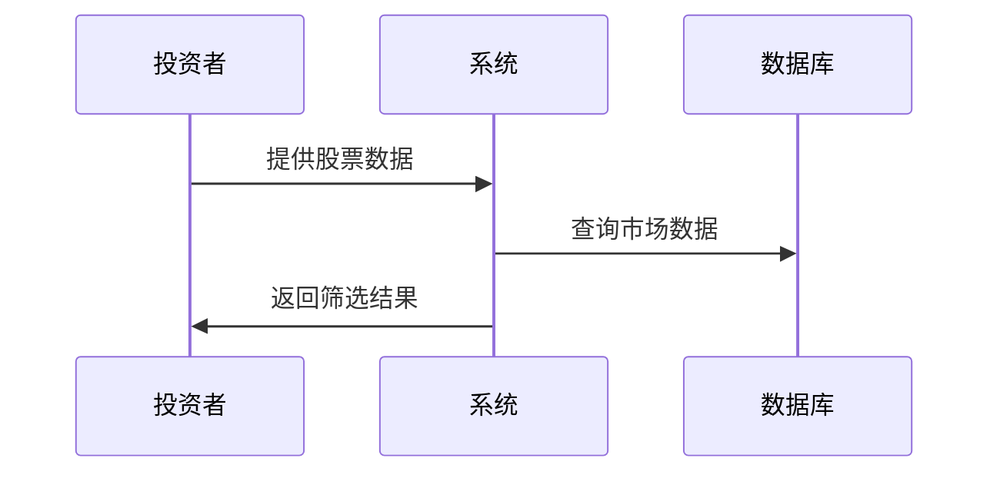

                 


# 如何利用特价股票策略进行全球价值链投资

## 关键词：
- 特价股票策略
- 全球价值链
- 投资分析
- 股票筛选算法
- 跨国公司

## 摘要：
本文详细探讨了如何利用特价股票策略在全球价值链中进行有效投资。通过分析特价股票的核心概念、全球价值链的运作机制，以及两者结合的投资策略，本文为投资者提供了从理论到实践的全面指导。结合数学模型、算法流程图和Python代码示例，本文深入讲解了如何识别价值洼地、构建投资组合，并通过风险管理优化投资成果。

---

## 第一部分: 特价股票策略与全球价值链投资的背景与基础

### 第1章: 特价股票策略的定义与特点

#### 1.1 特价股票的定义与核心要素

##### 1.1.1 特价股票的定义
特价股票是指市场价格低于其内在价值的股票。这种股票通常被市场低估，具有较大的增值潜力。特价股票的核心在于发现市场中的“价值洼地”，即市场价格低于公司实际价值的情况。

##### 1.1.2 特价股票的核心特点
- **低估值**：市场价格低于公司账面价值或行业平均水平。
- **高安全边际**：买入价格远低于内在价值，降低投资风险。
- **周期性机会**：通常在市场低迷或公司短期问题时出现。

##### 1.1.3 特价股票与普通股票的区别
| 特性 | 特价股票 | 普通股票 |
|------|----------|----------|
| 价格 | 低于价值 | 反映市场情绪 |
| 风险 | 较低     | 较高      |
| 投资策略 | 价值投资 | 趋势投资 |

#### 1.2 全球价值链的基本概念

##### 1.2.1 全球价值链的定义
全球价值链是指跨国公司在全球范围内组织生产、分配和销售产品的链条。它包括从原材料采购、生产制造到最终产品的分销和消费的各个环节。

##### 1.2.2 全球价值链的主要参与者
- **跨国公司**：核心企业，主导全球生产网络。
- **上游供应商**：提供原材料和零部件。
- **下游分销商**：负责产品的销售和市场推广。
- **消费者**：最终产品的需求方。

##### 1.2.3 全球价值链的运作机制
全球价值链通过跨国分工和协作，优化资源分配，降低成本，提高效率。例如，跨国公司将生产环节外包给低成本国家，利用当地劳动力优势，同时在发达国家市场进行销售。

#### 1.3 特价股票策略与全球价值链投资的结合

##### 1.3.1 特价股票策略在投资中的作用
- **价值发现**：在全球价值链中寻找被低估的公司。
- **风险分散**：通过跨国投资降低区域风险。

##### 1.3.2 全球价值链投资的优势
- **全球化视野**：利用不同国家的市场差异。
- **成本优势**：通过全球供应链降低成本。

##### 1.3.3 两者结合的逻辑与可行性
- **逻辑**：在全球价值链中，某些公司可能因市场波动或行业周期而被低估，特价股票策略可以帮助投资者发现这些机会。
- **可行性**：通过分析跨国公司的全球供应链和市场表现，投资者可以在全球范围内寻找价值洼地。

---

### 第2章: 特价股票策略的核心概念与联系

#### 2.1 特价股票策略的原理

##### 2.1.1 市场有效性的假设
有效市场假说认为市场价格反映所有可用信息，但现实中市场可能存在短期非理性，导致价格偏离价值。

##### 2.1.2 价值发现的逻辑
投资者通过分析公司基本面，寻找市场价格低于内在价值的机会。

##### 2.1.3 股价波动与投资机会
股价波动为投资者提供了低价买入的机会，尤其是在市场恐慌或公司特定问题时。

#### 2.2 全球价值链的实体关系图

##### 2.2.1 全球价值链的参与者关系


#### 2.3 特价股票策略与全球价值链的关系

##### 2.3.1 全球价值链中的价值洼地
跨国公司可能因全球经济波动或行业周期被低估，投资者可以利用这些机会。

##### 2.3.2 特价股票策略在跨国公司中的应用
分析跨国公司的全球供应链和市场表现，寻找被低估的股票。

##### 2.3.3 全球市场波动对特价股票的影响
全球经济波动可能导致特定市场或行业出现价值洼地，投资者可以利用特价股票策略进行投资。

---

### 第3章: 特价股票策略的算法与数学模型

#### 3.1 特价股票筛选算法

##### 3.1.1 数据输入
收集全球范围内跨国公司的股票数据，包括市盈率（P/E）、市净率（P/B）等指标。

##### 3.1.2 数据清洗
去除无效数据，处理异常值，确保数据准确。

##### 3.1.3 计算市盈率和市净率
使用以下公式计算：
$$ P/E = \frac{股票价格}{每股净利润} $$
$$ P/B = \frac{股票价格}{每股净资产} $$

##### 3.1.4 筛选标准
选择P/E和P/B低于行业平均水平的股票。

#### 3.2 算法流程图


#### 3.3 Python代码实现
```python
import pandas as pd

# 假设data是一个包含股票数据的DataFrame，包括'P/E'和'P/B'列
# 筛选P/E和P/B低于行业平均水平的股票
industry_average_pe = data['P/E'].mean()
industry_average_pb = data['P/B'].mean()

# 筛选条件
mask = (data['P/E'] < industry_average_pe) & (data['P/B'] < industry_average_pb)

# 输出结果
selected_stocks = data[mask]
print(selected_stocks)
```

#### 3.4 数学模型与公式
- 市盈率（P/E）：
$$ P/E = \frac{P}{EPS} $$
- 市净率（P/B）：
$$ P/B = \frac{P}{BPS} $$

---

### 第4章: 系统分析与架构设计方案

#### 4.1 问题场景介绍
跨国公司在全球价值链中的表现受多种因素影响，投资者需要分析这些因素以发现价值洼地。

#### 4.2 项目介绍
构建一个基于全球价值链的特价股票筛选系统，帮助投资者发现被低估的跨国公司。

#### 4.3 系统功能设计

##### 4.3.1 领域模型


##### 4.3.2 系统架构设计


##### 4.3.3 系统接口设计
- 输入接口：接收股票数据和市场数据。
- 输出接口：显示筛选结果和投资建议。

##### 4.3.4 系统交互设计


---

### 第5章: 实战案例

#### 5.1 数据收集与清洗

##### 5.1.1 数据来源
从全球股票数据库中获取跨国公司的股票数据。

##### 5.1.2 数据清洗
处理缺失值和异常值，确保数据准确。

#### 5.2 特价股票筛选

##### 5.2.1 计算P/E和P/B
使用上述公式计算每个股票的P/E和P/B。

##### 5.2.2 应用筛选标准
选择P/E和P/B低于行业平均水平的股票。

#### 5.3 投资组合构建

##### 5.3.1 确定投资比例
根据风险偏好和市场趋势分配投资比例。

##### 5.3.2 监控与调整
定期监控投资组合的表现，根据市场变化进行调整。

#### 5.4 数据可视化

##### 5.4.1 使用Matplotlib绘制图表
```python
import matplotlib.pyplot as plt

selected_stocks = [stock1, stock2, stock3]
plt.bar(selected_stocks, [price1, price2, price3])
plt.title('Selected Stocks')
plt.show()
```

---

### 第6章: 风险管理与优化

#### 6.1 风险评估

##### 6.1.1 市场风险
全球市场波动可能影响股票价格。

##### 6.1.2 公司风险
公司特定问题可能导致股价下跌。

#### 6.2 风险管理策略

##### 6.2.1 分散投资
通过投资不同行业和地区的股票降低风险。

##### 6.2.2 定期再平衡
定期调整投资组合以适应市场变化。

#### 6.3 优化策略

##### 6.3.1 动态筛选
定期更新股票筛选标准，捕捉新的价值洼地。

##### 6.3.2 结合技术分析
将技术分析与价值分析结合，提高投资效果。

---

### 第7章: 高级主题与未来趋势

#### 7.1 量化分析与机器学习

##### 7.1.1 量化分析的应用
使用大数据和算法进行股票筛选和预测。

##### 7.1.2 机器学习在投资中的应用
利用机器学习模型预测市场趋势和股票价值。

#### 7.2 全球供应链的变化

##### 7.2.1 供应链重构
全球化背景下，供应链可能重新分布，影响跨国公司的价值。

##### 7.2.2 新兴市场的机会
新兴市场可能成为新的价值洼地，值得投资者关注。

---

### 第8章: 总结与附录

#### 8.1 总结
利用特价股票策略在全球价值链中进行投资需要结合市场分析、公司基本面和全球供应链的运作。通过系统的分析和风险管理，投资者可以在全球范围内发现价值洼地，实现长期收益。

#### 8.2 附录

##### 8.2.1 数据来源
- 全球股票数据库
- 行业分析报告

##### 8.2.2 工具与资源
- Python编程语言
- Pandas和Matplotlib库
- 股票分析工具

##### 8.2.3 参考文献
- 约翰·涅iman的《价值投资入门》
- 彼得·林奇的《投资最重要的事情》

---

## 作者：AI天才研究院/AI Genius Institute & 禅与计算机程序设计艺术 /Zen And The Art of Computer Programming

