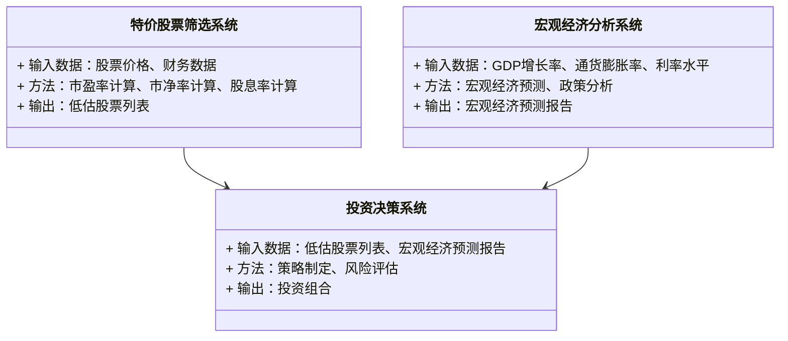
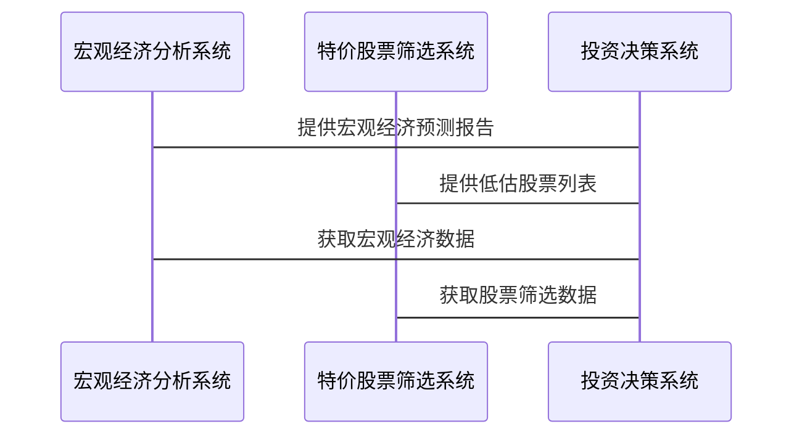

                 

<think>
好的，我将按照您的要求撰写一篇关于如何利用特价股票策略进行全球宏观对冲的技术博客文章。我们先从标题、关键词和摘要开始，然后逐步展开各个章节内容。由于文章较长，我将分段呈现。

# 如何利用特价股票策略进行全球宏观对冲

**关键词**：特价股票策略、全球宏观对冲、股票投资、风险管理、算法交易

**摘要**：  
本文详细探讨了如何利用特价股票策略在全球宏观对冲中实现收益最大化。通过分析特价股票的核心概念、全球宏观经济因素对股市的影响，以及两者结合的策略实施，本文为投资者提供了一套系统化的投资方法。文章结合数学模型、算法实现和实际案例，深入讲解了如何在复杂的经济环境中制定有效的投资策略，并通过风险管理和系统优化提升投资组合的稳定性。

---

## 第一章：特价股票策略的背景与概念

### 1.1 特价股票的定义与特点

特价股票是指那些市场价格显著低于其内在价值的股票。这类股票通常具有较高的安全边际，能够为投资者提供较大的潜在收益空间。以下是特价股票的几个核心特点：

- **低估值**：特价股票的市场价格低于其账面价值或行业平均水平，通常可以通过市盈率（P/E）、市净率（P/B）等指标来衡量。
- **高潜力**：这些股票往往处于低估状态，但其基本面具有改善的潜力，例如行业复苏、管理改善或市场周期性波动。
- **风险较高**：由于股价被低估，市场可能已经反映了部分负面信息，投资者需要具备一定的风险承受能力。

**表1-1：特价股票与非特价股票的对比**

| 特性         | 特价股票                  | 非特价股票                |
|--------------|---------------------------|---------------------------|
| 市盈率       | 低于行业平均水平          | 高于行业平均水平          |
| 市净率       | 低于行业平均水平          | 高于行业平均水平          |
| 股价波动性   | 较高                     | 较低                     |
| 投资风险     | 较高                     | 较低                     |

### 1.2 特价股票策略的背景与重要性

#### 1.2.1 特价股票策略的背景

特价股票策略并非新兴的投资策略，其历史可以追溯到本杰明·格雷厄姆的价值投资理念。格雷厄姆强调以低于内在价值的价格买入股票，以获得安全边际和长期收益。随着市场的发展，投资者逐渐将这种策略应用于全球化的市场环境中。

#### 1.2.2 特价股票策略的重要性

在全球化背景下，特价股票策略的重要性主要体现在以下几个方面：

1. **风险分散**：通过选择多个低估的股票，投资者可以分散行业或地区的风险。
2. **收益潜力**：当市场恢复理性时，低估股票的价格往往会出现反弹，带来超额收益。
3. **逆向投资**：在市场恐慌时买入低估股票，能够在市场复苏时获得丰厚回报。

### 1.3 特价股票策略的应用场景

#### 1.3.1 特价股票在熊市中的机会

熊市通常伴随着市场的恐慌性抛售，许多优质股票的价格被压低，为投资者提供了买入特价股票的机会。例如，在2020年新冠疫情爆发期间，许多航空公司的股票价格大幅下跌，但其基本面并未发生根本性变化，为投资者提供了抄底的机会。

#### 1.3.2 特价股票在牛市中的风险

在牛市中，市场情绪高涨，投资者可能忽视基本面因素，导致特价股票的表现相对平淡。然而，牛市中也存在部分被市场忽视的低估股票，投资者需要通过深入分析来识别这些机会。

#### 1.3.3 特价股票与宏观经济周期的关系

经济周期对股市有显著影响，尤其是在衰退期和复苏期，特价股票策略往往表现优异。例如，在经济衰退期间，某些行业的股票可能被过度抛售，导致其市场价格低于内在价值。

---

## 第二章：全球宏观对冲的基本原理

### 2.1 全球宏观对冲的定义与特点

#### 2.1.1 全球宏观对冲的定义

全球宏观对冲是一种通过分析全球宏观经济因素，利用金融衍生工具进行套利和对冲的投资策略。投资者通过分析全球经济趋势、货币政策、地缘政治等因素，制定相应的投资策略。

#### 2.1.2 全球宏观对冲的核心要素

- **宏观经济分析**：分析GDP增长率、通货膨胀率、利率水平、汇率波动等宏观经济指标。
- **市场情绪分析**：通过投资者情绪指标（如VIX指数）来判断市场的风险偏好。
- **政策预期**：关注各国政府的财政政策和货币政策，预测其对市场的影响。

### 2.2 宏观经济因素对股市的影响

#### 2.2.1 经济周期对股市的影响

经济周期对股市的影响是多方面的。在经济衰退期，企业盈利下降，股票价格通常会下跌；而在经济复苏期，企业盈利回升，股票价格往往会上涨。

#### 2.2.2 利率政策对股市的影响

利率水平是影响股市的重要因素。低利率环境通常会刺激股市上涨，因为投资者更倾向于将资金投入风险较高的资产以追求更高的回报。相反，高利率环境可能会抑制股市表现，因为债券等固定收益资产的吸引力增强。

#### 2.2.3 汇率波动对股市的影响

汇率波动对股市的影响主要体现在以下几个方面：

1. **出口型企业**：如果本币贬值，出口型企业的竞争力增强，其股票价格可能上涨。
2. **进口型企业**：如果本币升值，进口型企业的成本增加，其股票价格可能下跌。
3. **国际投资**：汇率波动会影响国际资本流动，进而影响股市的整体表现。

### 2.3 全球宏观对冲策略的实施步骤

#### 2.3.1 宏观分析与策略制定

投资者需要对全球经济趋势进行深入分析，制定相应的投资策略。例如，在全球经济复苏期，可以考虑增加对周期性行业的投资。

#### 2.3.2 仓位配置与风险控制

投资者需要根据宏观经济分析结果进行仓位配置，并通过衍生工具（如期货、期权）进行风险对冲，以降低市场波动对投资组合的影响。

#### 2.3.3 交易执行与绩效评估

在制定策略后，投资者需要通过高效的交易执行系统进行操作，并定期评估投资策略的绩效，及时调整投资组合。

---

## 第三章：特价股票策略与全球宏观对冲的结合

### 3.1 特价股票策略的数学模型与算法

#### 3.1.1 市盈率模型

市盈率（P/E）是衡量股票估值的重要指标。其计算公式为：

$$ P/E = \frac{股票价格}{每股净利润} $$

当P/E低于行业平均水平时，股票可能具有低估特性。

#### 3.1.2 市净率模型

市净率（P/B）是另一种常用的估值指标。其计算公式为：

$$ P/B = \frac{股票价格}{每股净资产} $$

当P/B低于1时，股票通常被视为低估。

#### 3.1.3 股息率模型

股息率（Dividend Yield）是衡量股票收益能力的指标。其计算公式为：

$$ 股息率 = \frac{每股股息}{股票价格} \times 100\% $$

高股息率的股票通常具有较高的投资价值。

#### 3.1.4 基于机器学习的股票筛选算法

以下是基于机器学习的股票筛选算法的Python代码示例：

```python
import pandas as pd
from sklearn.svm import SVC
from sklearn.model_selection import train_test_split
from sklearn.metrics import accuracy_score

# 数据预处理
data = pd.read_csv('stock_data.csv')
X = data[['P/E', 'P/B', '股息率']]
y = data['是否低估']  # 1表示低估，0表示非低估

# 划分训练集和测试集
X_train, X_test, y_train, y_test = train_test_split(X, y, test_size=0.2, random_state=42)

# 训练模型
model = SVC()
model.fit(X_train, y_train)

# 预测与评估
y_pred = model.predict(X_test)
print("准确率:", accuracy_score(y_test, y_pred))
```

#### 3.1.5 基于统计套利的股票交易算法

以下是基于统计套利的股票交易算法的Python代码示例：

```python
import pandas as pd
import numpy as np
from sklearn.linear_model import LinearRegression

# 数据预处理
data = pd.read_csv('stock_data.csv')
X = data[['P/E', 'P/B', '股息率']]
y = data['未来收益']

# 训练模型
model = LinearRegression()
model.fit(X, y)

# 预测收益
predicted_returns = model.predict(X)

# 策略实施
positions = np.where(predicted_returns > np.mean(predicted_returns), 1, -1)
returns = positions * y
print("平均收益率:", np.mean(returns))
```

### 3.2 全球宏观对冲策略的系统架构设计

#### 3.2.1 系统功能设计

以下是系统功能设计的Mermaid类图：



#### 3.2.2 系统架构设计

以下是系统架构设计的Mermaid架构图：

```mermaid
container 宏观经济分析模块 {
    service 宏观经济数据采集
    service 宏观经济预测模型
}

container 特价股票筛选模块 {
    service 特价股票数据采集
    service 特价股票筛选算法
}

container 投资决策模块 {
    service 投资策略制定
    service 风险管理
}

宏观经济分析模块 --> 投资决策模块
特价股票筛选模块 --> 投资决策模块
```

#### 3.2.3 系统接口设计

以下是系统接口设计的Mermaid序列图：



---

## 第四章：项目实战与案例分析

### 4.1 项目环境安装

以下是项目实战所需的环境安装命令：

```bash
# 安装所需的Python库
pip install pandas numpy scikit-learn matplotlib
```

### 4.2 系统核心代码实现

#### 4.2.1 特价股票筛选代码

```python
import pandas as pd
import numpy as np

def calculate_pe_ratio(data):
    return data['股价'] / data['每股净利润']

def calculate_pb_ratio(data):
    return data['股价'] / data['每股净资产']

def calculate_dividend_yield(data):
    return (data['每股股息'] / data['股价']) * 100

# 示例数据
data = {
    '股价': [10, 20, 30, 40],
    '每股净利润': [2, 3, 4, 5],
    '每股净资产': [5, 10, 15, 20],
    '每股股息': [1, 2, 3, 4]
}

df = pd.DataFrame(data)

# 计算估值指标
pe = calculate_pe_ratio(df)
pb = calculate_pb_ratio(df)
dividend_yield = calculate_dividend_yield(df)

print("市盈率:", pe)
print("市净率:", pb)
print("股息率:", dividend_yield)
```

#### 4.2.2 全球宏观对冲代码

```python
import pandas as pd
from sklearn.linear_model import LinearRegression

def macroeconomic_analysis(data):
    model = LinearRegression()
    model.fit(data[['GDP增长率', '通货膨胀率', '利率水平']], data['股价'])
    return model

# 示例数据
data = {
    'GDP增长率': [2, 3, 4, 5],
    '通货膨胀率': [1, 2, 3, 4],
    '利率水平': [0.05, 0.06, 0.07, 0.08],
    '股价': [100, 110, 120, 130]
}

df = pd.DataFrame(data)

# 训练宏观分析模型
model = macroeconomic_analysis(df)

# 预测股价
predicted_prices = model.predict(df[['GDP增长率', '通货膨胀率', '利率水平']])
print("预测股价:", predicted_prices)
```

### 4.3 实际案例分析

#### 4.3.1 案例背景

假设我们有一个包含全球多个市场的股票数据，我们需要通过特价股票策略和全球宏观对冲策略相结合，制定一个投资组合。

#### 4.3.2 数据分析与策略制定

1. **数据采集**：收集全球主要市场的股票数据，包括市盈率、市净率、股息率等指标。
2. **筛选特价股票**：通过计算市盈率、市净率和股息率，筛选出低估股票。
3. **宏观经济分析**：分析全球经济趋势，制定投资策略。
4. **投资组合配置**：根据筛选结果和宏观经济分析结果，配置投资组合。

#### 4.3.3 投资组合优化

通过数学优化模型，调整投资组合的权重，以实现收益最大化和风险最小化。

---

## 第五章：高级策略与风险管理

### 5.1 高级策略：对冲策略

#### 5.1.1 什么是对冲策略

对冲策略是指通过同时买入和卖出相关资产，以抵消市场波动带来的风险。

#### 5.1.2 对冲策略的实施步骤

1. **识别相关资产**：选择与目标资产相关性较高的资产。
2. **建立头寸**：买入目标资产，卖出相关资产。
3. **监控与调整**：定期监控头寸，根据市场变化进行调整。

### 5.2 风险管理模型

#### 5.2.1 风险管理的重要性

在投资过程中，风险管理是确保投资组合稳定性的关键。

#### 5.2.2 风险管理模型的实现

以下是风险管理模型的Python代码示例：

```python
import numpy as np

def calculate VaR(data, confidence_level=95):
    returns = data['收益']
    sorted_returns = sorted(returns)
    percentile = (1 - confidence_level/100) * len(sorted_returns)
    VaR = sorted_returns[int(percentile)]
    return VaR

# 示例数据
data = {
    '收益': [0.01, 0.02, -0.01, 0.03, -0.02]
}

df = pd.DataFrame(data)

VaR = calculate VaR(df, 95)
print("VaR值:", VaR)
```

---

## 第六章：总结与展望

### 6.1 本章总结

本文详细探讨了如何利用特价股票策略进行全球宏观对冲。通过分析特价股票的核心概念、全球宏观经济因素对股市的影响，以及两者结合的策略实施，为投资者提供了一套系统化的投资方法。

### 6.2 未来展望

随着人工智能和大数据技术的不断发展，特价股票策略和全球宏观对冲策略的结合将更加紧密。未来的研究可以进一步探索以下方向：

1. **多因子模型**：结合多个因子（如价值因子、动量因子等）进行股票筛选。
2. **实时交易系统**：开发实时交易系统，提高交易效率。
3. **风险管理优化**：通过引入更复杂的风险管理模型，进一步提高投资组合的稳定性。

---

## 作者：AI天才研究院/AI Genius Institute & 禅与计算机程序设计艺术 /Zen And The Art of Computer Programming

感谢您的阅读！希望本文能够为您的投资决策提供有价值的参考。如需进一步探讨或合作，欢迎随时联系！

