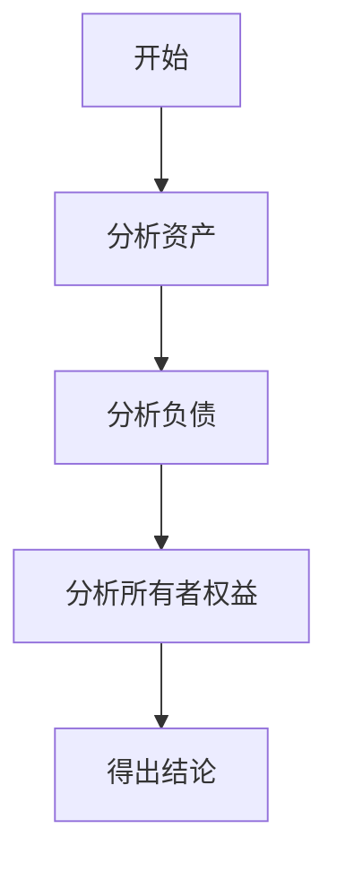
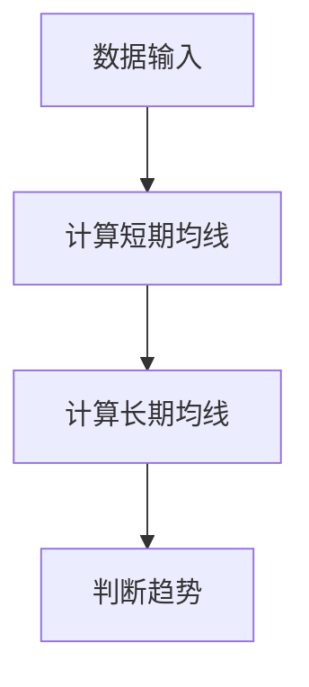
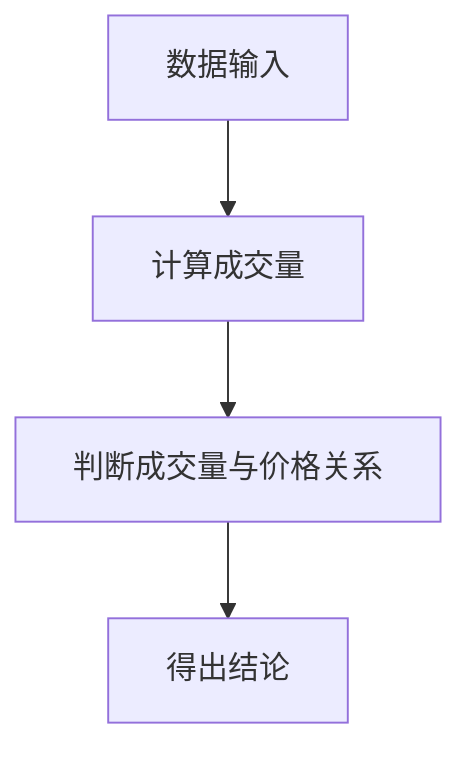
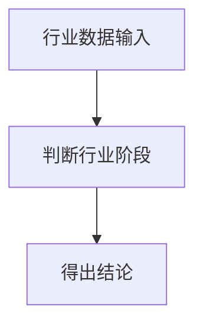
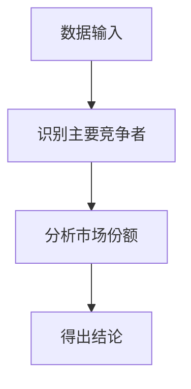
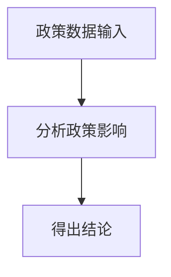
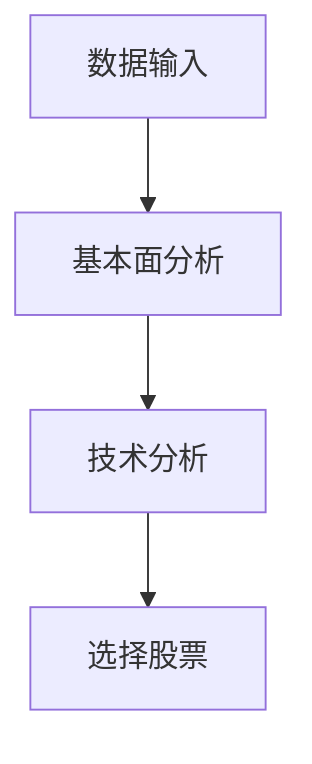
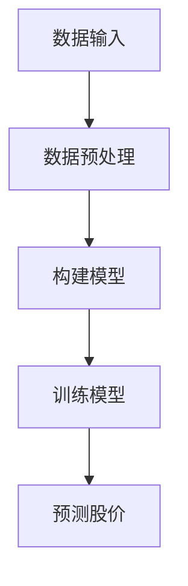
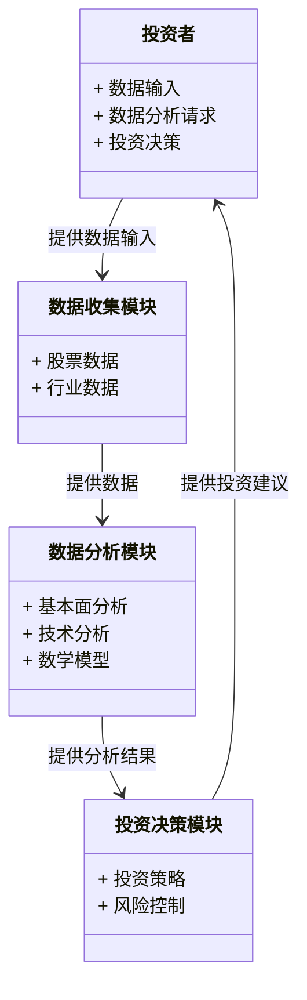
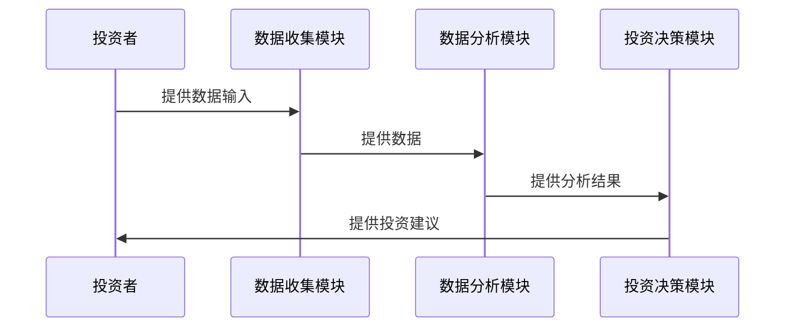

                 


# 如何利用特价股票策略进行全球数字价值链投资

## 关键词：特价股票、数字价值链、价值投资、技术分析、数字转型

## 摘要：  
在全球数字转型的背景下，数字价值链成为投资的重要领域。特价股票策略作为一种有效的投资方法，结合数字价值链的分析，可以帮助投资者在数字转型中抓住价值洼地。本文将详细探讨特价股票策略的基本原理、数字价值链的构成、分析方法，以及如何利用数学模型和系统架构设计来优化投资决策。通过实际案例分析和最佳实践分享，为投资者提供实用的指导。

---

## 第一部分: 特价股票策略与全球数字价值链投资基础

### 第1章: 特价股票策略的概述

#### 1.1 什么是特价股票
- **1.1.1 特价股票的定义**  
  特价股票是指市场价格低于其内在价值的股票，通常被认为被市场低估，具有较大的上涨潜力。  
  $$内在价值 = \text{公司未来现金流的现值}$$  

- **1.1.2 特价股票的特点**  
  - 价格低于行业平均水平。  
  - 公司基本面良好，但市场情绪或短期因素导致股价被压制。  
  - 投资风险相对较低，回报潜力较高。  

- **1.1.3 特价股票与普通股票的区别**  
  | 特点 | 特价股票 | 普通股票 |  
  |------|----------|----------|  
  | 价格 | 低于价值 | 靠近价值 |  
  | 风险 | 较低     | 较高     |  
  | 回报 | 较高     | 较稳定   |  

#### 1.2 全球数字价值链的定义与特点
- **1.2.1 数字价值链的定义**  
  数字价值链是指从数据生成、处理、分析到应用的完整链条，涵盖技术、服务、数据等多个环节。  

- **1.2.2 数字价值链的构成**  
  - 数据生成：传感器、用户行为等。  
  - 数据存储：云服务、数据库。  
  - 数据处理：人工智能、大数据分析。  
  - 数据应用：商业决策、产品优化。  

- **1.2.3 数字价值链的核心要素**  
  - 数据技术：AI、大数据、区块链。  
  - 行业应用：金融、医疗、教育。  
  - 市场需求：数字化转型需求。  

#### 1.3 特价股票策略在数字价值链投资中的应用
- **1.3.1 特价股票策略的基本原理**  
  - 通过基本面和技术分析，识别被低估的股票。  
  - 关注行业趋势和公司前景，选择具有增长潜力的公司。  

- **1.3.2 数字价值链投资的基本逻辑**  
  - 数字化转型带来新的投资机会。  
  - 数字价值链中的公司具有较高的增长潜力。  
  - 通过特价股票策略，捕捉低估值公司的价值回归机会。  

- **1.3.3 特价股票策略与数字价值链投资的结合**  
  - 重点关注数字价值链中的低估值公司。  
  - 结合行业趋势和公司基本面，选择具有竞争优势的股票。  

---

## 第二部分: 特价股票分析方法

### 第2章: 基本面分析

#### 2.1.1 市盈率分析  
$$\text{市盈率} = \frac{\text{股价}}{\text{每股收益}}$$  
- 市盈率低于行业平均水平的公司可能具有投资价值。  

#### 2.1.2 市净率分析  
$$\text{市净率} = \frac{\text{股价}}{\text{每股净资产}}$$  
- 市净率低于1的公司可能被低估。  

#### 2.1.3 资产负债表分析  
- 关注公司负债情况、资产质量等。  
- 通过mermaid流程图展示资产负债表分析步骤：  


### 第2章: 技术分析

#### 2.2.1 K线图分析  
- 通过K线图观察股票价格的波动趋势。  
- 使用mermaid绘制K线图示例：  
```mermaid
chart line
    "价格"
    100, 120, 90, 110, 130
```

#### 2.2.2 移动平均线分析  
- 计算短期和长期移动平均线，判断趋势。  
- 使用mermaid流程图展示移动平均线分析步骤：  


#### 2.2.3 成交量分析  
- 成交量是判断趋势强度的重要指标。  
- 使用mermaid流程图展示成交量分析步骤：  


### 第2章: 行业分析

#### 2.3.1 行业周期分析  
- 行业周期分为复苏期、增长期、成熟期和衰退期。  
- 使用mermaid流程图展示行业周期分析步骤：  


#### 2.3.2 行业竞争分析  
- 关注行业内主要竞争者和市场份额。  
- 使用mermaid流程图展示行业竞争分析步骤：  


#### 2.3.3 行业政策分析  
- 政策变化对行业的影响。  
- 使用mermaid流程图展示行业政策分析步骤：  


---

## 第三部分: 数字价值链投资策略

### 第3章: 数字价值链投资的逻辑

#### 3.1.1 数字经济的发展趋势  
- 数字化转型成为全球经济的核心驱动力。  
- 数字技术的应用广泛，包括AI、大数据、区块链等。  

#### 3.1.2 数字价值链的核心环节  
- 数据生成与存储：云服务、传感器。  
- 数据处理与分析：AI、大数据技术。  
- 数据应用：商业决策、产品优化。  

#### 3.1.3 数字价值链的投资机会  
- 重点关注数字化转型中的新兴行业。  
- 选择具有技术优势和市场潜力的公司。  

### 第3章: 特价股票策略在数字价值链中的应用

#### 3.2.1 选择数字价值链中的特价股票  
- 通过基本面和技术分析，识别数字价值链中的低估值公司。  
- 使用mermaid流程图展示股票选择步骤：  


#### 3.2.2 数字价值链中的价值洼地  
- 重点关注数字化转型中的新兴行业。  
- 选择具有竞争优势和增长潜力的公司。  

#### 3.2.3 数字价值链中的风险控制  
- 设置止损点，控制投资风险。  
- 分散投资，降低行业风险。  

---

## 第四部分: 数字价值链投资的数学模型与算法

### 第4章: 数学模型

#### 4.1.1 特价股票的价值评估模型  
$$\text{内在价值} = \sum_{t=1}^{n} \frac{\text{现金流}_t}{(1 + r)^t}$$  
- 使用现金流折现模型评估公司价值。  

#### 4.1.2 数字价值链的投资回报模型  
$$\text{投资回报率} = \frac{\text{收益} - \text{成本}}{\text{成本}} \times 100\%$$  
- 通过投资回报率评估投资项目的可行性。  

#### 4.1.3 数学模型的优缺点分析  
- 优点：量化分析，减少主观因素。  
- 缺点：假设条件可能与实际情况不符。  

### 第4章: 算法原理

#### 4.2.1 基于机器学习的股票预测算法  
- 使用LSTM网络预测股票价格。  
- 使用mermaid流程图展示算法步骤：  


#### 4.2.2 基于时间序列的股票预测算法  
- 使用ARIMA模型预测股票价格。  
- 使用mermaid流程图展示算法步骤：  


#### 4.2.3 算法的实现与优化  
- 使用Python代码实现股票预测模型：  
```python
import pandas as pd
import numpy as np
from sklearn.metrics import mean_squared_error

# 示例数据加载
data = pd.read_csv('stock_prices.csv')
# 数据预处理
data['log_return'] = np.log(data['价格']) - np.log(data['价格'].shift(1))
# 模型训练
model = ...  # 具体模型实现
model.fit(data)
# 模型预测
predicted_prices = model.predict(data)
# 模型评估
mse = mean_squared_error(data['价格'], predicted_prices)
print(f'均方误差: {mse}')
```

---

## 第五部分: 数字价值链投资的系统分析与架构设计

### 第5章: 系统分析与架构设计方案

#### 5.1 问题场景介绍  
- 投资者需要一个高效的投资系统，利用数字价值链的分析和数学模型进行投资决策。  

#### 5.2 系统功能设计  
- 数据收集模块：收集股票数据、行业数据等。  
- 数据分析模块：进行基本面和技术分析。  
- 投资决策模块：基于分析结果做出投资决策。  

#### 5.3 系统架构设计  
- 使用mermaid类图展示系统架构：  


#### 5.4 系统交互设计  
- 使用mermaid序列图展示系统交互流程：  


---

## 第六部分: 项目实战

### 第6章: 项目实战

#### 6.1 环境安装  
- 安装必要的Python库，如pandas、numpy、scikit-learn等。  

#### 6.2 核心实现源代码  
- 示例代码：股票数据分析与预测  
```python
import pandas as pd
import numpy as np
from sklearn.metrics import mean_squared_error

# 数据加载
data = pd.read_csv('stock_prices.csv')

# 数据预处理
data['log_return'] = np.log(data['价格']) - np.log(data['价格'].shift(1))

# 模型训练
model = ...  # 具体模型实现

# 模型预测
predicted_prices = model.predict(data)

# 模型评估
mse = mean_squared_error(data['价格'], predicted_prices)
print(f'均方误差: {mse}')
```

#### 6.3 代码应用解读与分析  
- 数据预处理：计算对数收益，消除价格波动的影响。  
- 模型训练：使用机器学习模型进行预测。  
- 模型评估：使用均方误差评估模型性能。  

#### 6.4 实际案例分析  
- 分析某数字价值链公司的股票，展示整个投资过程。  

#### 6.5 项目小结  
- 总结项目中的经验与教训，提出改进建议。  

---

## 第七部分: 最佳实践与注意事项

### 第7章: 最佳实践 tips

#### 7.1 小结  
- 特价股票策略与数字价值链投资相结合，可以帮助投资者捕捉价值洼地。  
- 通过技术分析和数学模型优化投资决策。  

#### 7.2 注意事项  
- 投资有风险，需谨慎操作。  
- 定期评估投资组合，及时调整策略。  

#### 7.3 拓展阅读  
- 推荐阅读《价值投资实战》、《数字转型的经济学》等书籍。  

---

## 作者：AI天才研究院/AI Genius Institute & 禅与计算机程序设计艺术 /Zen And The Art of Computer Programming

---

以上是《如何利用特价股票策略进行全球数字价值链投资》的技术博客文章的完整目录和正文内容。文章详细探讨了特价股票策略的基本原理、数字价值链的构成、分析方法，以及如何利用数学模型和系统架构设计来优化投资决策。通过实际案例分析和最佳实践分享，为投资者提供实用的指导。

