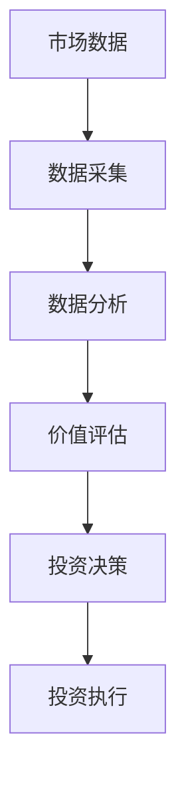
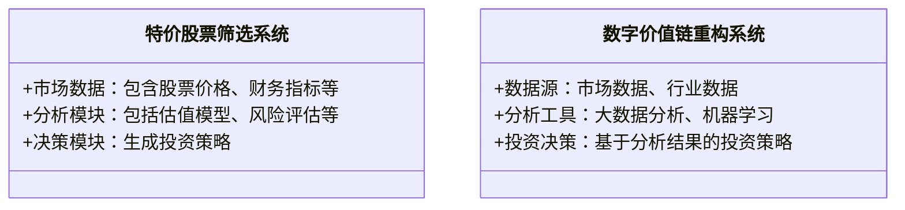

                 


# 如何利用特价股票策略进行全球数字价值链重构投资

> **关键词**：特价股票、数字价值链重构、投资策略、全球投资、数字经济、价值重塑

> **摘要**：随着数字经济的快速发展，全球数字价值链正在经历重构，投资者需要利用特价股票策略优化投资组合。本文从特价股票策略的核心概念出发，结合数字技术的应用，分析其在数字价值链重构中的作用，并提供基于数学模型的系统分析与实战案例，帮助投资者在全球数字经济中把握投资机遇，实现价值重塑。

---

## 第一章：特价股票策略与数字价值链重构概述

### 1.1 特价股票策略的定义与特点

#### 1.1.1 特价股票的定义
特价股票是指那些价格低于其内在价值，且具有长期投资潜力的股票。这类股票通常被市场低估，具有较大的增值空间。

#### 1.1.2 特价股票策略的核心特点
- **低估值**：股票价格远低于行业平均水平或历史平均水平。
- **高潜力**：公司基本面良好，具备长期增长潜力。
- **逆周期性**：在市场低迷时更容易找到低估股票。

#### 1.1.3 特价股票策略与传统股票投资的区别
| 方面        | 特价股票策略               | 传统股票投资             |
|-------------|---------------------------|--------------------------|
| 投资目标     | 挖掘低估股票，长期持有      | 短期收益或特定行业投资    |
| 风险偏好     | 中低风险                   | 高风险                   |
| 投资周期     | 长期                      | 短期或中期               |

### 1.2 全球数字价值链重构的背景与意义

#### 1.2.1 数字经济的崛起
数字技术的快速发展推动了全球经济结构的数字化转型，数据成为新的生产要素。

#### 1.2.2 全球价值链重构的趋势
全球价值链正在从传统制造业向数字服务和智能制造转型，数字技术成为重构的核心驱动力。

#### 1.2.3 数字价值链重构对投资的影响
- **投资标的扩展**：从传统行业转向数字经济领域。
- **投资逻辑变化**：从单纯关注财务指标转向关注技术创新和数字化能力。

### 1.3 特价股票策略与数字价值链重构的结合

#### 1.3.1 特价股票策略在数字价值链重构中的作用
- **捕捉低估机会**：在数字转型过程中，许多公司因市场波动被低估。
- **长期价值发现**：数字技术的应用提升了企业的长期竞争力。

#### 1.3.2 数字技术对股票投资的影响
- **数据驱动决策**：大数据分析帮助投资者发现市场机会。
- **技术驱动创新**：人工智能和机器学习优化投资策略。

#### 1.3.3 全球化视角下的投资机会
- **跨国投资**：数字技术的全球性使得跨国投资成为可能。
- **新兴市场机会**：新兴市场中的数字技术应用往往具有更高的增长潜力。

---

## 第二章：特价股票策略的核心概念与数学模型

### 2.1 特价股票策略的核心概念

#### 2.1.1 投资标的筛选标准
- **市盈率（P/E）**：低于行业平均水平。
- **市净率（P/B）**：低于行业平均水平。
- **股息率**：高于行业平均水平。

#### 2.1.2 市场周期分析
- **市场低估阶段**：适合寻找特价股票。
- **市场高估阶段**：避免高估值股票。

#### 2.1.3 风险控制机制
- **止损策略**：设定止损点，避免重大损失。
- **分散投资**：避免过度集中于单一行业或股票。

### 2.2 特价股票策略的数学模型

#### 2.2.1 投资组合优化模型
目标：最大化投资收益，最小化投资风险。

公式：
$$
\text{最大化} \quad \sum_{i=1}^{n} w_i r_i - \lambda \sum_{i=1}^{n} w_i^2
$$

其中：
- \( w_i \)：第 \( i \) 只股票的权重。
- \( r_i \)：第 \( i \) 只股票的预期收益。
- \( \lambda \)：风险惩罚因子。

#### 2.2.2 风险-收益平衡公式
$$
\text{收益} = \mu + \alpha \times \text{风险}
$$

其中：
- \( \mu \)：无风险收益率。
- \( \alpha \)：风险溢价系数。

#### 2.2.3 市场波动预测模型
$$
\sigma = \sqrt{\sum_{i=1}^{n} w_i^2 \sigma_i^2}
$$

其中：
- \( \sigma \)：投资组合的总体波动率。
- \( \sigma_i \)：第 \( i \) 只股票的波动率。

---

## 第三章：全球数字价值链重构的系统分析

### 3.1 数字价值链重构的系统架构

#### 3.1.1 数字价值链重构的主体构成
- **数据源**：市场数据、公司基本面数据。
- **分析工具**：大数据分析、人工智能算法。
- **投资决策系统**：基于分析结果的决策支持。

#### 3.1.2 数字价值链重构的流程图


#### 3.1.3 数字价值链重构的系统架构图


---

## 第四章：项目实战

### 4.1 项目背景

#### 4.1.1 项目目标
通过数字技术分析，筛选出具有长期投资价值的特价股票，构建优化的投资组合。

### 4.2 环境配置

#### 4.2.1 数据源
- 股票数据：使用Yahoo Finance API获取。
- 市场数据：包括宏观经济指标。

### 4.3 核心代码实现

#### 4.3.1 数据采集与处理
```python
import pandas as pd
import yfinance as yf

# 下载股票数据
def download_stock_data(tickers, start, end):
    data = pd.DataFrame()
    for ticker in tickers:
        df = yf.download(ticker, start=start, end=end)
        data[ticker] = df['Adj Close']
    return data

# 示例：下载苹果、微软股票数据
tickers = ['AAPL', 'MSFT']
data = download_stock_data(tickers, '2020-01-01', '2023-12-31')
```

#### 4.3.2 估值模型实现
```python
import numpy as np

def calculate_value(ticker_data):
    pe_ratio = ticker_data['Adj Close'] / ticker_data['Earnings per Share']
    pb_ratio = ticker_data['Adj Close'] / ticker_data['Book Value per Share']
    return pe_ratio, pb_ratio

# 示例：计算PE和PB比率
pe, pb = calculate_value(data)
```

---

## 第五章：总结与展望

### 5.1 总结
本文详细探讨了如何利用特价股票策略进行全球数字价值链重构投资，从理论到实践，为投资者提供了系统的指导。

### 5.2 展望
随着数字技术的进一步发展，特价股票策略在投资中的应用将更加广泛，投资者需要不断优化模型，抓住数字经济带来的投资机遇。

---

## 作者：AI天才研究院 & 禅与计算机程序设计艺术

