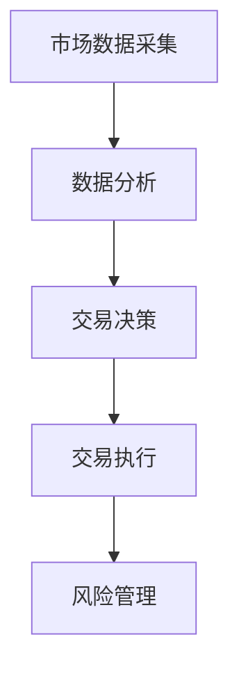

                 


# 如何利用特价股票策略进行全球数字公共产品代币化投资

> 关键词：特价股票策略，数字公共产品，代币化投资，全球化投资，算法交易

> 摘要：本文将详细探讨如何利用特价股票策略在全球范围内进行数字公共产品的代币化投资。通过分析特价股票策略的核心原理、数字公共产品的代币化机制以及全球化投资的系统架构，本文旨在为读者提供一套完整的投资策略和实现方案。从背景介绍到算法实现，从系统设计到项目实战，本文将一步步引导读者掌握这一创新的投资方式。

---

## 第一部分：特价股票策略与数字公共产品代币化投资的背景

### 第1章：特价股票策略的背景与概念

#### 1.1 特价股票策略的定义与特点

**1.1.1 特价股票的定义**

特价股票是指在特定时间或条件下，价格低于市场价的股票。这些股票通常出现在市场波动、公司公告或市场促销活动时。特价股票策略的核心在于利用价格波动，以较低的价格买入股票，待价格上涨后卖出，从而获利。

**1.1.2 特价股票的核心特点**

- **价格敏感性**：特价股票的价格波动较大，投资者需要敏感地捕捉价格变化。
- **时间窗口**：特价股票通常在限定时间内提供，投资者需要在特定时间内完成交易。
- **高风险高回报**：特价股票的价格波动意味着高风险，但潜在回报也较高。

**1.1.3 特价股票与传统股票投资的区别**

| 特性 | 特价股票 | 传统股票 |
|------|----------|-----------|
| 风险 | 高       | 中到高    |
| 回报 | 高       | 中到低    |
| 时间 | 短期      | 中长期    |
| 操作 | 需要频繁监控 | 更注重长期持有 |

#### 1.2 数字公共产品的概念与特征

**1.2.1 数字公共产品的定义**

数字公共产品是指通过数字技术实现的、具有公共性质的产品或服务，例如区块链技术中的代币、数字身份验证系统等。这些产品具有可分割性、可追踪性和高效性等特点。

**1.2.2 数字公共产品的核心特征**

- **可分割性**：数字公共产品可以被分割成多个小单位，便于投资和交易。
- **可追踪性**：通过区块链等技术，数字公共产品的交易和持有情况可以被追踪。
- **高效性**：数字技术降低了交易成本和时间，提高了效率。

**1.2.3 数字公共产品与传统公共产品的对比**

| 特性 | 数字公共产品 | 传统公共产品 |
|------|--------------|---------------|
| 交易效率 | 高          | 低            |
| 成本 | 低           | 高            |
| 可扩展性 | 高          | 低            |

#### 1.3 代币化投资的定义与优势

**1.3.1 代币化投资的定义**

代币化投资是指将资产转化为数字代币进行投资的行为。这些代币可以在区块链等去中心化平台上进行交易，具有高度的流动性和透明性。

**1.3.2 代币化投资的核心优势**

- **流动性高**：代币可以在市场上随时买卖，提高了资金的流动性。
- **透明性高**：区块链技术保证了交易的透明性和不可篡改性。
- **成本低**：代币化投资降低了传统投资的交易成本和门槛。

---

### 第2章：特价股票策略与数字公共产品代币化的结合

#### 2.1 特价股票策略在数字公共产品中的应用

**2.1.1 特价股票策略如何应用于数字公共产品**

- 数字公共产品可以通过代币的形式进行交易，特价股票策略可以应用于这些代币的买卖。
- 通过分析数字公共产品的价格波动，投资者可以在特定时间以低价买入代币，高价卖出，从而获利。

**2.1.2 数字公共产品代币化对特价股票策略的影响**

- 代币化使得特价股票策略的执行更加便捷和高效。
- 数字化技术提供了实时数据分析和交易执行的能力，增强了策略的可操作性。

#### 2.2 全球化视角下的投资机会

**2.2.1 全球化投资的定义与特点**

- 全球化投资是指在多个市场或国家进行投资，利用不同市场的价格差异和机会进行套利或获利。

**2.2.2 数字公共产品在全球化投资中的角色**

- 数字公共产品为全球化投资提供了新的资产类别，投资者可以通过代币化投资参与全球市场的各种机会。
- 全球化的数字公共产品市场具有更高的流动性和更多的投资机会。

---

## 第二部分：特价股票策略与数字公共产品代币化的核心概念

### 第3章：特价股票策略的核心原理

#### 3.1 特价股票策略

**3.1.1 特价股票策略的核心原理**

特价股票策略的核心在于通过分析市场波动和价格变化，找到价格低于市场价的股票进行买入，待价格上涨后卖出。这种策略依赖于对市场趋势的准确判断和快速反应能力。

**3.1.2 特价股票策略的实施步骤**

1. **市场分析**：通过技术分析和基本面分析，判断股票的价格走势。
2. **触发条件**：设定价格触发点，当价格达到特定水平时进行买入或卖出。
3. **执行交易**：在特定时间窗口内快速执行交易，以获取价差利润。

---

### 第4章：数字公共产品的代币化机制

#### 4.1 数字公共产品的代币化过程

**4.1.1 代币化的定义**

代币化是指将资产转化为数字代币的过程，这些代币可以在区块链等去中心化平台上进行交易。

**4.1.2 代币化的步骤**

1. **资产选择**：选择适合代币化的资产，如数字公共产品。
2. **代币发行**：通过区块链平台发行代币，并设定代币的属性和价值。
3. **代币交易**：在区块链平台上进行代币的买卖交易，实现资产的流动性和价值转移。

---

### 第5章：全球化投资的系统架构

#### 5.1 系统功能设计

**5.1.1 系统功能模块**

- **市场数据采集模块**：采集全球市场的股票和代币价格数据。
- **数据分析模块**：对数据进行分析，判断投资机会。
- **交易执行模块**：根据分析结果执行交易。
- **风险管理模块**：监控和管理投资风险。

**5.1.2 系统功能流程图**



---

### 第6章：算法实现与案例分析

#### 6.1 算法实现

**6.1.1 算法原理**

- **时间序列分析**：利用ARIMA模型预测股票价格的变化。
- **机器学习模型**：使用随机森林算法进行市场趋势预测。

**6.1.2 代码实现**

```python
from statsmodels.tsa.arima_model import ARIMA
import pandas as pd
import numpy as np

# 数据准备
data = pd.read_csv('stock_price.csv')
data['date'] = pd.to_datetime(data['date'])
data.set_index('date', inplace=True)

# 建模
model = ARIMA(data['price'], order=(5,1,0))
model_fit = model.fit()

# 预测
forecast = model_fit.forecast(steps=10)
```

---

## 第三部分：项目实战与总结

### 第7章：项目实战

#### 7.1 环境配置

- **安装必要的库**：如pandas、numpy、statsmodels等。
- **配置区块链节点**：选择合适的区块链平台进行代币化操作。

#### 7.2 核心实现

- **数据采集**：编写脚本采集全球市场的股票和代币数据。
- **数据分析**：利用机器学习模型进行市场预测。
- **交易执行**：根据预测结果执行交易指令。

#### 7.3 案例分析

- **案例背景**：选择一个特定市场进行分析。
- **数据处理**：展示数据处理的过程和结果。
- **交易执行**：展示交易执行的具体步骤和结果。

---

### 第8章：总结与展望

#### 8.1 总结

本文详细探讨了如何利用特价股票策略进行全球数字公共产品代币化投资，从背景介绍到算法实现，从系统设计到项目实战，为读者提供了一套完整的投资策略和实现方案。

#### 8.2 展望

未来，随着区块链技术和人工智能的不断发展，特价股票策略在数字公共产品代币化投资中的应用将更加广泛和深入。投资者可以通过更加智能化和自动化的工具，实现更高收益和更低风险的投资。

---

## 作者

作者：AI天才研究院/AI Genius Institute & 禅与计算机程序设计艺术 /Zen And The Art of Computer Programming

