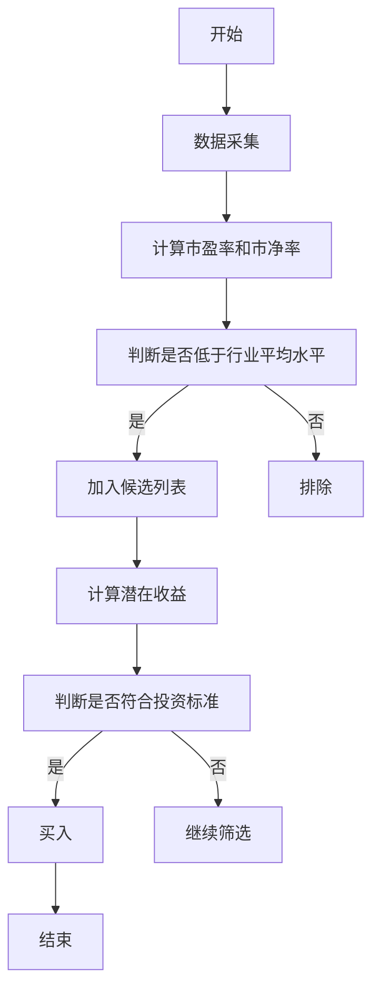
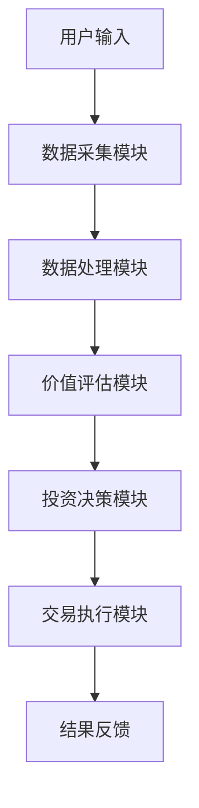
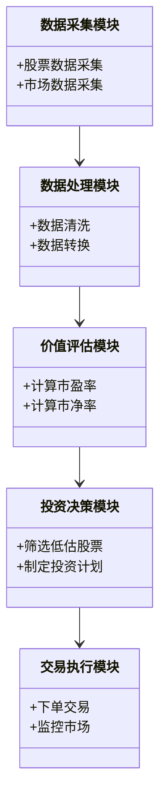

                 


# 如何利用特价股票策略进行全球数字公共产品投资

> 关键词：特价股票策略, 数字公共产品, 全球投资, 投资策略, 人工智能, 数据分析, 股票投资

> 摘要：本文将详细介绍如何利用特价股票策略进行全球数字公共产品投资。通过分析特价股票策略的核心概念、算法原理、系统架构设计以及实际项目案例，我们将探讨如何在全球范围内利用特价股票策略优化数字公共产品投资，实现高效的投资收益。

---

## 第一部分: 特价股票策略与数字公共产品投资基础

### 第1章: 特价股票策略概述

#### 1.1 特价股票策略的定义与特点

##### 1.1.1 什么是特价股票
特价股票是指在特定市场条件下，价格被低估的股票。这些股票通常具有较高的潜在回报，但由于市场波动、公司基本面变化或其他因素，其价格暂时低于其真实价值。

##### 1.1.2 特价股票的特点
- **低估值**：特价股票的市场价格低于其内在价值。
- **高潜力**：这些股票通常具有较高的增长潜力。
- **周期性**：特价股票的出现具有周期性，通常与市场波动或经济周期相关。

##### 1.1.3 特价股票与其他投资策略的区别
- **价值投资**：寻找市场价格低于内在价值的股票。
- **成长投资**：关注具有高增长潜力的公司。
- **趋势投资**：跟随市场趋势进行投资。

#### 1.2 数字公共产品投资的定义与特点

##### 1.2.1 数字公共产品的定义
数字公共产品是指通过数字技术提供的公共产品或服务，例如在线教育平台、数字政府服务、数字医疗等。

##### 1.2.2 数字公共产品的特点
- **数字化**：依赖数字技术实现。
- **可扩展性**：能够快速扩展服务范围。
- **低成本**：相比传统公共产品，数字公共产品的边际成本较低。

##### 1.2.3 数字公共产品投资的潜在价值
- **高增长潜力**：数字技术的广泛应用带来了巨大的投资机会。
- **社会影响**：数字公共产品能够显著改善人们的生活质量。
- **政策支持**：政府通常会支持数字公共产品的开发和推广。

---

### 第2章: 特价股票策略与数字公共产品投资的背景

#### 2.1 当前全球投资环境分析

##### 2.1.1 全球经济形势对投资策略的影响
全球经济的不确定性（如经济衰退、地缘政治冲突等）使得投资者更加关注低估值、高潜力的投资标的。

##### 2.1.2 数字经济的发展与投资机会
随着数字经济的快速发展，数字公共产品的需求不断增加，为投资者提供了新的机会。

##### 2.1.3 特价股票策略的兴起
在市场波动加剧的情况下，寻找低估值的股票成为一种有效的投资策略。

#### 2.2 数字公共产品在全球投资中的作用

##### 2.2.1 数字公共产品在全球经济中的地位
数字公共产品已经成为全球经济的重要组成部分，尤其是在教育、医疗、政府服务等领域。

##### 2.2.2 数字公共产品投资的背景与趋势
随着技术的进步和数字化转型的推进，数字公共产品的投资需求持续增长。

##### 2.2.3 特价股票策略在全球数字公共产品投资中的应用
通过寻找低估值的数字公共产品相关股票，投资者可以在市场波动中获得超额收益。

---

### 第3章: 特价股票策略的核心概念与原理

#### 3.1 特价股票策略的核心概念

##### 3.1.1 特价股票的定义与分类
- **定义**：价格低于内在价值的股票。
- **分类**：根据行业、市值、地域等进行分类。

##### 3.1.2 特价股票的市场定位
- **低估区域**：市场价格低于内在价值的区域。
- **合理区域**：市场价格接近内在价值的区域。
- **高估区域**：市场价格远高于内在价值的区域。

##### 3.1.3 特价股票的估值方法
- **市盈率（P/E）**：市场价格与每股收益的比率。
- **市净率（P/B）**：市场价格与每股净资产的比率。
- **股息率**：每股股息与股价的比率。

#### 3.2 数字公共产品投资的核心要素

##### 3.2.1 数字公共产品的核心属性
- **技术依赖性**：依赖数字技术实现。
- **用户需求**：满足特定用户群体的需求。
- **可扩展性**：能够快速扩展服务范围。

##### 3.2.2 数字公共产品的价值评估
- **用户规模**：服务的用户数量。
- **技术优势**：技术的先进性和创新能力。
- **市场地位**：在行业中的市场占有率。

##### 3.2.3 数字公共产品的风险与收益分析
- **风险**：技术风险、市场风险、政策风险。
- **收益**：潜在的高回报。

---

### 第4章: 特价股票策略与数字公共产品投资的关系

#### 4.1 特价股票策略在数字公共产品投资中的应用

##### 4.1.1 特价股票策略如何影响数字公共产品投资
- **低估值股票的发现**：通过分析市盈率、市净率等指标，发现低估值的数字公共产品相关股票。
- **投资决策优化**：利用特价股票策略优化投资组合，降低投资风险。

##### 4.1.2 数字公共产品投资如何利用特价股票策略
- **筛选低估值股票**：通过特价股票策略筛选出具有高潜力的数字公共产品相关股票。
- **制定投资计划**：根据市场波动和公司基本面变化，制定投资计划。

##### 4.1.3 特价股票策略与数字公共产品投资的相互作用
- **策略优化**：通过数字公共产品投资的需求，优化特价股票策略。
- **收益提升**：利用特价股票策略，提升数字公共产品投资的收益。

---

## 第二部分: 特价股票策略的算法原理与系统架构设计

---

### 第5章: 特价股票策略的算法原理

#### 5.1 特价股票策略的数学模型

##### 5.1.1 股票价值计算公式
股票的内在价值可以通过以下公式计算：
$$ V = \frac{E}{k} $$
其中，$E$ 是公司的预期收益，$k$ 是折现率。

##### 5.1.2 市盈率计算公式
市盈率（P/E）的计算公式为：
$$ P/E = \frac{P}{E} $$
其中，$P$ 是股票的价格，$E$ 是公司的每股收益。

##### 5.1.3 市净率计算公式
市净率（P/B）的计算公式为：
$$ P/B = \frac{P}{B} $$
其中，$P$ 是股票的价格，$B$ 是公司的每股净资产。

#### 5.2 特价股票策略的算法流程

##### 5.2.1 算法流程图（mermaid）



##### 5.2.2 Python代码实现

```python
import pandas as pd
import numpy as np

def calculate_value_ratios(stock_data):
    # 计算市盈率
    stock_data['PE'] = stock_data['Price'] / stock_data['Earnings']
    # 计算市净率
    stock_data['PB'] = stock_data['Price'] / stock_data['Book Value']
    return stock_data

def is_cheap_stock(stock_data, industry_avg_pe, industry_avg_pb):
    # 判断股票是否低估
    cheap Stocks = stock_data[(stock_data['PE'] < industry_avg_pe) & 
                               (stock_data['PB'] < industry_avg_pb)]
    return cheap Stocks

# 示例数据
data = {
    'Stock': ['A', 'B', 'C'],
    'Price': [10, 15, 20],
    'Earnings': [5, 6, 8],
    'Book Value': [2, 3, 4]
}

stock_data = pd.DataFrame(data)
stock_data = calculate_value_ratios(stock_data)
cheap_stocks = is_cheap_stock(stock_data, 15, 1.5)
print(cheap_stocks)
```

---

### 第6章: 系统分析与架构设计

#### 6.1 投资系统的工作流程

##### 6.1.1 投资系统流程图（mermaid）



#### 6.2 系统功能设计

##### 6.2.1 系统功能模块（mermaid）



---

## 第三部分: 项目实战与最佳实践

### 第7章: 项目实战

#### 7.1 环境安装与数据获取

##### 7.1.1 环境安装
- 安装Python和必要的库（如pandas、numpy、matplotlib）。
- 安装Jupyter Notebook用于数据可视化。

##### 7.1.2 数据获取
从金融数据供应商（如Yahoo Finance）获取历史股价数据。

#### 7.2 系统核心实现

##### 7.2.1 数据预处理
对获取的数据进行清洗和转换，确保数据的完整性和准确性。

##### 7.2.2 算法实现
根据前面的算法，实现特价股票筛选功能。

#### 7.3 实际案例分析

##### 7.3.1 案例背景
假设我们投资于某家数字公共产品公司，其股票价格近期出现大幅下跌，但公司基本面良好。

##### 7.3.2 数据分析
通过计算市盈率和市净率，发现该股票的价格低于行业平均水平，符合特价股票的条件。

##### 7.3.3 投资决策
决定买入该股票，等待价格回升。

#### 7.4 项目小结
通过该项目，我们验证了特价股票策略在数字公共产品投资中的有效性。

---

### 第8章: 最佳实践与注意事项

#### 8.1 投资策略的注意事项

##### 8.1.1 风险管理
- 设置止损点，避免重大损失。
- 分散投资，降低风险。

##### 8.1.2 策略调整
- 定期评估策略的有效性。
- 根据市场变化调整策略。

#### 8.2 小结

通过本文的详细介绍，我们了解了如何利用特价股票策略进行全球数字公共产品投资。从理论到实践，我们掌握了核心概念、算法原理和系统设计，为实际投资提供了有力支持。

#### 8.3 扩展阅读

- 推荐阅读《股票投资策略与技术分析》。
- 关注数字经济领域的最新动态。

---

## 作者：AI天才研究院/AI Genius Institute & 禅与计算机程序设计艺术 /Zen And The Art of Computer Programming

