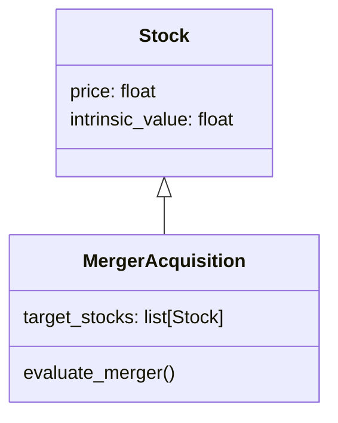

                 


# 如何利用特价股票策略进行反向并购投资

> 关键词：反向并购、特价股票、投资策略、股票市场、并购分析

> 摘要：本文将详细探讨如何利用特价股票策略进行反向并购投资。通过分析特价股票的筛选标准、反向并购的核心概念以及两者的协同作用，结合实际案例和系统设计，为投资者提供一套高效的投资策略。

---

## 第一部分: 特价股票策略与反向并购投资概述

### 第1章: 特价股票策略与反向并购投资概述

#### 1.1 特价股票策略的定义与特点
##### 1.1.1 特价股票的定义
特价股票指的是在特定市场条件下，价格远低于其内在价值的股票。这些股票通常被视为被市场低估，具有较高的投资潜力。

##### 1.1.2 特价股票的特点
- **低估值**：市场价格低于内在价值。
- **高波动性**：价格波动较大，存在短期价格波动风险。
- **周期性**：通常出现在市场低迷或行业低谷时期。

##### 1.1.3 特价股票与普通股票的区别
| 特性 | 特价股票 | 普通股票 |
|------|----------|----------|
| 价格 | 低于价值 | 接近价值 |
| 风险 | 较高     | 中等     |
| 投资机会 | 高     | 一般     |

#### 1.2 反向并购投资的定义与特点
##### 1.2.1 反向并购的定义
反向并购是指一家私人公司收购一家上市公司，从而实现上市或扩张的过程。

##### 1.2.2 反向并购的特点
- **快速上市**：通过并购上市公司实现快速上市。
- **资金需求**：通常需要大量资金支持。
- **风险较高**：涉及复杂的法律和财务问题。

#### 1.3 特价股票策略在反向并购中的作用
##### 1.3.1 特价股票策略在反向并购中的应用
- 策略性地选择被低估的上市公司作为并购目标。
- 利用低价股票提升并购后的市场价值。

##### 1.3.2 特价股票策略的优势
- 成本优势：低价股票减少并购成本。
- 市场机会：在市场低迷时获得优质资产。

##### 1.3.3 特价股票策略的潜在风险
- 市场波动风险：股价波动可能影响并购效果。
- 信息不对称风险：并购目标可能存在隐藏问题。

---

### 第2章: 特价股票策略的核心概念与联系

#### 2.1 特价股票策略的核心概念
##### 2.1.1 特价股票的筛选标准
- 市盈率（P/E）低于行业平均水平。
- 市净率（P/B）低于1。

##### 2.1.2 特价股票的价值评估模型
$$ V = P \times (1 + r)^n $$
其中，V为股票价值，P为当前价格，r为折现率，n为时间周期。

##### 2.1.3 特价股票的市场周期分析
- 经济周期：在衰退期寻找特价股票。
- 行业周期：选择处于低谷期的行业。

#### 2.2 反向并购的核心概念
##### 2.2.1 反向并购的驱动因素
- 快速上市需求。
- 规模扩张需求。

##### 2.2.2 反向并购的流程与步骤
1. 寻找合适的上市公司。
2. 进行尽职调查。
3. 签订并购协议。
4. 完成交易。

##### 2.2.3 反向并购的法律与财务要求
- 符合相关法律法规。
- 资金充足，财务健康。

#### 2.3 特价股票策略与反向并购的联系
##### 2.3.1 特价股票策略如何支持反向并购
- 提供低成本并购目标。
- 增加并购后的市场价值。

##### 2.3.2 反向并购如何利用特价股票策略
- 确保并购成本最低化。
- 提升并购后的盈利能力。

##### 2.3.3 特价股票策略与反向并购的协同效应
- 综合利用特价股票和反向并购，实现快速扩张和价值提升。

---

### 第3章: 特价股票策略的算法原理

#### 3.1 特价股票筛选算法
##### 3.1.1 算法原理
通过量化指标筛选出价格低于内在价值的股票。

##### 3.1.2 算法流程图（Mermaid）

```mermaid
graph TD
A[开始] -> B[选择筛选标准]
B -> C[计算股票价值]
C -> D[判断是否低于当前价格]
D -> E[是，则加入候选名单]
D -> F[否，则排除]
E -> G[结束]
F -> G
```

##### 3.1.3 算法实现
```python
def find_cheap_stocks(stocks):
    cheap_stocks = []
    for stock in stocks:
        if stock.price < stock.intrinsic_value:
            cheap_stocks.append(stock)
    return cheap_stocks
```

#### 3.2 反向并购评估模型
##### 3.2.1 模型原理
评估并购后的潜在价值和风险。

##### 3.2.2 模型流程图（Mermaid）

```mermaid
graph TD
A[开始] -> B[评估并购目标]
B -> C[计算并购成本]
C -> D[评估潜在收益]
D -> E[判断收益是否大于成本]
E -> F[是，则推荐并购]
E -> G[否，则不推荐]
F -> G
G -> 结束
```

#### 3.3 特价股票策略的数学模型
##### 3.3.1 特价股票价值评估公式
$$ V = P \times (1 + r)^n $$

---

### 第4章: 反向并购的系统分析与架构设计

#### 4.1 系统功能设计
##### 4.1.1 领域模型（Mermaid类图）



#### 4.2 系统架构设计
##### 4.2.1 系统架构图（Mermaid架构图）

```mermaid
graph LR
A[开始] -> B[选择目标公司]
B -> C[进行尽职调查]
C -> D[评估潜在收益]
D -> E[判断是否并购]
E -> F[是，则进行并购]
E -> G[否，则放弃]
F -> 结束
G -> 结束
```

---

## 第五章: 项目实战

### 5.1 环境安装
- 安装必要的金融分析工具和编程库，如Python的pandas和numpy。

### 5.2 核心代码实现
```python
import pandas as pd

def calculate_intrinsic_value(stocks):
    intrinsic_values = []
    for stock in stocks:
        iv = stock.price * (1 + 0.05)**10
        intrinsic_values.append(iv)
    return intrinsic_values
```

### 5.3 案例分析
分析一家处于低价位的上市公司，评估其作为反向并购目标的可行性。

### 5.4 代码应用解读与分析
解释上述代码如何帮助筛选特价股票并评估并购价值。

---

## 第六章: 总结与展望

### 6.1 总结
总结本文的主要观点和策略，强调特价股票策略在反向并购中的重要性。

### 6.2 小结
重申关键点，提醒读者注意潜在风险。

### 6.3 注意事项
- 风险提示：市场波动和信息不对称风险。
- 操作建议：结合多种策略，分散投资风险。

### 6.4 拓展阅读
推荐相关书籍和资源，供读者深入学习。

---

**作者：AI天才研究院/AI Genius Institute & 禅与计算机程序设计艺术 /Zen And The Art of Computer Programming**

