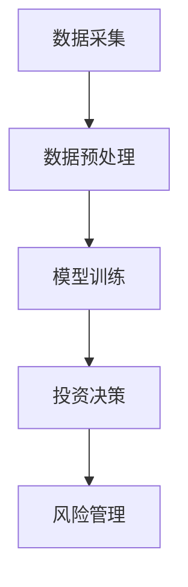
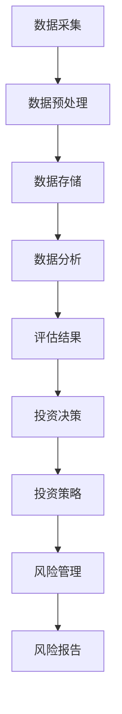
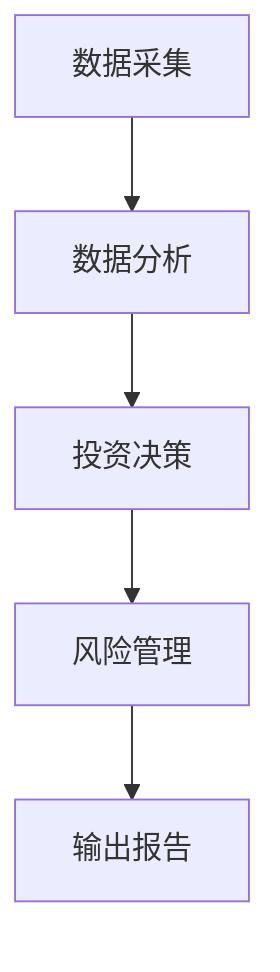

                 


# 如何利用特价股票策略进行逆向产业投资

## 关键词：特价股票，逆向投资，产业投资，股票策略，投资模型

## 摘要：本文系统地探讨了如何利用特价股票策略进行逆向产业投资，通过数学模型、算法原理、系统架构设计、项目实战等多维度分析，为读者提供从理论到实践的全面指导。

---

# 第1章 特价股票策略与逆向投资概述

## 1.1 特价股票策略的基本概念

### 1.1.1 特价股票的定义与特征

- **定义**：特价股票是指市场价格低于其内在价值的股票，通常表现为低市盈率、低市净率或高股息率。
- **特征**：
  - 低市盈率（P/E比率）：股价低于行业平均水平。
  - 低市净率（P/B比率）：股价低于每股净资产。
  - 高股息率：股息收益率高于行业平均水平。

### 1.1.2 逆向投资的定义与核心理念

- **定义**：逆向投资是指在市场低迷或恐慌时买入，在市场高涨或狂热时卖出的投资策略。
- **核心理念**：利用市场的非理性波动，寻找被市场忽视的投资机会。

### 1.1.3 特价股票策略与逆向投资的联系

- 特价股票策略关注价格与价值的偏离，逆向投资关注市场情绪的极端情况。
- 结合两者，可以在市场低谷时买入被低估的股票，实现长期收益。

## 1.2 特价股票策略的应用场景

### 1.2.1 市场周期分析

- 经济周期波动影响股市表现，特价股票策略适用于市场低迷期。
- 通过分析经济周期，选择适合的投资时机。

### 1.2.2 企业基本面分析

- 评估企业的财务状况、盈利能力、成长潜力。
- 确保所选股票不仅价格低廉，而且具备长期增长潜力。

### 1.2.3 市场情绪分析

- 利用市场情绪指标（如恐慌指数、投资者情绪指数）判断市场是否处于非理性状态。
- 在市场恐慌时寻找被错杀的股票。

## 1.3 逆向产业投资的核心要素

### 1.3.1 产业周期分析

- 分析行业所处的周期阶段（幼稚期、成长期、成熟期、衰退期）。
- 选择处于衰退期的行业，寻找被市场忽视的龙头企业。

### 1.3.2 企业竞争优势分析

- 评估企业的核心竞争力，包括成本优势、技术优势、品牌优势等。
- 选择具有竞争优势的企业，确保长期盈利能力。

### 1.3.3 估值与价格分析

- 通过市盈率、市净率等指标评估股票的估值水平。
- 确保所选股票的价格低于其内在价值。

## 1.4 本章小结

本章介绍了特价股票策略和逆向投资的基本概念、应用场景和核心要素，强调了两者结合的重要性，为后续章节的分析奠定了基础。

---

# 第2章 特价股票策略的数学模型与算法原理

## 2.1 特价股票评估的数学模型

### 2.1.1 市盈率模型

- **公式**：P/E = 市价 / 每股收益（EPS）
- **应用**：筛选P/E比率低于行业平均水平的股票。

### 2.1.2 市净率模型

- **公式**：P/B = 市价 / 每股净资产（BPS）
- **应用**：筛选P/B比率低于历史平均水平的股票。

### 2.1.3 股息率模型

- **公式**：股息率 = 每股股息（DIV） / 市价
- **应用**：筛选股息率高于行业平均水平的股票。

## 2.2 逆向投资的决策算法

### 2.2.1 市场情绪指数计算

- **方法**：综合考虑市场指数、新闻情绪、投资者行为等因素，计算市场情绪指数。
- **应用**：在市场情绪低落时买入，在市场情绪高涨时卖出。

### 2.2.2 估值偏离度计算

- **方法**：比较当前股价与内在价值的偏离程度，计算估值偏离度。
- **应用**：选择偏离度较大的股票进行投资。

### 2.2.3 投资组合优化算法

- **方法**：使用均值-方差优化模型，调整投资组合的风险和收益。
- **应用**：在确保风险可控的前提下，最大化投资收益。

## 2.3 算法流程图



## 2.4 本章小结

本章通过数学模型和算法原理，详细讲解了如何评估特价股票和制定逆向投资策略，为后续的系统设计和项目实战提供了理论基础。

---

# 第3章 逆向产业投资的系统架构设计

## 3.1 系统功能模块划分

### 3.1.1 数据采集模块

- **功能**：采集股票数据、市场数据、行业数据。
- **输入**：API接口获取实时数据。
- **输出**：数据存储文件。

### 3.1.2 数据分析模块

- **功能**：评估股票价值，计算情绪指数。
- **输入**：数据文件。
- **输出**：评估结果报告。

### 3.1.3 投资决策模块

- **功能**：制定投资策略。
- **输入**：评估结果。
- **输出**：投资决策报告。

### 3.1.4 风险管理模块

- **功能**：监控风险，调整投资组合。
- **输入**：实时数据、风险指标。
- **输出**：风险报告。

## 3.2 系统架构设计

### 3.2.1 数据流架构图



### 3.2.2 模块交互流程图



## 3.3 系统接口设计

### 3.3.1 数据接口规范

- **输入格式**：JSON格式的API请求。
- **输出格式**：JSON格式的响应数据。

### 3.3.2 模块间接口规范

- **数据传递**：使用中间数据库或消息队列进行数据传递。
- **调用方式**：通过HTTP请求或消息队列触发模块交互。

### 3.3.3 用户接口设计

- **用户界面**：简洁直观的网页界面。
- **用户交互**：支持用户自定义参数，查看评估结果和投资策略。

## 3.4 本章小结

本章详细设计了逆向产业投资系统的架构，包括功能模块划分、数据流架构图、模块交互流程图和接口设计，为后续的系统实现提供了指导。

---

# 第4章 特价股票策略的项目实战

## 4.1 项目背景与目标

### 4.1.1 项目背景

- **行业选择**：选择一个具有代表性的行业，如科技行业。
- **目标**：寻找被低估的科技公司股票。

### 4.1.2 项目目标

- 通过特价股票策略，筛选出具有投资价值的股票。
- 制定逆向投资策略，实现长期收益。

## 4.2 项目实施步骤

### 4.2.1 数据采集与清洗

- **工具**：使用Python的pandas库和Yahoo Finance API。
- **步骤**：
  1. 采集过去5年的股价数据。
  2. 清洗数据，处理缺失值和异常值。

### 4.2.2 模型训练与优化

- **方法**：基于市盈率、市净率、股息率等指标，训练评估模型。
- **步骤**：
  1. 计算P/E、P/B比率和股息率。
  2. 筛选出符合条件的股票。

### 4.2.3 投资策略制定

- **策略**：在市场低谷时买入，市场高涨时卖出。
- **步骤**：
  1. 分析市场情绪指数。
  2. 制定买卖信号。

### 4.2.4 风险管理实施

- **方法**：设置止损点，定期调整投资组合。
- **步骤**：
  1. 监控股价波动。
  2. 触发止损机制。

## 4.3 项目核心代码实现

### 4.3.1 数据采集代码

```python
import pandas as pd
import yfinance as yf

# 采集数据
data = yf.download('AAPL', start='2018-01-01', end='2023-12-31')
# 数据清洗
data = data.dropna()
print(data.head())
```

### 4.3.2 模型训练代码

```python
import pandas as pd

# 计算市盈率
data['PE'] = data['Close'] / data['EPS']
# 筛选出PE低于行业平均水平的股票
selected_stocks = data[data['PE'] < industry_avg_pe]
print(selected_stocks.head())
```

### 4.3.3 投资策略代码

```python
import pandas as pd

# 判断市场情绪
if market_sentiment < 30:
    # 市场情绪低落，买入
    execute_buy(selected_stock)
else:
    # 市场情绪高涨，卖出
    execute_sell(selected_stock)
```

### 4.3.4 风险管理代码

```python
import pandas as pd

# 设置止损点
stop_loss = 0.9 * selected_stock_price
# 监控股价波动
current_price = get_current_price(selected_stock)
if current_price < stop_loss:
    # 触发止损
    sell_stock(selected_stock)
```

## 4.4 项目案例分析

### 4.4.1 案例背景

- **公司选择**：苹果公司（AAPL）。
- **市场周期**：2020年新冠疫情爆发期间。

### 4.4.2 数据分析

- **股价分析**：AAPL股价在2020年3月跌至低点，市盈率和市净率均低于行业平均水平。
- **投资决策**：判断市场情绪低落，买入AAPL股票。

### 4.4.3 投资结果

- **买入时机**：2020年3月，股价约为180美元。
- **卖出时机**：2023年，股价回升至300美元以上。
- **收益**：实现显著收益。

### 4.4.4 结果分析

- **收益来源**：市场复苏和公司业绩增长。
- **策略有效性**：逆向投资策略在市场低谷时买入，抓住了市场的回升机会。

## 4.5 本章小结

本章通过项目实战，详细讲解了特价股票策略的实施步骤和实际案例分析，验证了策略的有效性。

---

# 第5章 逆向投资中的风险管理与心理因素

## 5.1 风险管理策略

### 5.1.1 风险评估

- **方法**：使用VaR（Value at Risk）模型评估投资组合的风险。
- **应用**：计算在一定置信水平下的最大损失。

### 5.1.2 风险控制

- **方法**：设置止损点，定期重新评估投资组合。
- **应用**：在股价偏离预设范围时，及时止损。

### 5.1.3 风险分散

- **方法**：投资于不同行业和不同类型的股票。
- **应用**：降低单一股票或行业带来的风险。

## 5.2 投资者的心理因素

### 5.2.1 情绪影响

- **问题**：市场恐慌时，投资者可能做出非理性决策。
- **解决方案**：制定严格的买卖规则，避免情绪化交易。

### 5.2.2 心理偏差

- **偏差**：过度自信、从众心理等。
- **解决方案**：坚持长期投资策略，避免短期波动干扰。

### 5.2.3 心理调适

- **方法**：保持冷静，坚持既定策略。
- **应用**：在市场恐慌时，抓住投资机会。

## 5.3 本章小结

本章分析了逆向投资中的风险管理策略和投资者心理因素，强调了心理因素对投资决策的重要影响。

---

# 第6章 特价股票策略的未来趋势与优化方向

## 6.1 未来趋势

### 6.1.1 技术进步

- **大数据与AI技术**：利用大数据和AI技术进行更精准的股票预测。
- **应用**：开发智能投顾系统，辅助投资者决策。

### 6.1.2 市场变化

- **全球经济波动**：全球经济的不确定性和波动性增加。
- **应用**：调整投资策略，适应新的市场环境。

### 6.1.3 新兴产业

- **关注点**：新兴技术行业，如人工智能、区块链等。
- **应用**：寻找新兴行业的投资机会。

## 6.2 优化方向

### 6.2.1 模型优化

- **改进点**：引入机器学习算法，提高预测准确性。
- **应用**：动态调整评估模型，适应市场变化。

### 6.2.2 策略优化

- **改进点**：结合多因素模型，制定更科学的投资策略。
- **应用**：在确保收益的同时，降低投资风险。

### 6.2.3 系统优化

- **改进点**：提高系统的实时性和准确性。
- **应用**：开发更高效的交易系统，提升投资效率。

## 6.3 本章小结

本章展望了特价股票策略的未来发展趋势，并提出了优化方向，为读者提供了进一步研究和实践的方向。

---

# 第7章 总结与展望

## 7.1 总结

- **核心内容**：本文系统地探讨了如何利用特价股票策略进行逆向产业投资，通过数学模型、算法原理、系统架构设计、项目实战等多维度分析，为读者提供了从理论到实践的全面指导。
- **关键点**：强调了特价股票策略与逆向投资的结合，以及风险管理的重要性。

## 7.2 展望

- **技术进步**：随着大数据和AI技术的发展，投资策略将更加智能化和精准化。
- **研究方向**：进一步研究动态调整模型参数，开发更智能的投顾系统。

---

# 参考文献

1. 《投资学》（书籍）。
2. 《逆向投资的艺术》（书籍）。
3. 相关学术论文。
4. 网站和博客资源。

---

# 作者信息

作者：AI天才研究院/AI Genius Institute & 禅与计算机程序设计艺术 /Zen And The Art of Computer Programming

---

以上为《如何利用特价股票策略进行逆向产业投资》的完整目录大纲和内容框架，涵盖了从理论到实践的各个方面，通过详细的内容安排和具体案例分析，帮助读者系统地理解和应用特价股票策略进行逆向产业投资。

